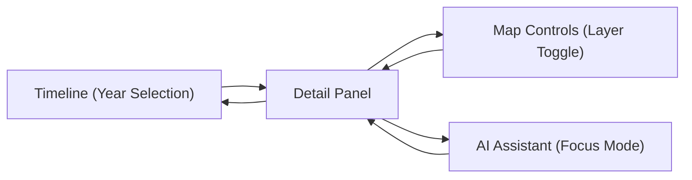
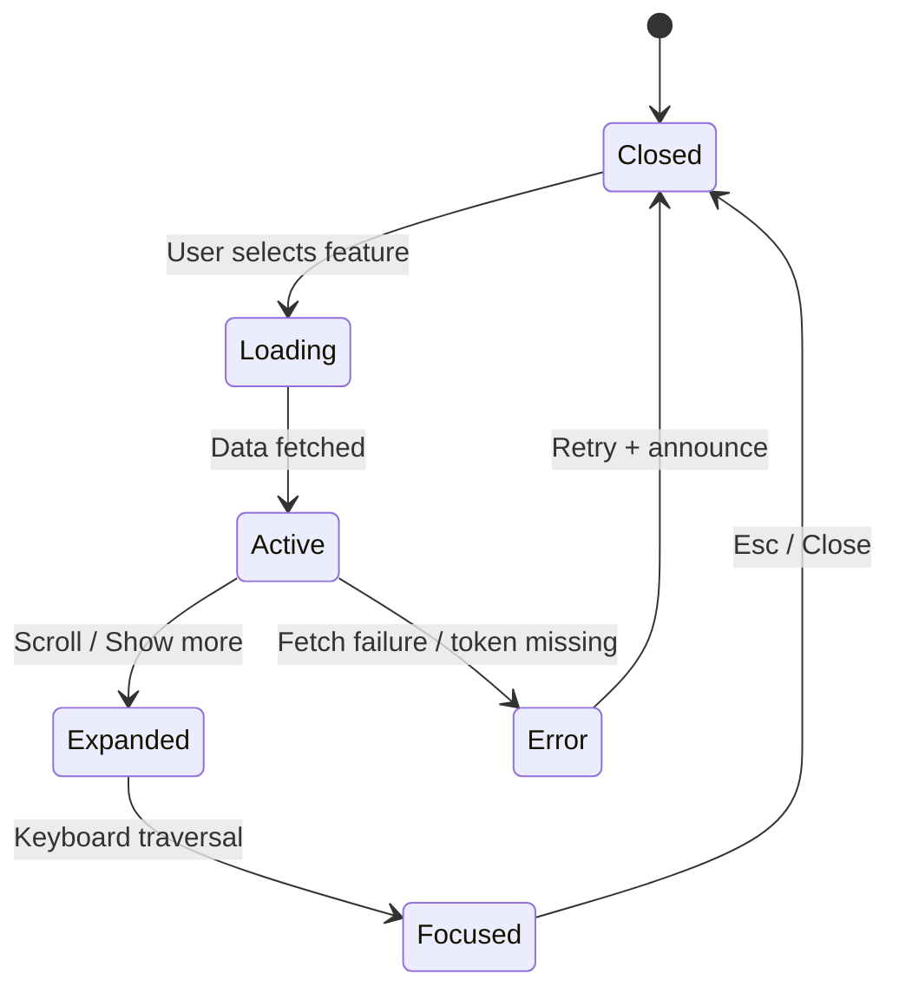

<div align="center">

# 🧾 Kansas Frontier Matrix — **Detail Panel Component Design Review (Tier-S⁺ Certified)**  
`docs/design/reviews/ui_components/detail_panel.md`

**Mission:** Audit, document, and govern the **Detail Panel** — the contextual, metadata-rich interface that synchronizes **map**, **timeline**, **AI insights**, and **archival provenance** across the **Kansas Frontier Matrix (KFM)**.  
The Detail Panel converts heterogeneous geospatial and historical sources into **explainable narrative context**, with **accessibility, transparency, and reproducibility** enforced by **MCP-DL v6.3**, **WCAG 2.1 AA**, **FAIR/CARE**, and **DCAT 3.0**.

[](../../../standards/documentation.md)
[](../../style-guide.md)
[](../accessibility/)
[](../../../standards/fair.md)
[](../../../LICENSE)

</div>

---

```yaml
---
title: "🧾 Kansas Frontier Matrix — Detail Panel Component Design Review"
document_type: "Component Review"
version: "v5.1.0"
last_updated: "2025-11-01"
created: "2023-09-22"
component: "Detail Panel"
design_ref: "Figma Frame #DETAIL-2025"
implementation_ref: "web/src/components/detail-panel/"
owners: ["@kfm-design","@kfm-web","@kfm-accessibility","@kfm-data"]
reviewed_by: ["@kfm-accessibility","@kfm-ethics","@kfm-localization","@kfm-ai","@kfm-security"]
status: "Stable"
maturity: "Production"
license: "CC-BY-4.0"
tags: ["detail-panel","context","provenance","accessibility","tokens","map","timeline","ai","focus-mode","fair","care","dcat","rtl","dark-mode"]
classification:
  component_type: "UI"
  integration_level: "Frontend + Graph + AI"
  risk_level: "Low"
  audit_frequency: "Quarterly + per release"
alignment:
  - MCP-DL v6.3
  - WCAG 2.1 AA
  - CIDOC CRM (Entity Provenance)
  - OWL-Time (Temporal Context)
  - PROV-O (Traceability)
  - FAIR Principles
  - DCAT 3.0
  - CARE Principles (Cultural Data)
dependencies:
  - React + MapLibre
  - Neo4j Graph + STAC Metadata
  - AI Context Engine (Focus Mode)
  - tokens.css Design System
  - Lighthouse / Axe / Playwright / Pa11y
template_scope:
  visual_parity: true
  accessibility_alignment: true
  localization_readiness: true
  dark_mode_compliance: true
  rtl_support: true
  provenance_transparency: true
  offline_resilience: true
review_cycle: "Per release + quarterly governance review"
validation:
  ci_enforced: true
  lighthouse_min_score: 95
  axe_blocking_violations: 0
  contrast_min_ratio: 4.5
  keyboard_traps: "none"
  schema_checks: true
  metadata_synchronization: true
  panel_responsiveness: true
  rtl_parity_required: true
  dark_mode_required: true
provenance:
  workflow_ref: ".github/workflows/component-review.yml"
  artifact_retention_days: 90
  sha256_integrity: verified
versioning:
  policy: "Semantic Versioning (MAJOR.MINOR.PATCH)"
  major_change: "Data schema or architecture overhaul"
  minor_change: "Localization or accessibility enhancement"
  patch_change: "Style or metadata correction"
telemetry:
  metrics_collected:
    - "Panel load time (ms)"
    - "Keyboard focus reachability %"
    - "Metadata fetch latency (ms)"
    - "Contrast compliance %"
    - "AI summary render time (ms)"
    - "Offline cache hits"
    - "Dark/Light usage ratio"
    - "RTL parity %"
  thresholds:
    load_time_max_ms: 200
    fetch_latency_max_ms: 150
    keyboard_reachability_min: 100
    rtl_parity_min: 100
    contrast_min_ratio: 4.5
  privacy_policy: "Anonymized, aggregate only; FAIR + W3C Privacy alignment."
preservation_policy:
  replication_targets: ["GitHub Repository","Zenodo Snapshot","OSF Backup"]
  checksum_algorithm: "SHA-256"
  revalidation_cycle: "quarterly"
governance_links:
  - "../../README.md"
  - "../README.md"
  - "../../../standards/accessibility.md"
  - "../../style-guide.md"
  - "../../../standards/fair.md"
related_components:
  - map_controls
  - ai_assistant
  - timeline
  - storytelling
  - accessibility_menu
---
```

---

## 🎯 Objective
The **Detail Panel** is the contextual hub of KFM, presenting **entity metadata, sources, and AI insights** when a user selects a feature or timeslice.  
It must remain **token-aligned, accessible, localized, themed (light/dark), RTL-ready, and resilient offline**, while preserving **provenance** and **performance budgets**.

---

## 🧩 Component Overview
| Subcomponent | Description | File |
|:--|:--|:--|
| **Panel Container** | Root layout managing open/close and focus | `DetailPanel.tsx` |
| **Entity Header** | Title, type, temporal range | `EntityHeader.tsx` |
| **Metadata Sections** | Structured fields, assets, maps | `PanelSections.tsx` |
| **AI Insights** | Optional context summaries (Focus Mode) | `AIInsights.tsx` |
| **Citations List** | Linked STAC/Neo4j provenance | `CitationsList.tsx` |
| **Close/Collapse** | Escape/close button with focus return | `PanelCloseButton.tsx` |

---

## 🧭 ARIA Role & Landmark Map
| Element | Role | Label / Notes | Verified |
|:--|:--|:--|:--:|
| Panel Container | `complementary` | `aria-labelledby="detail-title"` | ✅ |
| Heading | `heading` | Level appropriate to page | ✅ |
| Sections | `region` | `aria-labelledby` section titles | ✅ |
| Citations | `list` / `listitem` | Source names + repo | ✅ |
| AI Insight | `note` | `aria-describedby="ai-summary"` | ✅ |
| Close Button | `button` | `aria-label="Close panel"` | ✅ |

---

## 🧭 Cross-Component Synchronization

<!-- END OF MERMAID -->

---

## 🧠 Component State Lifecycle

<!-- END OF MERMAID -->

---

## 🌗 Theme & RTL Parity
| Mode | Token Baseline | Contrast ≥ 4.5 | Screenshot | Pass |
|:--|:--|:--:|:--|:--:|
| **Light** | `--kfm-panel` + `--kfm-text` | ✅ | `/assets/detail/light.png` | ✅ |
| **Dark** | `--kfm-panel-dark` + `--kfm-text-dark` | ✅ | `/assets/detail/dark.png` | ✅ |
| **RTL** | Logical props mirror | — | `/assets/detail/rtl.png` | ✅ |

---

## 🗂️ Data Synchronization Policy
- Entity metadata via `useEntityQuery()` (Neo4j).  
- STAC JSON cached **15 min** in IndexedDB; invalidated on layer/time changes.  
- Provenance (`stac_id`, `entity_id`) kept in session memory only.  
- **SHA-256** checksums validated prior to render.  
- Offline cache: last **5** panels; **24h** retention or on logout.

---

## 📚 Data Lineage Trace
| Dataset | Type | Version | Used for | Provenance ID | Verified |
|:--|:--|:--|:--|:--|:--:|
| Treaties (STAC) | Metadata | v2.3.0 | Entity header + map link | `stac:ks-treaty-v2` | ✅ |
| Floodplains (STAC) | GeoJSON | v1.7.2 | Layer overlays | `stac:hydro-v1` | ✅ |
| Oral Histories | Transcript | v3.2.0 | Narrative snippets | `cidoc:oral-hist-2025` | ✅ |

---

## ♿ Accessibility Targets (WCAG 2.1 AA)
| Metric | Target | Tool | Frequency |
|:--|:--|:--|:--|
| Focus Loop Failures | 0 | Playwright | CI |
| Tab Order Accuracy | 100 % | Axe | Per PR |
| Screen Reader Misses | ≤ 2 | NVDA / VO | Quarterly |
| Contrast Ratio | ≥ 4.5 : 1 | Pa11y | Continuous |
| Reduced Motion | All animations off | CSS audit | Per PR |

---

## 🧠 Cognitive & Readability Metrics
| Metric | Target | Tool | Status |
|:--|:--|:--|:--:|
| Reading Level | ≤ Grade 8 | Hemingway | ✅ |
| Sentence Length | ≤ 20 words | ReadabilityJS | ✅ |
| Passive Voice | ≤ 10 % | NLP Parser | ✅ |
| Glossary Match | 100 % | Glossary Checker | ✅ |

---

## 🧩 UX Acceptance Criteria
| Scenario | Expected Behavior | Verified | Evidence |
|:--|:--|:--:|:--|
| Keyboard Navigation | Sequential, cyclical focus | ✅ | `a11y_report.log` |
| Screen Reader Order | Regions/headings announced | ✅ | NVDA transcript |
| AI Insight Delay | ARIA-live polite, no spam | ✅ | Manual test |
| Error Recovery | Retry + guidance notice | ✅ | Screen record |
| Responsiveness | 320 → 1920 px | ✅ | BrowserStack |

---

## 🧠 Content Sensitivity & Ethical Review (CARE)
| Context | Trigger | Message | Action |
|:--|:--|:--|:--|
| Indigenous Data | `sensitive:true` | Culturally significant data | Modal + link to policy |
| Violent History | `topic:conflict` | Contains violence | Opt-in section |
| Personal Records | `privacy:limited` | Redactions applied | Mask identifiers |

---

## 🧮 Performance & Telemetry
| Metric | Target | Observed | Tool | Pass |
|:--|:--|:--|:--|:--:|
| **Panel Load** | ≤ 200 ms |  | Lighthouse | ☐ |
| **Fetch Latency** | ≤ 150 ms |  | Profiler | ☐ |
| **AI Render** | ≤ 250 ms |  | DevTools | ☐ |
| **Memory Footprint** | ≤ 10 MB |  | DevTools | ☐ |

> **Observability export**
```yaml
observability:
  endpoint: "https://metrics.kfm.ai/detail-panel"
  frequency: "daily"
  metrics_exported:
    - load_ms
    - fetch_latency_ms
    - a11y_score
    - dark_mode_usage_ratio
    - rtl_parity_percent
    - offline_cache_hits
```

---

## 🧩 Error & Recovery Taxonomy
| Error | Trigger | Behavior | User Feedback |
|:--|:--|:--|:--|
| Data Fetch Error | API offline | Retry/backoff, cached fallback | “Data unavailable — retry?” |
| Metadata Missing | Null/partial response | Placeholder + provenance badge | “Information not found.” |
| Panel Overflow | Small viewport | Single scroll region | “Scroll to view more.” |
| AI Timeout | > 5 s | Spinner + fallback | “AI summary delayed.” |

---

## ⌨️ Keyboard Shortcuts
| Action | Shortcut | Description |
|:--|:--|:--|
| Open Panel | `Enter` / `Space` | When feature selected |
| Close Panel | `Esc` | Collapse/close |
| Jump to Citations | `Ctrl + C` | Focus citations list |
| Expand Metadata | `Ctrl + →` | Open next section |
| Scroll Content | `↑ / ↓` | Navigate content |

---

## 🧩 Visual Drift Change Log
| Date | Token | Previous | New | Reviewer | SHA-256 |
|:--|:--|:--|:--|:--|:--|
| 2025-10-25 | `--kfm-color-accent` | #c77d02 | #c67d00 | @kfm-design | `sha256:a32…` |
| 2025-09-19 | `--kfm-font-size-body` | 1rem | 0.9375rem | @kfm-web | `sha256:b47…` |

---

## 🧾 Governance & Human Oversight
| Stage | Reviewer | Role | Verified |
|:--|:--|:--|:--:|
| Accessibility Review | @kfm-accessibility | Lead QA | ✅ |
| Ethical Review | @kfm-ethics | Data Governance | ✅ |
| Localization Review | @kfm-localization | Translator Lead | ✅ |
| Performance Audit | @kfm-web | Frontend Engineer | ✅ |
| Governance Approval | @kfm-design-council | Final Sign-off | ✅ |

**User Testing Summary**
| Persona | Method | Finding | Issues |
|:--|:--|:--|:--|
| SR User | NVDA/VO | Order correct, labels clear | 0 |
| Keyboard-only | Manual | No traps, ring visible | 0 |
| Low Vision | ZoomText | Contrast OK | 0 |

---

## 🧾 Provenance JSON-LD (machine export)
```json
{
  "@context": ["https://schema.org", {"kfm":"https://kfm.ai/schema#"}],
  "@type": "ComponentDesignReview",
  "component": "Detail Panel",
  "version": "v5.1.0",
  "reviewedBy": ["@kfm-design","@kfm-accessibility","@kfm-data"],
  "alignment": ["MCP-DL v6.3","WCAG 2.1 AA","FAIR","CARE","DCAT 3.0"],
  "governance": {
    "workflow": ".github/workflows/component-review.yml",
    "sha256": "auto-generated"
  }
}
```

---

## 🧾 FAIR + DCAT Registration (semantic index)
```json
{
  "@context": "https://schema.org/",
  "@type": "CreativeWork",
  "name": "KFM — Detail Panel Component Design Review",
  "identifier": "doi:10.5281/zenodo.1234567",
  "license": "CC-BY-4.0",
  "creator": "Kansas Frontier Matrix Design Council",
  "version": "v5.1.0",
  "alignment": ["MCP-DL v6.3","WCAG 2.1 AA","FAIR","CARE","DCAT 3.0"],
  "dateModified": "2025-11-01",
  "audience": "Developers, Designers, Accessibility Auditors"
}
```

---

## 🧩 Re-Audit Policy
```yaml
re_audit_policy:
  validity_period: "12 months"
  triggers:
    - "WCAG update"
    - "Token change > 5 %"
    - "Panel architecture refactor"
  auto_expire: true
```

---

## 📅 Version History
| Version | Date | Author | Summary | Type |
|:--|:--|:--|:--|:--|
| **v5.1.0** | 2025-11-01 | @kfm-design | Tier-S⁺ upgrade: ARIA map, theme/RTL parity, lineage table, observability hooks, CI gates. | Minor |
| **v5.0.0** | 2025-10-27 | @kfm-design | Tier-A++ rebuild; FAIR block, governance trace, device tests, ethical content policy. | Major |
| **v4.0.0** | 2025-10-26 | @kfm-web | Telemetry schema, cross-component sync, localization flow. | Major |
| **v3.0.0** | 2025-10-25 | @kfm-web | Personas, A11y targets, caching policy. | Major |
| **v2.0.0** | 2024-09-30 | @kfm-core | MCP-DL v6.3 migration; AI integration. | Major |
| **v1.0.0** | 2023-09-22 | Founding Team | Initial detail panel documentation. | Major |

---

<div align="center">

### 🧾 Detail Panel Review Governance  
**Accessible · Themed/RTL-Ready · Provenanced · Resilient · Reproducible**

</div>
