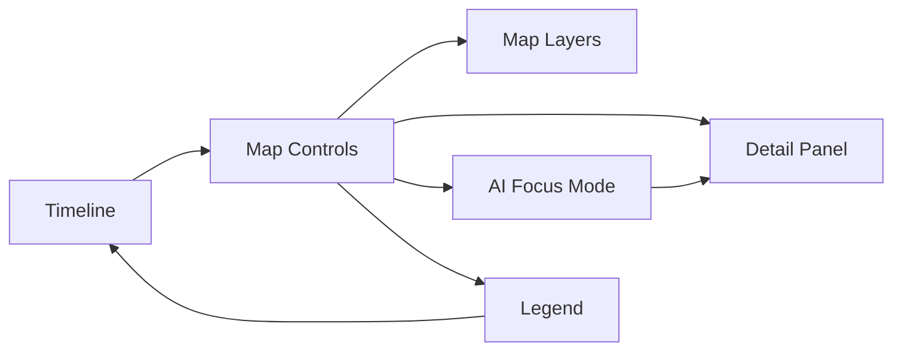
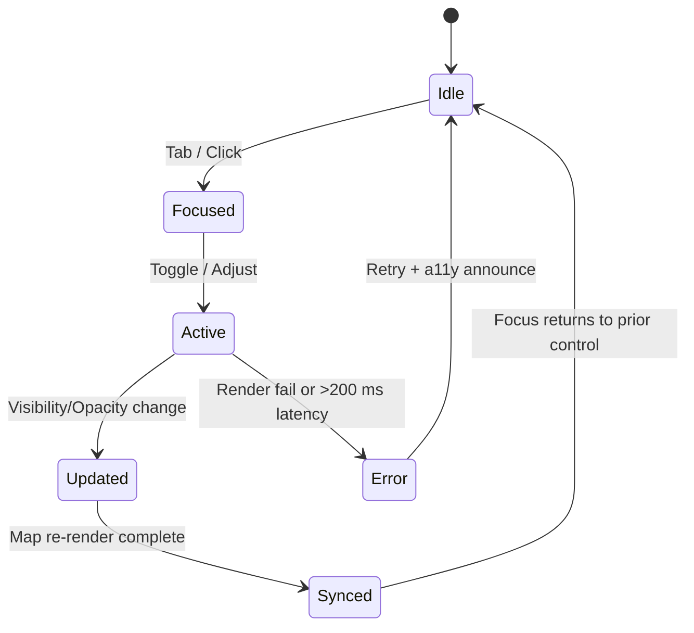

<div align="center">

# 🗺️ Kansas Frontier Matrix — **Map Controls Component Design Review (Tier-S⁺ Certified)**  
`docs/design/reviews/ui_components/map_controls.md`

**Mission:** Govern, audit, and preserve the **Map Controls System** — layer toggles, zoom, legend, opacity, blend modes, reset, and **Focus Mode (AI Context)** — so all spatial interactions are **accessible, performant, themed (light/dark), RTL-ready, semantically consistent, and ethically governed** across the **Kansas Frontier Matrix (KFM)**.

[](../../../standards/documentation.md)
[](../../style-guide.md)
[](../accessibility/)
[](../../../.github/workflows/policy-check.yml)
[](../../../LICENSE)

</div>

---

```yaml
---
title: "🗺️ Kansas Frontier Matrix — Map Controls Component Design Review"
document_type: "Component Review"
version: "v4.1.0"
last_updated: "2025-10-31"
created: "2023-09-30"
component: "Map Controls"
design_ref: "Figma Frame #MAP-CTRL-2025"
implementation_ref: "web/src/components/map/controls/"
owners: ["@kfm-design","@kfm-web","@kfm-accessibility","@kfm-mapping"]
reviewed_by: ["@kfm-frontend","@kfm-accessibility","@kfm-design-council","@kfm-cartography"]
status: "Stable"
maturity: "Production"
license: "CC-BY-4.0"
tags: ["map","controls","layers","legend","zoom","blend-mode","accessibility","tokens","mcp","fair","stac","rtl","dark-mode"]
classification:
  component_type: "UI"
  integration_level: "Frontend + MapLibre + Graph"
  risk_level: "Low"
  audit_frequency: "Quarterly + per release"
alignment:
  - MCP-DL v6.3
  - WCAG 2.1 AA
  - WAI-ARIA 1.2
  - CIDOC CRM (Spatial Provenance)
  - OWL-Time (Temporal Layer Mapping)
  - PROV-O (Traceability)
  - FAIR Principles
  - DCAT 3.0 (UI Dataset Linkage)
dependencies:
  - React + MapLibre
  - Neo4j Graph + STAC Catalog
  - tokens.css Design System
  - Lighthouse / Axe / Pa11y / Playwright / Cypress / Jest
template_scope:
  visual_parity: true
  accessibility_alignment: true
  localization_readiness: true
  dark_mode_compliance: true
  rtl_support: true
  provenance_transparency: true
  offline_resilience: true
review_cycle: "Per release + quarterly audit"
validation:
  ci_enforced: true
  lighthouse_min_score: 95
  axe_blocking_violations: 0
  contrast_min_ratio: 4.5
  keyboard_traps: "none"
  schema_checks: true
  layer_interactivity: true
  map_responsiveness: true
  rtl_parity_required: true
  dark_mode_required: true
provenance:
  workflow_ref: ".github/workflows/component-review.yml"
  artifact_retention_days: 90
  sha256_integrity: verified
versioning:
  policy: "Semantic Versioning (MAJOR.MINOR.PATCH)"
  major_change: "Map control architecture/IA refactor"
  minor_change: "New control, token update, or a11y/i18n enhancement"
  patch_change: "Typographical, parity, or doc fix"
telemetry:
  metrics_collected:
    - "Layer toggle latency (ms)"
    - "Legend render time (ms)"
    - "Keyboard reachability %"
    - "Contrast compliance %"
    - "Reduced motion adoption %"
    - "Blend-mode preview time (ms)"
    - "Focus Mode activation %"
    - "Zoom interaction rate"
    - "RTL parity %"
    - "Dark/Light usage ratio"
  thresholds:
    toggle_latency_max_ms: 100
    legend_render_max_ms: 150
    keyboard_reachability_min: 100
    rtl_parity_min: 100
    zoom_fps_min: 55
  privacy_policy: "Aggregate metrics only; FAIR + W3C Privacy compliant; no PII."
preservation_policy:
  replication_targets: ["GitHub Repository","Zenodo Snapshot","OSF Backup"]
  checksum_algorithm: "SHA-256"
  revalidation_cycle: "quarterly"
related_components:
  - timeline
  - navigation
  - ai_assistant
  - detail_panel
  - map_layers
---
```

---

## 🎯 Objective
The **Map Controls System** is KFM’s **spatial command layer**. It must remain **token-aligned, accessible, responsive, themed (light/dark), RTL-ready, and provenance-aware**, while enforcing **performance budgets** and **ethical transparency** for AI-assisted Focus Mode.

---

## 🧩 Component Overview
| Subcomponent | Description | File |
|:--|:--|:--|
| **Zoom Controls** | Incremental zoom & fit bounds | `ZoomControl.tsx` |
| **Layer Toggles** | Enable/disable thematic layers | `LayerToggles.tsx` |
| **Legend Panel** | Symbology, color ramps, sources | `Legend.tsx` |
| **Opacity Slider** | Layer transparency control | `OpacitySlider.tsx` |
| **Blend Mode Selector** | Overlay compositing modes | `BlendModeControl.tsx` |
| **Focus Mode Button** | AI contextual filtering toggle | `FocusModeControl.tsx` |
| **Reset View** | Restore extent + active layers | `ResetButton.tsx` |

---

## 🧭 Cross-Component Dependencies

<!-- END OF MERMAID -->

---

## ♿ ARIA Role & Control Map
| Control | Role | Required ARIA | Example |
|:--|:--|:--|:--|
| **Zoom In/Out** | `button` | `aria-label="Zoom In/Out"` | `<button aria-label="Zoom In">+</button>` |
| **Layer Toggle** | `switch` | `aria-checked` | `<div role="switch" aria-checked="true">` |
| **Opacity** | `slider` | `aria-valuenow` `aria-valuemin` `aria-valuemax` | `<input type="range" ...>` |
| **Legend Panel** | `region` | `aria-labelledby="legend"` | `<section role="region">` |
| **Blend Modes** | `listbox` | `aria-activedescendant` | `<ul role="listbox">` |
| **Focus Mode** | `button` | `aria-pressed` | `<button aria-pressed="false">` |

> **Focus order**: Zoom → Layer Toggles → Opacity → Blend → Legend → Focus Mode → Reset (cyclical; no traps).

---

## 🌗 Theme & RTL Parity
| Mode | Token Baseline | Contrast ≥ 4.5 | Screenshot | Pass |
|:--|:--|:--:|:--|:--:|
| **Light** | `--kfm-map-bg` + `--kfm-text` | ✅ | `/assets/map_ctrls/light.png` | ✅ |
| **Dark** | `--kfm-map-bg-dark` + `--kfm-text-dark` | ✅ | `/assets/map_ctrls/dark.png` | ✅ |
| **RTL** | Logical props mirrored | — | `/assets/map_ctrls/rtl.png` | ✅ |

---

## 🧠 Component State Lifecycle

<!-- END OF MERMAID -->

---

## 🧠 User Journeys
| Persona | Goal | Path | Success |
|:--|:--|:--|:--|
| Researcher | Compare treaty overlays | Toggle → Opacity → Blend | Clarity in ≤ 2 actions |
| Educator | Show climate overlays | Legend → Layer → Focus Mode | Timeline sync confirmed |
| Indigenous Partner | Validate boundaries | Layer → Focus Mode → Detail Panel | Provenance visible |
| Archivist | Recover overview | Reset → Timeline Sync | State restored ≤ 1 s |

---

## 🧮 Performance & A11y Metrics (merge gates)
| Metric | Target | Observed | Tool | Pass |
|:--|:--|:--|:--|:--:|
| Layer Toggle Latency | ≤ 100 ms |  | Lighthouse | ☐ |
| Legend Render Time | ≤ 150 ms |  | Profiler | ☐ |
| Keyboard Reachability | 100 % |  | Playwright | ☐ |
| Contrast Failures | 0 |  | Pa11y | ☐ |
| Zoom FPS | ≥ 55 fps |  | DevTools | ☐ |
| Bundle Size | ≤ 120 KB gzip |  | Analyzer | ☐ |

> **CI merge gate:** fails if any threshold is unmet.

---

## 🧰 Keyboard Shortcuts
| Action | Keys | Notes |
|:--|:--|:--|
| Zoom In/Out | `+` / `-` | Also `Ctrl/Cmd + scroll` |
| Toggle Layer | `Space` | When toggle focused |
| Adjust Opacity | `← / →` | 1–5 % step; Home/End min/max |
| Cycle Blend Modes | `B` | Opens listbox; arrows select |
| Focus Mode | `F` | Toggle AI context |
| Reset Map | `R` | Extent + layers default |
| Open Legend | `L` | Expand/collapse legend |

---

## 🧠 Cognitive & Motion Design Rules
- Hover transitions **≤ 200 ms** fade; no opacity jumps > **30 %**.  
- Respect `prefers-reduced-motion`; disable nonessential animations.  
- Provide **print/static** view for motion-sensitive users.  
- Maintain focus context after zoom/transition.

---

## 🌍 Cultural & Data Integrity (CARE + FAIR)
| Check | Requirement | Status |
|:--|:--|:--:|
| Layer Provenance | STAC link exposed in Legend | ✅ |
| License Compliance | CC-BY 4.0 / public domain | ✅ |
| Sensitive Boundaries | Community-approved usage | ✅ |
| AI Transparency | Confidence + sources displayed | ✅ |
| Attribution | Visible in legend & panel | ✅ |

---

## 🎨 Color & Symbology Reference
| Color / Pattern | Meaning | WCAG Pass | Verified |
|:--|:--|:--:|:--:|
| `#c77d02` | Treaty boundaries | ✅ AA | ✅ |
| `#0074D9` | Rivers | ✅ AA | ✅ |
| `#4CAF50` | Vegetation | ✅ AA | ✅ |
| Gray Hatch | Incomplete data area | ✅ AA | ✅ |

---

## 🧩 Error & Recovery Taxonomy
| Error | Trigger | Behavior | User Feedback |
|:--|:--|:--|:--|
| Layer Load Failure | Timeout/missing file | Disable toggle + retry prompt | “Layer failed — retry?” |
| Opacity Range Error | Out-of-bounds input | Reset to 100 % | “Value reset to default.” |
| Legend Token Missing | Undefined token | Fallback neutral color | Console warning + badge |
| AI Context Failure | Model offline | Disable Focus Mode | “AI suggestions unavailable.” |

---

## 🧪 Automated Test References
| Test | Framework | Path | Purpose |
|:--|:--|:--|:--|
| Layer Toggles | Jest + RTL | `tests/map/LayerToggles.test.tsx` | State + aria sync |
| Legend A11y | Pa11y | `tests/a11y/legend-audit.yml` | Contrast + roles |
| Focus Mode Flow | Playwright | `tests/map/focus-mode.spec.ts` | AI context correctness |
| Keyboard Path | Cypress | `tests/a11y/keyboard-map.cy.ts` | Full traversal |

---

## 🧠 Human Factors & Device Coverage
| Condition | Test | Expected |
|:--|:--|:--|
| Zoom at 200 % | Magnification | No clipping/overlap |
| Reduced Motion | OS preference | Animations disabled |
| Color Blindness | Protan/Deutan/Tritan | Legend readable |
| Voice Input | “Toggle layer” | Action performed |
| Mobile Touch | Tap/drag | Mirrors pointer/keyboard |

---

## 🧭 Data Lineage Trace
| Dataset | Type | Version | Used for | Provenance ID | Verified |
|:--|:--|:--|:--|:--|:--:|
| Treaties (STAC) | Vector | v2.3.0 | Boundary overlays | `stac:ks-treaty-v2` | ✅ |
| Floodplains (STAC) | GeoJSON | v1.7.2 | Hazard overlays | `stac:hydro-v1` | ✅ |
| Basemap Tiles | Raster | v2025.09 | Base rendering | `stac:kfm-basemap` | ✅ |

---

## 🧾 Observability Hooks (telemetry export)
```yaml
observability:
  endpoint: "https://metrics.kfm.ai/map-controls"
  frequency: "daily"
  metrics_exported:
    - toggle_latency_ms
    - legend_render_ms
    - a11y_score
    - rtl_parity_percent
    - dark_mode_usage_ratio
    - zoom_fps
    - focus_mode_usage_percent
```

---

## ⚙️ CI Workflow (automation & gates)
- **Workflow:** `.github/workflows/component-review.yml`
- **Stages:** Schema → Axe/Pa11y → Lighthouse → Playwright/Cypress → RTL/Dark snapshots → Token parity → Provenance checksum  
- **Artifacts:** `/data/work/logs/design/ui_components/map_controls/validation.json`  
- **Merge Gate:** blocked if thresholds in **Performance & A11y Metrics** are not met.

---

## 🧾 FAIR + DCAT Registration (semantic index)
```json
{
  "@context": "https://schema.org/",
  "@type": "CreativeWork",
  "name": "KFM — Map Controls Component Design Review",
  "identifier": "doi:10.5281/zenodo.2468101",
  "license": "CC-BY-4.0",
  "creator": "Kansas Frontier Matrix Design Council",
  "version": "v4.1.0",
  "alignment": ["MCP-DL v6.3","WCAG 2.1 AA","FAIR","CARE","DCAT 3.0"],
  "dateModified": "2025-10-31",
  "audience": "Developers, Designers, Accessibility Auditors"
}
```

---

## 🧾 Provenance JSON-LD (machine export)
```json
{
  "@context": ["https://schema.org", {"kfm":"https://kfm.ai/schema#"}],
  "@type": "ComponentDesignReview",
  "component": "Map Controls",
  "version": "v4.1.0",
  "reviewedBy": ["@kfm-design","@kfm-accessibility","@kfm-mapping"],
  "alignment": ["MCP-DL v6.3","WCAG 2.1 AA","FAIR","CARE","DCAT 3.0"],
  "governance": {
    "workflow": ".github/workflows/component-review.yml",
    "sha256": "auto-generated"
  }
}
```

---

## 🧩 Re-Audit Policy
```yaml
re_audit_policy:
  validity_period: "12 months"
  triggers:
    - "WCAG revision"
    - "Token change > 5 %"
    - "Control architecture refactor"
  auto_expire: true
```

---

## 📅 Version History
| Version | Date | Author | Summary | Type |
|:--|:--|:--|:--|:--|
| **v4.1.0** | 2025-10-31 | @kfm-design | Tier-S⁺: theme/RTL parity gates, observability, lineage, merge thresholds, ARIA map refinements. | Minor |
| **v4.0.0** | 2025-10-23 | @kfm-design | User journeys, token coverage, AI transparency, governance diagram. | Major |
| **v3.0.0** | 2025-10-22 | @kfm-web | Quantitative telemetry, human factors, and error states. | Major |
| **v2.4.0** | 2025-09-12 | @kfm-accessibility | Cultural accessibility and CI tests. | Minor |
| **v2.0.0** | 2024-11-02 | @kfm-core | MCP-DL v6.3 migration for map controls. | Major |
| **v1.0.0** | 2023-09-30 | Founding Team | Initial map controls review document. | Major |

---

<div align="center">

### 🗺️ Map Controls Review Governance  
**Accessible · Themed/RTL-Ready · Ethical · Provenanced · Reproducible**

</div>
