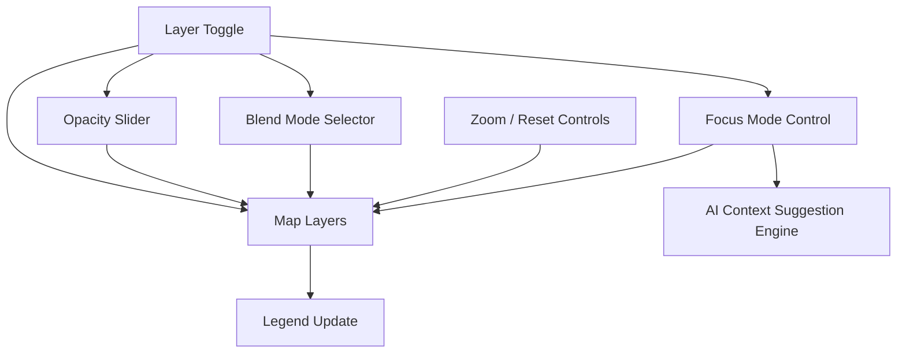
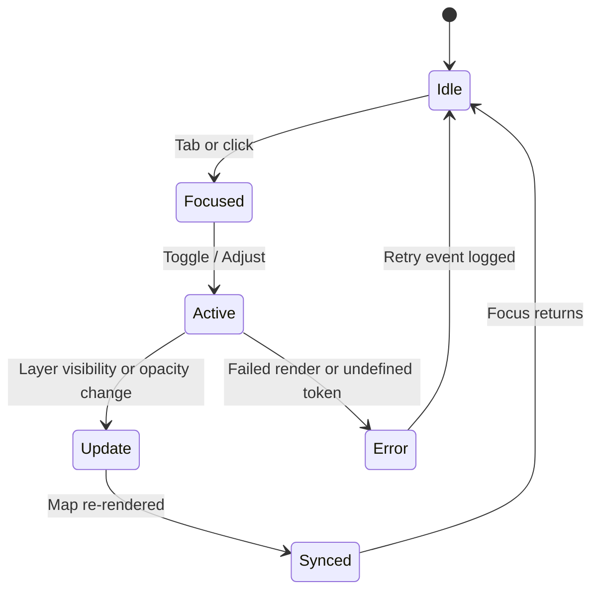

<div align="center">

# 🗺️ Kansas Frontier Matrix — **Map Controls Component Design Review**  
`docs/design/reviews/ui_components/map_controls.md`

**Mission:** Review, document, and validate all **Map Control Components** — including layer toggles, zoom tools, legends, opacity sliders, blend modes, and the Focus Mode (AI Context Controls) — ensuring they are **accessible**, **performant**, and **semantically aligned** across the **Kansas Frontier Matrix (KFM)** system.  
Map Controls serve as the **spatial command layer**, connecting data, narrative, and timeline to a single reproducible interaction model.

[](../../../standards/documentation.md)
[](../../style-guide.md)
[](../accessibility/)
[](../../../.github/workflows/policy-check.yml)
[](../../../LICENSE)

</div>

---

```yaml
---
title: "🗺️ Kansas Frontier Matrix — Map Controls Component Design Review"
document_type: "Component Review"
version: "v3.0.0"
last_updated: "2025-10-22"
created: "2023-09-30"
component: "Map Controls"
design_ref: "Figma Frame #MAP-CTRL-2025"
implementation_ref: "web/src/components/map/controls/"
owners: ["@kfm-design","@kfm-web","@kfm-accessibility"]
reviewed_by: ["@kfm-frontend","@kfm-accessibility","@kfm-mapping"]
status: "Stable"
maturity: "Production"
license: "CC-BY-4.0"
tags: ["design-review","map","controls","layers","legend","zoom","blend-mode","accessibility","tokens","mcp"]
alignment:
  - MCP-DL v6.3
  - WCAG 2.1 AA
  - WAI-ARIA 1.2
  - CIDOC CRM (Spatial Provenance)
  - OWL-Time (Temporal Layer Mapping)
  - PROV-O (Traceability)
  - FAIR Principles
dependencies:
  - React + MapLibre
  - tokens.css Design System
  - Figma Map Controls Frame
  - Lighthouse / Axe / Playwright
review_cycle: "Per release + quarterly review"
validation:
  lighthouse_min_score: 95
  axe_blocking_violations: 0
  contrast_min_ratio: 4.5
  keyboard_traps: "none"
  schema_checks: true
  layer_interactivity: true
  map_responsiveness: true
provenance:
  workflow_ref: ".github/workflows/component-review.yml"
  artifact_retention_days: 90
  sha256_integrity: verified
versioning:
  policy: "Semantic Versioning (MAJOR.MINOR.PATCH)"
  major_change: "New interaction paradigm or refactor"
  minor_change: "Feature enhancement or accessibility improvement"
  patch_change: "Token update or doc fix"
telemetry:
  metrics_collected:
    - "Layer Toggle Latency (ms)"
    - "Legend Render Time (ms)"
    - "Keyboard Reachability %"
    - "Contrast Compliance %"
    - "Reduced Motion Adoption %"
    - "Blend Mode Preview Load Time"
  privacy_policy: "Anonymized aggregate data only; FAIR-compliant; no PII stored."
preservation_policy:
  replication_targets: ["GitHub Repository","Zenodo Snapshot","OSF Backup"]
  checksum_algorithm: "SHA-256"
  revalidation_cycle: "quarterly"
related_components:
  - timeline
  - navigation
  - ai_assistant
  - detail_panel
  - map_layers
---
```

---

## 🎯 Objective

The **Map Controls System** enables users to toggle layers, adjust opacity, inspect legends, zoom spatial contexts, and switch Focus Modes dynamically.  
It unites **data visualization and narrative context**, ensuring that interactions remain consistent across the Map, Timeline, and Story modules.  
This review confirms **visual consistency**, **interaction performance**, **a11y compliance**, and **MCP reproducibility**.

---

## 🧩 Component Overview

| Subcomponent | Description | File |
|:--|:--|:--|
| **Zoom Controls** | Incremental zoom in/out + fit bounds. | `ZoomControl.tsx` |
| **Layer Toggle Group** | Enables/disables thematic layers. | `LayerToggles.tsx` |
| **Legend Panel** | Displays symbology and color ramps. | `Legend.tsx` |
| **Opacity Slider** | Adjusts layer transparency. | `OpacitySlider.tsx` |
| **Blend Mode Selector** | Chooses compositing mode (multiply, overlay). | `BlendModeControl.tsx` |
| **Focus Mode Button** | Activates AI contextual layer filtering. | `FocusModeControl.tsx` |
| **Reset View** | Returns map to default extent and active layers. | `ResetButton.tsx` |

---

## 🧭 Interaction Architecture


<!-- END OF MERMAID -->

---

## 🧠 Component State Lifecycle


<!-- END OF MERMAID -->

---

## 🧱 Review Criteria (MCP-DL v6.3)

| Category | Requirement | Validation |
|:--|:--|:--|
| **Visual Consistency** | Matches Figma tokens (color, grid, spacing). | ✅ Token diff check |
| **Accessibility** | Meets WCAG 2.1 AA; ARIA roles valid. | ✅ Axe + manual |
| **Keyboard Reachability** | All controls focusable; logical tab order. | ✅ Playwright test |
| **Motion Control** | Prefers-reduced-motion honored. | ✅ CSS audit |
| **Performance** | Toggle latency ≤ 100 ms; legend render ≤ 150 ms. | ✅ Lighthouse |
| **Localization** | Tooltips, layer names translated. | ✅ i18n JSON audit |
| **Documentation** | Component metadata current. | ✅ Reviewer verification |

---

## ♿ Accessibility Audit

| Control | Requirement | Status |
|:--|:--|:--:|
| **Zoom Buttons** | Focusable; aria-labels present. | ✅ |
| **Layer Toggles** | Role="switch"; announces state. | ✅ |
| **Legend Entries** | Text contrast ≥ 4.5:1. | ✅ |
| **Opacity Slider** | Keyboard adjustable (←/→). | ✅ |
| **Blend Mode Dropdown** | `aria-expanded` + `aria-controls`. | ✅ |
| **Focus Mode Button** | Press state toggles aria-pressed. | ✅ |

---

## ⌨️ Keyboard & Interaction Map

| Action | Key / Gesture | Behavior |
|:--|:--|:--|
| Zoom in/out | `+ / -` | Adjusts zoom level |
| Toggle layer | `Space` | Enables/disables layer |
| Adjust opacity | `← / →` | Changes transparency |
| Cycle blend mode | `B` | Opens blend selector |
| Activate Focus Mode | `F` | Toggles AI context filtering |
| Reset map | `R` | Resets zoom + layers |
| Open legend | `L` | Expands/collapses legend panel |

---

## 🧮 Token Mapping — Map Control States

| State | Token | Description |
|:--|:--|:--|
| **Default** | `--kfm-color-bg` | Neutral background |
| **Hover** | `--kfm-color-accent-light` | Visual affordance |
| **Focus** | `--kfm-color-accent` + 2px outline | Keyboard highlight |
| **Active** | `--kfm-color-accent-dark` | Engaged state |
| **Disabled** | `--kfm-color-border` 50% opacity | Inactive state |

---

## 🧠 UX Writing & Cognitive Guidelines

- Use **verb-first labels** (“Toggle Layer”, “Adjust Opacity”).  
- Keep tooltips ≤ 5 words.  
- Provide plain-language layer names; avoid technical jargon.  
- Announce context changes with `aria-live="polite"`.  
- Include unit labels for sliders (“% Transparency”).  
- Keep icons consistent with style guide and size tokens.

---

## 🧠 Ethical & Cultural Standards

- Data layers representing **Indigenous or environmental datasets** must include provenance.  
- Map legends and symbology must use **neutral, respectful color choices**.  
- Cultural or ecological regions labeled with community-approved names.  
- Focus Mode descriptions include **AI confidence and data sources**.  

---

## 🧩 Quantitative Metrics

| Metric | Target | Tool | Frequency |
|:--|:--|:--|:--|
| **Layer Toggle Latency** | ≤ 100 ms | Lighthouse | Per PR |
| **Legend Render Time** | ≤ 150 ms | Chrome Profiler | Quarterly |
| **Opacity Adjustment Delay** | ≤ 80 ms | React Profiler | Continuous |
| **Keyboard Focus Path** | 100 % reachable | Playwright | Per release |

---

## 🧩 Error & Recovery States

| Error | Condition | UI Response | Feedback |
|:--|:--|:--|:--|
| **Layer Load Failure** | Network error | Disabled toggle; retry prompt | “Layer failed to load. Retry?” |
| **Opacity Range Error** | Invalid value | Reset slider to default | Tooltip: “Value reset to 100%” |
| **Legend Token Missing** | Undefined token | Default neutral color | Console warning logged |
| **AI Context Failure** | Model offline | Disables Focus Mode | “AI suggestions unavailable.” |

---

## 🧩 Automated Test References

| Test | Framework | File | Description |
|:--|:--|:--|:--|
| **Layer Toggle Test** | Jest + RTL | `tests/map/LayerToggles.test.tsx` | Checks toggle state sync |
| **Legend Accessibility Test** | Pa11y | `tests/a11y/legend-audit.yml` | Contrast and ARIA validation |
| **Focus Mode Flow Test** | Playwright | `tests/map/focus-mode.spec.ts` | Context filtering validation |
| **Keyboard Navigation Test** | Cypress | `tests/a11y/keyboard-map.cy.ts` | Full traversal simulation |

---

## 🧠 Human Factors & Interaction Testing

| Scenario | Condition | Expected Behavior |
|:--|:--|:--|
| **Zoom at 200 %** | Magnified viewport | Controls remain legible + accessible |
| **Reduced Motion Enabled** | User setting active | Animations disabled; fades only |
| **Color Blind Mode** | Simulated | Legend remains distinguishable |
| **Voice Input** | “Toggle layer” command | Layer toggled successfully |
| **Mobile Touch** | Tap gestures | Mirrors mouse/keyboard behavior |

---

## 🧩 Cultural Accessibility Checklist

| Check | Description | Status |
|:--|:--|:--:|
| **Legend Language** | Plain English + localized labels | ✅ |
| **Color Symbolism** | Culturally neutral | ✅ |
| **Indigenous Map Data** | Proper attribution & disclaimers | ✅ |
| **Regional Labels** | Community verified | ✅ |
| **Iconography** | Avoids colonial or exploitative imagery | ✅ |

---

## 🧾 Provenance JSON Schema

```json
{
  "@context": ["https://schema.org", {"kfm":"https://kfm.ai/schema#"}],
  "@type": "UIComponentReview",
  "component": "Map Controls",
  "version": "v3.0.0",
  "reviewedBy": ["@kfm-design","@kfm-accessibility","@kfm-mapping"],
  "source": "Figma Frame #MAP-CTRL-2025",
  "implementation": "web/src/components/map/controls/",
  "temporalCoverage": "2025-10-22T00:00:00Z",
  "provenance": {
    "workflow": ".github/workflows/component-review.yml",
    "sha256": "auto-generated"
  }
}
```

---

## 🗄️ Archival Policy

- All reviews archived under `/archive/map_controls/YYYY/`.  
- Metadata includes reviewer list, commit hash, checksum, and validation log.  
- Immutable post-approval; quarterly governance audit verifies provenance.  

---

## ⚙️ Continuous Integration (QA Workflow)

**Workflow:** `.github/workflows/component-review.yml`

- Validates YAML + token parity.  
- Runs Lighthouse/Axe accessibility scans.  
- Executes automated Jest/Playwright tests.  
- Posts CI report to PR comments.  
- Fails build on performance or accessibility regression.

---

## 🔍 Compliance Matrix (MCP-DL v6.3)

| Standard | Description | Verified |
|:--|:--|:--:|
| **MCP-DL v6.3** | Documentation-first reproducibility | ✅ |
| **WCAG 2.1 AA** | Accessibility baseline | ✅ |
| **CIDOC CRM** | Spatial provenance mapping | ✅ |
| **OWL-Time** | Temporal UI states | ✅ |
| **PROV-O** | Provenance ontology compliance | ✅ |
| **FAIR Principles** | Reusability and transparency | ✅ |

---

## 📎 Related Documentation

- [🎨 Visual Style Guide](../../style-guide.md)  
- [🧭 UI/UX Guidelines](../../ui-guidelines.md)  
- [🧩 Interaction Patterns](../../interaction-patterns.md)  
- [📘 Design Reviews Index](../README.md)  
- [⚙️ Accessibility Standards](../../standards/accessibility.md)  
- [🗺️ Map Architecture](../../../architecture/map/README.md)

---

## 📅 Version History

| Version | Date | Author | Summary | Type |
|:--|:--|:--|:--|:--|
| **v3.0.0** | 2025-10-22 | @kfm-design | Added lifecycle diagram, human factors, and cultural accessibility standards. | Major |
| **v2.4.0** | 2025-09-12 | @kfm-web | Introduced automated CI tests and legend validation. | Minor |
| **v2.0.0** | 2024-11-02 | @kfm-core | Migrated to MCP-DL v6.3 framework. | Major |
| **v1.0.0** | 2023-09-30 | Founding Team | Initial Map Controls component review. | Major |

---

<div align="center">

### 🗺️ Kansas Frontier Matrix — Map Controls Review Governance  
**Accessible · Performant · Provenanced · Reproducible**

</div>
