<div align="center">

# 🗺️ Kansas Frontier Matrix — **Map Controls Component Design Review**  
`docs/design/reviews/ui_components/map_controls.md`

**Mission:** Audit and document the **Map Controls System** — layer toggles, zoom, legend, opacity, blend modes, and Focus Mode (AI Context) — ensuring that all spatial interactions in the **Kansas Frontier Matrix (KFM)** remain accessible, performant, semantically consistent, and ethically governed.  
Map Controls are the **spatial command layer** of KFM, translating complex geospatial and historical datasets into intuitive, reproducible visual interactions that align with MCP-DL v6.3 standards.

[](../../../standards/documentation.md)
[](../../style-guide.md)
[](../accessibility/)
[](../../../.github/workflows/policy-check.yml)
[](../../../LICENSE)

</div>

---

```yaml
---
title: "🗺️ Kansas Frontier Matrix — Map Controls Component Design Review"
document_type: "Component Review"
version: "v4.0.0"
last_updated: "2025-10-23"
created: "2023-09-30"
component: "Map Controls"
design_ref: "Figma Frame #MAP-CTRL-2025"
implementation_ref: "web/src/components/map/controls/"
owners: ["@kfm-design","@kfm-web","@kfm-accessibility","@kfm-mapping"]
reviewed_by: ["@kfm-frontend","@kfm-accessibility","@kfm-design-council"]
status: "Stable"
maturity: "Production"
license: "CC-BY-4.0"
tags: ["design-review","map","controls","layers","legend","zoom","blend-mode","a11y","tokens","mcp","fair","stac"]
alignment:
  - MCP-DL v6.3
  - WCAG 2.1 AA
  - WAI-ARIA 1.2
  - CIDOC CRM (Spatial Provenance)
  - OWL-Time (Temporal Layer Mapping)
  - PROV-O (Traceability)
  - FAIR Principles
  - DCAT 3.0 (UI Dataset Linkage)
dependencies:
  - React + MapLibre
  - Figma Map Controls Frame
  - tokens.css Design System
  - Lighthouse / Axe / Pa11y / Playwright
  - Neo4j Graph + STAC Metadata Catalog
review_cycle: "Per release + quarterly audit"
governance_board: ["@kfm-design-council","@kfm-accessibility-lead","@kfm-cartography"]
validation:
  lighthouse_min_score: 95
  axe_blocking_violations: 0
  contrast_min_ratio: 4.5
  keyboard_traps: "none"
  schema_checks: true
  layer_interactivity: true
  map_responsiveness: true
provenance:
  workflow_ref: ".github/workflows/component-review.yml"
  artifact_retention_days: 90
  sha256_integrity: verified
versioning:
  policy: "Semantic Versioning (MAJOR.MINOR.PATCH)"
  major_change: "Major re-architecture of map control system"
  minor_change: "New features, token updates, or accessibility improvements"
  patch_change: "Typographical or documentation fix"
telemetry:
  metrics_collected:
    - "Layer Toggle Latency (ms)"
    - "Legend Render Time (ms)"
    - "Keyboard Reachability %"
    - "Contrast Compliance %"
    - "Reduced Motion Adoption %"
    - "Blend Mode Preview Load Time"
    - "Focus Mode Activation %"
    - "Zoom Interaction Rate"
  privacy_policy: "Aggregate metrics only; FAIR + W3C Privacy compliant; no PII."
preservation_policy:
  replication_targets: ["GitHub Repository","Zenodo Snapshot","OSF Backup"]
  checksum_algorithm: "SHA-256"
  revalidation_cycle: "quarterly"
related_components:
  - timeline
  - navigation
  - ai_assistant
  - detail_panel
  - map_layers
---
```

---

## 🎯 Objective

The **Map Controls System** orchestrates how users engage with layered data in the Kansas Frontier Matrix, integrating spatial, temporal, and narrative dimensions into an accessible and reproducible interface.  
This review validates **visual design parity**, **interaction timing**, **performance budgets**, **accessibility**, and **ethical compliance** per **MCP-DL v6.3** standards.

---

## 🧩 Component Overview

| Subcomponent | Description | File |
|:--|:--|:--|
| **Zoom Controls** | Incremental zoom & fit bounds. | `ZoomControl.tsx` |
| **Layer Toggles** | Enable/disable thematic data layers. | `LayerToggles.tsx` |
| **Legend Panel** | Displays symbology and metadata. | `Legend.tsx` |
| **Opacity Slider** | Adjusts transparency of layers. | `OpacitySlider.tsx` |
| **Blend Mode Selector** | Adjusts compositing modes for overlays. | `BlendModeControl.tsx` |
| **Focus Mode Button** | Toggles AI contextual filtering. | `FocusModeControl.tsx` |
| **Reset Map View** | Resets all map states to defaults. | `ResetButton.tsx` |

---

## 🧭 Cross-Component Dependency Diagram


<!-- END OF MERMAID -->

---

## 🧠 Component State Lifecycle


<!-- END OF MERMAID -->

---

## 🧠 User Journeys

| Persona | Goal | Interaction Path | Success Criteria |
|:--|:--|:--|:--|
| **Researcher** | Compare historical treaties | Layer Toggle → Opacity → Blend Mode | Visual clarity in ≤ 2 actions |
| **Educator** | Demonstrate climate data overlays | Legend → Layer → Focus Mode | Map syncs to timeline context |
| **Indigenous Partner** | Validate cultural land layers | Layer → Focus Mode → Detail Panel | Provenance data visible |
| **Archivist** | Reset after deep zoom | Reset → Timeline Sync | State restored in ≤ 1s |

---

## ♿ Accessibility & ARIA Mapping

| Control | Role | Required ARIA | Example |
|:--|:--|:--|:--|
| **Zoom In/Out** | `button` | `aria-label="Zoom In"` | `<button aria-label="Zoom In">+</button>` |
| **Layer Toggle** | `switch` | `aria-checked` | `<div role="switch" aria-checked="true">` |
| **Opacity Slider** | `slider` | `aria-valuenow` `aria-valuemin` `aria-valuemax` | ✅ |
| **Legend Panel** | `region` | `aria-labelledby="legend"` | ✅ |
| **Blend Mode Selector** | `listbox` | `aria-activedescendant` | ✅ |
| **Focus Mode Button** | `button` | `aria-pressed` | ✅ |

---

## 🧱 Design Token Coverage

| Token Group | Example Tokens | Validation |
|:--|:--|:--:|
| **Color** | `--kfm-map-bg`, `--kfm-accent`, `--kfm-border` | ✅ |
| **Elevation** | `--kfm-elev-sm`, `--kfm-shadow-md` | ✅ |
| **Motion** | `--kfm-motion-fast`, `--kfm-motion-smooth` | ✅ |
| **Radius** | `--kfm-radius-md` | ✅ |
| **Typography** | `--kfm-font-sans` | ✅ |

---

## 🧮 Quantitative Performance & Accessibility Metrics

| Metric | Target | Tool | Frequency |
|:--|:--|:--|:--|
| **Layer Toggle Latency** | ≤ 100 ms | Lighthouse | PR |
| **Legend Render Time** | ≤ 150 ms | Profiler | Quarterly |
| **Keyboard Reachability** | 100 % | Playwright | PR |
| **Contrast Failures** | 0 | Pa11y | Continuous |
| **Zoom FPS** | ≥ 55 fps | Chrome DevTools | Monthly |
| **Bundle Size** | ≤ 120 KB gzip | Webpack Analyzer | Build |

---

## 🧠 Cognitive & Motion Design Rules

- Hover transitions ≤ 200 ms fade.  
- No opacity shifts > 30 % on hover/focus.  
- Support “print/static” view mode for motion-sensitive users.  
- Retain focus context after any transition or zoom.  
- All animations disable when `prefers-reduced-motion` is set.

---

## 🧠 Ethical & Data Integrity Checks

| Check | Requirement | Status |
|:--|:--|:--:|
| **Layer Data Provenance** | Linked to STAC item | ✅ |
| **License Compliance** | CC-BY 4.0 or public domain | ✅ |
| **AI Transparency** | Confidence + model cited | ✅ |
| **Sensitive Boundaries** | Community-approved use | ✅ |
| **Attribution Display** | Always visible in legend | ✅ |

---

## 🧮 Color & Symbology Reference

| Color / Pattern | Meaning | WCAG Pass | Verified |
|:--|:--|:--:|:--:|
| `#c77d02` | Treaty boundaries | ✅ AA | ✅ |
| `#0074D9` | Rivers & water | ✅ AA | ✅ |
| `#4CAF50` | Vegetation zones | ✅ AA | ✅ |
| Hatch (Gray) | Incomplete data area | ✅ AA | ✅ |

---

## 🧩 Error & Recovery Scenarios

| Error | Condition | Behavior | Feedback |
|:--|:--|:--|:--|
| **Layer Load Failure** | Missing file / timeout | Disabled toggle + retry prompt | “Layer failed to load. Retry?” |
| **Opacity Error** | Invalid input | Reset to 100 % | Tooltip: “Reset to default.” |
| **Legend Token Missing** | Undefined token | Fallback neutral color | Warning logged |
| **AI Context Failure** | Model offline | Focus Mode disabled | “AI suggestions unavailable.” |

---

## 🧩 Automated Test References

| Test | Framework | File | Description |
|:--|:--|:--|:--|
| **Layer Toggles** | Jest + RTL | `tests/map/LayerToggles.test.tsx` | Validates state updates |
| **Legend Audit** | Pa11y | `tests/a11y/legend-audit.yml` | Validates ARIA + contrast |
| **Focus Mode Flow** | Playwright | `tests/map/focus-mode.spec.ts` | Tests AI context response |
| **Keyboard Navigation** | Cypress | `tests/a11y/keyboard-map.cy.ts` | Simulates focus traversal |

---

## 🧠 Human Factors & Cognitive Load Testing

| Condition | Test | Expected Behavior |
|:--|:--|:--|
| **Zoom (200%)** | Magnified | No clipping / overlap |
| **Reduced Motion** | OS-level toggle | Animations disabled |
| **Color Blindness Simulation** | Deuteranopia | Legend remains readable |
| **Voice Input** | “Toggle Layer” | Activates intended control |
| **Mobile Touch** | Tap gestures | Mirror keyboard/mouse actions |

---

## 🧠 User Error Recovery & Feedback

| Scenario | Message | ARIA Role |
|:--|:--|:--|
| **Network Timeout** | “Connection lost — retrying.” | `role="alert"` |
| **Invalid Layer Selection** | “This layer is unavailable.” | `role="status"` |
| **Keyboard Trap Fix** | “Focus restored to active control.” | `aria-live="assertive"` |

---

## 🧩 Cultural Accessibility Checklist

| Check | Description | Status |
|:--|:--|:--:|
| **Legend Language** | Localized + plain English | ✅ |
| **Color Symbolism** | Culturally neutral palette | ✅ |
| **Indigenous Data** | Proper attribution + disclaimers | ✅ |
| **Regional Labels** | Verified by community | ✅ |
| **Iconography** | Non-colonial, non-hierarchical | ✅ |

---

## 🧩 Governance & Review Workflow

```mermaid
flowchart LR
  D["Design mockup / Figma"] --> A["Accessibility review"]
  A --> E["Implementation · React + MapLibre"]
  E --> P["Peer review · PR approval"]
  P --> C["CI/CD validation"]
  C --> G["Governance sign-off & archive"]
```


<!-- END OF MERMAID -->

---

## 🧮 Geo-Spatial Event Telemetry

| Metric | Description | Target |
|:--|:--|:--|
| **Pan Events** | Avg. movements per session | 10–25 |
| **Zoom Changes** | Frequency per minute | ≤ 5 |
| **Layer Toggles** | Toggles per session | ≤ 15 |
| **Focus Mode Usage** | % of sessions using AI context | ≥ 20 % |
| **Legend Interaction Rate** | Users opening legend | ≥ 60 % |

---

## 🤖 AI Transparency & User Consent Policy

> **AI Contextual Focus Mode**  
> The Focus Mode uses explainable AI trained on open datasets (NOAA, USGS, Tribal GIS).  
> Each output includes **confidence levels**, **citations**, and a visible **opt-out toggle**.  
> All inferences are non-persistent and are cleared after each session.

---

## 🧾 Provenance JSON Schema

```json
{
  "@context": ["https://schema.org", {"kfm":"https://kfm.ai/schema#"}],
  "@type": "UIComponentReview",
  "component": "Map Controls",
  "version": "v4.0.0",
  "reviewedBy": ["@kfm-design","@kfm-accessibility","@kfm-mapping"],
  "source": "Figma Frame #MAP-CTRL-2025",
  "implementation": "web/src/components/map/controls/",
  "temporalCoverage": "2025-10-23T00:00:00Z",
  "provenance": {
    "workflow": ".github/workflows/component-review.yml",
    "sha256": "auto-generated"
  }
}
```

---

## 🗄️ Archival Policy

- All reviews stored in `/archive/map_controls/YYYY/`.  
- Metadata includes commit SHA, reviewers, checksums, and validation logs.  
- Immutable post-approval; annual audits ensure MCP-DL compliance.  
- Linked to STAC entries for data provenance.

---

## ⚙️ Continuous Integration (QA Workflow)

- Validates YAML schema and metadata.  
- Executes Lighthouse, Axe, and Pa11y checks.  
- Runs Jest, Playwright, and Cypress tests.  
- Compares Figma → React parity for tokens.  
- Uploads results to `/data/work/logs/design/ui_components/map_controls/`.  

---

## 🔍 Compliance Matrix (MCP-DL v6.3)

| Standard | Description | Verified |
|:--|:--|:--:|
| **MCP-DL v6.3** | Documentation reproducibility | ✅ |
| **WCAG 2.1 AA** | Accessibility compliance | ✅ |
| **CIDOC CRM** | Provenance ontology | ✅ |
| **OWL-Time** | Temporal state mapping | ✅ |
| **PROV-O** | Traceability metadata | ✅ |
| **FAIR Principles** | Reusable, ethical data alignment | ✅ |
| **DCAT 3.0** | Dataset linkage compliance | ✅ |

---

## 📎 Related Documentation

- [🎨 Visual Style Guide](../../style-guide.md)  
- [🧭 UI/UX Guidelines](../../ui-guidelines.md)  
- [🧩 Interaction Patterns](../../interaction-patterns.md)  
- [📘 Design Reviews Index](../README.md)  
- [⚙️ Accessibility Standards](../../standards/accessibility.md)  
- [🌍 Map Architecture & Layers](../../../architecture/map/README.md)

---

## 📅 Version History

| Version | Date | Author | Summary | Type |
|:--|:--|:--|:--|:--|
| **v4.0.0** | 2025-10-23 | @kfm-design | Rebuilt with user journeys, ARIA map, token coverage, AI transparency, and full governance diagram. | Major |
| **v3.0.0** | 2025-10-22 | @kfm-web | Added quantitative telemetry, human factors, and error states. | Major |
| **v2.4.0** | 2025-09-12 | @kfm-accessibility | Introduced cultural accessibility and CI tests. | Minor |
| **v2.0.0** | 2024-11-02 | @kfm-core | Migrated to MCP-DL v6.3 structure. | Major |
| **v1.0.0** | 2023-09-30 | Founding Team | Initial map controls review document. | Major |

---

<div align="center">

### 🗺️ Kansas Frontier Matrix — Map Controls Review Governance  
**Accessible · Ethical · Performant · Provenanced · Reproducible**

</div>
