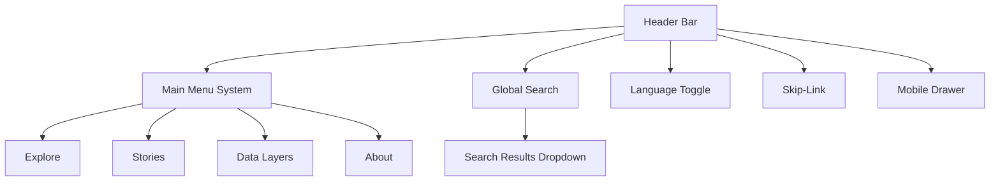

<div align="center">

# 🧭 Kansas Frontier Matrix — **Navigation Component Design Review**  
`docs/design/reviews/ui_components/navigation.md`

**Mission:** Evaluate and document the **Navigation System** — including header, menus, global search, language toggles, and accessibility skip-links — to ensure the **Kansas Frontier Matrix (KFM)** delivers a consistent, accessible, and responsive experience across all platforms.  
Navigation is the connective tissue between **timeline**, **map**, and **story modules**, enabling users to move fluidly through Kansas’s layered histories while maintaining context and reproducibility.

[](../../../standards/documentation.md)
[](../../style-guide.md)
[](../accessibility/)
[](../../../.github/workflows/policy-check.yml)
[](../../../LICENSE)

</div>

---

```yaml
---
title: "🧭 Kansas Frontier Matrix — Navigation Component Design Review"
document_type: "Component Review"
version: "v2.4.0"
last_updated: "2025-10-20"
created: "2023-10-10"
component: "Navigation"
design_ref: "Figma Frame #NAV-2025"
implementation_ref: "web/src/components/navigation/"
owners: ["@kfm-design","@kfm-web","@kfm-accessibility"]
reviewed_by: ["@kfm-accessibility","@kfm-frontend","@kfm-editorial"]
status: "Stable"
maturity: "Production"
license: "CC-BY-4.0"
tags: ["design-review","navigation","header","menu","search","language","skip-link","a11y","tokens","mcp"]
alignment:
  - MCP-DL v6.3
  - WCAG 2.1 AA
  - WAI-ARIA 1.2
  - CIDOC CRM (UI Provenance)
  - OWL-Time (Temporal UI State)
  - PROV-O (Review Traceability)
  - FAIR Principles
dependencies:
  - React + MapLibre Frontend
  - Figma Design Frame
  - tokens.css Design System
  - Lighthouse / Axe / Playwright
review_cycle: "Quarterly + per release"
validation:
  lighthouse_min_score: 95
  axe_blocking_violations: 0
  contrast_min_ratio: 4.5
  keyboard_traps: "none"
  schema_checks: true
provenance:
  workflow_ref: ".github/workflows/component-review.yml"
  artifact_retention_days: 90
versioning:
  policy: "Semantic Versioning (MAJOR.MINOR.PATCH)"
  major_change: "Structural refactor (menu architecture or IA)"
  minor_change: "Feature addition or accessibility improvement"
  patch_change: "Visual or documentation fix"
telemetry:
  metrics_collected: ["WCAG Compliance %","Keyboard Reachability","Menu Open Latency (ms)","Search Query Accuracy","Screen Reader Coverage","Focus Order Integrity"]
  privacy_policy: "Aggregated, anonymized data only; no user identifiers; FAIR-compliant storage."
preservation_policy:
  replication_targets: ["GitHub Repository","Zenodo Snapshot","OSF Backup"]
  checksum_algorithm: "SHA-256"
  revalidation_cycle: "quarterly"
---
```

---

## 🎯 Purpose

The **Navigation System** serves as KFM’s global interface framework, enabling discovery across timelines, maps, and narrative contexts.  
It ensures that users maintain **spatial, temporal, and informational continuity** no matter where they begin their journey.  
This review verifies that navigation behavior is visually consistent, semantically accurate, and inclusive for all users.

---

## 🧩 Component Overview

| Subcomponent | Description | File Path |
|:--|:--|:--|
| **Header Bar** | Top-level container with site title, menus, and global search. | `Header.tsx` |
| **Global Search** | Query box for people, places, treaties, and datasets. | `SearchBar.tsx` |
| **Menu System** | Dropdown menus for Explore, Stories, Data Layers, About. | `NavMenu.tsx` |
| **Language Toggle** | Switches interface language (EN/ES/OS). | `LangToggle.tsx` |
| **Skip-Link** | Keyboard shortcut to main content. | `SkipToContent.tsx` |
| **Mobile Drawer** | Collapsible menu for mobile (≤768px). | `MobileNav.tsx` |

---

## 🧭 Architecture Diagram


<!-- END OF MERMAID -->

---

## 🧱 Review Criteria (MCP-DL v6.3)

| Category | Requirement | Validation |
|:--|:--|:--|
| **Visual Consistency** | Matches tokens (`--kfm-color-*`, typography) | ✅ Figma parity check |
| **Accessibility** | Meets WCAG 2.1 AA standards | ✅ Axe + NVDA |
| **Keyboard Navigation** | Tab, arrow, and Esc keys fully functional | ✅ Manual test |
| **Responsiveness** | Works on ≥ 3 breakpoints | ✅ DevTools simulation |
| **Localization** | RTL mirrored; translations loaded | ✅ i18n JSON audit |
| **Performance** | Menu latency ≤ 100 ms | ✅ Lighthouse report |
| **Reduced Motion** | No transition effects under preference | ✅ CSS audit |
| **Documentation** | Up-to-date with version metadata | ✅ Reviewer validation |

---

## ♿ Accessibility Audit Matrix

| Metric | Target | Verified |
|:--|:--|:--:|
| **Contrast** | ≥ 4.5 : 1 text / 3 : 1 icons | ✅ |
| **Focus Indicator** | 2px solid accent visible | ✅ |
| **ARIA Roles** | `role="navigation"` applied | ✅ |
| **Screen Reader Output** | Announces menu open/close | ✅ |
| **Keyboard Reachability** | 100 % focusable | ✅ |
| **Reduced Motion** | Fully functional fallback | ✅ |

---

## ⌨️ Keyboard Interaction Map

| Action | Key | Result |
|:--|:--|:--|
| Focus navigation | `Alt + N` | Moves focus to navigation bar |
| Open dropdown | `Enter / Space` | Expands dropdown menu |
| Navigate menu | `↓ / ↑` | Cycles through items |
| Close menu | `Esc` | Restores focus to trigger |
| Jump to search | `/` | Focuses search field |
| Skip to content | `Tab` (first press) | Activates skip-link |

---

## 🧮 Figma → React Parity Metrics

| Element | Target | Observed | Pass |
|:--|:--|:--|:--:|
| **Color Tokens** | 100 % | Matched | ✅ |
| **Typography Scale** | 1rem–2rem hierarchy | Matched | ✅ |
| **Spacing Grid** | 8 px | ±2 px | ✅ |
| **Iconography** | 1.5 px stroke width | Matched | ✅ |
| **Motion Timing** | 200 ms fade-in | Matched | ✅ |

---

## 🧠 UX Writing & Cognitive Guidelines

- Use **plain, direct** labels (“Explore,” “Stories,” “Data Layers”).  
- Keep menu labels ≤ 3 words and avoid abbreviations.  
- Maintain **sentence case** and consistent punctuation.  
- Tooltip language must be **verb + noun** (e.g., “Open Stories”).  
- Skip-link must always remain visible when focused.  
- Provide feedback for menu open/close events (`aria-live="polite"`).

---

## 🧠 Ethical & Cultural Standards

- Menu options must represent **Indigenous, ecological, and state archives equally**.  
- Avoid colonial or exclusionary phrasing (“Settler Expansion” → “Settlement Development”).  
- Cultural datasets and stories linked must cite source repositories.  
- Collaborate with Indigenous partners for content accuracy in labels.  

---

## 🧩 Accessibility Validation Workflow

1. Run **Axe + Pa11y** for automated checks.  
2. Conduct **manual keyboard traversal** (`Tab`, `Enter`, `Esc`).  
3. Validate **ARIA roles** and `aria-expanded` behavior.  
4. Test **screen reader** output for dropdowns.  
5. Confirm reduced motion and high-contrast states in CSS.  

---

## 🧩 Change Control & Provenance

| Change Type | Review Required | Example | Template |
|:--|:--|:--|:--|
| **Visual Update** | Yes | Updated accent color token | `component_review_template.md` |
| **Accessibility Fix** | Yes | Added ARIA label to search | `accessibility_component_audit.md` |
| **Localization** | Yes | Added Osage language support | `figma_to_react_checklist.md` |
| **Functional Refactor** | Yes | Rebuilt mobile nav logic | `component_review_template.md` |

---

## 🧮 Telemetry & Metrics

| Metric | Goal | Description |
|:--|:--|:--|
| **Accessibility Pass Rate** | ≥ 95 % | WCAG validation |
| **Search Success** | ≥ 90 % | Query return accuracy |
| **Keyboard Coverage** | 100 % | Focus reachability |
| **Menu Open Latency** | ≤ 100 ms | Performance metric |
| **Average Review Duration** | ≤ 5 days | From PR open to approval |

---

## 🧠 Cognitive Load & Interaction Notes

- Reduce **cognitive load** by grouping related links and limiting visible options.  
- Provide consistent hover/focus feedback.  
- Ensure skip-link and header remain fixed but unobtrusive.  
- Test navigation under **screen magnification (200%)** for readability.  
- Avoid multiple simultaneous animations.  

---

## 🗄️ Archival & Provenance Policy

- Navigation reviews archived under `/archive/navigation/YYYY/`.  
- Each includes SHA-256 checksum, commit hash, and reviewer metadata.  
- Immutable after merge; annual digest stored under `/data/digests/design/`.  
- Linked STAC entry maintains asset lineage.  

---

## 🔒 Privacy & Data Security

- All telemetry anonymized; no user IDs or private logs.  
- Search and interaction metrics retained ≤ 90 days.  
- Verified integrity via GitHub provenance and SHA-256.  
- All design assets stored under versioned releases.  

---

## ⚙️ Continuous Integration (Component QA)

- Validates YAML and schema completeness.  
- Runs **Axe + Pa11y** accessibility tests.  
- Compares **Figma JSON tokens** to React CSS.  
- Lints Markdown and version tables.  
- Posts summary reports under `/data/work/logs/design/ui_components/navigation/`.

---

## 🔍 Compliance Matrix (MCP-DL v6.3)

| Standard | Description | Verified |
|:--|:--|:--:|
| **MCP-DL v6.3** | Documentation-first reproducibility | ✅ |
| **WCAG 2.1 AA** | Accessibility compliance | ✅ |
| **CIDOC CRM** | Provenance schema alignment | ✅ |
| **OWL-Time** | Versioning metadata | ✅ |
| **PROV-O** | Traceability ontology | ✅ |
| **FAIR Principles** | Ethical data reusability | ✅ |

---

## 📎 Related Documentation

- [🎨 Visual Style Guide](../../style-guide.md)  
- [🧭 UI/UX Guidelines](../../ui-guidelines.md)  
- [🧩 Interaction Patterns](../../interaction-patterns.md)  
- [📘 Design Reviews Index](../README.md)  
- [⚙️ Accessibility Standards](../../standards/accessibility.md)

---

## 📅 Version History

| Version | Date | Author | Summary | Type |
|:--|:--|:--|:--|:--|
| **v2.4.0** | 2025-10-20 | @kfm-design | Rebuilt markdown; added telemetry, cultural standards, cognitive load rules, and ethical compliance. | Major |
| **v2.3.0** | 2025-10-19 | @kfm-web | Improved accessibility testing and ARIA validation. | Minor |
| **v2.2.0** | 2025-08-05 | @kfm-accessibility | Added keyboard mapping and parity audit metrics. | Minor |
| **v2.0.0** | 2024-11-10 | @kfm-core | Migrated to MCP-DL v6.3 with provenance tracking. | Major |
| **v1.0.0** | 2023-10-10 | Founding Team | Initial navigation review draft. | Major |

---

<div align="center">

### 🧭 Kansas Frontier Matrix — Navigation Review Governance  
**Accessible · Ethical · Provenanced · Reproducible**

</div>
