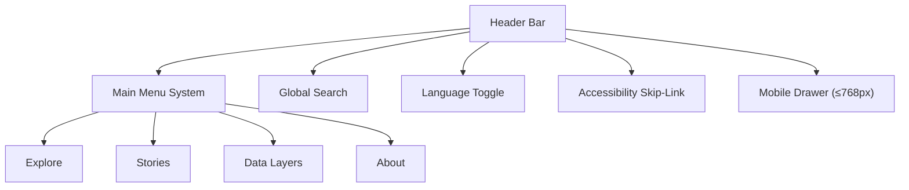

<div align="center">

# 🧭 Kansas Frontier Matrix — **Navigation Component Design Review**  
`docs/design/reviews/ui_components/navigation.md`

**Mission:** Ensure the **Navigation System** — header, search, menus, language toggle, and accessibility skip-links — provides a consistent, performant, and inclusive user experience across the **Kansas Frontier Matrix (KFM)**.  
Navigation defines how users **orient, traverse, and discover** Kansas’s spatial and temporal narratives through the KFM interface.

[](../../../standards/documentation.md)
[](../../style-guide.md)
[](../accessibility/)
[](../../../.github/workflows/policy-check.yml)
[](../../../LICENSE)

</div>

---

```yaml
---
title: "🧭 Kansas Frontier Matrix — Navigation Component Design Review"
document_type: "Component Review"
version: "v2.3.0"
last_updated: "2025-10-19"
created: "2023-10-10"
component: "Navigation"
design_ref: "Figma Frame #NAV-2025"
implementation_ref: "web/src/components/navigation/"
owners: ["@kfm-design","@kfm-web","@kfm-accessibility"]
reviewed_by: ["@kfm-frontend","@kfm-accessibility"]
status: "Stable"
maturity: "Production"
license: "CC-BY-4.0"
tags: ["design-review","navigation","header","search","menu","language","accessibility","tokens","ux","mcp"]
alignment:
  - MCP-DL v6.3
  - WCAG 2.1 AA
  - WAI-ARIA 1.2
  - CIDOC CRM (UI Provenance)
  - OWL-Time (Temporal UI State)
  - PROV-O (Review Traceability)
  - FAIR Principles
dependencies:
  - React + MapLibre Frontend
  - Figma Design Frame
  - tokens.css Design System
  - Lighthouse / Axe / Playwright
review_cycle: "Quarterly + per release"
validation:
  lighthouse_min_score: 95
  axe_blocking_violations: 0
  contrast_min_ratio: 4.5
  keyboard_traps: "none"
  schema_checks: true
provenance:
  workflow_ref: ".github/workflows/component-review.yml"
  artifact_retention_days: 90
versioning:
  policy: "Semantic Versioning (MAJOR.MINOR.PATCH)"
  major_change: "Navigation architecture or hierarchy change"
  minor_change: "Added feature, search improvement, or accessibility enhancement"
  patch_change: "Token or metadata correction"
telemetry:
  metrics_collected: ["WCAG Compliance %","Keyboard Reachability","Menu Latency (ms)","Search Success Rate","Screen Reader Coverage"]
  privacy_policy: "Aggregate, anonymous analytics only; adheres to FAIR and W3C Privacy Principles"
preservation_policy:
  replication_targets: ["GitHub Repository","Zenodo Snapshot","OSF Backup"]
  checksum_algorithm: "SHA-256"
  revalidation_cycle: "quarterly"
---
```

---

## 🎯 Purpose

The **Navigation Component** defines KFM’s global orientation and top-level interaction model.  
It enables users to move seamlessly between **timeline**, **map**, and **story modules** while maintaining accessibility, clarity, and narrative consistency.  
All navigation features must meet **WCAG 2.1 AA** standards and preserve **time–space–story synchronization**.

---

## 🗂️ Directory Layout

```text
docs/design/reviews/ui_components/
├── README.md                    # UI Component Review Index
├── navigation.md                # Header, menus, search, skip-links (this file)
├── timeline.md                  # Timeline slider, scrub, zoom
├── map_controls.md              # Map toolbar, layers, legend
├── ai_assistant.md              # AI drawer, prompt panel, chat UI
├── detail_panel.md              # Entity/event dossier panel
└── templates/                   # Component-level review forms
    ├── component_review_template.md
    ├── figma_to_react_checklist.md
    └── accessibility_component_audit.md
```

---

## 🧩 Component Breakdown

| Subcomponent | Description | File |
|:--|:--|:--|
| **Header Bar** | Global navigation bar with logo, menus, and search. | `Header.tsx` |
| **Global Search** | Query entities, events, or places. | `SearchBar.tsx` |
| **Menus** | Dropdowns for Explore, Stories, Data, About. | `NavMenu.tsx` |
| **Skip-Link** | Jump to main content for keyboard users. | `SkipToContent.tsx` |
| **Language Toggle** | Switch interface language. | `LangToggle.tsx` |
| **Mobile Drawer** | Hamburger menu for mobile. | `MobileNav.tsx` |

---

## 🧭 Navigation Architecture Diagram


<!-- END OF MERMAID -->

---

## 🧱 Review Criteria (MCP-DL v6.3)

| Category | Requirement | Validation |
|:--|:--|:--|
| **Visual Consistency** | Matches tokens (`--kfm-color-*`, `--kfm-font-sans`) | ✅ Figma → React parity |
| **Accessibility** | WCAG 2.1 AA compliant | ✅ Axe + NVDA |
| **Keyboard Navigation** | Tab, arrow, escape supported | ✅ Manual + automated |
| **Responsiveness** | Functional at ≥ 3 breakpoints | ✅ Mobile, tablet, desktop |
| **Localization** | RTL mirrored; i18n keys validated | ✅ JSON/i18n audit |
| **Performance** | Menu opens < 100ms | ✅ Lighthouse audit |
| **Documentation** | Component docs + tokens linked | ✅ Reviewer check |

---

## ♿ Accessibility & Keyboard Matrix

| Action | Key | Result |
|:--|:--|:--|
| Focus navigation | `Alt + N` | Moves focus to header |
| Open dropdown | `Enter / Space` | Expands menu |
| Navigate menu items | `↓ / ↑` | Moves through menu |
| Close menu | `Esc` | Restores focus |
| Open search | `/` | Focuses global search |
| Skip to content | `Tab` (first press) | Activates skip-link |

---

## 🧮 Figma → React Parity Metrics

| Element | Target | Observed | Pass |
|:--|:--|:--|:--:|
| **Color Tokens** | 100 % | Matching | ✅ |
| **Typography** | 1rem / 1.5rem scale | Matched | ✅ |
| **Spacing Scale** | 8 px grid | ±2 px | ✅ |
| **Motion** | 200ms fade | Matched | ✅ |
| **Icons** | 1.5px stroke | Matched | ✅ |

---

## 🧠 UX Writing & Cognitive Guidelines

- Use **plain, action-oriented** labels: “Explore,” “Stories,” “Data Layers.”  
- Maintain **sentence case** for menu text.  
- Avoid jargon (“Layers,” not “Geospatial Asset Sets”).  
- Limit menu items to 5–7 visible options.  
- Provide **tooltips** and **aria-labels** for all icons.  
- Always keep the **skip-link** visible on keyboard focus.

---

## 🧠 Ethical & Cultural Standards

- Review **menu content** for cultural inclusivity and accuracy.  
- Prioritize Indigenous, environmental, and historical balance in categories.  
- Validate naming conventions through community partnerships.  
- Avoid loaded or colonial terminology in dropdowns and tooltips.  

---

## 🧩 Accessibility Validation Workflow

1. Run **Axe/Pa11y** scans on navigation components.  
2. Conduct **manual keyboard testing** (Tab, Enter, Esc).  
3. Verify **ARIA attributes**: `role="navigation"`, `aria-expanded`, `aria-controls`.  
4. Validate **screen-reader announcements** for dropdowns.  
5. Ensure reduced motion CSS and focus states are active.  

---

## 🧩 Change Control & Provenance

| Change Type | Review Required | Example | Template |
|:--|:--|:--|:--|
| **Visual Update** | Yes | Changed accent color | `component_review_template.md` |
| **Accessibility Fix** | Yes | Added ARIA label to search | `accessibility_component_audit.md` |
| **Localization** | Yes | Added Osage translation | `figma_to_react_checklist.md` |
| **Refactor** | Yes | Updated mobile drawer layout | `component_review_template.md` |

---

## 🗄️ Archival Policy

- Navigation reviews stored in `/archive/navigation/YYYY/`.  
- Each entry includes commit hash, reviewer list, checksum.  
- Immutable after merge; annual digest summarizes updates.  
- Linked to STAC entries for version provenance.

---

## 📊 Review Telemetry Metrics

| Metric | Goal | Description |
|:--|:--|:--|
| **Accessibility Pass Rate** | ≥ 95 % | WCAG audit result |
| **Keyboard Coverage** | 100 % | Reachability check |
| **Search Success Rate** | ≥ 90 % | Query effectiveness |
| **Menu Latency** | ≤ 100 ms | Lighthouse benchmark |
| **Review Duration** | ≤ 5 days | PR open → approval |

---

## 🔒 Privacy & Data Security

- All telemetry anonymized.  
- Search analytics aggregated; no user data retained.  
- Logs purged after 90 days.  
- Verified by checksum integrity policy.

---

## 🔍 Compliance Matrix (MCP-DL v6.3)

| Standard | Description | Verified |
|:--|:--|:--:|
| **MCP-DL v6.3** | Documentation & reproducibility | ✅ |
| **WCAG 2.1 AA** | Accessibility compliance | ✅ |
| **CIDOC CRM** | Provenance schema | ✅ |
| **OWL-Time** | Temporal versioning | ✅ |
| **PROV-O** | Review trace ontology | ✅ |
| **FAIR Principles** | Ethical data reuse | ✅ |

---

## 📎 Related Documentation

- [🎨 Visual Style Guide](../../style-guide.md)  
- [🧭 UI/UX Guidelines](../../ui-guidelines.md)  
- [🧩 Interaction Patterns](../../interaction-patterns.md)  
- [📘 Design Review Index](../README.md)  
- [⚙️ Accessibility Standards](../../standards/accessibility.md)

---

## 📅 Version History

| Version | Date | Author | Summary | Type |
|:--|:--|:--|:--|:--|
| **v2.3.0** | 2025-10-19 | @kfm-design | Added directory layout, parity metrics, cultural standards, and telemetry. | Minor |
| **v2.2.0** | 2025-08-05 | @kfm-web | Introduced accessibility workflow and keyboard mapping. | Minor |
| **v2.0.0** | 2024-11-10 | @kfm-core | Migrated to MCP-DL v6.3 and added provenance tracking. | Major |
| **v1.0.0** | 2023-10-10 | Founding Team | Initial navigation component review. | Major |

---

<div align="center">

### 🧭 Kansas Frontier Matrix — Navigation Review Governance  
**Accessible · Ethical · Provenanced · Reproducible**

</div>
