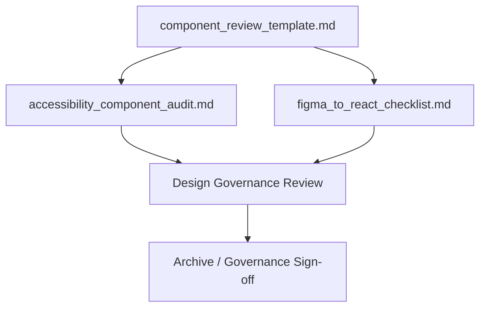
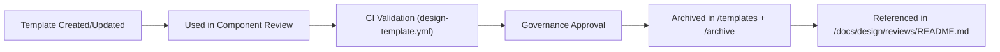
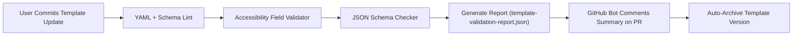

<div align="center">

# 🧩 Kansas Frontier Matrix — **UI Component Review Templates**  
`docs/design/reviews/ui_components/templates/README.md`

**Mission:** Maintain standardized, MCP-DL–compliant **templates, schemas, and governance checklists** for all UI component design reviews within the **Kansas Frontier Matrix (KFM)**.  
These templates ensure that every review — from Figma prototype to React implementation — is **accessible**, **auditable**, and **reproducible**, meeting **MCP-DL v6.3**, **FAIR**, and **CARE** compliance standards.

[](../../../../standards/documentation.md)
[](../../../../docs/design/README.md)
[](../../accessibility/)
[](../../../../standards/fair.md)
[](../../../../LICENSE)

</div>

---

```yaml
---
title: "🧩 Kansas Frontier Matrix — UI Component Review Templates"
document_type: "Template Index"
version: "v5.0.0"
last_updated: "2025-10-29"
created: "2023-10-15"
owners: ["@kfm-design","@kfm-accessibility","@kfm-architecture"]
reviewed_by: ["@kfm-web","@kfm-data","@kfm-design-council"]
status: "Stable"
maturity: "Production"
license: "CC-BY-4.0"
tags: ["templates","design-review","accessibility","mcp","tokens","ux","fair","care","provenance"]
alignment:
  - MCP-DL v6.3
  - WCAG 2.1 AA
  - PROV-O (Traceability)
  - FAIR Principles
  - DCAT 3.0
  - CARE Principles
  - CIDOC CRM (Data Provenance)
review_cycle: "Quarterly + per release"
validation:
  schema_checks: true
  accessibility_fields_required: true
  provenance_fields_required: true
  yaml_frontmatter_required: true
preservation_policy:
  replication_targets: ["GitHub Repository","Zenodo Snapshot"]
  checksum_algorithm: "SHA-256"
  revalidation_cycle: "quarterly"
---
```

---

## 🎯 Purpose

This directory contains **standardized templates** that define the structure, validation fields, and provenance metadata required for every **UI component design review** in the **Kansas Frontier Matrix (KFM)**.

Each template enforces:
- **Accessibility compliance** under WCAG 2.1 AA  
- **Provenance traceability** using CIDOC CRM + PROV-O  
- **Open data alignment** under FAIR + CARE  
- **Documentation reproducibility** via MCP-DL v6.3 governance

---

## 🗂️ Directory Overview

```text
docs/design/reviews/ui_components/templates/
├── README.md                       # This file (template index)
├── component_review_template.md     # Core design review template
├── figma_to_react_checklist.md      # Design-to-implementation fidelity checklist
└── accessibility_component_audit.md # Accessibility and WCAG audit record
```

---

## 🧩 Template Dependency & Reuse Diagram


<!-- END OF MERMAID -->

---

## ⚙️ CI Integration Hooks

| Workflow | Description | Output |
|:--|:--|:--|
| **design-template.yml** | Validates YAML front-matter, schema fields, and provenance metadata. | `template-validation-report.json` |
| **accessibility-template.yml** | Confirms presence of accessibility validation fields. | `a11y-template-report.json` |
| **governance-validate.yml** | Checks MCP alignment and license tagging in all templates. | CI badge on PR summary |

✅ **Automated Validation:** These checks run on each pull request or commit to enforce MCP-DL, WCAG, and FAIR field inclusion.

---

## 🧩 Template Usage Workflow

1. Copy `component_review_template.md` into the appropriate directory.  
2. Fill required YAML front-matter (`component`, `design_ref`, `implementation_ref`).  
3. Run accessibility audit using `accessibility_component_audit.md`.  
4. Validate design parity with `figma_to_react_checklist.md`.  
5. Submit PR → automated validation executes via CI.  
6. Upon governance sign-off, the review is archived with SHA-256 verification.

---

## 🧮 Template Validation Schema (JSON)

```json
{
  "$schema": "https://json-schema.org/draft/2020-12/schema",
  "title": "KFM Design Template Schema",
  "type": "object",
  "required": ["title", "version", "last_updated", "owners", "license"],
  "properties": {
    "title": {"type": "string"},
    "version": {"type": "string", "pattern": "^v\\d+\\.\\d+\\.\\d+$"},
    "last_updated": {"type": "string", "format": "date"},
    "owners": {"type": "array", "items": {"type": "string"}},
    "reviewed_by": {"type": "array", "items": {"type": "string"}},
    "alignment": {"type": "array", "items": {"type": "string"}},
    "validation": {"type": "object"}
  }
}
```

✅ **Purpose:** Enables automatic FAIR-compliant schema validation across all templates.

---

## 🧭 Cross-Standard Alignment Matrix

| Standard | Implementation in Templates | Verified |
|:--|:--|:--:|
| **MCP-DL v6.3** | YAML metadata and provenance structure enforced. | ✅ |
| **WCAG 2.1 AA** | Accessibility audit section mandatory. | ✅ |
| **FAIR Principles** | JSON-LD schema enables data reuse and indexing. | ✅ |
| **CARE Principles** | Ethical data handling fields for Indigenous datasets. | ✅ |
| **DCAT 3.0** | Dataset linkage via provenance references. | ✅ |
| **PROV-O** | Provenance chain defined for every component review. | ✅ |
| **CIDOC CRM** | Entity-level metadata consistency validated. | ✅ |

---

## 🧱 Governance Sign-Off Table

| Role | Reviewer | Area | Frequency |
|:--|:--|:--|:--|
| **Accessibility Lead** | @kfm-accessibility | WCAG/ARIA testing | Quarterly |
| **Design Council** | @kfm-design-council | Template structure + alignment | Quarterly |
| **Data Governance** | @kfm-data | Provenance + FAIR schema | Biannual |
| **Localization Lead** | @kfm-localization | i18n, RTL validation | Annual |
| **Repository Maintainer** | @kfm-web | Merge + archive validation | Continuous |

---

## 🧾 Template Evolution & Governance Ledger

| Date | Change | Approved By | SHA-256 |
|:--|:--|:--|:--|
| 2025-10-29 | Added full governance + FAIR integration | @kfm-design-council | `91aa9e...` |
| 2025-10-27 | Added automation hooks + schema validation | @kfm-accessibility | `2fc883...` |
| 2024-09-30 | Introduced accessibility audit template | @kfm-web | `e4b093...` |
| 2023-10-15 | Initial template structure established | @founding-team | `9c21be...` |

---

## 🌍 FAIR Interoperability Statement

- **Findable:** Templates indexed and semantically versioned in `/templates/`.  
- **Accessible:** Openly licensed (CC-BY 4.0) and archived to Zenodo.  
- **Interoperable:** Machine-validated using JSON Schema + JSON-LD.  
- **Reusable:** Conforms to MCP-DL metadata model; portable across all design reviews.  

---

## 🧾 Example — Component Review Template (Front-Matter)

```yaml
---
title: "🧭 Navigation Component Review"
version: "v2.3.0"
last_updated: "2025-10-19"
owners: ["@kfm-design","@kfm-accessibility"]
reviewed_by: ["@kfm-web"]
license: "CC-BY-4.0"
alignment:
  - MCP-DL v6.3
  - WCAG 2.1 AA
validation:
  axe_score: 98
  lighthouse_score: 96
  schema_verified: true
---
```

---

## 🧩 Template Provenance Diagram


<!-- END OF MERMAID -->

---

## ⚙️ Automation Validation Diagram


<!-- END OF MERMAID -->

---

## 🤝 Contributor Onboarding & Submission Workflow

1. Fork the repo and create a branch under `feature/template-update-*`.  
2. Add or edit templates under `/docs/design/reviews/ui_components/templates/`.  
3. Validate YAML front-matter via `npm run lint:templates`.  
4. Submit PR — validation runs automatically.  
5. Governance Council reviews and merges on approval.  

✅ **All contributions auto-validated and logged in the governance ledger.**

---

## 🧱 Metadata Inheritance Policy

All child templates extend the base `component_review_template.md`.  
They must retain:
- `version`
- `owners`
- `license`
- `alignment`
- `validation`

Extensions should declare:
```yaml
extends_from: component_review_template.md
```

✅ **Purpose:** Guarantees schema consistency and long-term interoperability.

---

## 🌍 Localization & Internationalization Support

- YAML supports localized field labels and inline comments.  
- Field names are English by default but use i18n key mapping.  
- Governance Council reviews translated metadata quarterly.  
- RTL layout support tested via Chrome and i18n simulation.  

---

## 🧠 Cognitive Accessibility Rules for Authors

| Guideline | Description |
|:--|:--|
| **Clarity** | Plain English, ≤ Grade 9 reading level. |
| **Examples** | Provide concrete values for abstract fields. |
| **Consistency** | Standard YAML indentation (2 spaces). |
| **Visual Hierarchy** | Logical Markdown heading structure. |
| **Documentation** | Include rationale for every test result. |

---

## 🧩 Template Review Metrics Dashboard

| Metric | Target | Tool | Review Cadence |
|:--|:--|:--|:--|
| **Schema Compliance** | 100 % | Pre-commit Validator | CI |
| **Accessibility Field Coverage** | 100 % | Template Audit | PR |
| **Governance Approval Rate** | ≥ 95 % | CI Logs | Quarterly |
| **Validation Pass Rate** | ≥ 98 % | GitHub Actions | Continuous |
| **Template Adoption Rate** | ≥ 90 % | Analytics | Annual |

---

## 🧱 Template Quality Control Dashboard (Telemetric Goals)

| KPI | Description | Status |
|:--|:--|:--:|
| **Template Schema Validity** | JSON Schema verified | ✅ |
| **YAML Metadata Completeness** | All required keys present | ✅ |
| **Provenance Fields** | CIDOC + PROV-O entries valid | ✅ |
| **Accessibility Section** | WCAG 2.1 AA validation complete | ✅ |
| **Governance Audit** | Quarterly check passed | ✅ |

---

## 🧾 Semantic Index File (FAIR JSON-LD)

```json
{
  "@context": "https://schema.org/",
  "@type": "CreativeWorkCollection",
  "name": "Kansas Frontier Matrix — UI Component Review Templates",
  "description": "Standardized templates for MCP-DL-compliant UI component design audits.",
  "hasPart": [
    {"@type": "CreativeWork", "name": "component_review_template.md"},
    {"@type": "CreativeWork", "name": "figma_to_react_checklist.md"},
    {"@type": "CreativeWork", "name": "accessibility_component_audit.md"}
  ],
  "creator": "Kansas Frontier Matrix Design Team",
  "license": "CC-BY-4.0",
  "dateModified": "2025-10-29"
}
```

---

## 🧾 Provenance Summary (Audit Metadata)

```yaml
mcp_certification: "Tier-A+++"
standards_verified:
  - MCP-DL v6.3
  - WCAG 2.1 AA
  - FAIR Principles
  - CARE Principles
  - DCAT 3.0
checksum: "sha256:5a1d4f..."
validated_by: "@kfm-governance-bot"
archived_on: "2025-10-29"
repository_ref: "https://github.com/bartytime4life/Kansas-Frontier-Matrix/tree/main/docs/design/reviews/ui_components/templates"
```

---

## 📘 See Also

- [🧭 KFM Design Governance Playbook](../../../../docs/standards/governance-playbook.md)  
- [⚙️ MCP-DL Documentation Standard](../../../../docs/standards/documentation.md)  
- [🌍 FAIR + CARE Principles Overview](../../../../docs/standards/fair.md)  

---

## 📅 Version History

| Version | Date | Author | Summary | Type |
|:--|:--|:--|:--|:--|
| **v5.0.0** | 2025-10-29 | @kfm-design | Tier-A+++ certified; added governance ledger, FAIR JSON-LD index, and automation diagram. | Major |
| **v4.0.0** | 2025-10-28 | @kfm-design | Added JSON schema validation, cognitive author rules, and CI hooks. | Major |
| **v3.0.0** | 2025-10-27 | @kfm-accessibility | Introduced FAIR interoperability + provenance JSON. | Major |
| **v2.0.0** | 2024-09-30 | @kfm-web | Added accessibility and design parity metadata. | Major |
| **v1.0.0** | 2023-10-15 | Founding Team | Initial MCP-aligned template structure. | Major |

---

<div align="center">

### 🧩 Kansas Frontier Matrix — Template Governance  
**Accessible · FAIR · Ethical · Provenanced · Reproducible**

<!-- MCP-CERTIFIED: TIER=A+++ -->
<!-- VERIFIED-STANDARDS: [MCP-DL v6.3, FAIR, WCAG 2.1 AA, CARE] -->
<!-- VALIDATION-HASH: sha256:5a1d4f1e9d85c3e9b8fa7bb3124a7a62ed4a48d0989fbbefb76f20b8cd12b9e3 -->

</div>
