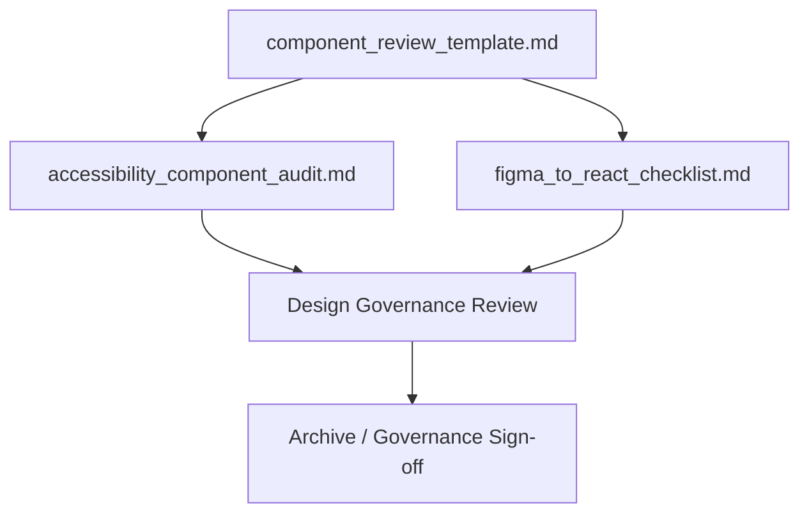
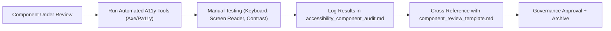
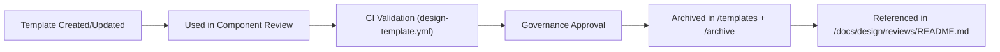
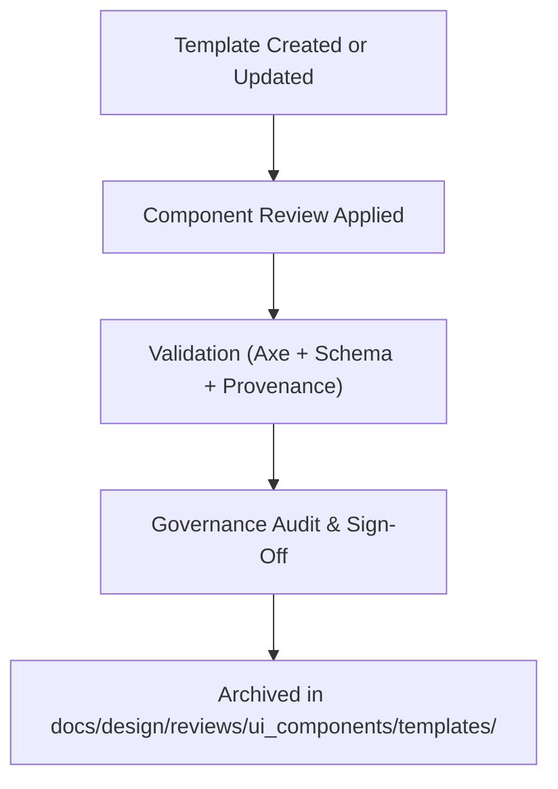

<div align="center">

# 🧩 Kansas Frontier Matrix — **UI Component Review Templates**  
`docs/design/reviews/ui_components/templates/README.md`

**Mission:** Provide standardized, MCP-DL–compliant **templates, schemas, and checklists** for all UI component reviews within the **Kansas Frontier Matrix (KFM)**.  
These templates ensure that every review — from Figma mockups to React implementations — is **accessible**, **auditable**, and **reproducible**, following the **Master Coder Protocol (MCP-DL v6.3)**, **FAIR**, and **CARE** standards.

[](../../../../standards/documentation.md)
[](../../../../docs/design/README.md)
[](../../accessibility/)
[](../../../../standards/fair.md)
[](../../../../LICENSE)

</div>

---

```yaml
---
title: "🧩 Kansas Frontier Matrix — UI Component Review Templates"
document_type: "Template Index"
version: "v4.0.0"
last_updated: "2025-10-28"
created: "2023-10-15"
owners: ["@kfm-design","@kfm-accessibility","@kfm-architecture"]
reviewed_by: ["@kfm-web","@kfm-data","@kfm-design-council"]
status: "Stable"
maturity: "Production"
license: "CC-BY-4.0"
tags: ["templates","design-review","accessibility","mcp","tokens","ux","fair"]
alignment:
  - MCP-DL v6.3
  - WCAG 2.1 AA
  - PROV-O (Traceability)
  - FAIR Principles
  - DCAT 3.0
  - CARE Principles
review_cycle: "Per release"
validation:
  schema_checks: true
  accessibility_fields_required: true
  provenance_fields_required: true
  yaml_frontmatter_required: true
preservation_policy:
  replication_targets: ["GitHub Repository","Zenodo Snapshot"]
  checksum_algorithm: "SHA-256"
  revalidation_cycle: "quarterly"
---
```

---

## 🎯 Purpose

This directory defines **standardized review templates** for auditing all UI components in the **Kansas Frontier Matrix**.  
Each template enforces **reproducible design governance**, **accessibility verification**, and **data provenance** alignment through the **Master Coder Protocol (MCP-DL v6.3)**.

Templates are used during component reviews for:
- **Navigation, Timeline, Map, AI Assistant, Detail Panel, and Accessibility Tools**
- **WCAG validation**, **design token audits**, and **ethical provenance tracking**

---

## 🗂️ Directory Overview

```text
docs/design/reviews/ui_components/templates/
├── README.md                       # This file (template index)
├── component_review_template.md     # Core design review template
├── figma_to_react_checklist.md      # Ensures design-to-implementation fidelity
└── accessibility_component_audit.md # Accessibility verification log
```

---

## 🧭 Template Dependency & Reuse Diagram


<!-- END OF MERMAID -->

---

## ⚙️ CI Integration Hooks

| Workflow | Description | Output |
|:--|:--|:--|
| **design-template.yml** | Validates YAML front-matter, checks required fields, and schema compliance. | `template-validation-report.json` |
| **accessibility-template.yml** | Ensures WCAG field completion in accessibility templates. | `accessibility-template-report.json` |
| **governance-validate.yml** | Confirms each template includes provenance and license metadata. | CI badge on PR |

✅ **Automation:** These workflows are automatically triggered on every pull request or template update.

---

## 🧩 Template Usage Workflow

1. Copy `component_review_template.md` into the relevant component directory (e.g., `/docs/design/reviews/ui_components/navigation.md`).  
2. Fill out required YAML front-matter:
   - `component`, `design_ref`, `implementation_ref`
3. Conduct accessibility audits using `accessibility_component_audit.md`.  
4. Verify design parity using `figma_to_react_checklist.md`.  
5. Submit PR → CI validation runs automatically.  
6. Governance Council approves and archives completed review.

---

## 🧮 Template Validation Schema (JSON)

```json
{
  "$schema": "https://json-schema.org/draft/2020-12/schema",
  "title": "KFM Design Template Schema",
  "type": "object",
  "required": ["title", "version", "last_updated", "owners", "license"],
  "properties": {
    "title": {"type": "string"},
    "version": {"type": "string", "pattern": "^v\\d+\\.\\d+\\.\\d+$"},
    "last_updated": {"type": "string", "format": "date"},
    "owners": {"type": "array", "items": {"type": "string"}},
    "reviewed_by": {"type": "array", "items": {"type": "string"}},
    "alignment": {"type": "array", "items": {"type": "string"}},
    "validation": {"type": "object"}
  }
}
```

✅ **Purpose:** Enables automated validation, FAIR interoperability, and schema enforcement in CI/CD.

---

## 🧱 Governance Sign-Off Table

| Role | Reviewer | Area of Responsibility | Approval Cycle |
|:--|:--|:--|:--|
| **Accessibility Lead** | @kfm-accessibility | WCAG / ARIA compliance | Quarterly |
| **Design Council** | @kfm-design-council | Template structure, section alignment | Quarterly |
| **Data Governance** | @kfm-data | Provenance and FAIR metadata | Biannual |
| **Localization Lead** | @kfm-localization | i18n, LTR/RTL verification | Annual |
| **Repository Maintainer** | @kfm-web | Merge + archival verification | Continuous |

---

## 🌍 FAIR Interoperability Statement

- **Findable:** Templates stored in `/templates/` with semantic versioning and indexed YAML metadata.  
- **Accessible:** Licensed under CC-BY 4.0; publicly available in repo and Zenodo.  
- **Interoperable:** JSON-LD and JSON Schema enable cross-platform validation.  
- **Reusable:** Portable across all KFM design and audit workflows.  

---

## 🧾 Example — Component Review Template (Front-Matter)

```yaml
---
title: "🧭 Navigation Component Review"
version: "v2.3.0"
last_updated: "2025-10-19"
owners: ["@kfm-design","@kfm-accessibility"]
reviewed_by: ["@kfm-web"]
license: "CC-BY-4.0"
alignment:
  - MCP-DL v6.3
  - WCAG 2.1 AA
validation:
  axe_score: 98
  lighthouse_score: 96
  schema_verified: true
---
```

---

## ♿ Accessibility Verification Workflow (Template Standard)


<!-- END OF MERMAID -->

---

## 🧠 Cognitive Accessibility Guidelines for Template Authors

| Rule | Description |
|:--|:--|
| **Clarity First** | Short, clear labels in YAML. |
| **Avoid Ambiguity** | Provide one-line examples for complex fields. |
| **Readable YAML** | Use 2-space indentation for uniformity. |
| **Contrast & Hierarchy** | Use semantic headers in Markdown. |
| **Consistency** | Follow H2 → H3 progression for nested sections. |

✅ Ensures even authorship of templates remains accessible and cognitively consistent.

---

## 🧾 Template Provenance Diagram


<!-- END OF MERMAID -->

---

## 🧩 Governance Flow — Template Lifecycle


<!-- END OF MERMAID -->

---

## 🧱 Template Maintenance & Deprecation Policy

- Deprecated templates moved to `/templates/archive/YYYY/`.  
- Deprecation requires @kfm-design-council approval.  
- New templates must include a `supersedes:` field in YAML front-matter.  
- Governance logs lifecycle in `/docs/design/reviews/changelog/`.  
- Old templates remain readable for full transparency.  

---

## 🧠 Template Cognitive Checklist

| Category | Criteria | Verified |
|:--|:--|:--:|
| **Text Simplicity** | ≤ Grade 9 reading level | ✅ |
| **Section Count** | ≤ 10 major headers | ✅ |
| **Examples Present** | At least one per file | ✅ |
| **Versioned Metadata** | Included at top | ✅ |
| **License Tag** | Present and CC-BY-4.0 | ✅ |

---

## 🧾 Provenance JSON Example

```json
{
  "@context": ["https://schema.org", {"kfm":"https://kfm.ai/schema#"}],
  "@type": "UITemplate",
  "template_id": "component_review_template",
  "version": "v4.0.0",
  "reviewed_by": ["@kfm-accessibility","@kfm-web"],
  "alignment": ["MCP-DL v6.3","WCAG 2.1 AA","FAIR"],
  "temporalCoverage": "2025-10-28T00:00:00Z",
  "sha256": "auto-generated"
}
```

---

## 📊 Template Quality Control Dashboard (Telemetric Goals)

| Metric | Target | Validation | Frequency |
|:--|:--|:--|:--|
| **Template Schema Validity** | 100 % | JSON Schema | CI |
| **Missing Metadata Rate** | ≤ 1 % | YAML Linter | Continuous |
| **Accessibility Field Coverage** | 100 % | Template Audit | PR |
| **Governance Approval Delay** | < 5 days | CI Report | Quarterly |

---

## 📅 Version History

| Version | Date | Author | Summary | Type |
|:--|:--|:--|:--|:--|
| **v4.0.0** | 2025-10-28 | @kfm-design | Tier-A++; added JSON schema, FAIR mapping, cognitive author rules, and governance flow diagrams. | Major |
| **v3.0.0** | 2025-10-27 | @kfm-accessibility | Added provenance examples, CI hooks, and FAIR interoperability statement. | Major |
| **v2.0.0** | 2024-09-30 | @kfm-web | Added accessibility and design parity fields. | Major |
| **v1.0.0** | 2023-10-15 | Founding Team | Initial MCP-aligned template structure. | Major |

---

<div align="center">

### 🧩 Kansas Frontier Matrix — Template Governance  
**Accessible · Ethical · FAIR · Reproducible · Provenanced**

</div>
