<div align="center">

# 🧩 Kansas Frontier Matrix — **UI Component Review Templates**  
`docs/design/reviews/ui_components/templates/README.md`

**Mission:** Maintain standardized, MCP-DL–compliant **templates, schemas, and governance checklists** for all UI component design reviews across the **Kansas Frontier Matrix (KFM)**.  
These templates ensure every review — from Figma prototype to React implementation — is **accessible**, **auditable**, and **reproducible**, meeting **MCP-DL v6.3**, **FAIR**, **CARE**, and **DCAT 3.0** compliance standards.

[](../../../../standards/documentation.md)
[](../../../../docs/design/README.md)
[](../../accessibility/)
[](../../../../standards/fair.md)
[](../../../../LICENSE)

</div>

---

```yaml
---
title: "🧩 Kansas Frontier Matrix — UI Component Review Templates"
document_type: "Template Index"
version: "v5.1.0"
last_updated: "2025-10-30"
created: "2023-10-15"
owners: ["@kfm-design","@kfm-accessibility","@kfm-architecture"]
reviewed_by: ["@kfm-web","@kfm-data","@kfm-design-council"]
status: "Stable"
maturity: "Production"
license: "CC-BY-4.0"
tags: ["templates","design-review","accessibility","mcp","tokens","ux","fair","care","provenance","dcat"]
alignment:
  - MCP-DL v6.3
  - WCAG 2.1 AA
  - PROV-O (Traceability)
  - FAIR Principles
  - DCAT 3.0
  - CARE Principles
  - CIDOC CRM (Data Provenance)
review_cycle: "Quarterly + per release"
validation:
  schema_checks: true
  accessibility_fields_required: true
  provenance_fields_required: true
  yaml_frontmatter_required: true
  ci_enforced: true
preservation_policy:
  replication_targets: ["GitHub Repository","Zenodo Snapshot"]
  checksum_algorithm: "SHA-256"
  revalidation_cycle: "quarterly"
---
```

---

## 🎯 Purpose

This directory contains **standardized templates** defining structure, validation fields, and provenance metadata required for every **UI component design review** in **KFM**.

Each template enforces:
- **Accessibility compliance** (WCAG 2.1 AA, ARIA)  
- **Provenance traceability** (CIDOC CRM + PROV-O)  
- **Open data alignment** (FAIR + CARE + DCAT 3.0)  
- **Documentation reproducibility** (MCP-DL v6.3 + CI enforcement)

---

## 🗂️ Directory Overview

```text
docs/design/reviews/ui_components/templates/
├── README.md                         # This index (you are here)
├── component_review_template.md       # Master component design review (Tier-S)
├── figma_to_react_checklist.md        # Design→Implementation parity (Tier-S)
└── accessibility_component_audit.md   # Accessibility audit (Tier-S+)
```

---

## 🧩 Template Dependency & Reuse Diagram


<!-- END OF MERMAID -->

---

## ⚙️ CI Integration Hooks

| Workflow | Description | Output |
|:--|:--|:--|
| **design-template.yml** | Validates YAML front-matter, schema fields, license and provenance. | `template-validation-report.json` |
| **accessibility-template.yml** | Ensures a11y fields exist and WCAG sections are complete. | `a11y-template-report.json` |
| **governance-validate.yml** | Verifies MCP alignment, required sections, and certification tags. | PR status badge + summary note |

✅ **Automated Validation:** Runs on each PR/commit to enforce MCP-DL, WCAG, FAIR/CARE, and DCAT field inclusion.

---

## 🧩 Template Usage Workflow

1. Copy `component_review_template.md` into the component’s review folder.  
2. Fill required YAML (`component`, `design_ref`, `implementation_ref`).  
3. Run **accessibility audit** via `accessibility_component_audit.md`.  
4. Verify **Figma → React parity** via `figma_to_react_checklist.md`.  
5. Open PR → CI executes validations and posts results.  
6. On governance sign-off, CI archives the review with SHA-256 checksum.

---

## 🧮 Template Validation Schema (JSON)

```json
{
  "$schema": "https://json-schema.org/draft/2020-12/schema",
  "title": "KFM Design Template Schema",
  "type": "object",
  "required": ["title", "version", "last_updated", "owners", "license"],
  "properties": {
    "title": {"type": "string"},
    "version": {"type": "string", "pattern": "^v\\d+\\.\\d+\\.\\d+$"},
    "last_updated": {"type": "string", "format": "date"},
    "owners": {"type": "array", "items": {"type": "string"}},
    "reviewed_by": {"type": "array", "items": {"type": "string"}},
    "alignment": {"type": "array", "items": {"type": "string"}},
    "validation": {"type": "object"}
  }
}
```

✅ Enables FAIR-compliant machine validation across all templates.

---

## 🧭 Cross-Standard Alignment Matrix

| Standard | Implementation in Templates | Verified |
|:--|:--|:--:|
| **MCP-DL v6.3** | YAML governance + provenance structure | ✅ |
| **WCAG 2.1 AA** | Mandatory accessibility sections | ✅ |
| **FAIR** | JSON-LD/Schema metadata for reuse | ✅ |
| **CARE** | Cultural data handling fields | ✅ |
| **DCAT 3.0** | Dataset linkages for review artifacts | ✅ |
| **PROV-O** | Review chain → archive traceability | ✅ |
| **CIDOC CRM** | Entity-level provenance mapping | ✅ |

---

## 🧱 Governance Sign-Off Table

| Role | Reviewer | Area | Frequency |
|:--|:--|:--|:--|
| **Accessibility Lead** | @kfm-accessibility | WCAG/ARIA testing | Quarterly |
| **Design Council** | @kfm-design-council | Template structure + parity | Quarterly |
| **Data Governance** | @kfm-data | Provenance + FAIR schema | Biannual |
| **Localization Lead** | @kfm-localization | i18n & RTL validation | Annual |
| **Repository Maintainer** | @kfm-web | Merge + archive checks | Continuous |

---

## 🧾 Template Evolution & Governance Ledger

| Date | Change | Approved By | SHA-256 |
|:--|:--|:--|:--|
| 2025-10-30 | Added CI enforcement + DCAT mapping | @kfm-design-council | `5f7a2e...` |
| 2025-10-29 | Added FAIR JSON-LD index + metrics dashboard | @kfm-accessibility | `91aa9e...` |
| 2024-09-30 | Introduced a11y audit template | @kfm-web | `e4b093...` |
| 2023-10-15 | Initial template structure established | @founding-team | `9c21be...` |

---

## 🌍 FAIR Interoperability Statement

- **Findable:** Templates versioned and indexed in `/templates/`.  
- **Accessible:** CC-BY 4.0; archived to Zenodo.  
- **Interoperable:** JSON-LD + JSON Schema for machine discovery.  
- **Reusable:** Compatible across all KFM review workflows (MCP-DL).

---

## 🧾 Example — Component Review Template (Front-Matter)

```yaml
---
title: "🧭 Navigation Component Review"
version: "v2.3.0"
last_updated: "2025-10-19"
owners: ["@kfm-design","@kfm-accessibility"]
reviewed_by: ["@kfm-web"]
license: "CC-BY-4.0"
alignment:
  - MCP-DL v6.3
  - WCAG 2.1 AA
validation:
  axe_score: 98
  lighthouse_score: 96
  schema_verified: true
---
```

---

## 🧩 Template Provenance Diagram


<!-- END OF MERMAID -->

---

## ⚙️ Automation Validation Diagram

```mermaid
flowchart LR
  U["User Commits Template Update"] --> L["YAML + Schema Lint"]
  L --> A11Y["Accessibility Field Validator"]
  A11Y --> SCH["JSON Schema Checker"]
  SCH --> REP["Generate Report (template-validation-report.json)"]
  REP --> BOT["PR Comment · Governance Summary"]
  BOT --> ARC["Auto-Archive Template Version"]
```


<!-- END OF MERMAID -->

---

## 🤝 Contributor Onboarding & Submission Workflow

1. Fork the repo → branch `feature/template-update-*`.  
2. Edit or add files in `/docs/design/reviews/ui_components/templates/`.  
3. Run `npm run lint:templates` to verify YAML + schema.  
4. Open PR — CI executes validation and posts results.  
5. Governance Council approves; merged content is archived with checksum.

---

## 🧱 Metadata Inheritance Policy

All child templates extend `component_review_template.md` and **must retain**:
- `version`, `owners`, `license`, `alignment`, `validation`

Declare in children:
```yaml
extends_from: component_review_template.md
```

---

## 🌍 Localization & Internationalization Support

- Localized labels supported in YAML comments and key mapping.  
- RTL mirrored via CSS logical props and template guidance.  
- Governance reviews translated metadata quarterly.

---

## 🧠 Cognitive Accessibility Rules for Authors

| Guideline | Description |
|:--|:--|
| **Clarity** | Plain English; ≤ Grade 9 reading level. |
| **Examples** | Provide concrete values for abstract fields. |
| **Consistency** | 2-space YAML indentation; predictable headings. |
| **Hierarchy** | H2 → H3 structure for nested sections. |
| **Rationale** | Record reasoning for each pass/fail outcome. |

---

## 🧩 Template Review Metrics Dashboard

| Metric | Target | Tool | Cadence |
|:--|:--|:--|:--|
| **Schema Compliance** | 100 % | Pre-commit Validator | CI |
| **A11y Field Coverage** | 100 % | Template Audit | PR |
| **Governance Approval Rate** | ≥ 95 % | CI Logs | Quarterly |
| **Validation Pass Rate** | ≥ 98 % | GitHub Actions | Continuous |
| **Template Adoption Rate** | ≥ 90 % | Repo Analytics | Annual |

---

## 🧱 Template Quality Control Dashboard

| KPI | Description | Status |
|:--|:--|:--:|
| **JSON Schema Validity** | All templates conform | ✅ |
| **Required YAML Keys** | Present across files | ✅ |
| **Provenance Fields** | CIDOC + PROV-O complete | ✅ |
| **A11y Sections** | WCAG evidence present | ✅ |
| **Governance Audit** | Last quarter passed | ✅ |

---

## 🧾 Semantic Index File (FAIR JSON-LD)

```json
{
  "@context": "https://schema.org/",
  "@type": "CreativeWorkCollection",
  "name": "Kansas Frontier Matrix — UI Component Review Templates",
  "description": "Standardized templates for MCP-DL-compliant UI component design audits.",
  "hasPart": [
    {"@type": "CreativeWork", "name": "component_review_template.md"},
    {"@type": "CreativeWork", "name": "figma_to_react_checklist.md"},
    {"@type": "CreativeWork", "name": "accessibility_component_audit.md"}
  ],
  "creator": "Kansas Frontier Matrix Design Team",
  "license": "CC-BY-4.0",
  "dateModified": "2025-10-30"
}
```

---

## 🧾 Provenance Summary (Audit Metadata)

```yaml
mcp_certification: "Tier-A+++"
standards_verified:
  - MCP-DL v6.3
  - WCAG 2.1 AA
  - FAIR Principles
  - CARE Principles
  - DCAT 3.0
checksum: "sha256:5a1d4f..."
validated_by: "@kfm-governance-bot"
archived_on: "2025-10-30"
repository_ref: "https://github.com/bartytime4life/Kansas-Frontier-Matrix/tree/main/docs/design/reviews/ui_components/templates"
```

---

## 📘 See Also

- [🧭 Design Governance Playbook](../../../../docs/standards/governance-playbook.md)  
- [⚙️ MCP-DL Documentation Standard](../../../../docs/standards/documentation.md)  
- [🌍 FAIR + CARE Principles](../../../../docs/standards/fair.md)

---

## 📅 Version History

| Version | Date | Author | Summary | Type |
|:--|:--|:--|:--|:--|
| **v5.1.0** | 2025-10-30 | @kfm-design | CI enforcement flag, clarified automation outputs, DCAT tag added. | Minor |
| **v5.0.0** | 2025-10-29 | @kfm-design | Tier-A+++ certified; governance ledger, FAIR index, automation diagram. | Major |
| **v4.0.0** | 2025-10-28 | @kfm-design | JSON schema validation, cognitive author rules, CI hooks. | Major |
| **v3.0.0** | 2025-10-27 | @kfm-accessibility | FAIR interoperability + provenance JSON. | Major |
| **v2.0.0** | 2024-09-30 | @kfm-web | Accessibility and design parity metadata. | Major |
| **v1.0.0** | 2023-10-15 | Founding Team | Initial MCP-aligned template structure. | Major |

---

<div align="center">

### 🧩 Kansas Frontier Matrix — Template Governance  
**Accessible · FAIR · Ethical · Provenanced · Reproducible**

<!-- MCP-CERTIFIED: TIER=A+++ -->
<!-- VERIFIED-STANDARDS: [MCP-DL v6.3, FAIR, WCAG 2.1 AA, CARE, DCAT 3.0] -->
<!-- VALIDATION-HASH: sha256:templates-readme-v5-1-0-xxxxxxxxxxxxxxxxxxxxxxxxxxxxxxxxxxxxxxxx -->

</div>
