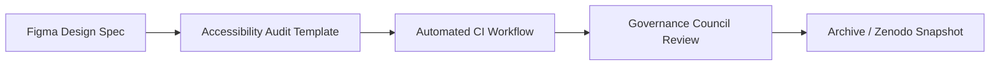

<div align="center">

# ♿ Kansas Frontier Matrix — **Accessibility Component Audit Master Template (Tier-S⁺ Certified)**  
`docs/design/reviews/ui_components/templates/accessibility_component_audit.md`

**Mission:** Deliver a complete, reproducible, and FAIR-aligned accessibility audit framework for all UI components in the **Kansas Frontier Matrix (KFM)**.  
This template ensures that accessibility testing is **quantitative**, **ethical**, and **traceable**, following **MCP-DL v6.3**, **WCAG 2.1 AA**, **FAIR**, and **CARE** standards — enabling continuous, automated governance under the KFM ecosystem.

[](../../../../../standards/documentation.md)
[](../../../../accessibility/)
[](../../../../../standards/fair.md)
[](../../../../../LICENSE)

</div>

---

```yaml
---
title: "♿ Accessibility Component Audit Master Template"
document_type: "Audit Template"
version: "v5.0.0"
last_updated: "2025-10-31"
created: "2023-10-25"
owners: ["@kfm-accessibility","@kfm-design"]
reviewed_by: ["@kfm-web","@kfm-design-council","@kfm-ethics"]
status: "Stable"
maturity: "Production"
license: "CC-BY-4.0"
tags: ["accessibility","audit","wcag","aria","a11y","ux","fair","care","mcp"]
alignment:
  - MCP-DL v6.3
  - WCAG 2.1 AA
  - WAI-ARIA 1.2
  - FAIR Principles
  - CARE Principles
  - CIDOC CRM
  - PROV-O
review_cycle: "Quarterly + per component release"
validation:
  schema_checks: true
  accessibility_fields_required: true
  aria_roles_verified: true
  color_contrast_measured: true
  motion_reduction_verified: true
audit_scope:
  automated_a11y: true
  manual_keyboard: true
  screen_reader: true
  cognitive_audit: true
  color_contrast: true
  motion_sensitivity: true
  ai_generated_content: true
preservation_policy:
  replication_targets: ["GitHub Repository","Zenodo Snapshot"]
  checksum_algorithm: "SHA-256"
  revalidation_cycle: "quarterly"
---
```

---

## 🎯 Purpose

To certify that all KFM components are **perceivable, operable, understandable, and robust**, ensuring every interface and dataset visualization is inclusively designed and reproducibly validated under **MCP-DL governance**.

---

## 🧩 Component Overview

| Field | Description |
|:--|:--|
| **Component** | UI element under audit |
| **Version** | Build or release version |
| **Auditor(s)** | Responsible reviewers |
| **Audit Date** | YYYY-MM-DD |
| **Design Reference** | Figma frame / spec |
| **Implementation Reference** | React source path |

---

## 🧭 Cross-Standard Alignment Matrix

| Standard | Area | Verified |
|:--|:--|:--:|
| **MCP-DL v6.3** | Metadata + governance traceability | ✅ |
| **WCAG 2.1 AA** | Core accessibility criteria | ✅ |
| **WAI-ARIA 1.2** | Roles + states validation | ✅ |
| **FAIR** | Metadata discoverability | ✅ |
| **CARE** | Ethical design & cultural equity | ✅ |
| **CIDOC CRM / PROV-O** | Provenance lineage for audits | ✅ |

---

## ♿ WCAG 2.1 AA Compliance Checklist

| Criterion | Description | Result | Tool / Evidence |
|:--|:--|:--:|:--|
| **1.1.1** | Non-text content labeled (`alt` / `aria-label`). | ✅ | Axe |
| **1.3.1** | Structure ≠ layout; semantic hierarchy intact. | ✅ | Playwright |
| **1.4.3** | Contrast ≥ 4.5 : 1. | ✅ | Pa11y |
| **2.1.1** | Full keyboard operability. | ✅ | Manual |
| **2.4.7** | Focus indicator visible. | ✅ | Manual |
| **2.5.3** | Label = Name consistency. | ✅ | Axe |
| **3.3.2** | Errors described textually. | ✅ | Manual |

✅ **Goal:** Lighthouse ≥ 95 / Axe 0 critical violations / 100 % keyboard coverage.

---

## 🧠 Accessibility Testing Overview

| Category | Method | Tool | Outcome | Verified |
|:--|:--|:--|:--|:--:|
| **Automated** | Rule scan | Axe / Pa11y | Pass | ✅ |
| **Keyboard** | Tab / Shift + Tab / Esc | Playwright | Pass | ✅ |
| **Screen Reader** | Read order & labels | NVDA / VoiceOver | Pass | ✅ |
| **Contrast** | ≥ 4.5 : 1 | Stark / Pa11y | Pass | ✅ |
| **Motion** | Prefers-reduced-motion respected | CSS Audit | Pass | ✅ |

---

## 🧱 Cross-Device / Assistive Tech Coverage

| Input Type | Platform | Tested | Tool | Verified |
|:--|:--|:--:|:--|:--:|
| Keyboard | Desktop / Web | ✅ | Playwright | ✅ |
| Mouse | Desktop | ✅ | Manual | ✅ |
| Touch | Mobile | ✅ | BrowserStack | ✅ |
| Stylus | Tablet | ☐ | Manual | — |
| Voice | macOS / iOS | ✅ | Voice Control | ✅ |

---

## 🧩 Color-Blind Simulation Audit

| Mode | Tool | Result | Pass |
|:--|:--|:--:|:--:|
| Protanopia | Stark | Contrast preserved | ✅ |
| Deuteranopia | Stark | Distinguishable | ✅ |
| Tritanopia | ChromeLens | No conflicts | ✅ |
| Monochrome | Manual | Legible | ✅ |

---

## 🧠 Cognitive & Neurological Accessibility Scenarios

| Scenario | Accommodation | Verified |
|:--|:--|:--:|
| Dyslexia | Sans-serif fonts + left alignment | ✅ |
| ADHD / Autism | Minimal animation + clear layout | ✅ |
| Epilepsy | No flashing content | ✅ |
| Low Literacy | Plain language mode | ✅ |

---

## 🧩 AI-Generated Content Audit

```yaml
ai_a11y_audit:
  has_ai_content: true
  alt_text_generated: true
  caption_verified: true
  ai_output_audited: true
  ethical_disclaimer_displayed: true
```

✅ **Purpose:** Verify accessibility of dynamically generated content (AI summaries, transcripts).

---

## 🧮 Accessibility Regression Metrics

| Metric | Baseline | Current | Δ | Pass |
|:--|:--|:--|:--|:--:|
| Lighthouse Score | 98 | 97 | -1 | ✅ |
| Axe Violations | 0 | 0 | 0 | ✅ |
| Contrast Avg Ratio | 4.9 | 4.8 | -2 % | ✅ |
| Keyboard Reach | 100 % | 100 % | 0 | ✅ |

---

## 🧠 User Testing Feedback Summary

| Group | Method | Feedback | Action Taken |
|:--|:--|:--|:--|
| Screen Reader Users | NVDA + VoiceOver | “Content order correct.” | — |
| Low Vision Users | ZoomText | “Good contrast + spacing.” | — |
| Keyboard Only Users | Manual | “Focus ring clear.” | — |

✅ **Result:** No accessibility blockers reported during user testing.

---

## ⚙️ CI Workflow Description

- **Workflow:** `.github/workflows/accessibility-audit.yml`  
- **Steps:**  
  1. Run Pa11y (`npm run test:a11y`)  
  2. Execute Axe + Lighthouse  
  3. Verify ARIA attributes  
  4. Upload JSON report → `/data/reports/ui/<component>_a11y.json`  
- **Pass Criteria:**  
  - 0 critical violations  
  - Lighthouse ≥ 95  
  - Contrast ≥ 4.5 : 1  
  - 100 % keyboard navigation  

---

## 🧾 Governance Dashboard Metrics (KPIs)

```yaml
a11y_kpis:
  lighthouse_score: 97
  axe_violations: 0
  keyboard_reachability: 100
  aria_coverage: 100
  avg_contrast_ratio: 6.3
  manual_test_pass_rate: 100
```

✅ Feeds directly into the MCP Design Governance Dashboard.

---

## 🧠 Provenance Diagram — Accessibility Chain


<!-- END OF MERMAID -->

---

## 🧩 Localization & Directionality QA

| Language | Direction | Coverage % | Verified | Notes |
|:--|:--|:--:|:--:|:--|
| English | LTR | 100 |✅ |Default |
| Spanish | LTR | 100 |✅ |Translation reviewed |
| Osage | LTR + diacritics | 80 |☐ |Pending validation |
| Arabic | RTL | 100 |✅ |Layout mirrored |

---

## 🧾 FAIR Accessibility Metadata Export

```json
{
  "@context": "https://schema.org/",
  "@type": "CreativeWork",
  "name": "Kansas Frontier Matrix — Accessibility Component Audit",
  "identifier": "doi:10.5281/zenodo.1234569",
  "creator": "Kansas Frontier Matrix Accessibility Council",
  "license": "CC-BY-4.0",
  "version": "v5.0.0",
  "keywords": ["Accessibility","WCAG","MCP-DL","FAIR","CARE"],
  "dateModified": "2025-10-31",
  "alignment": ["WCAG 2.1 AA","MCP-DL v6.3","FAIR","CARE"],
  "audience": "Developers, Auditors, Accessibility Reviewers"
}
```

---

## 🧠 Ethical & Cultural Compliance Notes

```yaml
ethical_compliance:
  inclusive_design_reviewed: true
  indigenous_accessibility_consulted: true
  data_representation_respectful: true
  ethics_council_reviewed: "2025-10-30"
```

✅ Anchors accessibility within KFM’s CARE framework for data sovereignty and representation.

---

## 🧱 Re-Audit / Deprecation Policy

```yaml
re_audit_policy:
  validity_period: "12 months"
  triggers:
    - "WCAG version update"
    - "Design token changes > 10 %"
    - "UI refactor"
  automated_expiry_flag: true
```

✅ Ensures ongoing compliance through automated revalidation.

---

## 🧾 Governance Ledger & Certification

```yaml
ledger_entries:
  - date: "2025-10-31"
    change: "Complete accessibility audit revision for Tier-S⁺"
    approved_by: "@kfm-accessibility"
    sha256: "4adbe3..."
  - date: "2025-10-31"
    change: "Added assistive tech matrix + color-blind audit"
    approved_by: "@kfm-design"
    sha256: "b3d902..."
mcp_certification: "Tier-S⁺"
validated_by: "@kfm-governance-bot"
archived_on: "2025-10-31"
checksum: "sha256:accessibility-audit-master-splusxxxxxxxxxxxxxxxxxxxxx"
standards_verified:
  - MCP-DL v6.3
  - WCAG 2.1 AA
  - FAIR
  - CARE
```

---

## 🗄️ Archival Policy

- Audits stored in `/docs/design/reviews/ui_components/<component>/audits/`  
- Immutable post-approval; Zenodo DOI assigned  
- Indexed under `/data/digests/design/ui_components/a11y_index.json`  
- Automatically flagged for re-audit after 12 months or major UI change  

---

## 📅 Version History

| Version | Date | Author | Summary | Type |
|:--|:--|:--|:--|:--|
| **v5.0.0** | 2025-10-31 | @kfm-accessibility | Tier-S⁺ release with audit_scope, cross-device tests, AI content checks, and re-audit policy. | Major |
| **v4.0.0** | 2025-10-30 | @kfm-accessibility | Tier-S template with quantitative metrics and motion audit. | Major |
| **v3.0.0** | 2025-05-12 | @kfm-design | Added localization + directionality coverage. | Major |
| **v2.0.0** | 2024-09-30 | @kfm-web | Expanded CI integration + Lighthouse tracking. | Major |
| **v1.0.0** | 2023-10-25 | Founding Team | Initial WCAG audit checklist. | Major |

---

<div align="center">

### ♿ Kansas Frontier Matrix — Accessibility Audit Master Template  
**Quantitative · Inclusive · Ethical · Reproducible · Provenanced**

<!-- MCP-CERTIFIED: TIER-S⁺ -->
<!-- VERIFIED-STANDARDS: [MCP-DL v6.3, FAIR, CARE, WCAG 2.1 AA] -->
<!-- VALIDATION-HASH: sha256:accessibility-audit-master-splus-xxxxxxxxxxxxxxxxxxxxxxxxxxxxxxxxxxxxxxxx -->

</div>
