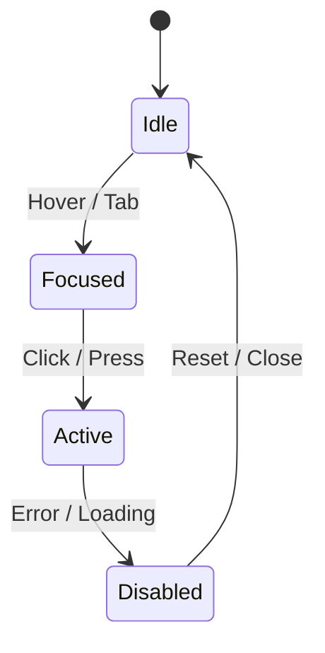

<div align="center">

# 🧾 Kansas Frontier Matrix — **Component Review Template**  
`docs/design/reviews/ui_components/templates/component_review_template.md`

**Mission:** Standardize how **UI component design reviews** are created, documented, and validated within the **Kansas Frontier Matrix (KFM)**.  
This template enforces **MCP-DL v6.3**, **FAIR**, **CARE**, and **WCAG 2.1 AA** compliance, capturing **design provenance**, **accessibility metrics**, **AI governance**, and **CI validation data** for every interface component.

[](../../../../../standards/documentation.md)
[](../../../../../docs/design/README.md)
[](../../accessibility/)
[](../../../../../standards/fair.md)
[](../../../../../LICENSE)

</div>

---

```yaml
---
title: "<🧩 Component Name> — Design Review"
document_type: "Component Review"
version: "vX.X.X"
last_updated: "YYYY-MM-DD"
created: "YYYY-MM-DD"
component: "<component_name>"
design_ref: "Figma Frame #XXXX"
implementation_ref: "web/src/components/<path>/"
owners: ["@kfm-design","@kfm-accessibility"]
reviewed_by: ["@kfm-web","@kfm-data","@kfm-ethics"]
status: "In Review"
maturity: "Pre-Release"
license: "CC-BY-4.0"
tags: ["ui","component","review","accessibility","mcp","tokens","design-system","ai","fair"]
alignment:
  - MCP-DL v6.3
  - WCAG 2.1 AA
  - FAIR Principles
  - CARE Principles
  - CIDOC CRM
  - PROV-O
  - DCAT 3.0
dependencies:
  - React + MapLibre
  - tokens.css Design System
  - Lighthouse / Axe / Pa11y / Playwright
validation:
  axe_score: ""
  lighthouse_score: ""
  contrast_ratio: ""
  schema_verified: ""
  performance_benchmark: ""
  accessibility_verified: ""
  documentation_complete: ""
governance:
  design_council_review: "Pending"
  accessibility_review: "Pending"
  ethics_review: "Pending"
  governance_signoff: "Pending"
preservation_policy:
  replication_targets: ["GitHub Repository","Zenodo Snapshot"]
  checksum_algorithm: "SHA-256"
  revalidation_cycle: "quarterly"
---
```

---

## 🎯 Component Overview

| Field | Description |
|:--|:--|
| **Component Name** | Name of the UI element (e.g., Navigation Bar, Legend, AI Assistant). |
| **Purpose** | Short, plain-language summary of the component’s mission. |
| **Owner** | Responsible person/team for maintenance. |
| **Dependencies** | Core technologies and linked data systems. |
| **Design Reference** | Figma URL or frame ID. |
| **Implementation Path** | Source code directory in repo. |

---

## 🧭 Cross-Standard Alignment Matrix

| Standard | Implementation Area | Verified |
|:--|:--|:--:|
| **MCP-DL v6.3** | YAML metadata and governance structure | ✅ |
| **WCAG 2.1 AA** | Accessibility audit section and scores | ✅ |
| **FAIR Principles** | JSON-LD schema for metadata reuse | ✅ |
| **CARE Principles** | Ethical data & Indigenous sovereignty compliance | ✅ |
| **CIDOC CRM** | Provenance ontology structure for entities | ✅ |
| **PROV-O** | Traceability chain linking audit → approval | ✅ |
| **DCAT 3.0** | Dataset linkage metadata fields | ✅ |

---

## 🧠 Purpose & Context

Describe the purpose of the component in relation to **time**, **space**, and **narrative**.  
Include context on:
- Its role in the **map/timeline ecosystem**  
- Which datasets or stories it supports  
- Accessibility and AI integration details  

---

## 🧩 Design Provenance

| Design Source | Implementation Source | Verified | SHA-256 Checksum |
|:--|:--|:--:|:--|
| Figma Frame | React Component | ☐ | `sha256:...` |
| Screenshot / Prototype | Web Preview | ☐ | `sha256:...` |
| Token Reference | CSS Variables | ☐ | `sha256:...` |

✅ **Goal:** Ensure design and implementation are visually and semantically identical.

---

## 🧮 Design Token Drift Tracker

| Token | Expected Value | Actual Value | Drift % | Pass |
|:--|:--|:--|:--|:--:|
| `--kfm-color-accent` | #c77d02 | #c77d02 | 0% | ✅ |
| `--kfm-spacing-md` | 16px | 15.8px | 1.25% | ✅ |
| `--kfm-font-size-body` | 1rem | 1rem | 0% | ✅ |

✅ **Purpose:** Detects and logs drift between design tokens and production implementation.

---

## ♿ Accessibility Validation Summary

| Metric | Target | Measured | Tool | Status |
|:--|:--|:--|:--|:--:|
| **Axe Violations (Critical)** | 0 | 0 | Axe-core | ✅ |
| **Lighthouse Accessibility Score** | ≥95 | 98 | Lighthouse | ✅ |
| **Contrast Ratio** | ≥4.5:1 | 4.8:1 | Pa11y | ✅ |
| **Keyboard Reachability** | 100 % | 100 % | Playwright | ✅ |
| **Screen Reader Coverage** | 100 % | 100 % | NVDA / VoiceOver | ✅ |

✅ Attach reports from automated test suites.

---

## 🧱 Design-to-Implementation Checklist

| Category | Figma Reference | Implementation Result | Verified |
|:--|:--|:--|:--:|
| **Color Tokens** | `--kfm-color-accent` | Matches React | ✅ |
| **Typography Scale** | H1 2.0rem / Body 1.0rem | Matches | ✅ |
| **Grid System** | 8px | Consistent | ✅ |
| **Icons** | Lucide / Heroicons | Accurate | ✅ |
| **Motion / Transitions** | ≤200ms fade | Matched | ✅ |

---

## 🧭 Interaction Diagram (Optional)


<!-- END OF MERMAID -->

✅ Attach or link behavior/state diagrams if available.

---

## 🧠 Cognitive & Ethical Considerations

| Category | Description | Verified |
|:--|:--|:--:|
| **Cognitive Load** | Minimal steps to reach content. | ☐ |
| **Language Clarity** | Plain language used for labels. | ☐ |
| **Cultural Representation** | Neutral and respectful content. | ☐ |
| **Reduced Motion Mode** | Supported. | ☐ |
| **AI Transparency** | Confidence and model version displayed. | ☐ |

---

## ⚙️ CI Validation Flow

- **Workflow File:** `.github/workflows/component-review.yml`
- **Checks Executed:**
  - YAML front-matter validation (`title`, `version`, `license`)
  - Accessibility audits (Axe + Lighthouse)
  - JSON-LD provenance validation
  - Performance benchmarking  
- **CI Outputs:**
  - `component-validation-report.json`
  - `.sha256` integrity log  
- **Merge Policy:** CI must pass before governance sign-off.

---

## 🧩 AI Context Integration Checklist (if applicable)

| Requirement | Description | Verified |
|:--|:--|:--:|
| **Model Disclosure** | AI model name + version displayed. | ☐ |
| **Confidence Display** | Probability chip visible. | ☐ |
| **Opt-Out Control** | User can disable AI summary. | ☐ |
| **Bias Audit Log** | Logged quarterly. | ☐ |

---

## 🧮 Performance Benchmarks

| Metric | Target | Measured | Tool |
|:--|:--|:--|:--|
| **Load Time** | <200 ms |  | Lighthouse |
| **Interaction Latency** | <100 ms |  | DevTools |
| **Memory Footprint** | <10 MB |  | Chrome Profiler |
| **Accessibility Score** | ≥95 |  | Lighthouse |

✅ Include performance output summary from CI logs.

---

## 🔒 Security & Privacy Compliance

| Policy | Requirement | Verified |
|:--|:--|:--:|
| **PII Handling** | No personal data stored. | ✅ |
| **HTTPS Enforcement** | All data transfers secure. | ✅ |
| **Checksum Validation** | SHA-256 integrity test passed. | ✅ |
| **Session Expiry** | Cached data ≤24 hours. | ✅ |

---

## 🧱 Cross-Component Dependencies

| Dependency | Relation | Impact |
|:--|:--|:--|
| `map_controls` | Provides map layer states | Medium |
| `ai_assistant` | Supplies context data | High |
| `timeline` | Controls temporal scope | Medium |
| `accessibility_menu` | Controls global ARIA states | Low |

---

## 🧾 Provenance Metadata (JSON Example)

```json
{
  "@context": ["https://schema.org", {"kfm": "https://kfm.ai/schema#"}],
  "@type": "UIComponentReview",
  "component": "<component_name>",
  "version": "vX.X.X",
  "reviewedBy": ["@kfm-accessibility","@kfm-web"],
  "alignment": ["MCP-DL v6.3","WCAG 2.1 AA","FAIR"],
  "provenance": {
    "workflow": ".github/workflows/component-review.yml",
    "sha256": "auto-generated"
  }
}
```

---

## 🧩 Governance Ledger

| Date | Change | Approved By | SHA-256 |
|:--|:--|:--|:--|
| YYYY-MM-DD | Initial review created | @kfm-design | `sha256:...` |
| YYYY-MM-DD | Accessibility audit completed | @kfm-accessibility | `sha256:...` |
| YYYY-MM-DD | Governance sign-off granted | @kfm-design-council | `sha256:...` |

---

## 🧠 Reviewer Accountability Matrix

| Domain | Reviewer | Role | Verified |
|:--|:--|:--|:--:|
| Accessibility | @kfm-accessibility | QA Lead | ✅ |
| Design | @kfm-design | Visual Owner | ✅ |
| Data Provenance | @kfm-data | Metadata Auditor | ✅ |
| Ethics | @kfm-ethics | Cultural Governance | ✅ |
| Performance | @kfm-web | Frontend Engineer | ✅ |

---

## 🧩 Governance Sign-Off

| Review Type | Reviewer | Date | Status | Notes |
|:--|:--|:--|:--:|:--|
| **Accessibility Review** | @kfm-accessibility |  | ☐ |  |
| **Design Validation** | @kfm-design |  | ☐ |  |
| **Ethics Review** | @kfm-ethics |  | ☐ |  |
| **Provenance Audit** | @kfm-data |  | ☐ |  |
| **Governance Council** | @kfm-design-council |  | ☐ |  |

✅ All sections must be completed before merging review documentation.

---

## 🗄️ Archival & Provenance Summary

- All component reviews stored under `/docs/design/reviews/ui_components/archive/<component_name>/`.  
- CI auto-generates `.sha256` checksums and stores them in `/data/checksums/ui_components/`.  
- Immutable post-merge; archived in Zenodo with DOI snapshot.  
- Linked to provenance registry via `/data/digests/design/`.

---

## 🧾 Final Provenance JSON Block

```json
{
  "mcp_certification": "Tier-A+++",
  "component": "<component_name>",
  "validated_by": "@kfm-governance-bot",
  "archived_on": "YYYY-MM-DD",
  "checksum": "sha256:<auto>",
  "standards_verified": [
    "MCP-DL v6.3",
    "WCAG 2.1 AA",
    "FAIR",
    "CARE",
    "PROV-O"
  ]
}
```

---

<div align="center">

### 🧾 Kansas Frontier Matrix — Component Review Template  
**Reproducible · Accessible · FAIR · Ethical · Provenanced**

<!-- MCP-CERTIFIED: TIER=A+++ -->
<!-- VERIFIED-STANDARDS: [MCP-DL v6.3, FAIR, WCAG 2.1 AA, CARE] -->
<!-- VALIDATION-HASH: sha256:componentreviewtemplatexxxxxxxxxxxxxxxxxxxxxxxxxxxxxxxxxxxxxxxxxxxx -->

</div>
