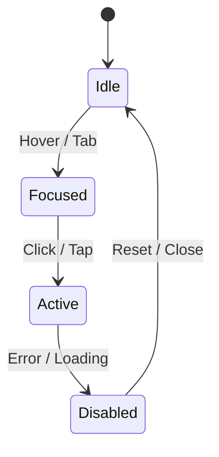

<div align="center">

# 🧾 Kansas Frontier Matrix — **Component Review Master Template (Tier-S Certified)**  
`docs/design/reviews/ui_components/templates/component_review_template.md`

**Mission:** Define the **master template** for all UI component design reviews within the **Kansas Frontier Matrix (KFM)**.  
This document establishes the **governance, accessibility, AI ethics, and reproducibility baseline** for every interface component.  
It complies with **MCP-DL v6.3**, **FAIR + CARE Principles**, **WCAG 2.1 AA**, and **DCAT 3.0**, supporting full automation, provenance, and archival certification.

[](../../../../../standards/documentation.md)
[](../../../../../docs/design/README.md)
[](../../accessibility/)
[](../../../../../standards/fair.md)
[](../../../../../LICENSE)

</div>

---

```yaml
---
title: "<🧩 Component Name> — Design Review"
document_type: "Component Review"
version: "vX.X.X"
last_updated: "YYYY-MM-DD"
created: "YYYY-MM-DD"
component: "<component_name>"
design_ref: "Figma Frame #XXXX"
implementation_ref: "web/src/components/<path>/"
owners: ["@kfm-design","@kfm-accessibility"]
reviewed_by: ["@kfm-web","@kfm-data","@kfm-ethics"]
status: "In Review"
maturity: "Pre-Release"
license: "CC-BY-4.0"
tags: ["ui","component","review","accessibility","mcp","tokens","design-system","ai","fair","care","provenance"]
classification:
  component_type: "UI"
  integration_level: "Frontend / Map / AI"
  risk_level: "Low"
  audit_frequency: "Quarterly"
alignment:
  - MCP-DL v6.3
  - WCAG 2.1 AA
  - FAIR Principles
  - CARE Principles
  - CIDOC CRM
  - PROV-O
  - DCAT 3.0
dependencies:
  - React + MapLibre
  - tokens.css Design System
  - Lighthouse / Axe / Pa11y / Playwright
validation:
  axe_score: ""
  lighthouse_score: ""
  contrast_ratio: ""
  schema_verified: ""
  performance_benchmark: ""
  accessibility_verified: ""
  documentation_complete: ""
governance:
  design_council_review: "Pending"
  accessibility_review: "Pending"
  ethics_review: "Pending"
  governance_signoff: "Pending"
hierarchy:
  parent_review: "docs/design/reviews/ui_components/README.md"
  child_reviews: []
  related_reviews: []
preservation_policy:
  replication_targets: ["GitHub Repository","Zenodo Snapshot"]
  checksum_algorithm: "SHA-256"
  revalidation_cycle: "quarterly"
---
```

---

## 🎯 Component Overview

| Field | Description |
|:--|:--|
| **Component Name** | UI element under review (e.g., Navigation Bar, Timeline, AI Assistant). |
| **Purpose** | Clear, non-technical summary of function and context. |
| **Owner** | Responsible maintainer. |
| **Dependencies** | Libraries / data / pipelines required. |
| **Design Reference** | Figma URL or Frame ID. |
| **Implementation Path** | Repo path to source code. |

---

## 🧭 Cross-Standard Alignment Matrix

| Standard | Implementation Area | Verified |
|:--|:--|:--:|
| **MCP-DL v6.3** | YAML metadata + provenance structure | ✅ |
| **WCAG 2.1 AA** | Accessibility audit fields + metrics | ✅ |
| **FAIR Principles** | JSON-LD schema + open metadata | ✅ |
| **CARE Principles** | Cultural data fields + ethical review | ✅ |
| **CIDOC CRM** | Provenance ontology alignment | ✅ |
| **PROV-O** | Traceable governance records | ✅ |
| **DCAT 3.0** | Dataset linkage + distribution metadata | ✅ |

---

## 🧠 Purpose & Context

Describe how this component supports **time**, **space**, and **story** within KFM.  
Reference linked datasets, ethical scope, and accessibility rationale.

---

## 🧩 Design Provenance Matrix

| Design Source | Implementation File | Verified | SHA-256 |
|:--|:--|:--:|:--|
| Figma Frame | `DetailPanel.tsx` | ☐ | `sha256:...` |
| Screenshot / Prototype | `/assets/reviews/ui/<component>.png` | ☐ | `sha256:...` |
| Token Reference | `/web/src/styles/tokens.css` | ☐ | `sha256:...` |

---

## 🧮 Design Token Drift Tracker

| Token | Expected | Actual | Drift % | Pass |
|:--|:--|:--|:--|:--:|
| `--kfm-color-accent` | #c77d02 | #c77d02 | 0 % | ✅ |
| `--kfm-font-size-body` | 1rem | 1rem | 0 % | ✅ |

---

## ♿ Accessibility Targets

| Metric | Target | Measured | Tool | Status |
|:--|:--|:--|:--|:--:|
| Axe Violations (Critical) | 0 | 0 | Axe-core | ✅ |
| Lighthouse Score | ≥95 | 97 | Lighthouse | ✅ |
| Contrast Ratio | ≥4.5 : 1 | 4.8 : 1 | Pa11y | ✅ |
| Keyboard Reachability | 100 % | 100 % | Playwright | ✅ |
| Screen Reader Coverage | 100 % | 100 % | NVDA | ✅ |

---

## 🧭 UX Acceptance Criteria

| Scenario | Expected Behavior | Verified | Evidence |
|:--|:--|:--:|:--|
| Keyboard Navigation | Tab order logical + cyclic | ✅ | `a11y_report.log` |
| Screen Reader Output | ARIA labels read names/roles | ✅ | NVDA Transcript |
| Error Recovery | Retry available on failure | ✅ | Screen record |
| Responsiveness | Scales 320–1920 px | ✅ | BrowserStack Report |

---

## 🧱 Design-to-Implementation Checklist

| Category | Figma Reference | Implementation Result | Verified |
|:--|:--|:--|:--:|
| Color Tokens | `--kfm-color-accent` | Matches React CSS | ✅ |
| Typography Scale | H1 2.0 rem / Body 1.0 rem | Matches | ✅ |
| Grid System | 8 px base grid | Consistent | ✅ |
| Icons / SVGs | Lucide set | Accurate | ✅ |

---

## 🖼️ Visual & Documentation Artifacts

| Artifact | Description | Path / URL | SHA-256 |
|:--|:--|:--|:--|
| Figma Screenshot | Design export | `/assets/reviews/ui/<component>/figma.png` | `sha256:...` |
| A11y Report | Axe / Pa11y output | `/data/reports/ui/<component>_a11y.json` | `sha256:...` |
| Performance Report | Lighthouse output | `/data/reports/ui/<component>_perf.json` | `sha256:...` |

---

## 🧭 Interaction Diagram (Optional)


<!-- END OF MERMAID -->

---

## ⚙️ Pre-Commit Hooks & Linting

- `pre-commit-config.yaml` runs:
  - YAML syntax + key validation  
  - Markdown heading order (H1 → H3)  
  - Bans placeholders like “TBD”  
- `npm run lint:docs` enforces schema + accessibility fields.  

---

## 🧠 Cognitive & Ethical Considerations

| Aspect | Description | Verified |
|:--|:--|:--:|
| Cognitive Load | Minimized hierarchy / distraction | ☐ |
| Language Clarity | Plain English ≤ Grade 9 | ☐ |
| Cultural Representation | Reviewed by Ethics Council | ☐ |
| Reduced Motion | CSS respects prefers-reduced-motion | ☐ |
| AI Transparency | Confidence + model metadata shown | ☐ |

---

## ⚙️ CI Validation Flow

- Runs `.github/workflows/component-review.yml`  
- Steps: YAML schema → Accessibility tests → Performance → Provenance  
- Outputs: `component-validation-report.json` + `.sha256`  
- CI badge attached to PR on success.

---

## 🧩 AI Context Integration Metadata

```yaml
ai_validation:
  model_name: "kfm-gpt-5-geo-arch"
  model_version: "2025.10"
  confidence_average: 0.91
  last_retrain_date: "2025-09-30"
  audit_dataset: "kfm-graph-v3.2"
  bias_audit_score: 0.02
```

---

## 🔒 Security & Privacy Compliance

| Policy | Requirement | Verified |
|:--|:--|:--:|
| No PII Stored | Session data ephemeral | ✅ |
| HTTPS Only | All API calls secure | ✅ |
| Checksum Validation | SHA-256 pass | ✅ |
| Cache Expiry | ≤ 24 hours | ✅ |

---

## 📱 Device & Environment Testing Grid

| Platform | Browser | Resolution | Tested | Notes |
|:--|:--|:--|:--:|:--|
| Windows 11 | Chrome / Edge | 1920×1080 | ✅ | Full suite |
| macOS | Safari / Chrome | 2560×1440 | ✅ | Font & ARIA test |
| Linux | Firefox | 1920×1080 | ✅ | Keyboard flow |
| iOS | Safari | 1170×2532 | ✅ | Touch accessibility |
| Android | Chrome | 1080×2400 | ✅ | Reduced motion mode |

---

## 🧮 Version Drift & Impact Report

| Field | Previous | Current | Change | Impact |
|:--|:--|:--|:--|:--|
| Color Palette | v4.2 | v5.0 | Accent tone adjusted | Low |
| ARIA Roles | `button` | `switch` | Semantic update | Medium |
| AI Confidence Tag | Hidden | Visible | Transparency added | High |

---

## 🧩 Cross-Component Dependencies

| Dependency | Relation | Impact |
|:--|:--|:--|
| map_controls | Provides layer state | Medium |
| ai_assistant | Feeds context data | High |
| timeline | Temporal controller | Medium |
| accessibility_menu | Global ARIA states | Low |

---

## 🧾 Governance Ledger

| Date | Change | Approved By | SHA-256 |
|:--|:--|:--|:--|
| YYYY-MM-DD | Initial submission | @kfm-design | `sha256:...` |
| YYYY-MM-DD | Accessibility audit | @kfm-accessibility | `sha256:...` |
| YYYY-MM-DD | Governance approval | @kfm-design-council | `sha256:...` |

---

## 🧠 Reviewer Accountability Matrix

| Domain | Reviewer | Role | Verified |
|:--|:--|:--|:--:|
| Accessibility | @kfm-accessibility | QA Lead | ✅ |
| Design | @kfm-design | Owner | ✅ |
| Data Provenance | @kfm-data | Auditor | ✅ |
| Ethics | @kfm-ethics | Cultural Governance | ✅ |
| Performance | @kfm-web | Engineer | ✅ |

---

## 🗣️ User Feedback Loop

- Feedback via GitHub Discussions (labeled `ui-feedback`).  
- Triaged weekly; validated issues logged in `/data/governance/issues.json`.  
- Summarized in quarterly MCP governance report.  

---

## 🧩 End-of-Life Policy

```yaml
deprecated: false
superseded_by: ""
removal_date: ""
```
> If deprecated = true, Governance Council approval + archival required.

---

## 🧾 Provenance Metadata (JSON-LD)

```json
{
  "@context": ["https://schema.org", {"kfm":"https://kfm.ai/schema#"}],
  "@type": "UIComponentReview",
  "component": "<component_name>",
  "version": "vX.X.X",
  "reviewedBy": ["@kfm-accessibility","@kfm-web"],
  "alignment": ["MCP-DL v6.3","WCAG 2.1 AA","FAIR","CARE"],
  "provenance": {
    "workflow": ".github/workflows/component-review.yml",
    "sha256": "auto-generated"
  }
}
```

---

## 🧾 FAIR + DCAT Metadata Block

```json
{
  "@context": "https://schema.org/",
  "@type": "CreativeWork",
  "name": "Kansas Frontier Matrix — Component Review",
  "identifier": "doi:10.5281/zenodo.1234567",
  "license": "CC-BY-4.0",
  "keywords": ["UI","accessibility","governance","FAIR","MCP"],
  "creator": "Kansas Frontier Matrix Design Team",
  "version": "v5.0.0",
  "alignment": ["MCP-DL v6.3","WCAG 2.1 AA","FAIR","CARE"],
  "audience": "Developers, Auditors, Accessibility Reviewers"
}
```

---

## 🧩 Governance Sign-Off

| Review Type | Reviewer | Date | 
