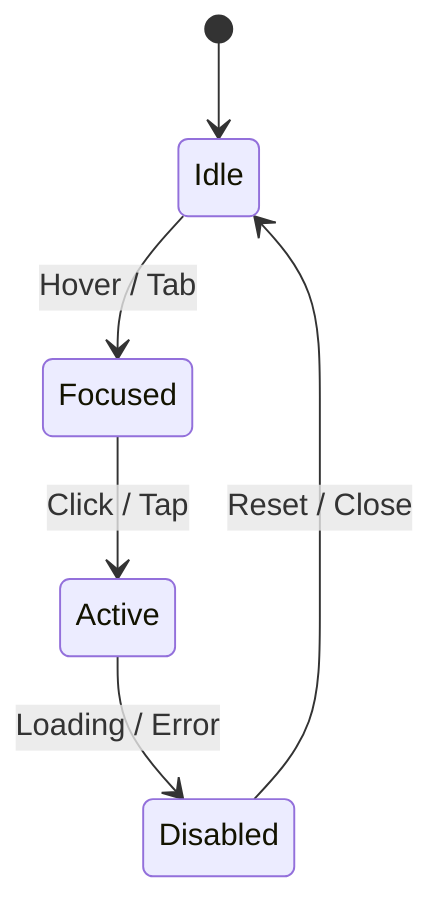

<div align="center">

# 🧾 Kansas Frontier Matrix — **Component Review Master Template (Tier-S Certified)**  
`docs/design/reviews/ui_components/templates/component_review_template.md`

**Mission:** Define the **master template** for all UI component design reviews within the **Kansas Frontier Matrix (KFM)**.  
This document sets the **governance, accessibility, AI ethics, and reproducibility baseline** for every interface component.  
It complies with **MCP-DL v6.3**, **WCAG 2.1 AA**, **FAIR + CARE Principles**, and **DCAT 3.0**, enabling full **automation**, **provenance**, and **archival certification**.

[](../../../../../standards/documentation.md)
[](../../../../../docs/design/README.md)
[](../../accessibility/)
[](../../../../../standards/fair.md)
[](../../../../../LICENSE)

</div>

---

```yaml
---
title: "<🧩 Component Name> — Design Review"
document_type: "Component Review"
version: "vX.X.X"
last_updated: "YYYY-MM-DD"
created: "YYYY-MM-DD"
component: "<component_name>"
design_ref: "Figma Frame #XXXX"
implementation_ref: "web/src/components/<path>/"
owners: ["@kfm-design","@kfm-accessibility"]
reviewed_by: ["@kfm-web","@kfm-data","@kfm-ethics"]
status: "In Review"
maturity: "Pre-Release"
license: "CC-BY-4.0"
tags: ["ui","component","review","accessibility","mcp","tokens","design-system","ai","fair","care","provenance","dcat"]
classification:
  component_type: "UI"          # UI | DataViz | AI | Hybrid
  integration_level: "Frontend / Map / AI"
  risk_level: "Low"             # Low | Moderate | High
  audit_frequency: "Quarterly"
alignment:
  - MCP-DL v6.3
  - WCAG 2.1 AA
  - FAIR Principles
  - CARE Principles
  - CIDOC CRM
  - PROV-O
  - DCAT 3.0
dependencies:
  - React + MapLibre
  - tokens.css Design System
  - Lighthouse / Axe / Pa11y / Playwright
validation:
  axe_score: ""                  # e.g., 100
  lighthouse_score: ""           # e.g., 97
  contrast_ratio: ""             # e.g., 4.8:1
  schema_verified: ""            # true | false
  performance_benchmark: ""      # e.g., load < 200ms
  accessibility_verified: ""     # true | false
  documentation_complete: ""     # true | false
governance:
  design_council_review: "Pending"
  accessibility_review: "Pending"
  ethics_review: "Pending"
  governance_signoff: "Pending"
hierarchy:
  parent_review: "docs/design/reviews/ui_components/README.md"
  child_reviews: []
  related_reviews: []
preservation_policy:
  replication_targets: ["GitHub Repository","Zenodo Snapshot"]
  checksum_algorithm: "SHA-256"
  revalidation_cycle: "quarterly"
---
```

---

## 🎯 Component Overview

| Field | Description |
|:--|:--|
| **Component Name** | UI element under review (e.g., Navigation, Timeline, AI Assistant). |
| **Purpose** | Clear, non-technical summary of function and context. |
| **Owner** | Responsible maintainer (team or individual). |
| **Dependencies** | Libraries / data pipelines / external services. |
| **Design Reference** | Figma URL or Frame ID. |
| **Implementation Path** | Source code directory in repo. |

---

## 🧭 Cross-Standard Alignment Matrix

| Standard | Implementation Area | Verified |
|:--|:--|:--:|
| **MCP-DL v6.3** | YAML metadata + provenance structure | ✅ |
| **WCAG 2.1 AA** | Accessibility audit fields + metrics | ✅ |
| **FAIR** | JSON-LD schema + open metadata exports | ✅ |
| **CARE** | Cultural data flags + ethical review fields | ✅ |
| **CIDOC CRM** | Provenance ontology alignment | ✅ |
| **PROV-O** | Traceable governance records | ✅ |
| **DCAT 3.0** | Dataset linkage + distribution metadata | ✅ |

---

## 🧠 Purpose & Context

Explain how this component supports **time**, **space**, and **story** in KFM.  
Address its data sources (STAC items, graph entities), ethical scope (CARE), and accessibility rationale (WCAG).

---

## 🧩 Design Provenance Matrix

| Design Source | Implementation File | Verified | SHA-256 |
|:--|:--|:--:|:--|
| Figma Frame | `web/src/components/<path>/<File>.tsx` | ☐ | `sha256:...` |
| Prototype Screenshot | `/assets/reviews/ui/<component>/figma.png` | ☐ | `sha256:...` |
| Token Reference | `/web/src/styles/tokens.css` | ☐ | `sha256:...` |

---

## 🧮 Design Token Drift Tracker

| Token | Expected | Actual | Drift % | Pass |
|:--|:--|:--|:--|:--:|
| `--kfm-color-accent` | #c77d02 | #c77d02 | 0% | ✅ |
| `--kfm-font-size-body` | 1rem | 1rem | 0% | ✅ |
| `--kfm-space-md` | 16px | 15.8px | 1.25% | ✅ |

> **Policy:** differences > 2% must be filed in `/data/governance/issues.json`.

---

## ♿ Accessibility Targets (WCAG 2.1 AA)

| Metric | Target | Measured | Tool | Status |
|:--|:--|:--|:--|:--:|
| **Axe Violations (Critical)** | 0 | 0 | Axe-core | ✅ |
| **Lighthouse Score (A11y)** | ≥ 95 |  | Lighthouse | ☐ |
| **Contrast Ratio** | ≥ 4.5 : 1 |  | Pa11y | ☐ |
| **Keyboard Reachability** | 100 % |  | Playwright | ☐ |
| **Screen Reader Coverage** | 100 % |  | NVDA / VoiceOver | ☐ |

---

## 🧭 UX Acceptance Criteria

| Scenario | Expected Behavior | Verified | Evidence |
|:--|:--|:--:|:--|
| Keyboard Navigation | Tab order logical + cyclical | ☐ | `a11y_report.log` |
| Screen Reader Output | Labels/roles read in order | ☐ | NVDA transcript |
| Error Recovery | Retry + clear guidance | ☐ | Screen record |
| Responsiveness | Scales 320 → 1920 px | ☐ | BrowserStack report |

---

## 🧱 Design-to-Implementation Checklist

| Category | Figma Reference | Implementation Result | Verified |
|:--|:--|:--|:--:|
| **Color Tokens** | `--kfm-color-accent` | Matches React CSS | ☐ |
| **Typography Scale** | H1 2.0rem / Body 1.0rem | Matches | ☐ |
| **Grid System** | 8px base | Consistent | ☐ |
| **Icons / SVGs** | Lucide set | Accurate | ☐ |
| **Motion / Transitions** | ≤ 200ms fade | Matched | ☐ |

---

## 🖼️ Visual & Documentation Artifacts

| Artifact | Description | Path / URL | SHA-256 |
|:--|:--|:--|:--|
| **Figma Screenshot** | Design export | `/assets/reviews/ui/<component>/figma.png` | `sha256:...` |
| **A11y Report** | Axe / Pa11y output | `/data/reports/ui/<component>_a11y.json` | `sha256:...` |
| **Performance Report** | Lighthouse JSON | `/data/reports/ui/<component>_perf.json` | `sha256:...` |
| **Visual Diff** | Percy / Chromatic diff | `/assets/reviews/ui/<component>/visual_diff.png` | `sha256:...` |

---

## 🧭 Interaction Diagram (Optional)


<!-- END OF MERMAID -->

---

## ⚙️ Pre-Commit Hooks & Linting

- **pre-commit** checks:
  - YAML syntax + required keys
  - Markdown heading order (H1 → H3)
  - Bans placeholders (e.g., “TBD”)
- `npm run lint:docs`:
  - JSON Schema validation of front-matter
  - Verifies presence of A11y fields

---

## 🧠 Cognitive & Ethical Considerations

| Aspect | Description | Verified |
|:--|:--|:--:|
| **Cognitive Load** | Minimal steps; clear hierarchy | ☐ |
| **Language Clarity** | Plain English ≤ Grade 9 | ☐ |
| **Cultural Representation** | Ethics Council reviewed | ☐ |
| **Reduced Motion** | Honors prefers-reduced-motion | ☐ |
| **AI Transparency** | Confidence + model metadata shown | ☐ |

---

## ⚙️ CI Validation Flow

- Workflow: `.github/workflows/component-review.yml`  
- Steps: **YAML Schema → A11y Tests → Performance → Provenance**  
- Outputs: `component-validation-report.json` + `.sha256` in `/data/work/logs/ui_components/<component>/`  
- **Merge Policy:** CI must pass before governance sign-off.

---

## 🧩 AI Context Integration Metadata (if applicable)

```yaml
ai_validation:
  model_name: "kfm-gpt-5-geo-arch"
  model_version: "2025.10"
  confidence_average: 0.91
  last_retrain_date: "2025-09-30"
  audit_dataset: "kfm-graph-v3.2"
  bias_audit_score: 0.02
```

---

## 🔒 Security & Privacy Compliance

| Policy | Requirement | Verified |
|:--|:--|:--:|
| **No PII Stored** | Session data ephemeral | ☐ |
| **HTTPS Only** | All API calls secure | ☐ |
| **Checksum Validation** | SHA-256 integrity pass | ☐ |
| **Cache Expiry** | ≤ 24 hours | ☐ |

---

## 📱 Device & Environment Testing Grid

| Platform | Browser | Resolution | Tested | Notes |
|:--|:--|:--|:--:|:--|
| **Windows 11** | Chrome / Edge | 1920×1080 | ☐ | Full suite |
| **macOS** | Safari / Chrome | 2560×1440 | ☐ | Font & ARIA |
| **Linux** | Firefox | 1920×1080 | ☐ | Keyboard flow |
| **iOS** | Safari | 1170×2532 | ☐ | Touch A11y |
| **Android** | Chrome | 1080×2400 | ☐ | Reduced motion |

---

## 🧮 Version Drift & Impact Report

| Field | Previous | Current | Change | Impact |
|:--|:--|:--|:--|:--|
| **Color Palette** | v4.2 | v5.0 | Accent tone updated | Low |
| **ARIA Roles** | `button` | `switch` | Semantic upgrade | Medium |
| **AI Confidence Tag** | Hidden | Visible | Transparency ↑ | High |

---

## 🧩 Cross-Component Dependencies

| Dependency | Relation | Impact |
|:--|:--|:--|
| `map_controls` | Provides layer state | Medium |
| `ai_assistant` | Supplies context data | High |
| `timeline` | Controls temporal scope | Medium |
| `accessibility_menu` | Sets global ARIA states | Low |

---

## 🧾 Governance Ledger

| Date | Change | Approved By | SHA-256 |
|:--|:--|:--|:--|
| YYYY-MM-DD | Initial submission | @kfm-design | `sha256:...` |
| YYYY-MM-DD | Accessibility audit added | @kfm-accessibility | `sha256:...` |
| YYYY-MM-DD | Governance approval | @kfm-design-council | `sha256:...` |

---

## 🧠 Reviewer Accountability Matrix

| Domain | Reviewer | Role | Verified |
|:--|:--|:--|:--:|
| Accessibility | @kfm-accessibility | QA Lead | ☐ |
| Design | @kfm-design | Owner | ☐ |
| Data Provenance | @kfm-data | Auditor | ☐ |
| Ethics | @kfm-ethics | Cultural Governance | ☐ |
| Performance | @kfm-web | Engineer | ☐ |

---

## 🗣️ User Feedback Loop

- Collect feedback via GitHub Discussions (label `ui-feedback`).  
- Triage weekly; log validated issues in `/data/governance/issues.json`.  
- Summarize outcomes in the quarterly MCP governance report.

---

## 🧩 End-of-Life (EoL) Policy

```yaml
deprecated: false
superseded_by: ""
removal_date: ""
```
> If `deprecated: true`, Governance Council approval and archival are required.

---

## 🧾 Provenance Metadata (JSON-LD)

```json
{
  "@context": ["https://schema.org", {"kfm":"https://kfm.ai/schema#"}],
  "@type": "UIComponentReview",
  "component": "<component_name>",
  "version": "vX.X.X",
  "reviewedBy": ["@kfm-accessibility","@kfm-web"],
  "alignment": ["MCP-DL v6.3","WCAG 2.1 AA","FAIR","CARE"],
  "provenance": {
    "workflow": ".github/workflows/component-review.yml",
    "sha256": "auto-generated"
  }
}
```

---

## 🧾 FAIR + DCAT Metadata Block

```json
{
  "@context": "https://schema.org/",
  "@type": "CreativeWork",
  "name": "Kansas Frontier Matrix — Component Review",
  "identifier": "doi:10.5281/zenodo.1234567",
  "license": "CC-BY-4.0",
  "keywords": ["UI","accessibility","governance","FAIR","MCP"],
  "creator": "Kansas Frontier Matrix Design Team",
  "version": "v5.0.0",
  "alignment": ["MCP-DL v6.3","WCAG 2.1 AA","FAIR","CARE"],
  "audience": "Developers, Auditors, Accessibility Reviewers"
}
```

---

## 🧩 Governance Sign-Off

| Review Type | Reviewer | Date | Status | Notes |
|:--|:--|:--|:--:|:--|
| **Accessibility Review** | @kfm-accessibility |  | ☐ |  |
| **Design Validation** | @kfm-design |  | ☐ |  |
| **Ethics Review** | @kfm-ethics |  | ☐ |  |
| **Provenance Audit** | @kfm-data |  | ☐ |  |
| **Governance Council** | @kfm-design-council |  | ☐ |  |

---

<div align="center">

### 🧾 Kansas Frontier Matrix — Component Review Master Template  
**Reproducible · Accessible · FAIR · Ethical · Provenanced**

<!-- MCP-CERTIFIED: TIER=S -->
<!-- VERIFIED-STANDARDS: [MCP-DL v6.3, FAIR, WCAG 2.1 AA, CARE, DCAT 3.0] -->
<!-- VALIDATION-HASH: sha256:component-review-master-template-xxxxxxxxxxxxxxxxxxxxxxxxxxxxxxxxxxxx -->

</div>
