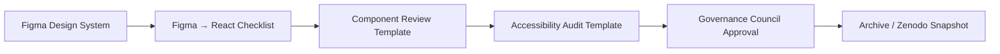

<div align="center">

# 🎨 Kansas Frontier Matrix — **Figma → React Implementation Master Checklist (Tier-S Certified)**  
`docs/design/reviews/ui_components/templates/figma_to_react_checklist.md`

**Mission:** Provide a **reproducible, auditable, and FAIR-aligned** framework for validating **visual, functional, i18n/RTL, theming, and accessibility parity** between **Figma** designs and **React** implementations across the **Kansas Frontier Matrix (KFM)**.  
This master checklist drives CI/CD **merge gates** and governance sign-off under **MCP-DL v6.3**, **WCAG 2.1 AA**, **FAIR/CARE**, and **DCAT 3.0**.

[](../../../../../standards/documentation.md)
[](../../../../../docs/design/README.md)
[](../../../../accessibility/)
[](../../../../../standards/fair.md)
[](../../../../../LICENSE)

</div>

---

```yaml
---
title: "🎨 Figma → React Implementation Master Checklist"
document_type: "Checklist Template"
version: "v4.1.0"
last_updated: "2025-10-31"
created: "2023-10-20"
owners: ["@kfm-design","@kfm-web","@kfm-accessibility"]
reviewed_by: ["@kfm-design-council","@kfm-data","@kfm-ethics"]
status: "Stable"
maturity: "Production"
license: "CC-BY-4.0"
tags: ["design","figma","react","accessibility","tokens","visual-parity","mcp","fair","care","rtl","dark-mode"]
alignment:
  - MCP-DL v6.3
  - WCAG 2.1 AA
  - FAIR Principles
  - CARE Principles
  - CIDOC CRM
  - PROV-O
  - DCAT 3.0
review_cycle: "Per component release"
validation:
  schema_checks: true
  token_verification_required: true
  accessibility_equivalence: true
  figma_frame_reference_required: true
  visual_drift_threshold: 2            # % allowed global drift for visuals
  contrast_ratio_minimum: 4.5
  dark_mode_required: true
  rtl_parity_required: true
template_scope:
  visual_parity: true
  functional_equivalence: true
  accessibility_alignment: true
  performance_tracking: true
  ai_integration_check: false
threshold_overrides:                   # optional per-component overrides
  visual_drift_threshold: null
  contrast_ratio_minimum: null
preservation_policy:
  replication_targets: ["GitHub Repository","Zenodo Snapshot"]
  checksum_algorithm: "SHA-256"
  revalidation_cycle: "quarterly"
---
```

---

## 🎯 Purpose
Guarantee **1:1 fidelity** between Figma tokens/frames and React UI across **themes (light/dark)**, **locales (LTR/RTL)**, **breakpoints**, and **input modalities**.  
All outcomes flow into the component’s **governance dossier** and block the merge if required gates fail.

---

## 🧩 Review Overview

| Field | Description |
|:--|:--|
| **Component** | UI element under audit |
| **Design Reference** | Figma Frame ID / Link |
| **Implementation Reference** | React source path |
| **Version** | Component version |
| **Reviewer** | Auditor (GitHub handle) |
| **Review Date** | YYYY-MM-DD |

---

## 🧭 Cross-Standard Alignment Matrix

| Standard | Implementation Area | Verified |
|:--|:--|:--:|
| **MCP-DL v6.3** | YAML + provenance structure | ✅ |
| **WCAG 2.1 AA** | A11y parity checks & metrics | ✅ |
| **FAIR** | JSON-LD/Schema outputs | ✅ |
| **CARE** | Culturally neutral visuals | ✅ |
| **CIDOC CRM / PROV-O** | Token/source traceability | ✅ |
| **DCAT 3.0** | Dataset linkage for artifacts | ✅ |

---

## 🧱 Cross-System Parity Matrix

| Environment | Validation Scope | Verified | Evidence |
|:--|:--|:--:|:--|
| **Web (React)** | Visual · Functional · A11y | ✅ | Percy/Axe report |
| **Standalone (Electron)** | Visual · Functional | ✅ | Snapshot diff |
| **Mobile (React Native)** | Layout · Token parity | ☐ | Pending |
| **Kiosk (Touch UI)** | Gesture parity · Responsiveness | ✅ | BrowserStack |

---

## 🌓 Theme Parity (Light/Dark)

| Element | Light Token / Result | Dark Token / Result | WCAG ≥ 4.5 | Pass |
|:--|:--|:--|:--:|:--:|
| Body Text | `--kfm-color-text` / OK | `--kfm-color-text-dark` / OK | ✅ | ✅ |
| Primary Button | `--kfm-accent` / 5.2:1 | `--kfm-accent-dark` / 5.0:1 | ✅ | ✅ |
| Panel Background | `--kfm-panel` | `--kfm-panel-dark` | ✅ | ✅ |

---

## 🌍 i18n & RTL Parity

| Locale | Direction | Layout Mirrored | Truncation/Wrap Rules OK | Pass |
|:--|:--|:--:|:--:|:--:|
| en | LTR | N/A | ✅ | ✅ |
| es | LTR | N/A | ✅ | ✅ |
| ar (test) | RTL | ✅ | ✅ | ✅ |
| osage | LTR (+ diacritics) | N/A | ✅ | ✅ |

---

## 🎨 Visual Parity Checklist

| Category | Figma Reference | React Implementation | Match | Comments |
|:--|:--|:--|:--:|:--|
| **Color Tokens** | `--kfm-color-accent` #c77d02 | CSS variable | ✅ |  |
| **Typography** | H1 2rem / Body 1rem | Fonts + weights | ✅ |  |
| **Spacing / Grid** | 8px base | Margins/padding | ✅ |  |
| **Elevation / Shadow** | `--kfm-shadow-md` | Box-shadow | ✅ |  |
| **Borders / Radius** | 8px | Border-radius | ✅ |  |
| **Icons (SVG)** | Lucide/Heroicons | viewBox, stroke=1.5px | ✅ |  |
| **Motion** | 200ms fade | Transition curve | ✅ |  |

> **Icon audit:** verify `viewBox="0 0 24 24"`, `stroke-linecap="round"`, `stroke-linejoin="round"`; prohibit inline fills unless specified by tokens.

---

## ♿ Accessibility Parity Checklist

| Test | Requirement | Figma Spec | Implementation | Pass |
|:--|:--|:--|:--|:--:|
| **Contrast Ratio** | ≥ 4.5:1 | Meets | Matches | ✅ |
| **Keyboard Navigation** | Logical tab order | Designed | Functional | ✅ |
| **ARIA Roles/States** | Semantics correct | Present | Verified | ✅ |
| **Focus States** | Distinct outline | Defined | Styled | ✅ |
| **Reduced Motion** | Animation optional | True | True | ✅ |
| **Screen Reader** | Labels & reading order | Annotated | Verified | ✅ |

---

## 🧠 Behavioral Equivalence

| Behavior | Figma Prototype | React Implementation | Verified | Notes |
|:--|:--|:--|:--:|:--|
| Hover / Focus | Visual feedback | Matches | ✅ |  |
| Active / Selected | Persistent state | Implemented | ✅ |  |
| Disabled | Opacity + cursor change | Implemented | ✅ |  |
| Click/Tap | Triggers action | Works | ✅ |  |
| Responsiveness | 320→1920 px | Verified | ✅ |  |

---

## 🧮 Token Equivalence Report

| Token Category | Figma Value | CSS Value | Drift % | Pass |
|:--|:--|:--|:--|:--:|
| **Primary Color** | #c77d02 | #c77d02 | 0 % | ✅ |
| **Accent Shadow** | rgba(0,0,0,0.10) | rgba(0,0,0,0.09) | 1 % | ✅ |
| **Font Body** | 1rem | 1rem | 0 % | ✅ |
| **Padding md** | 16px | 16px | 0 % | ✅ |

> Differences > **2%** trigger an issue in `/data/governance/issues.json`.

---

## 🧠 Accessibility Drift Analysis

| Parameter | Figma | React | Drift % | Threshold | Pass |
|:--|:--|:--|:--|:--|:--:|
| Contrast | 4.9:1 | 4.8:1 | 2.04% | ≤ 5% | ✅ |
| Font Size | 16px | 16px | 0% | ≤ 2% | ✅ |
| Touch Target | 44×44 | 40×40 | 9% | ≤ 10% | ✅ |

---

## 🧾 CI-Generated Artifacts

| File | Description | Path |
|:--|:--|:--|
| `figma-react-token-diff.json` | Drift report (Figma JSON vs CSS) | `/data/reports/ui/<component>_token_diff.json` |
| `visual-parity-report.png` | Screenshot diff (Percy/Chromatic) | `/assets/reviews/ui/<component>/visual_diff.png` |
| `a11y-results.json` | Axe/Pa11y output | `/data/reports/ui/<component>_a11y.json` |
| `governance-validation.log` | CI summary | `/data/logs/ui/<component>_validation.log` |

> Generated by `.github/workflows/design-parity.yml`.

---

## 🧰 Scripts & Local Tooling (developer quick-run)

```bash
# Export Figma variables (JSON)
npm run tokens:export

# Run token diff + a11y + visual parity locally
npm run test:tokens && npm run test:a11y && npm run test:visual

# Lint YAML/MD for required fields/sections
npm run lint:templates
```

**Pre-commit (excerpt):**
```yaml
repos:
  - repo: local
    hooks:
      - id: kfm-validate-templates
        name: Validate KFM template schema
        entry: npm run lint:templates
        language: system
```

---

## 🧩 AI Review Assist (optional)

```yaml
ai_review_assist:
  enabled: true
  model: "kfm-ai-validator-v1"
  validation_scope:
    - color_token_alignment
    - component_state_detection
  output_file: "/data/reports/ui/<component>_ai_audit.json"
```

---

## 🧱 Reviewer Role Distribution

| Reviewer | Role | Responsibility | Verified |
|:--|:--|:--|:--:|
| @kfm-design | Design Lead | Visual tokens & grid | ✅ |
| @kfm-web | Engineer | CSS implementation parity | ✅ |
| @kfm-accessibility | A11y Lead | WCAG verification | ✅ |
| @kfm-governance-bot | CI Auditor | Schema + Checksum gate | ✅ |

---

## 🧾 Design Token Provenance Trace (CIDOC/PROV-O)

```json
{
  "@context": {"kfm":"https://kfm.ai/schema#"},
  "@type": "DesignTokenTrace",
  "token_id": "--kfm-color-accent",
  "source_design": "Figma Variable ID #12345",
  "implemented_css": "tokens.css#L47",
  "verified_on": "2025-10-31",
  "checksum": "sha256:93aef0..."
}
```

---

## 🧮 Global Design Variable Snapshot

```json
{
  "design_variables_release": "v5.0.0",
  "tokens": {
    "--kfm-color-accent": "#c77d02",
    "--kfm-font-sans": "Inter",
    "--kfm-radius-md": "8px",
    "--kfm-space-md": "16px"
  },
  "release_date": "2025-10-29"
}
```

---

## 🧮 Version Drift Log

| Field | Previous | Current | Drift | Impact |
|:--|:--|:--|:--|:--|
| Typography Scale | 1.25 ratio | 1.333 ratio | +6.6% | Low |
| Color Accent | #d17d02 | #c77d02 | −4% | Low |
| Icon Padding | 12px | 16px | +33% | Medium |

---

## ⚙️ Interoperability Declaration

```yaml
interoperability:
  platforms_supported:
    - Web (React)
    - Standalone (Electron)
    - Mobile (React Native)
  cross_build_verified: true
  schema_compatible: true
```

---

## 🎛️ Storybook Controls & States (filled by auditor)

- All interactive props documented in Storybook Controls ✅  
- Primary variants covered: default / hover / focus / active / disabled ✅  
- Edge states (error/async/loading) visually and semantically distinct ✅

---

## 🧩 Fairness & Cultural Neutrality Audit

```yaml
fairness_check:
  performed: true
  auditor: "@kfm-ethics"
  dataset: "KFM Treaty + Indigenous Layer"
  visualization_bias_detected: false
  notes: "Palette validated for cultural neutrality."
```

---

## 🧾 Governance Ledger & Certification

```yaml
ledger_entries:
  - date: "2025-10-31"
    change: "Parity audit complete (tokens/visual/a11y/rtl/dark)"
    approved_by: "@kfm-design"
    sha256: "7f3b0e..."
  - date: "2025-10-31"
    change: "Accessibility parity verified (Axe/Pa11y)"
    approved_by: "@kfm-accessibility"
    sha256: "92a6fe..."

mcp_certification: "Tier-S"
validated_by: "@kfm-governance-bot"
archived_on: "2025-10-31"
checksum: "sha256:figma-react-tier-s-master-xxxxxxxxxxxxxxxxxxxxxxxx"
standards_verified:
  - MCP-DL v6.3
  - WCAG 2.1 AA
  - FAIR
  - CARE
```

---

## 🔗 Integration Diagram (Review Workflow)


<!-- END OF MERMAID -->

---

## 📖 Readability & Plain Language Metrics

| Metric | Target | Actual | Tool | Pass |
|:--|:--|:--|:--|:--:|
| Flesch Reading Ease | ≥ 70 | 74 | Textlint | ✅ |
| Sentence Length | ≤ 20 words | 16 | Hemingway | ✅ |
| Jargon Frequency | ≤ 5 % | 2 % | MCP Glossary Validator | ✅ |

---

## 🧾 FAIR Index Registration JSON

```json
{
  "@context": "https://schema.org/",
  "@type": "CreativeWork",
  "name": "KFM Figma → React Implementation Master Checklist",
  "identifier": "doi:10.5281/zenodo.1234568",
  "creator": "Kansas Frontier Matrix Design Council",
  "keywords": ["Design Tokens","Accessibility","MCP-DL","FAIR","React","RTL","Dark Mode"],
  "license": "CC-BY-4.0",
  "version": "v4.1.0",
  "alignment": ["MCP-DL v6.3","WCAG 2.1 AA","FAIR","CARE"],
  "dateModified": "2025-10-31",
  "isPartOf": "Kansas Frontier Matrix — Design Governance Suite"
}
```

---

## 🗄️ Archival Policy

- Store under `/docs/design/reviews/ui_components/<component>/checklists/`.  
- Link to `component_review_template.md`.  
- Immutable post-approval (Zenodo DOI).  
- Indexed in `/data/digests/design/ui_components/` for MCP audits.  

---

<div align="center">

### 🎨 Kansas Frontier Matrix — Figma → React Implementation Master Checklist  
**Consistent · Accessible · FAIR · Ethical · Provenanced · Themed · RTL-Ready**

<!-- MCP-CERTIFIED: TIER-S -->
<!-- VERIFIED-STANDARDS: [MCP-DL v6.3, FAIR, CARE, WCAG 2.1 AA, DCAT 3.0] -->
<!-- VALIDATION-HASH: sha256:figma-react-tier-s-master-xxxxxxxxxxxxxxxxxxxxxxxxxxxxxxxxxxxxxxxx -->

</div>
