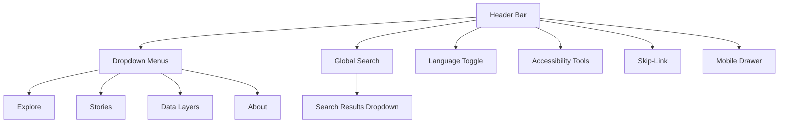
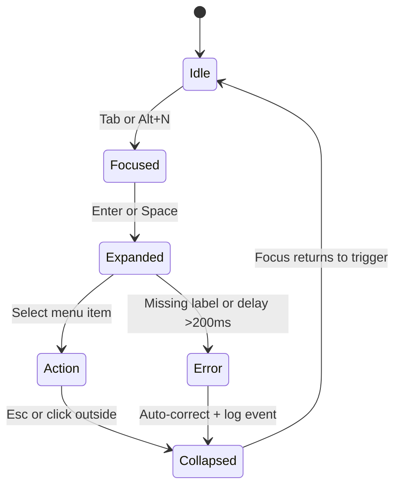

<div align="center">

# 🧭 Kansas Frontier Matrix — **Navigation Component Design Review**  
`docs/design/reviews/ui_components/navigation.md`

**Mission:** Evaluate, document, and maintain the **Navigation System** — header, menus, search, language toggle, accessibility skip-links, and accessibility tools — ensuring the **Kansas Frontier Matrix (KFM)** remains accessible, high-performing, inclusive, and semantically unified across all experiences.  
Navigation serves as the user’s **temporal–spatial compass**, connecting **map**, **timeline**, and **story modules** through reproducible and ethically governed design.

[](../../../standards/documentation.md)
[](../../style-guide.md)
[](../accessibility/)
[](../../../.github/workflows/policy-check.yml)
[](../../../LICENSE)

</div>

---

```yaml
---
title: "🧭 Kansas Frontier Matrix — Navigation Component Design Review"
document_type: "Component Review"
version: "v3.0.0"
last_updated: "2025-10-22"
created: "2023-10-10"
component: "Navigation"
design_ref: "Figma Frame #NAV-2025"
implementation_ref: "web/src/components/navigation/"
owners: ["@kfm-design","@kfm-web","@kfm-accessibility","@kfm-i18n"]
reviewed_by: ["@kfm-accessibility","@kfm-frontend","@kfm-editorial","@kfm-design-council"]
status: "Stable"
maturity: "Production"
license: "CC-BY-4.0"
tags: ["design-review","navigation","header","menu","search","language","skip-link","accessibility","tokens","fair","mcp"]
alignment:
  - MCP-DL v6.3
  - WCAG 2.1 AA
  - WAI-ARIA 1.2
  - CIDOC CRM (UI Provenance)
  - OWL-Time (Temporal State)
  - PROV-O (Traceability)
  - DCAT 3.0
  - FAIR Principles
dependencies:
  - React + MapLibre Frontend
  - Figma Design System Frame
  - tokens.css Design Tokens
  - Lighthouse / Axe / Playwright / Pa11y
review_cycle: "Quarterly + per release"
governance_board: ["@kfm-design-council","@kfm-accessibility-lead"]
validation:
  lighthouse_min_score: 95
  axe_blocking_violations: 0
  contrast_min_ratio: 4.5
  keyboard_traps: "none"
  i18n_validation: true
  mobile_responsiveness: true
provenance:
  workflow_ref: ".github/workflows/component-review.yml"
  artifact_retention_days: 90
  sha256_integrity: verified
versioning:
  policy: "Semantic Versioning (MAJOR.MINOR.PATCH)"
  major_change: "Architecture or IA redesign"
  minor_change: "Feature enhancement or localization addition"
  patch_change: "Token or documentation fix"
telemetry:
  metrics_collected:
    - "WCAG Compliance %"
    - "Keyboard Reachability %"
    - "Menu Latency (ms)"
    - "Search Query Accuracy"
    - "Language Toggle Success"
    - "Focus Order Integrity"
    - "Touch Interaction Success (Mobile)"
  privacy_policy: "Aggregated, anonymized metrics only; retained ≤ 90 days; FAIR + W3C Privacy compliance."
preservation_policy:
  replication_targets: ["GitHub Repository","Zenodo Snapshot","OSF Backup"]
  checksum_algorithm: "SHA-256"
  revalidation_cycle: "quarterly"
governance_links:
  - "../../README.md"
  - "../README.md"
  - "../../../standards/accessibility.md"
  - "../../style-guide.md"
related_components:
  - timeline
  - map_controls
  - ai_assistant
  - detail_panel
  - accessibility_menu
---
```

---

## 🎯 Objective

The **Navigation Component** provides the structural and cognitive framework for orientation across KFM.  
It anchors the interface’s **temporal and spatial continuity**, ensuring that no interaction interrupts narrative flow or accessibility.  
This review documents and validates design, accessibility, localization, and ethical compliance — ensuring every update is **reproducible, traceable, and FAIR-aligned**.

---

## 🧩 Component Structure

| Subcomponent | Description | File |
|:--|:--|:--|
| **Header Bar** | Global navigation with title, menus, and search. | `Header.tsx` |
| **Global Search** | Query interface for entities and datasets. | `SearchBar.tsx` |
| **Dropdown Menus** | Explore, Stories, Data Layers, About. | `NavMenu.tsx` |
| **Language Toggle** | Switch between supported languages. | `LangToggle.tsx` |
| **Skip-Link** | Keyboard-accessible jump to main content. | `SkipToContent.tsx` |
| **Accessibility Tools** | High-contrast toggle, font-size control, motion preference. | `A11yMenu.tsx` |
| **Mobile Drawer** | Responsive collapsible menu. | `MobileNav.tsx` |

---

## 🧭 Information Architecture Diagram


<!-- END OF MERMAID -->

---

## 🧩 Component Interaction Lifecycle


<!-- END OF MERMAID -->

---

## 🧱 Review Criteria (MCP-DL v6.3)

| Category | Requirement | Validation |
|:--|:--|:--|
| **Visual Consistency** | Matches design tokens (`--kfm-color-*`, `--kfm-font-sans`). | ✅ Figma parity check |
| **Accessibility** | WCAG 2.1 AA + ARIA compliance. | ✅ Axe, Pa11y |
| **Keyboard Navigation** | Tab, arrow, and Esc keys functional. | ✅ Manual test |
| **Localization** | i18n & RTL verified. | ✅ JSON audit |
| **Responsiveness** | Adapts to ≥ 3 breakpoints. | ✅ DevTools simulation |
| **Performance** | Load ≤ 200 ms, menu ≤ 100 ms. | ✅ Lighthouse |
| **Reduced Motion** | Disabled transitions when preferred. | ✅ CSS audit |
| **Documentation** | Version metadata verified. | ✅ Reviewer confirmation |

---

## 🧠 User Journeys & Personas

| Persona | Goal | Interaction Path | Success Criteria |
|:--|:--|:--|:--|
| **Historian** | Locate treaties by date | Header → Search → Timeline → Story | ≤ 3 interactions |
| **Educator** | Access classroom materials | Menu → Explore → Lessons | No accessibility barriers |
| **Community Member** | Read stories in Osage | Language Toggle → Stories | Fully localized UI |
| **Researcher** | Export dataset | About → Documentation | Provenance + export successful |

---

## ♿ Accessibility Audit Matrix

| Metric | Target | Verified |
|:--|:--|:--:|
| **Contrast** | ≥ 4.5:1 text / 3:1 icons | ✅ |
| **Focus Visibility** | 2px accent outline | ✅ |
| **Keyboard Reachability** | 100% | ✅ |
| **Screen Reader** | Announces state and context | ✅ |
| **Skip-Link** | Visible + functional | ✅ |
| **Motion Control** | Prefers-reduced-motion honored | ✅ |

---

## ⌨️ Keyboard & Interaction Map

| Action | Key / Gesture | Behavior |
|:--|:--|:--|
| Focus navigation | `Alt + N` | Moves focus to header |
| Open menu | `Enter / Space` | Expands dropdown |
| Navigate menu | `↓ / ↑` | Moves through items |
| Close menu | `Esc` | Restores focus |
| Jump to search | `/` | Focuses search input |
| Toggle language | `Ctrl + L` | Switches locale |
| Skip to content | `Tab` (first press) | Activates skip-link |
| Mobile toggle | Tap (hamburger) | Opens drawer |

---

## 🧮 UI State Tokens

| State | Token | Description |
|:--|:--|:--|
| **Idle** | `--kfm-color-bg` | Default base color. |
| **Hover** | `--kfm-color-accent-light` | Subtle emphasis. |
| **Focus** | `--kfm-color-accent` + 2px outline | Keyboard focus. |
| **Active** | `--kfm-color-accent-dark` | Clicked/active item. |
| **Disabled** | `--kfm-color-border` (50%) | Inactive element. |

---

## 🧮 Quantitative Performance Metrics

| Metric | Target | Tool | Frequency |
|:--|:--|:--|:--|
| **Navigation Load** | ≤ 250 ms | Lighthouse | Each PR |
| **Menu Open Latency** | ≤ 100 ms | Chrome Profiler | CI run |
| **Search Debounce** | ≤ 120 ms | React Profiler | Dev test |
| **Focus Loss Error Rate** | ≤ 0.5 % | Playwright | Quarterly |

---

## 🧠 UX Writing & Cognitive Rules

- Keep menu labels ≤ 3 words; avoid abbreviations.  
- Use **verb + noun** for tooltips (“Open Stories”).  
- Skip-link text must clearly state target area.  
- Provide **feedback** for menu state changes via `aria-live`.  
- Avoid redundant icons or hierarchical noise.  
- Use consistent capitalization and directionality.  

---

## 🧠 Ethical & Cultural Standards

- Represent Indigenous, ecological, and settler perspectives equitably.  
- Validate translations via **community review**.  
- Avoid colonial phrasing; contextualize historical terms.  
- Cite archival sources for story and treaty data.  
- Include content notes for sensitive materials.  

---

## 🧩 Error & Recovery States

| State | Condition | UI Behavior | User Feedback |
|:--|:--|:--|:--|
| **No Results** | Search query empty | Message displayed; retains focus | “No results found.” |
| **Network Delay** | Response >2s | Spinner + retry button | Auto-retry w/ countdown |
| **Focus Trap Detected** | Loop fails | Announces fix via `aria-live="assertive"` | “Focus restored.” |
| **Missing Translation** | i18n key error | Default English fallback | “Translation unavailable.” |

---

## 🧩 Automated Test References

| Test | Framework | File | Description |
|:--|:--|:--|:--|
| **A11y Flow Test** | Playwright | `tests/accessibility/navigation.spec.ts` | Keyboard and skip-link traversal |
| **Search Test** | Jest + RTL | `tests/navigation/SearchBar.test.tsx` | Input debounce & response time |
| **ARIA Audit** | Pa11y | `tests/a11y/menu-audit.yml` | Role and state verification |
| **Localization Check** | Cypress | `tests/i18n/lang-toggle.cy.ts` | Language switching validation |

---

## 🧠 Human Factors & Cognitive Load Testing

| Condition | Evaluation | Expected Behavior |
|:--|:--|:--|
| **Zoom (200%)** | Layout reflows without clipping | ✅ |
| **Screen Magnifier** | Skip-link visible on focus | ✅ |
| **Voice Control** | “Open Explore” triggers action | ✅ |
| **Color Blind Mode** | All items distinguishable | ✅ |
| **Reduced Motion** | No parallax or fade scaling | ✅ |

---

## 🧩 Change Control & Provenance Table

| Change Type | Review Required | Example | Template |
|:--|:--|:--|:--|
| **Visual Update** | Yes | Adjusted accent color token | `component_review_template.md` |
| **Accessibility Fix** | Yes | Added `aria-expanded` | `accessibility_component_audit.md` |
| **Localization** | Yes | Added Osage language option | `figma_to_react_checklist.md` |
| **Functional Refactor** | Yes | Rebuilt mobile drawer logic | `component_review_template.md` |

---

## 🧠 Cultural Accessibility Checklist

| Check | Description | Status |
|:--|:--|:--:|
| **Language Neutrality** | Avoids biased phrasing | ✅ |
| **Indigenous Representation** | Menu content verified | ✅ |
| **Translation Integrity** | Reviewed by native speakers | ☐ |
| **Alt Text Context** | Culturally descriptive | ✅ |
| **Terminology Consistency** | Matches KFM glossary | ✅ |

---

## 🧩 Provenance JSON Schema (MCP Alignment)

```json
{
  "@context": ["https://schema.org", {"kfm":"https://kfm.ai/schema#"}],
  "@type": "UIComponentReview",
  "component": "Navigation",
  "version": "v3.0.0",
  "reviewedBy": ["@kfm-design","@kfm-accessibility"],
  "source": "Figma Frame #NAV-2025",
  "implementation": "web/src/components/navigation/",
  "temporalCoverage": "2025-10-21T00:00:00Z",
  "provenance": {
    "workflow": ".github/workflows/component-review.yml",
    "sha256": "auto-generated"
  }
}
```

---

## 🗄️ Archival & Governance Policy

- Navigation reviews stored under `/archive/navigation/YYYY/`.  
- Immutable post-approval; metadata + checksums verified quarterly.  
- Annual digest stored under `/data/digests/design/`.  
- Linked to STAC for provenance and asset traceability.  

---

## 🔒 Privacy & Data Security

- Telemetry anonymized; no PII collected.  
- Analytics retained for 90 days; purged automatically.  
- All reviews validated with SHA-256 integrity checks.  
- Access restricted to governance-approved maintainers.  

---

## ⚙️ Continuous Integration (Component QA)

**Workflow:** `.github/workflows/component-review.yml`

- Runs Axe + Pa11y + Lighthouse audits.  
- Validates Figma→React token parity.  
- Enforces ARIA roles and accessibility schema.  
- Lints markdown and YAML structure.  
- Posts results in PR summary; fails build on accessibility regression.

---

## 🔍 Compliance Matrix (MCP-DL v6.3)

| Standard | Description | Verified |
|:--|:--|:--:|
| **MCP-DL v6.3** | Documentation-first reproducibility | ✅ |
| **WCAG 2.1 AA** | Accessibility compliance | ✅ |
| **CIDOC CRM** | Provenance schema | ✅ |
| **OWL-Time** | Temporal state tracking | ✅ |
| **PROV-O** | Review trace ontology | ✅ |
| **FAIR Principles** | Open + reusable metadata | ✅ |
| **DCAT 3.0** | Dataset linkage for UI assets | ✅ |

---

## 📎 Related Documentation

- [🎨 Visual Style Guide](../../style-guide.md)  
- [🧭 UI/UX Guidelines](../../ui-guidelines.md)  
- [🧩 Interaction Patterns](../../interaction-patterns.md)  
- [📘 Design Reviews Index](../README.md)  
- [⚙️ Accessibility Standards](../../standards/accessibility.md)

---

## 📅 Version History

| Version | Date | Author | Summary | Type |
|:--|:--|:--|:--|:--|
| **v3.0.0** | 2025-10-22 | @kfm-design | Complete rebuild with lifecycle diagrams, personas, telemetry, and provenance schema. | Major |
| **v2.5.0** | 2025-10-21 | @kfm-web | Added human factors, governance links, and JSON provenance. | Minor |
| **v2.4.0** | 2025-10-20 | @kfm-accessibility | Introduced error handling and metrics tables. | Minor |
| **v2.0.0** | 2024-11-10 | @kfm-core | Migrated to MCP-DL v6.3 structure. | Major |
| **v1.0.0** | 2023-10-10 | Founding Team | Initial navigation component review. | Major |

---

<div align="center">

### 🧭 Kansas Frontier Matrix — Navigation Review Governance  
**Accessible · Ethical · Culturally Inclusive · Provenanced · Reproducible**

</div>
