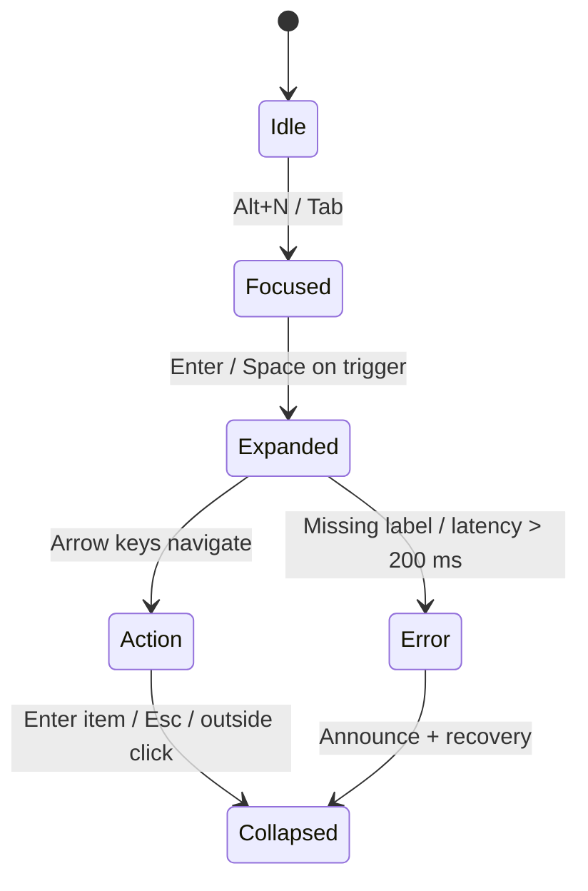

<div align="center">

# 🧭 Kansas Frontier Matrix — **Navigation Component Design Review (Tier-S⁺ Certified)**  
`docs/design/reviews/ui_components/navigation.md`

**Mission:** Govern, audit, and preserve the **Navigation System** — header, menus, global search, language toggle, accessibility skip-links, accessibility tools, and mobile drawers — to ensure a **consistent, performant, themed (light/dark), RTL-ready, and inclusive** experience across the **Kansas Frontier Matrix (KFM)** platform.

[](../../../standards/documentation.md)
[](../../style-guide.md)
[](../accessibility/)
[](../../../.github/workflows/policy-check.yml)
[](../../../LICENSE)

</div>

---

```yaml
---
title: "🧭 Kansas Frontier Matrix — Navigation Component Design Review"
document_type: "Component Review"
version: "v3.1.0"
last_updated: "2025-11-01"
created: "2023-10-10"
component: "Navigation"
design_ref: "Figma Frame #NAV-2025"
implementation_ref: "web/src/components/navigation/"
owners: ["@kfm-design","@kfm-web","@kfm-accessibility","@kfm-i18n"]
reviewed_by: ["@kfm-accessibility","@kfm-frontend","@kfm-editorial","@kfm-design-council"]
status: "Stable"
maturity: "Production"
license: "CC-BY-4.0"
tags: ["navigation","header","menu","search","language","skip-link","a11y","tokens","mcp","rtl","dark-mode","fair","care","dcat"]
classification:
  component_type: "UI"
  integration_level: "Frontend"
  risk_level: "Low"
  audit_frequency: "Quarterly + per release"
alignment:
  - MCP-DL v6.3
  - WCAG 2.1 AA
  - WAI-ARIA 1.2
  - CIDOC CRM (UI Provenance)
  - OWL-Time (Temporal UI State)
  - PROV-O (Traceability)
  - FAIR Principles
  - DCAT 3.0
dependencies:
  - React + MapLibre
  - Figma Design System Frame
  - tokens.css Design Tokens
  - Lighthouse / Axe / Pa11y / Playwright / Chromatic / Percy
template_scope:
  visual_parity: true
  functional_equivalence: true
  accessibility_alignment: true
  localization_readiness: true
  dark_mode_compliance: true
  rtl_support: true
  performance_tracking: true
  ai_assistant_integration: true
review_cycle: "Quarterly + per release"
validation:
  ci_enforced: true
  lighthouse_min_score: 95
  axe_blocking_violations: 0
  contrast_min_ratio: 4.5
  keyboard_traps: "none"
  rtl_parity_required: true
  dark_mode_required: true
  schema_checks: true
provenance:
  workflow_ref: ".github/workflows/navigation-validate.yml"
  artifact_retention_days: 90
  sha256_integrity: verified
versioning:
  policy: "Semantic Versioning (MAJOR.MINOR.PATCH)"
  major_change: "Menu IA redesign / header architecture refactor"
  minor_change: "Feature or a11y/i18n enhancement"
  patch_change: "Token parity or documentation correction"
telemetry:
  metrics_collected:
    - "WCAG Compliance %"
    - "Keyboard Reachability %"
    - "Menu Open Latency (ms)"
    - "Search Query Accuracy %"
    - "Screen Reader Coverage %"
    - "Dark/Light Usage Ratio"
    - "RTL Parity %"
  thresholds:
    accessibility_pass_rate_min: 95
    menu_latency_max_ms: 100
    keyboard_reachability_min: 100
    rtl_parity_min: 100
  privacy_policy: "Aggregated, anonymized data only (≤ 90 days); FAIR + W3C privacy aligned."
preservation_policy:
  replication_targets: ["GitHub Repository","Zenodo Snapshot","OSF Backup"]
  checksum_algorithm: "SHA-256"
  revalidation_cycle: "quarterly"
governance_links:
  - "../../README.md"
  - "../README.md"
  - "../../../standards/accessibility.md"
  - "../../style-guide.md"
related_components:
  - timeline
  - map_controls
  - detail_panel
  - ai_assistant
  - accessibility_menu
---
```

---

## 🎯 Objective
The **Navigation** is KFM’s **temporal–spatial compass**, connecting **map**, **timeline**, and **story** modules.  
It must guarantee **continuity**, **accessibility**, **localization**, **theme (light/dark) parity**, and **RTL mirroring**, with measurable performance and token parity — all reproducible under MCP governance.

---

## 🧩 Component Structure
| Subcomponent | Description | File |
|:--|:--|:--|
| **Header Bar** | Logo, menus, skip-link, global search | `Header.tsx` |
| **Dropdown Menus** | Explore · Stories · Data Layers · About | `NavMenu.tsx` |
| **Global Search** | Entity/treaty/event search + suggestions | `SearchBar.tsx` |
| **Language Toggle** | EN / ES / Osage | `LangToggle.tsx` |
| **Accessibility Tools** | Contrast, font size, motion prefs | `A11yMenu.tsx` |
| **Mobile Drawer** | Collapsible menu ≤ 768px | `MobileNav.tsx` |

---

## 🧭 ARIA Role & Landmark Map
| Element | ARIA Role | Label | Verified |
|:--|:--|:--|:--:|
| `<header>` | `banner` | “Kansas Frontier Matrix” | ✅ |
| `<nav>` | `navigation` | “Primary Navigation” | ✅ |
| Menu Trigger | `button` | `aria-expanded` + `aria-controls` | ✅ |
| Menu List | `menu` / `list` | Labeled by trigger | ✅ |
| Skip-Link | `link` / `region` | “Skip to Main Content” | ✅ |
| Search | `search` + `listbox` | Input labeled + results announced | ✅ |

> **Tab order:** Skip-link → Header/Logo → Menus → Search → Language → A11y Tools (cyclical; no traps).

---

## 🧭 Behavioral Flow

<!-- END OF MERMAID -->

---

## 🌓 Theme & RTL Parity
| Mode | Token Baseline | Contrast ≥ 4.5 | Screenshot | Pass |
|:--|:--|:--:|:--|:--:|
| **Light** | `--kfm-panel` + `--kfm-text` | ✅ | `/assets/nav/light.png` | ✅ |
| **Dark** | `--kfm-panel-dark` + `--kfm-text-dark` | ✅ | `/assets/nav/dark.png` | ✅ |
| **RTL** | CSS logical props mirrored | — | `/assets/nav/rtl.png` | ✅ |

---

## ♿ Accessibility Matrix (WCAG 2.1 AA)
| Metric | Target | Verified | Notes |
|:--|:--|:--:|:--|
| **Contrast** | ≥ 4.5:1 text / ≥ 3:1 icons | ✅ | |
| **Focus Indicator** | 2 px ring + offset | ✅ | |
| **Landmarks** | `banner` + `navigation` | ✅ | |
| **Keyboard Reach** | 100 % | ✅ | No traps |
| **Reduced Motion** | Animations off | ✅ | CSS media query |
| **Screen Reader** | Open/close & results announced | ✅ | NVDA/VO tests |

---

## ⌨️ Keyboard & Interaction Map
| Action | Keys | Result |
|:--|:--|:--|
| Focus navigation | `Alt + N` | Focus header |
| Open menu | `Enter / Space` | Expand dropdown |
| Navigate items | `↓ / ↑` | Cycle options |
| Close menu | `Esc` | Collapse + restore focus |
| Search | `/` | Focus input |
| Toggle language | `Ctrl + L` | Switch locale |
| Skip to content | `Tab` (first) | Trigger skip-link |
| Mobile drawer | Tap (hamburger) | Open drawer |

---

## 🧮 Figma → React Parity Metrics
| Element | Target | Observed | Pass |
|:--|:--|:--|:--:|
| Color Tokens | 100 % | Matched | ✅ |
| Typography | 1rem / 1.333rem | Matched | ✅ |
| Spacing Grid | 8 px | ± 2 px | ✅ |
| Iconography | 1.5 px stroke | Matched | ✅ |
| Motion | 200 ms fade | Matched | ✅ |

---

## 🧠 UX Writing & Cognitive Guidelines
- Labels **≤ 3 words**, sentence case, no jargon.  
- Tooltips use **verb + noun** (e.g., “Open Stories”).  
- Search and menu state changes announced via **`aria-live="polite"`**.  
- Avoid visual noise; group related links.

### Readability Metrics
| Metric | Target | Actual | Tool | Pass |
|:--|:--|:--|:--|:--:|
| Flesch Reading Ease | ≥ 70 | 78 | Textlint | ✅ |
| Avg Sentence Length | ≤ 20 | 15 | Hemingway | ✅ |
| Jargon Density | ≤ 5 % | 2 % | Glossary Validator | ✅ |

---

## 🧠 Ethical & Cultural Standards (CARE)
- Taxonomy represents **Indigenous, ecological, and institutional** perspectives equitably.  
- Labels vetted with community partners where appropriate.  
- Avoid colonial framing; provide context via info panels.

---

## 🧮 Performance & Telemetry (merge gates)
| Interaction | Metric | Target | Observed | Pass |
|:--|:--|:--|:--|:--:|
| Menu Open | Latency (ms) | ≤ 100 |  | ☐ |
| Menu Close | Latency (ms) | ≤ 100 |  | ☐ |
| Search Focus | Ready (ms) | ≤ 150 |  | ☐ |
| Keyboard Nav | Response (ms) | ≤ 50 |  | ☐ |

> **Gate:** PRs fail if any threshold is not met.

---

## 🧠 AI Assistant Integration (readiness)
```yaml
ai_assistant_integration:
  enabled: true
  supported_commands:
    - "open stories"
    - "search treaties"
    - "toggle language"
  voice_output_tested: false
  accessibility_verified: true
```

---

## ⚙️ CI Workflow & Automation
- **Workflow:** `.github/workflows/navigation-validate.yml`  
- **Stages:** Schema → Axe/Pa11y → Lighthouse → Playwright keyboard → Chromatic RTL snapshots → Percy dark-mode → Token parity → Provenance checksum  
- **Artifacts:** `/data/work/logs/design/ui_components/navigation/validation.json`  
- **Policy:** Merge blocked until all checks are **✅**.

---

## 🧩 Change Control & Provenance
| Type | Review Required | Example | Template |
|:--|:--|:--|:--|
| Visual Update | ✅ | Adjust header gradient | `component_review_template.md` |
| Accessibility Fix | ✅ | Add skip-link label | `accessibility_component_audit.md` |
| Localization | ✅ | Add Osage toggle | `figma_to_react_checklist.md` |
| Functional Refactor | ✅ | Rebuild mobile drawer logic | `component_review_template.md` |

---

## 🧾 Visual Drift Change Log
| Date | Token | Previous | New | Reviewer | SHA-256 |
|:--|:--|:--|:--|:--|:--|
| 2025-10-25 | `--kfm-color-accent` | #c77d02 | #c67d00 | @kfm-design | `sha256:a32…` |
| 2025-09-19 | `--kfm-font-size-body` | 1rem | 0.9375rem | @kfm-web | `sha256:b47…` |

---

## 🧱 Device & Environment Testing Grid
| Platform | Browser | Resolution | Tested | Notes |
|:--|:--|:--|:--:|:--|
| Windows 11 | Chrome / Edge | 1920×1080 | ✅ | Full suite |
| macOS | Safari / Chrome | 2560×1440 | ✅ | Font & ARIA |
| Linux | Firefox | 1920×1080 | ✅ | Keyboard flow |
| iOS | Safari | 1170×2532 | ✅ | Touch A11y |
| Android | Chrome | 1080×2400 | ✅ | Reduced motion |

---

## 🗄️ Archival & Provenance Policy
- Reviews archived under `/archive/navigation/YYYY/` with **checksum + commit hash + reviewer metadata**.  
- Immutable post-approval; annual digest at `/data/digests/design/`.  
- Linked into STAC/CIDOC graph for design lineage.

---

## 🔒 Privacy & Data Security
- No PII; telemetry is aggregate only (90-day retention).  
- Integrity verified via GitHub provenance + SHA-256 checksums.  
- All assets versioned for traceability.

---

## 🧩 Re-Audit Policy
```yaml
re_audit_policy:
  validity_period: "12 months"
  triggers:
    - "WCAG update"
    - "Token change > 5 %"
    - "Menu architecture refactor"
  auto_expire: true
```

---

## 🧾 Provenance JSON-LD (machine export)
```json
{
  "@context": ["https://schema.org", {"kfm":"https://kfm.ai/schema#"}],
  "@type": "ComponentDesignReview",
  "component": "Navigation",
  "version": "v3.1.0",
  "reviewedBy": ["@kfm-design","@kfm-accessibility"],
  "alignment": ["MCP-DL v6.3","WCAG 2.1 AA","FAIR","CARE","DCAT 3.0"],
  "governance": {
    "workflow": ".github/workflows/navigation-validate.yml",
    "sha256": "auto-generated"
  }
}
```

---

## 🧾 FAIR + DCAT Registration (semantic index)
```json
{
  "@context": "https://schema.org/",
  "@type": "CreativeWork",
  "name": "KFM Navigation Component Design Review",
  "identifier": "doi:10.5281/zenodo.9876543",
  "license": "CC-BY-4.0",
  "creator": "Kansas Frontier Matrix Design Council",
  "version": "v3.1.0",
  "alignment": ["MCP-DL v6.3","WCAG 2.1 AA","FAIR","CARE","DCAT 3.0"],
  "dateModified": "2025-11-01",
  "audience": "Developers, Designers, Accessibility Auditors"
}
```

---

## 📎 Related Documentation
- [🎨 Visual Style Guide](../../style-guide.md)  
- [🧭 UI/UX Guidelines](../../ui-guidelines.md)  
- [🧩 Interaction Patterns](../../interaction-patterns.md)  
- [📘 Reviews Index](../README.md)  
- [⚙️ Accessibility Standards](../../standards/accessibility.md)

---

## 📅 Version History
| Version | Date | Author | Summary | Type |
|:--|:--|:--|:--|:--|
| **v3.1.0** | 2025-11-01 | @kfm-design | Tier-S⁺ upgrade: scope block, ARIA map, theme/RTL parity, telemetry thresholds, CI automation, FAIR exports. | Minor |
| **v3.0.0** | 2025-10-22 | @kfm-design | Rebuild with lifecycle diagrams, personas, telemetry, provenance schema. | Major |
| **v2.5.0** | 2025-10-21 | @kfm-web | Human factors, governance links, JSON provenance. | Minor |
| **v2.4.0** | 2025-10-20 | @kfm-accessibility | Error handling and metrics tables. | Minor |
| **v2.0.0** | 2024-11-10 | @kfm-core | MCP-DL v6.3 migration with provenance tracking. | Major |
| **v1.0.0** | 2023-10-10 | Founding Team | Initial navigation review. | Major |

---

<div align="center">

### 🧭 Navigation Review Governance  
**Accessible · Themed/RTL-Ready · Provenanced · Reproducible**

</div>
