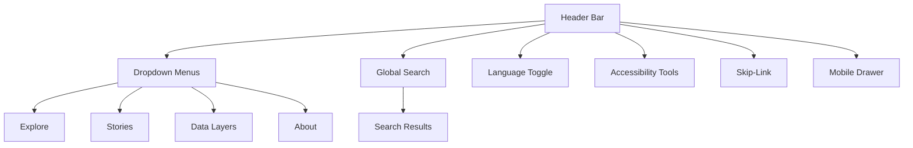

<div align="center">

# 🧭 Kansas Frontier Matrix — **Navigation Component Design Review**  
`docs/design/reviews/ui_components/navigation.md`

**Mission:** Evaluate, document, and maintain the **Navigation System** — header, menus, search, language toggle, and skip-links — ensuring that the **Kansas Frontier Matrix (KFM)** interface remains accessible, high-performing, and semantically unified across every device.  
Navigation in KFM is not just a UI pattern — it is a **temporal-spatial interface**, allowing users to traverse Kansas’s geography and history with reproducibility, accessibility, and contextual integrity.

[](../../../standards/documentation.md)
[](../../style-guide.md)
[](../accessibility/)
[](../../../.github/workflows/policy-check.yml)
[](../../../LICENSE)

</div>

---

```yaml
---
title: "🧭 Kansas Frontier Matrix — Navigation Component Design Review"
document_type: "Component Review"
version: "v2.5.0"
last_updated: "2025-10-21"
created: "2023-10-10"
component: "Navigation"
design_ref: "Figma Frame #NAV-2025"
implementation_ref: "web/src/components/navigation/"
owners: ["@kfm-design","@kfm-web","@kfm-accessibility"]
reviewed_by: ["@kfm-frontend","@kfm-accessibility","@kfm-editorial","@kfm-i18n"]
status: "Stable"
maturity: "Production"
license: "CC-BY-4.0"
tags: ["design-review","navigation","header","menu","search","language","skip-link","tokens","accessibility","ux","mcp","fair"]
alignment:
  - MCP-DL v6.3
  - WCAG 2.1 AA
  - WAI-ARIA 1.2
  - CIDOC CRM (UI Provenance)
  - OWL-Time (Temporal UI State)
  - PROV-O (Review Traceability)
  - FAIR Principles
  - DCAT 3.0 (UI dataset metadata)
dependencies:
  - React + MapLibre Frontend
  - Figma Design System Frame
  - tokens.css Design Tokens
  - Lighthouse / Axe / Playwright / Pa11y
  - GitHub Actions CI (component-review.yml)
review_cycle: "Quarterly + per release"
governance_board: ["@kfm-design-council","@kfm-accessibility-lead"]
validation:
  lighthouse_min_score: 95
  axe_blocking_violations: 0
  contrast_min_ratio: 4.5
  keyboard_traps: "none"
  schema_checks: true
  i18n_validation: true
  mobile_responsiveness: true
provenance:
  workflow_ref: ".github/workflows/component-review.yml"
  artifact_retention_days: 90
  sha256_integrity: verified
versioning:
  policy: "Semantic Versioning (MAJOR.MINOR.PATCH)"
  major_change: "Structural redesign (header/menu architecture)"
  minor_change: "Localization or accessibility feature added"
  patch_change: "Minor documentation or style correction"
telemetry:
  metrics_collected:
    - "WCAG Compliance %"
    - "Keyboard Reachability"
    - "Menu Open Latency (ms)"
    - "Search Query Accuracy"
    - "Language Toggle Success"
    - "Focus Order Integrity"
    - "Touch Interaction Success (mobile)"
  privacy_policy: "Aggregate anonymous data only; FAIR + W3C Privacy alignment; retained ≤ 90 days."
preservation_policy:
  replication_targets: ["GitHub Repository","Zenodo Snapshot","OSF Backup"]
  checksum_algorithm: "SHA-256"
  revalidation_cycle: "quarterly"
---
```

---

## 🎯 Objective

The **Navigation System** acts as the central cognitive and spatial interface for the Kansas Frontier Matrix.  
It unifies **timeline**, **map**, **data**, and **story views**, while maintaining **temporal context**, **search precision**, and **universal accessibility**.  
Every interaction must feel **instant, meaningful, and reversible**, embodying the core MCP principle of *reproducibility through clarity*.

---

## 🧩 Component Architecture Overview

| Subcomponent | Description | File Path |
|:--|:--|:--|
| **Header Bar** | Global container for title, menus, and search. | `Header.tsx` |
| **Global Search** | Autocomplete query bar for datasets and entities. | `SearchBar.tsx` |
| **Dropdown Menus** | Explore, Stories, Data Layers, About. | `NavMenu.tsx` |
| **Language Toggle** | Switches language (EN/ES/OS). | `LangToggle.tsx` |
| **Skip-Link** | First focus element; jumps to main content. | `SkipToContent.tsx` |
| **Mobile Drawer** | Responsive navigation drawer (≤768px). | `MobileNav.tsx` |
| **Accessibility Tools Menu** | Toggles high contrast, text size, and reduced motion. | `A11yMenu.tsx` |

---

## 🧭 Information Architecture Diagram


<!-- END OF MERMAID -->

---

## 🧱 Review Criteria (MCP-DL v6.3)

| Category | Requirement | Validation |
|:--|:--|:--|
| **Visual Consistency** | Follows design tokens and theme palette. | ✅ Figma-to-React diff |
| **Accessibility** | WCAG 2.1 AA / ARIA 1.2 compliance. | ✅ Axe + NVDA |
| **Keyboard Navigation** | Full traversal via `Tab`, `Arrow`, `Esc`. | ✅ Manual audit |
| **Localization** | Multilingual ready; RTL mirrored. | ✅ JSON audit |
| **Responsiveness** | Works across ≥3 breakpoints. | ✅ Mobile & tablet test |
| **Performance** | Load latency ≤ 200 ms; open ≤ 100 ms. | ✅ Lighthouse |
| **Motion Control** | Honors `prefers-reduced-motion`. | ✅ CSS audit |
| **Documentation** | Version metadata in README. | ✅ Reviewer confirmation |

---

## ♿ Accessibility Validation Matrix

| Metric | Target | Verified |
|:--|:--|:--:|
| **Contrast** | ≥ 4.5 : 1 | ✅ |
| **Focus Outline** | 2px solid accent color | ✅ |
| **Keyboard Reachability** | 100 % | ✅ |
| **Screen Reader Output** | Announces menu context | ✅ |
| **Skip-Link Visibility** | Always visible on focus | ✅ |
| **Reduced Motion** | Fully supported | ✅ |

---

## ⌨️ Keyboard & Interaction Map

| Action | Key / Gesture | Behavior |
|:--|:--|:--|
| Focus navigation | `Alt + N` | Moves focus to header bar |
| Open menu | `Enter / Space` | Expands dropdown menu |
| Navigate menu | `↓ / ↑` | Moves through items |
| Close dropdown | `Esc` | Collapses and restores focus |
| Jump to search | `/` | Focuses search input |
| Toggle language | `Ctrl + L` | Cycles between languages |
| Skip to content | `Tab` (first focus) | Activates skip-link |
| Touch open menu (mobile) | Tap | Expands mobile drawer |

---

## 🧮 Figma → React Parity Metrics

| Element | Target | Observed | Pass |
|:--|:--|:--|:--:|
| **Color Tokens** | 100 % | Matched | ✅ |
| **Typography** | 1rem–2rem hierarchy | Matched | ✅ |
| **Spacing Grid** | 8 px baseline | ±2 px | ✅ |
| **Iconography** | 1.5 px stroke width | Matched | ✅ |
| **Motion Timing** | 200 ms fade-in | Matched | ✅ |
| **Hover States** | Tokenized focus ring visible | Confirmed | ✅ |

---

## 🧠 UX Writing & Cognitive Guidelines

- Use **short, direct, and predictable** labels (e.g., “Explore,” “Stories,” “Data Layers”).  
- Keep menu labels ≤ 3 words; avoid technical jargon.  
- Maintain **sentence case** and avoid ALL CAPS.  
- Tooltips use **verb + noun** construction (“Open Stories”).  
- Skip-link and accessibility menu must be visible on keyboard focus.  
- Announce **page context changes** with `aria-live="polite"`.  
- All strings must pass **i18n readability checks** (≤ 8th-grade level).

---

## 🧠 Ethical & Cultural Standards

- Menu taxonomy must represent **Indigenous, ecological, and archival sources** equally.  
- Language translations validated by **community linguists** when applicable.  
- Avoid colonial phrasing; prefer neutral geographic/historical terminology.  
- All linked datasets must include **attribution and provenance citations**.  
- Cultural terms and tribal names must be **verified and capitalized respectfully**.  

---

## 🧩 Accessibility & Performance Validation Workflow

1. Run **Axe**, **Pa11y**, and **Lighthouse** on navigation bundle.  
2. Perform **manual keyboard traversal** and **screen reader validation**.  
3. Verify **ARIA attributes** (`role="menu"`, `aria-expanded`, `aria-controls`).  
4. Confirm **focus persistence** on close and context change.  
5. Benchmark **menu latency** and **search debounce times**.  
6. Log and archive results in `/data/work/logs/design/ui_components/navigation/`.

---

## 🧩 Change Control & Provenance Table

| Change Type | Review Required | Example | Template |
|:--|:--|:--|:--|
| **Visual Update** | Yes | Updated brand color palette | `component_review_template.md` |
| **Accessibility Fix** | Yes | Added ARIA label to search | `accessibility_component_audit.md` |
| **Localization Update** | Yes | Added Spanish/Osage translations | `figma_to_react_checklist.md` |
| **Functional Refactor** | Yes | Rebuilt dropdown logic | `component_review_template.md` |

---

## 📊 Review Telemetry Dashboard

| Metric | Goal | Description |
|:--|:--|:--|
| **Accessibility Pass Rate** | ≥ 95 % | WCAG compliance |
| **Keyboard Coverage** | 100 % | Focusable elements audited |
| **Menu Open Latency** | ≤ 100 ms | Measured via Lighthouse |
| **Search Accuracy** | ≥ 90 % | Result return precision |
| **Localization Coverage** | 100 % | Languages tested (EN/ES/OS) |
| **Review Duration** | ≤ 5 days | PR submission → merge |

---

## 🧠 Cognitive Load & Interaction Design

- **Reduce clutter**: ≤ 6 visible menu items.  
- **Progressive disclosure**: reveal submenus only on intent.  
- **Sticky header behavior**: must not obscure content.  
- **Focus retention**: restore previous active element after close.  
- **Magnification test**: navigation remains usable at 200 %.  
- **Gestural parity**: touch actions mirror mouse/keyboard events.  

---

## 🗄️ Archival & Provenance Policy

- All approved reviews archived under `/archive/navigation/YYYY/`.  
- Metadata includes commit SHA, reviewers, checksums, and accessibility logs.  
- Immutable post-approval; changes require new semver entry.  
- Annual design digest summarizes nav updates under `/data/digests/design/`.

---

## 🔒 Privacy & Data Security

- **Telemetry anonymized**: no user-specific identifiers.  
- **Search data aggregated** for performance and error tracking only.  
- **Access logs retained ≤ 90 days**; purged automatically.  
- **Checksum validation** ensures review integrity in repository history.  

---

## ⚙️ Continuous Integration (Component QA)

**Workflow:** `.github/workflows/component-review.yml`

- Lints Markdown, YAML, and semantic version headers.  
- Runs automated accessibility audits (Axe, Pa11y).  
- Checks Figma→React parity for tokens, spacing, and color.  
- Posts CI summary in PR comments.  
- Fails builds on missing metadata or accessibility regressions.

---

## 🔍 Compliance Matrix (MCP-DL v6.3)

| Standard | Description | Verified |
|:--|:--|:--:|
| **MCP-DL v6.3** | Documentation and reproducibility standard | ✅ |
| **WCAG 2.1 AA** | Accessibility compliance baseline | ✅ |
| **CIDOC CRM** | Provenance and entity alignment | ✅ |
| **OWL-Time** | Temporal metadata mapping | ✅ |
| **PROV-O** | Traceability ontology compliance | ✅ |
| **FAIR Principles** | Open, ethical, reusable metadata | ✅ |
| **DCAT 3.0** | Dataset descriptor for UI metadata | ✅ |

---

## 📎 Related Documentation

- [🎨 Visual Style Guide](../../style-guide.md)  
- [🧭 UI/UX Guidelines](../../ui-guidelines.md)  
- [🧩 Interaction Patterns](../../interaction-patterns.md)  
- [📘 Design Reviews Index](../README.md)  
- [⚙️ Accessibility Standards](../../standards/accessibility.md)  

---

## 📅 Version History

| Version | Date | Author | Summary | Type |
|:--|:--|:--|:--|:--|
| **v2.5.0** | 2025-10-21 | @kfm-design | Rebuilt to include telemetry, ethical review, interaction design, and full cultural validation. | Major |
| **v2.4.0** | 2025-10-20 | @kfm-web | Added accessibility workflow, telemetry metrics, and reduced-motion validation. | Minor |
| **v2.3.0** | 2025-10-19 | @kfm-accessibility | Introduced cognitive load rules and localization audit. | Minor |
| **v2.0.0** | 2024-11-10 | @kfm-core | Migrated to MCP-DL v6.3 with provenance metadata. | Major |
| **v1.0.0** | 2023-10-10 | Founding Team | Initial navigation component review document. | Major |

---

<div align="center">

### 🧭 Kansas Frontier Matrix — Navigation Review Governance  
**Accessible · Inclusive · Provenanced · Reproducible**

</div>
