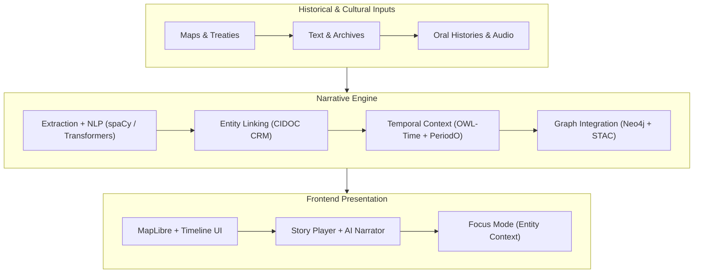
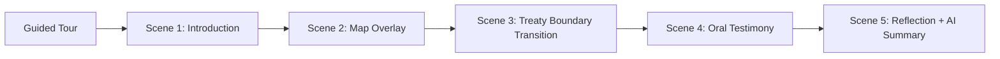

<div align="center">

# 📖 Kansas Frontier Matrix — **Storytelling & Narrative Design**  
`docs/design/storytelling.md`

**Mission:** Define how **historical narratives, oral histories, and data visualizations**  
intertwine within the **Kansas Frontier Matrix (KFM)** — transforming datasets into  
accessible, emotionally resonant, and contextually rich stories grounded in **place, people, and time**.

[](../standards/documentation.md)
[](README.md)
[](../../src/nlp/)
[](../standards/accessibility.md)
[](../../LICENSE)

</div>

---

```yaml
---
title: "📖 Kansas Frontier Matrix — Storytelling & Narrative Design"
document_type: "README"
version: "v2.5.0"
last_updated: "2025-10-19"
created: "2025-10-10"
owners: ["@kfm-design", "@kfm-architecture", "@kfm-accessibility", "@kfm-research"]
status: "Stable"
maturity: "Production"
tags: ["storytelling","narrative","oral-history","ai","focus-mode","accessibility","cidoc-crm","owl-time","periodo","mcp","stac","ethics"]
license: "CC-BY-4.0"
alignment:
  - MCP-DL v6.3
  - WCAG 2.1 AA
  - CIDOC CRM (Narrative Provenance)
  - OWL-Time (Temporal Modeling)
  - PeriodO (Historical Period Vocabulary)
  - DCAT 3.0
  - STAC 1.0
  - FAIR Principles
dependencies:
  - Neo4j Knowledge Graph
  - FastAPI Backend
  - React + MapLibre Frontend
  - STAC Metadata Catalog
  - spaCy / Transformers NLP
review_cycle: "Quarterly"
validation:
  schema: "docs/standards/schemas/story-node.schema.json"
  stac: true
  wcag: true
  provenance_check: true
provenance:
  reviewed_by: ["@kfm-accessibility", "@kfm-editorial", "@kfm-frontend"]
  workflow_ref: ".github/workflows/site.yml"
  artifact_retention_days: 90
versioning:
  policy: "Semantic Versioning (MAJOR.MINOR.PATCH)"
  major_change: "Breaking schema or narrative framework changes."
  minor_change: "New features, templates, or metadata additions."
  patch_change: "Minor fixes, typos, or link corrections."
  example_next_release: "v2.6.0 — Adds multilingual story playback and AI narrator metadata."
semantic_alignment:
  - CIDOC CRM
  - OWL-Time
  - PeriodO
  - FAIR Principles
telemetry:
  metrics_collected: ["Scene Duration","Focus Switch Rate","AI Summary Confidence","Audio/Transcript Toggle Ratio"]
  privacy_policy: "Anonymized aggregate metrics only; opt-in analytics per GDPR and W3C Privacy Principles."
---
```

---

## 🎯 Overview

Storytelling is the **interpretive and emotional heart** of the Kansas Frontier Matrix.  
While architecture defines structure and data ensures accuracy, **storytelling creates meaning** —  
turning datasets into immersive, reproducible narratives that reveal how **geography, culture, and time converge**.

This document defines the **narrative architecture**, **story node schema**, **AI and accessibility integration**,  
and **validation protocols** for all KFM narrative content under **MCP-DL v6.3**.

---

## 🧭 Narrative System Architecture


<!-- END OF MERMAID -->

**Core Flow**
1. Source data → parsed and semantically tagged.
2. Narrative engine links people, places, and time.
3. Graph enriches stories with provenance and citations.
4. Frontend renders synchronized timeline and AI narrator.

---

## 🧩 Core Narrative Principles

| Principle | Description | Example |
|:--|:--|:--|
| **Human-Centered** | Begin from lived experience — individual, group, or community. | Osage migration story tied to 1825 treaty. |
| **Spatially Grounded** | Anchor all narratives in physical geography. | Clicking “Council Grove” opens local migration story. |
| **Temporally Layered** | Show parallel events and evolving eras. | Toggle between 1854–1861 to see Kansas Territory evolve. |
| **Polyvocal** | Include multiple voices and epistemologies. | Tribal accounts + settler journals + federal reports. |
| **Ethical Provenance** | Cite, attribute, and license all content. | Oral interviews list permissions, date, and scope. |
| **Universal Accessibility** | Design for every user. | Captions, transcripts, keyboard navigation, reduced motion. |
| **Transparency** | Maintain explicit data lineage. | Each story node shows data sources and confidence. |

---

## 🧠 Ethics, Consent & Indigenous Data Sovereignty

- **Informed Consent:** Each oral history has recorded `consent.scope`, `consent.date`, and `consent.notes`.  
- **Access Tiers:** Content may be marked `public`, `restricted`, or `community-access`.  
- **Sovereignty:** Respect Indigenous protocols; link to tribal data governance statements.  
- **Interpretive Balance:** Present state, federal, and community accounts equally.  
- **Content Notes:** All sensitive topics (e.g., war, displacement) include `content_warnings`.

---

## 🕰️ Narrative Modes

| Mode | Description | Use Case |
|:--|:--|:--|
| **Guided Tour** | Curated linear storytelling sequence. | Museum or classroom display. |
| **Exploratory** | User-led browsing across map and timeline. | Research and open discovery. |
| **Hybrid Interactive** | AI-guided exploration of linked events. | Educational or community-based projects. |
| **Audio/Transcript** | Narrated storytelling with captions. | Accessibility-first storytelling. |
| **AI Focus Mode** | AI-centered context exploration for people/places. | Deep dive by entity or region. |


<!-- END OF MERMAID -->

---

## 🧬 Narrative Data Model (JSON-LD + CIDOC CRM + OWL-Time)

**Entity Alignment**
- `Person` → `crm:E21_Person`  
- `Event` → `crm:E5_Event` (linked to `time:TemporalEntity`)  
- `Place` → `crm:E53_Place` (lat/long)  
- `Document` → `crm:E31_Document`  
- `StoryNode` → connects all above via `mentions`, `about`, `spatialCoverage`, `temporalCoverage`.

---

## 📜 Story Node Example

```json
{
  "@context": ["https://schema.org", {"crm":"http://www.cidoc-crm.org/cidoc-crm/","time":"http://www.w3.org/2006/time#"}],
  "id": "medicine_lodge_treaty_1867",
  "type": "StoryNode",
  "slug": "medicine-lodge-1867",
  "title": "The Medicine Lodge Creek Treaties (1867)",
  "description": "Five Plains tribes signed treaties redefining land in Kansas and Indian Territory.",
  "temporalCoverage": {"@type":"time:Interval","time:hasBeginning":"1867-10-21","time:hasEnd":"1867-10-28"},
  "spatialCoverage": {"@type":"Place","name":"Medicine Lodge, Kansas","lat":37.267,"lon":-98.583},
  "themes": ["Treaties","Diplomacy","Land Cession"],
  "periodo": ["p0d7c4qj"],
  "consent": {"scope":"open-with-attribution","date":"1983-06-01"},
  "media": {
    "map_layer": "treaties_1867.geojson",
    "image": "images/medicine_lodge.jpg",
    "audio": "audio/medicine_lodge_excerpt.mp3"
  },
  "content": [
    {"type":"paragraph","text":"In October 1867, representatives from five tribes gathered to negotiate peace..."},
    {"type":"quote","text":"We came to Medicine Lodge Creek to seek peace.","attribution":"Kiowa Elders"},
    {"type":"timeline_link","year":1867}
  ],
  "sources": [
    {"title":"Kappler’s Indian Affairs, Vol. II","url":"https://avalon.law.yale.edu/19th_century/"},
    {"title":"Kiowa Elders Oral Testimony, 1983 (KHS Archive)","url":"#"}
  ],
  "license":"CC-BY-4.0"
}
```

---

## ⌨️ Keyboard Interaction Matrix

| Action | Keys | Result |
|:--|:--|:--|
| Play / Pause | `Space` | Toggles narrator or autoplay mode. |
| Prev / Next Scene | `← / →` | Moves focus between scenes. |
| Open Sources | `S` | Opens source citations panel. |
| Toggle Audio/Transcript | `T` | Switches view mode. |
| Exit Story | `ESC` | Closes player, returns focus. |
| Open Help | `Alt + /` | Shows keyboard shortcut modal. |

---

## 🎙️ Oral Histories & Multi-Modal Narratives

| Format | Integration | Accessibility |
|:--|:--|:--|
| **Audio Interviews** | Linked to story node; timeline-synced playback. | Transcripts required and editable. |
| **Video Narratives** | Scrollytelling, synchronized captions. | Captions mandatory; pause on blur. |
| **Historic Imagery** | Fade transitions and map overlays. | Alt text with historical context. |
| **Text Narratives** | Markdown + JSON for localization. | Responsive and reflowable. |
| **AI Summaries** | Contextual synopses of primary sources. | Include confidence + sources disclaimer. |

---

## ♿ Accessibility Audit Matrix

| Category | Tool | Pass Criteria |
|:--|:--|:--|
| **Contrast** | Lighthouse / WAVE | ≥ 4.5:1 |
| **Keyboard Navigation** | Playwright / Manual | 100% focusable |
| **Screen Reader Order** | NVDA / VoiceOver | Logical order preserved |
| **Reduced Motion** | Manual | Motion disabled when requested |
| **Captions/Transcripts** | Manual audit | 100% media coverage |
| **Content Notes** | Manual | Visible before sensitive scenes |

---

## 🧠 Cognitive & UX Writing Rules

- Use plain, empathetic language and active voice.  
- Describe context first, detail second (progressive disclosure).  
- Define metaphors or Indigenous terms when needed.  
- Never sensationalize violence, tragedy, or dispossession.  
- Maintain neutral tone when describing conflicts or trauma.

---

## 📊 Telemetry & Engagement Metrics

| Metric | Description |
|:--|:--|
| **Scene Duration** | Avg. time users spend per story node. |
| **Playback Completion Rate** | % of users who finish entire story sequence. |
| **Audio vs. Transcript Preference** | Ratio of mode toggles. |
| **Accessibility Adoption** | Sessions with reduced motion or high-contrast mode enabled. |
| **AI Summary Confidence** | Mean confidence score of auto-summaries. |

*Metrics anonymized; stored in aggregate; opt-in per GDPR & FAIR data ethics.*

---

## 🧩 MCP Validation Checklist

| Category | Validation Metric | Verified |
|:--|:--|:--:|
| **Metadata** | Story node includes ID, time, place, consent, and license. | ✅ |
| **Provenance** | Each quote/image/video attributed to source. | ✅ |
| **Accessibility** | Captions, transcripts, alt text validated. | ✅ |
| **Sensitivity** | Warnings and consent checks included. | ✅ |
| **Schema** | JSON-LD + STAC pass schema validation. | ✅ |
| **WCAG** | Lighthouse ≥ 95 (Accessibility). | ✅ |

---

## 🧾 Governance & Version History

| Version | Date | Author | Summary | Type |
|:--|:--|:--|:--|:--|
| **v2.5.0** | 2025-10-19 | @kfm-design | Added telemetry, keyboard matrix, cognitive rules, compliance grid. | Minor |
| **v2.4.0** | 2025-10-18 | @kfm-architecture | Introduced Indigenous data sovereignty and content notes. | Minor |
| **v2.3.0** | 2025-10-15 | @kfm-accessibility | Added accessibility audit matrix + validation checklist. | Minor |
| **v2.2.0** | 2025-10-13 | @kfm-editorial | Expanded core principles and ethical provenance. | Minor |
| **v2.0.0** | 2025-10-10 | @kfm-core | Refactored to MCP-DL v6.3 alignment. | Major |
| **v1.0.0** | 2025-09-01 | @kfm-core | Initial release. | Major |

---

## 🔗 Related Documents

- [🎨 Visual Style Guide](style-guide.md)  
- [🧭 UI/UX Guidelines](ui-guidelines.md)  
- [🧠 Focus Mode & AI Integration](../architecture/focus-mode.md)  
- [⚙️ Accessibility Standards](../standards/accessibility.md)  
- [🧱 Component Architecture](component-architecture.md)

---

## 🧾 MCP Compliance Table

| Standard | Description | Verified |
|:--|:--|:--:|
| **MCP-DL v6.3** | Documentation Framework | ✅ |
| **WCAG 2.1 AA** | Accessibility Compliance | ✅ |
| **CIDOC CRM** | Cultural Heritage Schema | ✅ |
| **OWL-Time** | Temporal Reasoning Ontology | ✅ |
| **STAC 1.0** | Story Asset Catalog | ✅ |
| **FAIR Principles** | Data Ethics & Reuse | ✅ |

---

<div align="center">

### 🪶 “Stories are how data remembers — each treaty, each trail, each voice echoes through the plains.”

**Kansas Frontier Matrix — Narrative & Storytelling Design Team**

</div>
