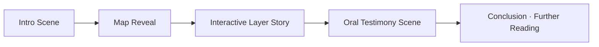

<div align="center">

# 📖 Kansas Frontier Matrix — Storytelling & Narrative Design  
`docs/design/storytelling.md`

**Mission:** Define how historical narratives, oral histories, and data visualizations  
intertwine within the **Kansas Frontier Matrix (KFM)** — transforming raw datasets  
into accessible, emotionally resonant, and contextually rich stories.

[](../../.github/workflows/site.yml)
[](../)
[](README.md)
[](README.md)
[](../../LICENSE)

</div>

---

## 🎯 Purpose

Storytelling is the **interpretive heart** of the Kansas Frontier Matrix.  
Where architecture provides structure and data offers facts, storytelling provides **meaning** —  
turning geographic layers and historical documents into experiences that reveal  
**how place, people, and time converge**.

This guide describes the **principles, narrative structures, and design patterns**  
that transform datasets (maps, treaties, floods, letters) into immersive stories  
for both academic audiences and the general public.

---

## 🧭 Narrative System Overview

```mermaid
flowchart TD
    A["Historical Data\n(Maps · Documents · Audio)"] --> B["Narrative Engine\n(Event Linking · Time Context)"]
    B --> C["Story Nodes\n(Scenes · Events · Dialogues)"]
    C --> D["Story Modes\n(Guided Tours · Free Exploration)"]
    D --> E["Frontend Experience\n(Timeline + Map + AI Narrator)"]
    E --> F["Knowledge Graph Feedback\n(Entity Enrichment)"]
````

<!-- END OF MERMAID -->

---

## 🧩 Core Narrative Principles

| Principle              | Description                                                                     | Example                                                                         |
| :--------------------- | :------------------------------------------------------------------------------ | :------------------------------------------------------------------------------ |
| **Human-Centered**     | Every story begins from lived experience — people, places, or community memory. | Oral history of Osage migration tied to 1825 Treaty map.                        |
| **Spatially Grounded** | Stories are anchored to real locations and mapped geometry.                     | Clicking “Council Grove” opens a local historical story node.                   |
| **Temporally Layered** | Time defines narrative pacing and context.                                      | Story shifts between 1854 and 1861 as Kansas Territory evolves.                 |
| **Polyvocal**          | Multiple perspectives coexist.                                                  | Settler journals, tribal oral accounts, and government reports appear together. |
| **Ethical Provenance** | All content credits originators and permissions.                                | Attribution for audio interviews, document scans, and photographs.              |
| **Accessibility**      | All stories are perceivable and navigable by everyone.                          | Captioned video, transcripts, high-contrast storytelling mode.                  |

---

## 🕰️ Narrative Modes

| Mode                        | Description                                                  | Primary Use                                  |
| :-------------------------- | :----------------------------------------------------------- | :------------------------------------------- |
| **Guided Tour**             | Curated sequence of map/timeline scenes with narration.      | Museum and educational experiences.          |
| **Exploratory Mode**        | Open browsing with contextual popups and adaptive summaries. | Researchers and public users.                |
| **Hybrid Story Mode**       | Combines guided and free-flow; AI suggests next steps.       | Oral history paths and interactive teaching. |
| **Audio / Transcript Mode** | Narrated storytelling with synchronized captions.            | Accessibility-first storytelling.            |

```mermaid
flowchart LR
    A["Guided Tour"] --> B["Scene 1\nIntroduction"]
    B --> C["Scene 2\nHistorical Map Overlay"]
    C --> D["Scene 3\nTreaty Boundary Transition"]
    D --> E["Scene 4\nOral Testimony"]
    E --> F["Scene 5\nConclusion + AI Summary"]
```

<!-- END OF MERMAID -->

---

## 📜 Story Node Structure

Each story is composed of **nodes** — self-contained narrative units that link data, media, and text.
Nodes are modular, versioned, and defined in JSON/Markdown for reuse and translation.

**Example: `stories/medicine_lodge_treaty_1867.json`**

```json
{
  "id": "medicine_lodge_treaty_1867",
  "title": "The Medicine Lodge Creek Treaties (1867)",
  "description": "A pivotal moment where southern Plains tribes signed treaties reshaping Kansas and Indian Territory.",
  "time_range": ["1867-10-21", "1867-10-28"],
  "location": {"name": "Medicine Lodge, Kansas", "lat": 37.267, "lon": -98.583},
  "media": {
    "map_layer": "treaties_1867.geojson",
    "image": "images/medicine_lodge.jpg",
    "audio": "audio/medicine_lodge_treaty_excerpt.mp3"
  },
  "content": [
    {"type": "paragraph", "text": "In October 1867, representatives from five tribes..."},
    {"type": "quote", "text": "We came to Medicine Lodge Creek to seek peace..."},
    {"type": "map_ref", "layer": "treaties_1867.geojson"},
    {"type": "timeline_link", "year": 1867}
  ],
  "sources": [
    {"title": "Kappler’s Indian Affairs, Vol. II", "url": "https://avalon.law.yale.edu/19th_century/"},
    {"title": "Oral account from Kiowa elders, 1983 (KHS Archive)", "url": "#"}
  ],
  "license": "CC-BY-4.0"
}
```

Each node integrates into the **knowledge graph** via its metadata (`id`, `time_range`, `location`).

---

## 🎙️ Oral Histories & Multi-Modal Narratives

| Format                     | Integration Method                                           | Accessibility                                        |
| :------------------------- | :----------------------------------------------------------- | :--------------------------------------------------- |
| **Audio Interviews**       | Linked to timeline and map locations with playback controls. | Transcripts auto-generated and editable.             |
| **Video Segments**         | Synchronized with story scroll (like scrollytelling).        | Captions required; auto-pause when out of view.      |
| **Photographs / Maps**     | Fade transitions in guided tours.                            | Alt text and metadata embedded.                      |
| **Text Narratives**        | Markdown or JSON paragraphs tied to coordinates.             | Reflowable and screen-reader friendly.               |
| **AI-Generated Summaries** | Contextual recaps of complex documents.                      | Stored separately with disclaimers and source links. |

---

## 🧮 Storytelling Layout Patterns

| Section                | Behavior                                    | Implementation                              |
| :--------------------- | :------------------------------------------ | :------------------------------------------ |
| **Intro Scene**        | Hero text + background map image.           | Full-bleed layout with fade-in.             |
| **Main Narrative**     | Scroll-synced text and visuals.             | Intersection Observer triggers map updates. |
| **Interactive Scene**  | Embedded map with hotspots.                 | Tooltips, focus states, voice-over.         |
| **Reflection / Outro** | Summary + call-to-action (explore further). | Static page linking to related stories.     |



<!-- END OF MERMAID -->

---

## ♿ Accessibility Guidelines for Narrative Content

| Feature                 | Rule                                               | Example                                  |
| :---------------------- | :------------------------------------------------- | :--------------------------------------- |
| **Transcripts**         | Required for all audio and video.                  | `transcripts/medicine_lodge.txt`         |
| **Alt Text**            | Describe not just visuals, but historical context. | “Photo of Medicine Lodge council, 1867.” |
| **Keyboard Navigation** | All story interactions available via keyboard.     | Arrow keys scroll scenes.                |
| **Reduced Motion**      | Provide fade-only transitions.                     | No parallax on reduced-motion mode.      |
| **Color Contrast**      | Text/background ≥ 4.5:1.                           | Background overlays darken map imagery.  |
| **Language Tags**       | Use `lang="en"` or specific dialect codes.         | `<p lang="ks-osage">` for Osage phrases. |

---

## 🧠 Narrative AI Integration

| Function                    | Description                                                                         |
| :-------------------------- | :---------------------------------------------------------------------------------- |
| **Context Summaries**       | AI aggregates related events, treaties, and data layers to generate scene synopses. |
| **Conversational Q&A**      | Users can ask questions (“What was happening nearby in 1854?”).                     |
| **Cross-Layer Correlation** | Suggests visual comparisons (e.g., drought patterns vs. settlement expansion).      |
| **Ethical Safeguards**      | All generated text must include source links and confidence metadata.               |

Example AI Output:

> *“During the 1867 Medicine Lodge councils, the U.S. government negotiated five treaties affecting over 23 million acres. This event coincided with concurrent drought conditions recorded in Kansas River valley datasets.”*

---

## 🔍 Storytelling Review Checklist (MCP)

| Category       | Check                                               | Verified |
| :------------- | :-------------------------------------------------- | :------: |
| Metadata       | Story node includes `id`, `time_range`, `location`. |     ✅    |
| Accessibility  | Captions, transcripts, alt text.                    |     ✅    |
| Narrative Flow | Scenes follow a clear temporal sequence.            |     ✅    |
| Provenance     | Each quote and media source cited.                  |     ✅    |
| Validation     | Story JSON passes schema + link check.              |     ✅    |

---

## 🧾 Implementation Notes

* All story data lives in `/data/stories/` as JSON or Markdown with STAC-style metadata.
* Story playback logic handled by `/web/src/modules/storytelling/`.
* Version control for edits:

  * `v1.x` → static curated stories.
  * `v2.x` → dynamic AI-augmented stories.
* Story updates must be reviewed and logged in `/docs/design/reviews/`.
* Use **semantic HTML** for story text (e.g., `<article>`, `<section>`, `<aside>`).

---

<div align="center">

### 🪶 “Stories are how data remembers — each map, each treaty, each voice speaks through time.”

**— Kansas Frontier Matrix Storytelling Team**

</div>

