<div align="center">

# 📖 Kansas Frontier Matrix — **Storytelling & Narrative Design**  
`docs/design/storytelling.md`

**Mission:** Define how **historical narratives, oral histories, and interactive data visualizations**  
intertwine within the **Kansas Frontier Matrix (KFM)** — transforming archival datasets into  
accessible, emotionally resonant, and contextually grounded stories of **place, people, and time**.

[](../standards/documentation.md)
[](README.md)
[](../../src/nlp/)
[](../standards/accessibility.md)
[](../../LICENSE)

</div>

---

```yaml
---
title: "📖 Kansas Frontier Matrix — Storytelling & Narrative Design"
document_type: "README"
version: "v2.4.0"
last_updated: "2025-10-19"
created: "2025-10-10"
owners: ["@kfm-design", "@kfm-architecture", "@kfm-accessibility", "@kfm-research"]
status: "Stable"
maturity: "Production"
tags: ["storytelling","narrative","oral-history","ai","focus-mode","accessibility","cidoc-crm","owl-time","periodo","stac","mcp"]
license: "CC-BY-4.0"
alignment:
  - MCP-DL v6.3
  - WCAG 2.1 AA
  - CIDOC CRM (cultural heritage semantics)
  - OWL-Time (temporal modeling)
  - PeriodO (named historical periods)
  - DCAT 3.0 (dataset description)
  - STAC 1.0 (geo assets)
dependencies:
  - Neo4j Knowledge Graph
  - FastAPI Backend
  - React + MapLibre Frontend
  - STAC Metadata Catalog
  - spaCy / Transformers NLP
review_cycle: "Quarterly"
validation:
  schema: "docs/standards/schemas/story-node.schema.json"
  stac: true
  wcag: true
  provenance_check: true
provenance:
  reviewed_by: ["@kfm-accessibility", "@kfm-frontend", "@kfm-editorial"]
  workflow_ref: ".github/workflows/site.yml"
  artifact_retention_days: 90
versioning:
  policy: "Semantic Versioning (MAJOR.MINOR.PATCH)"
  major_change: "Breaking schema or player behavior; ethical/compliance changes."
  minor_change: "New modes, templates, fields; non-breaking AI/UX updates."
  patch_change: "Fixes, copy, link updates; token or schema clarifications."
  example_next_release: "v2.5.0 — Adds bilingual story playback + new consent facets."
---
```

---

## 🎯 Overview

Storytelling is the **interpretive and emotional core** of KFM.  
Where architecture supplies structure and data ensures evidence, **storytelling provides meaning** —  
turning maps, treaties, diaries, hazards, and oral traditions into coherent experiences that reveal how  
**geography, culture, ecology, and time** shape each other.

This document defines the **narrative architecture**, **story node model**, **ethics & accessibility rules**,  
**AI integration**, and **validation pipeline** for building reproducible, community-respectful digital stories.

---

## 🧭 Narrative Architecture

```mermaid
flowchart TD
    A["Historical Data\n(Maps · Documents · Audio · Oral Histories)"] --> B["Narrative Engine\n(Entity Linking · OWL-Time Context · PeriodO)"]
    B --> C["Story Nodes\n(Scenes · Events · Dialogues · Sources)"]
    C --> D["Narrative Modes\n(Guided · Exploratory · Hybrid · Audio/Transcript · AI Focus)"]
    D --> E["Frontend Experience\n(MapLibre + Timeline + Story Player + AI Narrator)"]
    E --> F["Knowledge Graph Feedback\n(CIDOC CRM Enrichment · STAC/Provenance Update)"]
```


<!-- END OF MERMAID -->

**Contract**
- All narrative elements link to graph entities (people, places, events) with **provenance** and **time**.  
- Assets (images/audio/overlays) are registered in **STAC** for discoverability and reuse.  
- **AI** suggests context but never replaces or obscures primary sources.

---

## 🧩 Core Narrative Principles

| Principle | Description | Example |
|:--|:--|:--|
| **Human-Centered** | Begin with lived experience: individuals, families, communities. | Osage oral history alongside the 1825 treaty boundary. |
| **Spatially Grounded** | Anchor every story to real places and geometries. | Selecting Council Grove opens migration scenes. |
| **Temporally Layered** | Model overlapping timelines (event, ecology, policy). | Shift between 1854–1861 as Kansas Territory evolves. |
| **Polyvocal** | Present multiple voices equitably. | Tribal accounts + settler journals + state reports. |
| **Ethical Provenance** | Cite sources, consent, and rights transparently. | Oral interviews include permission and usage scope. |
| **Universal Accessibility** | WCAG 2.1 AA by default. | Captions, transcripts, high contrast, reduced motion. |
| **Care & Safety** | Prepare audiences for difficult histories. | Content notes and opt-out for traumatic scenes. |

---

## 🧠 Ethics, Consent & Indigenous Data Sovereignty

- **Informed Consent** for all oral histories with fields: `consent.scope`, `consent.date`, `consent.notes`, and any **embargo**.  
- **Cultural Sensitivity** flags and **access tiers** (public/restricted) for community-governed content.  
- **Share-back** principle: link to tribal resources, export packets on request.  
- **Interpretive Balance**: co-present community narratives with state/federal records; avoid tokenization.  
- **Content Notes**: `sensitivity.content_warnings` for scenes involving violence, dispossession, epidemics.

---

## 🕰️ Narrative Modes

| Mode | Description | Use Case |
|:--|:--|:--|
| **Guided Tour** | Sequential, curator-led storyline with narration. | Exhibits, classrooms, public talks. |
| **Exploratory** | Free exploration via map/timeline with adaptive tips. | Research, open discovery. |
| **Hybrid Interactive** | Guided scaffold with AI-suggested branches. | Seminars, oral history pedagogy. |
| **Audio/Transcript** | Narrated scenes with synchronized captions. | Accessibility-first experiences. |
| **AI Focus Mode** | Entity-centric context (person/place/event). | Deep dives, thematic analysis. |


<!-- END OF MERMAID -->

---

## 🧬 Narrative Data Model (JSON-LD + CIDOC CRM + OWL-Time)

Use **JSON-LD** aligned to **CIDOC CRM** for entities and **OWL-Time** for temporal range; incorporate **PeriodO** for named eras.

**Indicative Mapping**
- `Person` → `crm:E21_Person`  
- `Event` → `crm:E5_Event` with `time:TemporalEntity`  
- `Place` → `crm:E53_Place` (with `geo` lat/long)  
- `Document` → `crm:E31_Document`  
- `StoryNode` (custom) with `about`, `mentions`, `spatialCoverage`, `temporalCoverage`, `periodo`

---

## 📜 Story Node Schema

**JSON-LD Example:** `data/stories/medicine_lodge_treaty_1867.json`

```json
{
  "@context": ["https://schema.org", {"crm":"http://www.cidoc-crm.org/cidoc-crm/","time":"http://www.w3.org/2006/time#"}],
  "id": "medicine_lodge_treaty_1867",
  "type": "StoryNode",
  "slug": "medicine-lodge-1867",
  "title": "The Medicine Lodge Creek Treaties (1867)",
  "description": "Five Plains tribes signed treaties redefining land in Kansas and Indian Territory.",
  "temporalCoverage": {
    "@type": "time:Interval",
    "time:hasBeginning": "1867-10-21",
    "time:hasEnd": "1867-10-28"
  },
  "spatialCoverage": {"@type":"Place","name":"Medicine Lodge, Kansas","lat":37.267,"lon":-98.583},
  "themes": ["Treaties","Diplomacy","Land Cession"],
  "periodo": ["p0d7c4qj"],
  "sensitivity": {"cultural": true, "content_warnings": ["violence","dispossession"]},
  "consent": {"scope": "open-with-attribution", "date": "1983-06-01", "notes": "KHS permissions on file"},
  "media": {
    "map_layer": "treaties_1867.geojson",
    "image": "images/medicine_lodge.jpg",
    "audio": "audio/medicine_lodge_excerpt.mp3"
  },
  "content": [
    {"type":"paragraph","text":"In October 1867, representatives from five tribes gathered to negotiate peace..."},
    {"type":"quote","attribution":"Kiowa elders","text":"We came to Medicine Lodge Creek to seek peace."},
    {"type":"map_ref","layer":"treaties_1867.geojson"},
    {"type":"timeline_link","year":1867}
  ],
  "sources": [
    {"title":"Kappler’s Indian Affairs, Vol. II","url":"https://avalon.law.yale.edu/19th_century/"},
    {"title":"Kiowa Elders Oral Testimony, 1983 (KHS Archive)","url":"#","rights":"with permission"}
  ],
  "provenance": {"created_by":"@kfm-architecture","created":"2025-10-12","last_updated":"2025-10-18"},
  "license": "CC-BY-4.0"
}
```

**Markdown + Frontmatter Alternative** (`data/stories/medicine_lodge_treaty_1867.md`)

```yaml
---
id: medicine_lodge_treaty_1867
slug: medicine-lodge-1867
title: The Medicine Lodge Creek Treaties (1867)
temporalCoverage: { start: 1867-10-21, end: 1867-10-28 }
spatialCoverage: { name: Medicine Lodge, Kansas, lat: 37.267, lon: -98.583 }
themes: [Treaties, Land Cession, Diplomacy]
periodo: [p0d7c4qj]
sensitivity: { cultural: true, content_warnings: [violence, dispossession] }
consent: { scope: open-with-attribution, date: 1983-06-01 }
media: { map_layer: treaties_1867.geojson, image: images/medicine_lodge.jpg, audio: audio/medicine_lodge_excerpt.mp3 }
sources:
  - { title: "Kappler’s Indian Affairs, Vol. II", url: "https://avalon.law.yale.edu/19th_century/" }
  - { title: "Kiowa Elders Oral Testimony, 1983 (KHS Archive)", url: "#" }
license: CC-BY-4.0
---
```

---

## 🎙️ Oral Histories & Multi-Modal Narratives

| Format | Integration | Accessibility |
|:--|:--|:--|
| **Audio Interviews** | Geocoded playback linked on timeline/map. | Auto-generated transcripts; human-reviewed. |
| **Video Narratives** | Scrollytelling scenes with captions. | Required captions; pause on focus/blur. |
| **Historic Imagery** | Fade transitions and lightbox zoom. | Alt text includes context, date, location. |
| **Text Narratives** | Markdown/JSON paragraphs tied to coordinates. | Reflowable, screen-reader friendly. |
| **AI Synopses** | Summaries of dense documents/events. | Clear disclaimer + citations + confidence. |

---

## ⌨️ Story Player — Keyboard Shortcuts

| Action | Keys | Notes |
|:--|:--|:--|
| Play/Pause | `Space` | Announces state via `aria-live="polite"`. |
| Prev/Next Scene | `←` / `→` | Moves focus to scene heading. |
| Open Sources | `S` | Jumps to sources list in drawer. |
| Exit Story | `ESC` | Returns focus to previous trigger. |
| Open Help | `Alt + /` | Shows keyboard cheatsheet modal. |

---

## 🧠 AI Integration & Focus Mode

| Function | Description |
|:--|:--|
| **Context Summaries** | AI condenses multi-source evidence into human-readable synopses with citations. |
| **Conversational Q&A** | “What events preceded this treaty?” → lists neighboring events with links. |
| **Cross-Layer Insights** | Suggests overlays (e.g., drought vs. settlement expansion). |
| **Ethical Transparency** | Every AI output includes **confidence** + **source links**; never overrides primary sources. |

> *“During the Medicine Lodge councils, five treaties reshaped ~23 million acres, overlapping drought zones recorded in 1867 Kansas River datasets.”*  
> — _AI Summary (confidence: 0.91 · sources: NOAA GHCN-D, Kappler Vol. II)_

---

## ♿ Accessibility & Inclusion

| Feature | Rule | Example |
|:--|:--|:--|
| **Transcripts** | All spoken content requires transcripts. | `transcripts/medicine_lodge.txt` |
| **Captions** | All videos require captions (WebVTT). | `captions/medicine_lodge_en.vtt` |
| **Alt Text** | Describe imagery and historical context. | “Photograph of 1867 council grounds.” |
| **Keyboard Access** | 100% keyboard reachability. | Tab order matches visual order. |
| **Reduced Motion** | Respect user setting; use fades only. | Map panning animation disabled. |
| **Contrast** | Text/background ≥ 4.5:1. | Dark overlays on maps. |
| **Language Tags** | Mark multilingual text. | `<p lang="ks-osage">Hoⁿje!</p>` |
| **Content Notes** | Provide warnings and skip options. | “This section references forced removals.” |

---

## ✅ Storytelling Review Checklist (MCP Validation)

| Category | Validation Metric | Verified |
|:--|:--|:--:|
| **Metadata** | `id`, `slug`, `temporalCoverage`, `spatialCoverage`, `themes` present. | ✅ |
| **Provenance** | Sources + license + consent fields complete. | ✅ |
| **Accessibility** | Transcripts, captions, alt text, keyboard support. | ✅ |
| **Sensitivity** | Content warnings included if needed. | ✅ |
| **Schema** | JSON-LD/frontmatter validates; links resolve. | ✅ |
| **STAC** | Assets indexed under `data/stac/`. | ✅ |

---

## 🧪 Testing & CI

- **Make targets**
  - `make stories-validate` — Lints story JSON-LD/frontmatter.  
  - `make stac-validate` — Validates STAC items for narrative assets.  
  - `make docs-validate` — Lints Markdown (links/headings/badges).

- **CI Gates**
  - JSON-LD schema pass
  - Link check = 0 failures
  - WCAG automatic checks pass + manual spot checks listed in PR
  - Provenance fields present (`sources`, `license`, `consent` when applicable)

---

## 🔗 Related Documents

- [🎨 Visual Style Guide](style-guide.md)  
- [🧭 UI/UX Guidelines](ui-guidelines.md)  
- [🧠 Focus Mode & AI Integration](../architecture/focus-mode.md)  
- [⚙️ Accessibility Standards](../standards/accessibility.md)  
- [🧱 Component Architecture](component-architecture.md)

---

## 🧾 Appendix A — Minimal STAC Item for a Story

```json
{
  "type":"Feature",
  "stac_version":"1.0.0",
  "id":"story-medicine-lodge-1867",
  "properties":{
    "title":"Story: Medicine Lodge 1867",
    "datetime":"1867-10-21T00:00:00Z",
    "start_datetime":"1867-10-21T00:00:00Z",
    "end_datetime":"1867-10-28T23:59:59Z",
    "kfm:story_node":"medicine_lodge_treaty_1867"
  },
  "geometry":{"type":"Point","coordinates":[-98.583,37.267]},
  "assets":{
    "story":{"href":"../data/stories/medicine_lodge_treaty_1867.json","type":"application/ld+json"},
    "image":{"href":"../data/stories/images/medicine_lodge.jpg","type":"image/jpeg"}
  },
  "links":[]
}
```

---

## 🧾 Appendix B — Commands

```bash
# Validate narrative nodes and links
make stories-validate && make docs-validate

# Validate STAC catalog for story assets
make stac-validate
```

---

## 🧾 Appendix C — Version History

| Version | Date | Author | Description |
|:--|:--|:--|:--|
| **v2.4.0** | 2025-10-19 | @kfm-design | Added ethics & sovereignty, keyboard shortcuts, related docs, and CI gates. |
| **v2.3.0** | 2025-10-18 | @kfm-architecture | JSON-LD schema alignment, PeriodO tags, and STAC example. |
| **v2.2.0** | 2025-10-16 | @kfm-accessibility | Expanded accessibility & sensitivity sections. |
| **v2.1.0** | 2025-10-15 | @kfm-editorial | Core principles and narrative modes clarified. |
| **v2.0.0** | 2025-10-10 | @kfm-core | Refactor to MCP-DL v6.3; CIDOC/OWL-Time integration. |
| **v1.0.0** | 2025-09-01 | @kfm-core | Initial release. |

---

<div align="center">

### 🪶 “Stories are how data remembers — each treaty, each trail, each voice echoes through the plains.”

**Kansas Frontier Matrix — Narrative & Storytelling Design Team**

</div>
