<div align="center">

# 📖 Kansas Frontier Matrix — **Storytelling & Narrative Design**  
`docs/design/storytelling.md`

**Mission:** Define how **historical narratives, oral histories, and data visualizations**  
intertwine within the **Kansas Frontier Matrix (KFM)** — transforming datasets into  
accessible, emotionally resonant, and contextually rich stories grounded in **place, people, and time**.

[](../standards/documentation.md)
[](README.md)
[](../../src/nlp/)
[](../standards/accessibility.md)
[](../../LICENSE)

</div>

---

```yaml
---
title: "📖 Kansas Frontier Matrix — Storytelling & Narrative Design"
document_type: "README"
version: "v2.3.0"
last_updated: "2025-10-18"
created: "2025-10-10"
owners: ["@kfm-design", "@kfm-architecture"]
status: "Stable"
maturity: "Production"
tags: ["storytelling","narrative","oral-history","ai","focus-mode","accessibility","cidoc-crm","owl-time","mcp","stac"]
license: "CC-BY-4.0"
alignment:
  - MCP-DL v6.3
  - WCAG 2.1 AA
  - CIDOC CRM
  - OWL-Time
  - DCAT 3.0
  - STAC 1.0
dependencies:
  - Neo4j Graph Database
  - FastAPI Backend
  - React + MapLibre Frontend
  - STAC Metadata Catalog
  - spaCy / Transformers NLP
review_cycle: "Quarterly"
validation:
  schema: "story-node.schema.json"
  stac: true
  wcag: true
  provenance_check: true
---
```

---

## 🎯 Overview

Storytelling is the **interpretive and emotional heart** of the Kansas Frontier Matrix.  
While architecture defines structure and data ensures accuracy, **storytelling creates meaning** —  
turning datasets into immersive experiences that reveal how **geography, culture, and history converge**.

This document establishes the **narrative system architecture**, **story node schema**, **AI integration**,  
and **accessibility protocols** for building reproducible, ethically grounded digital stories.

---

## 🧭 System Overview

```mermaid
flowchart TD
    A["Historical Data\n(Maps · Archives · Audio · Oral Histories)"] --> B["Narrative Engine\n(Entity Linking · Temporal Context)"]
    B --> C["Story Nodes\n(Scenes · Dialogues · Sources)"]
    C --> D["Story Modes\n(Guided Tours · Exploratory · AI Focus Mode)"]
    D --> E["Frontend Experience\n(Map + Timeline + Narrator)"]
    E --> F["Knowledge Graph Feedback\n(Neo4j · CIDOC CRM Enrichment)"]
```



<!-- END OF MERMAID -->

The narrative engine transforms structured and unstructured data into **interactive knowledge experiences**,  
synchronized across the **timeline**, **map**, and **AI narrator** — maintaining provenance, accessibility, and interpretive transparency.

---

## 🧩 Core Narrative Principles

| Principle | Description | Example |
|:--|:--|:--|
| **Human-Centered** | Begin from lived experience — people, place, or community. | Oral history of Osage migration linked to 1825 Treaty map. |
| **Spatially Grounded** | Anchor stories to real-world geography. | Clicking “Council Grove” reveals 1850s migration narrative. |
| **Temporally Layered** | Use time as structure and pacing. | Transition between 1854–1861 as Kansas Territory evolves. |
| **Polyvocal** | Present multiple perspectives equally. | Settler journals, tribal oral accounts, and state archives. |
| **Ethical Provenance** | Attribute all origins and permissions transparently. | Oral interviews logged with consent and license metadata. |
| **Universal Accessibility** | Design for inclusive participation. | Captioned media, transcripts, reduced motion, high contrast. |

---

## 🕰️ Narrative Modes

| Mode | Description | Use Case |
|:--|:--|:--|
| **Guided Tour** | Curated path through story scenes with narration. | Exhibits, museum experiences. |
| **Exploratory** | Open browsing with contextual summaries. | Research, public exploration. |
| **Hybrid Interactive** | Guided entry with adaptive AI branching. | Interactive classrooms, oral history sessions. |
| **Audio/Transcript** | Narrated storytelling with synchronized captions. | Accessibility-first digital exhibits. |

```mermaid
flowchart LR
    A["Guided Tour"] --> B["Scene 1 · Introduction"]
    B --> C["Scene 2 · Map Overlay"]
    C --> D["Scene 3 · Treaty Transition"]
    D --> E["Scene 4 · Oral Testimony"]
    E --> F["Scene 5 · Reflection + AI Summary"]
```


<!-- END OF MERMAID -->

---

## 📜 Story Node Structure

Story Nodes are **atomic narrative units** — modular, versioned, and connected to the knowledge graph.

**Example:** `data/stories/medicine_lodge_treaty_1867.json`

```json
{
  "@context": ["https://schema.org", {"crm": "http://www.cidoc-crm.org/cidoc-crm/"}],
  "id": "medicine_lodge_treaty_1867",
  "type": "StoryNode",
  "title": "The Medicine Lodge Creek Treaties (1867)",
  "description": "Five Plains tribes signed treaties redefining land in Kansas and Indian Territory.",
  "temporalCoverage": {
    "@type": "time:Interval",
    "time:hasBeginning": "1867-10-21",
    "time:hasEnd": "1867-10-28"
  },
  "spatialCoverage": {"@type": "Place", "name": "Medicine Lodge, Kansas", "lat": 37.267, "lon": -98.583},
  "themes": ["Treaties", "Diplomacy", "Land Cession"],
  "periodo": ["p0d7c4qj"],
  "consent": {"scope": "open-with-attribution", "date": "1983-06-01"},
  "media": {
    "map_layer": "treaties_1867.geojson",
    "image": "images/medicine_lodge.jpg",
    "audio": "audio/medicine_lodge_excerpt.mp3"
  },
  "content": [
    {"type": "paragraph", "text": "In October 1867, representatives from five tribes gathered to negotiate peace..."},
    {"type": "quote", "text": "We came to Medicine Lodge Creek to seek peace."},
    {"type": "timeline_link", "year": 1867}
  ],
  "sources": [
    {"title": "Kappler’s Indian Affairs, Vol. II", "url": "https://avalon.law.yale.edu/19th_century/"},
    {"title": "Kiowa Elders Oral Testimony, 1983 (KHS Archive)", "url": "#"}
  ],
  "license": "CC-BY-4.0"
}
```

---

## 🎙️ Oral Histories & Multi-Modal Narratives

| Format | Integration | Accessibility |
|:--|:--|:--|
| **Audio Interviews** | Linked to timeline/map with playback controls. | Transcripts required, editable, auto-generated. |
| **Video Narratives** | Scroll-synced with captions. | Captions required, pause on scroll out of view. |
| **Photographs & Maps** | Fade transitions in guided tours. | Alt text with historical context. |
| **Text Narratives** | Markdown or JSON paragraphs tied to coordinates. | Screen-reader friendly, reflowable. |
| **AI Summaries** | Scene-level recaps generated from graph data. | Must include disclaimer + source list. |

---

## 🧠 AI Integration & Focus Mode

| Function | Description |
|:--|:--|
| **Context Summaries** | Aggregates data across sources for concise insight. |
| **Conversational Q&A** | Natural language exploration (“What events followed this treaty?”). |
| **Cross-Layer Insights** | Connects climate, land, and political datasets. |
| **Ethical Transparency** | All AI output references provenance and confidence. |

> *“During the Medicine Lodge councils, five treaties reshaped 23 million acres, overlapping drought zones recorded in Kansas River datasets.”*  
> — _AI Summary (confidence: 0.91, sources: NOAA GHCN-D, Kappler Vol. II)_

---

## ♿ Accessibility Guidelines

| Feature | Rule | Example |
|:--|:--|:--|
| **Transcripts** | Required for all spoken content. | `transcripts/medicine_lodge.txt` |
| **Alt Text** | Describe visuals and historical context. | “Photo of the 1867 council grounds.” |
| **Keyboard Access** | All interactions accessible via keyboard. | Arrow keys scroll timeline. |
| **Reduced Motion** | Fade-only transitions for reduced-motion users. | Disable parallax effects. |
| **Contrast** | Maintain ≥4.5:1 contrast. | Dark overlays behind map text. |
| **Language Tags** | Add proper tags for dialects. | `<p lang="ks-osage">Hoⁿje!</p>` |
| **Content Warnings** | Display before sensitive content. | “This section depicts forced relocation.” |

---

## 🔍 MCP Validation Checklist

| Category | Check | Verified |
|:--|:--|:--:|
| Metadata | Story node includes id, time, location. | ✅ |
| Accessibility | Transcripts, captions, alt text included. | ✅ |
| Provenance | Sources cited, consent recorded. | ✅ |
| Narrative Flow | Temporal and spatial continuity verified. | ✅ |
| Schema | JSON-LD validated successfully. | ✅ |
| STAC | Registered in data/stac catalog. | ✅ |

---

## 🧾 Implementation Notes

- Stories stored in `/data/stories/` as JSON-LD with STAC metadata.  
- Frontend storytelling handled in `/web/src/modules/storytelling/`.  
- Version Control:  
  - `v1.x` → Static curated stories.  
  - `v2.x` → Dynamic AI-augmented stories.  
- Peer review required in `/docs/design/reviews/`.  
- Semantic HTML required (`<article>`, `<section>`, `<aside>`).  

---

<div align="center">

### 🪶 “Stories are how data remembers — each treaty, each trail, each voice echoes through the plains.”

**Kansas Frontier Matrix — Narrative & Storytelling Design Team**

</div>