<div align="center">

# 🎨 Kansas Frontier Matrix — **Visual Style Guide**  
`docs/design/style-guide.md`

**Mission:** Define a consistent, accessible, and human-centered **visual design system**  
for the **Kansas Frontier Matrix (KFM)** — enabling reproducible storytelling through  
color, typography, layout, and component design.

[](../standards/documentation.md)
[](README.md)
[](../standards/accessibility.md)
[](../../web/)
[](../../LICENSE)

</div>

---

```yaml
---
title: "🎨 Kansas Frontier Matrix — Visual Style Guide"
document_type: "README"
version: "v1.8.0"
last_updated: "2025-10-18"
created: "2025-10-10"
owners: ["@kfm-design", "@kfm-architecture"]
status: "Stable"
maturity: "Production"
tags: ["design-system","visual-style","tokens","accessibility","typography","color","components","wcag","mcp"]
license: "CC-BY-4.0"
alignment:
  - MCP-DL v6.3
  - WCAG 2.1 AA
  - STAC 1.0 (asset previews & legends)
  - WAI-ARIA 1.2
dependencies:
  - React + MapLibre Frontend
  - CSS Custom Properties (tokens.css)
  - Lucide / Heroicons
  - Playwright + Lighthouse (a11y tests)
review_cycle: "Quarterly"
validation:
  lighthouse_min_score: 95
  contrast_min_ratio: 4.5
  keyboard_traps: "none"
  aria_violations: 0
---
```

---

## 🎯 Overview

This guide codifies KFM’s **visual identity** and **interface components** for web, data viz, and print.  
Every color, font, and component is **documented, versioned, and reusable** in a tokens-first system,  
so designers and engineers ship **consistent, accessible** experiences across the monorepo.

---

## 🧩 Visual Identity

| Element | Description |
|:--|:--|
| **Design Philosophy** | Archival authenticity × scientific clarity × human empathy. |
| **Mood** | Warm and grounded; scholarly yet welcoming; place-forward. |
| **Tone** | Trustworthy, plain-spoken, inclusive. |
| **Keywords** | History · Geography · Light · Accessibility · Provenance. |

---

## 🧱 System Map

```mermaid
flowchart TD
  A["Design Tokens\n(color · type · space · motion)"] --> B["Foundations\n(grid · elevation · theming)"]
  B --> C["Components\n(buttons · cards · panels · tooltips · inputs)"]
  C --> D["Patterns\n(forms · map HUD · timeline controls)"]
  D --> E["Surfaces\n(pages · modals · side panels)"]
  E --> F["Validation\n(a11y · Lighthouse · Playwright)"]
```


<!-- END OF MERMAID -->

---

## 🎨 Color Palette (WCAG 2.1 AA)

> All text/background pairs meet **≥ 4.5:1** contrast; large text (≥ 18.66px/14pt bold) meets **≥ 3:1**.  
> Tokens live in `web/src/styles/tokens.css` and are the single source of truth.

| Token | Purpose | HEX | Swatch |
|:--|:--|:--|:--|
| `--color-accent` | Primary highlight | `#c77d02` |  |
| `--color-accent-alt` | Hover/active | `#a96a00` |  |
| `--color-bg` | Background (light) | `#f9f9f9` |  |
| `--color-bg-dark` | Background (dark) | `#1a1a1a` |  |
| `--color-text` | Body text (light) | `#2c2c2c` |  |
| `--color-text-light` | Text on dark | `#f2f2f2` |  |
| `--color-border` | Dividers | `#d9d9d9` |  |
| `--color-success` | Positive state | `#2e7d32` |  |
| `--color-warning` | Caution | `#f9a825` |  |
| `--color-error` | Error | `#d32f2f` |  |

**Light & Dark Mode**

```css
:root {
  --color-bg: #f9f9f9;
  --color-text: #2c2c2c;
  --color-accent: #c77d02;
  --color-border: #d9d9d9;
}
@media (prefers-color-scheme: dark) {
  :root {
    --color-bg: #1a1a1a;
    --color-text: #f2f2f2;
    --color-accent: #e59b1a;
    --color-border: #333;
  }
}
```

---

## ✍️ Typography System

| Element | Font | Weight | Use |
|:--|:--|:--|:--|
| **Display / Headings** | `"Libre Baskerville", serif` | 700 | H1–H2, map titles |
| **Body / UI** | `"Inter", sans-serif` | 400–600 | Paragraphs, labels |
| **Monospace / Code** | `"IBM Plex Mono", monospace` | 400 | Coordinates, code snippets |
| **Small Caps** | `"Crimson Pro", serif` | 600 | Metadata, treaty headers |

**Responsive Scale (Major Third ratio)**

| Level | Font Size | Line Height |
|:--|:--|:--|
| h1 | 2.369rem | 1.2 |
| h2 | 1.777rem | 1.3 |
| h3 | 1.333rem | 1.4 |
| body | 1rem | 1.6 |
| small | 0.875rem | 1.5 |

---

## 🧭 Layout & Spacing

```mermaid
flowchart TD
  A["Container · 12-column grid"] --> B["Row · flex/grid"]
  B --> C["Component · Card · Panel · Button"]
  C --> D["Content · Text · Media · Data"]
```


<!-- END OF MERMAID -->

**Grid Rules**

| Property | Value |
|:--|:--|
| Columns | 12 (collapse ≤ 768px) |
| Gutter | 1rem desktop / 0.5rem mobile |
| Max Width | 1440px |
| Container Padding | 2rem |
| Alignment | Flexbox + CSS Grid hybrid |

**Spacing Tokens**

| Token | px | Use |
|:--|:--|:--|
| `--space-xs` | 4 | Icons, tight labels |
| `--space-sm` | 8 | Inputs, compact groups |
| `--space-md` | 16 | Paragraph spacing, buttons |
| `--space-lg` | 24 | Card padding, modal margins |
| `--space-xl` | 48 | Section padding |

---

## 🪶 Iconography & Visual Language

| Set | Source | Use |
|:--|:--|:--|
| **Lucide** | MIT | Core UI (map, layers, filters, AI) |
| **Heroicons** | Tailwind Labs | Modals, timeline controls |
| **Custom SVG** | `/web/public/icons/` | Kansas motifs (bison, rivers, forts) |

**Rules**
- Stroke width **1.5–2px**; use `currentColor` for fill/stroke.
- Provide `aria-label` or `<title>`; ensure focusable when interactive.

```html
<svg aria-label="Toggle Dark Mode" width="20" height="20">
  <use href="/icons/moon.svg#icon"></use>
</svg>
```

---

## 🧱 Components

| Component | Visual Style | Accessibility Notes |
|:--|:--|:--|
| **Buttons** | 8px radius; solid accent or outline; 500 weight. | `aria-pressed` for toggles; 44×44 hit-area. |
| **Cards** | Soft shadow, 8px radius; hover elevation. | Clickable → `role="button"`; focus ring visible. |
| **Panels/Drawers** | Right-side slide; scrim backdrop. | Focus trap; ESC closes; labelled by heading. |
| **Tooltips** | Minimal, 300ms delay; fade. | Persist on focus; `aria-describedby`. |
| **Inputs** | 1px border, 8px radius, accent focus ring. | Visible labels; `aria-invalid` on error. |
| **Modals** | Centered; max-width 720px. | Inert background; return focus to trigger. |

**Example**

```html
<button class="btn btn--accent">Explore Timeline</button>

<style>
.btn {
  font-family: var(--font-sans, Inter, system-ui, -apple-system, Segoe UI, Roboto, "Helvetica Neue", Arial, "Apple Color Emoji","Segoe UI Emoji");
  border-radius: 8px;
  padding: 0.5rem 1.25rem;
  font-weight: 500;
  border: 1px solid transparent;
  transition: background .2s ease, border-color .2s ease, color .2s ease;
}
.btn--accent { background: var(--color-accent); color: #fff; }
.btn--accent:hover { background: var(--color-accent-alt); }
.btn:focus-visible { outline: 2px solid var(--color-accent); outline-offset: 2px; }
</style>
```

---

## 🌗 Theming & Tokens

**Global Variables (excerpt)**

```css
:root{
  /* Typography */
  --font-sans: "Inter", system-ui, -apple-system, Segoe UI, Roboto, "Helvetica Neue", Arial;
  --font-serif: "Libre Baskerville", Georgia, "Times New Roman", serif;

  /* Colors */
  --color-accent:#c77d02;
  --color-accent-alt:#a96a00;
  --color-bg:#f9f9f9;
  --color-text:#2c2c2c;

  /* Space */
  --space-xs:4px;
  --space-sm:8px;
  --space-md:16px;
  --space-lg:24px;
  --space-xl:48px;

  /* Radius & Shadow */
  --radius:8px;
  --shadow-sm:0 1px 2px rgba(0,0,0,.05);
  --shadow-lg:0 4px 8px rgba(0,0,0,.10);

  /* Motion */
  --transition: 200ms ease;
}
@media (prefers-color-scheme: dark){
  :root{
    --color-bg:#1a1a1a;
    --color-text:#f2f2f2;
    --shadow-lg:0 4px 12px rgba(255,255,255,.10);
  }
}
```

---

## ♿ Accessibility Validation Checklist

| Check | Tool / Method |
|:--|:--|
| Contrast ratios | WAVE / Axe / Lighthouse |
| Keyboard navigation | Manual + Playwright e2e |
| Screen reader labels | NVDA / VoiceOver |
| Responsive scaling | Chrome DevTools |
| Reduced motion | `prefers-reduced-motion` audit |
| Colorblind safety | simulators (e.g., Color Oracle) |

---

## 🧪 Testing & Governance (MCP-DL v6.3)

**Automated PR Gates**
- Lighthouse ≥ **95** (Performance/Accessibility/Best Practices)
- Axe/Pa11y violations: **0 blocking**
- Keyboard traps: **none**
- Min contrast: **4.5:1**
- Bundle size diff < **+5%** (FYI only)

**Manual Spot-Checks**
- Focus order intuitive
- Visible focus rings on all interactives
- Motion alternatives present

---

## 🧭 Design Tokens — Authoring Rules

1. **Single source of truth** in `tokens.css`; no hard-coded hex in components.  
2. **Semver changes**: breaking visual shifts bump **MINOR**; palette/semantic rename bump **MAJOR**.  
3. **Changelogs** required in `docs/design/reviews/` with screenshots or Percy diffs.  
4. **Bidirectional contrast**: test light/dark and accent on both backgrounds.  

---

## 🧰 Asset & Legend Conventions (Maps & Charts)

| Asset | Convention |
|:--|:--|
| **Map legends** | Use 12/14px Inter; 4/8px spacers; swatch 12×12; left-aligned labels. |
| **Scale bars** | High contrast; not obscuring data; responsive hide < 360px. |
| **Color ramps** | Blind-safe ramps; categorical sets limited to 8 hues. |
| **Downloads** | Provide SVG/PNG @2x; embed `aria-label` in SVGs. |

---

## 📐 Example: Timeline Controls (Spec)

```mermaid
flowchart LR
  A["Prev"] --> B["Zoom−"] --> C["Play/Pause"] --> D["Zoom+"] --> E["Next"]
```


<!-- END OF MERMAID -->

**Behavior**
- **Play** advances in fixed steps (configurable); **Pause** persists map state.  
- Controls are reachable via **Tab**; arrow keys move step ±1; **Space** toggles play.  
- `aria-live="polite"` announces current year/period to screen readers.

---

## 🧮 Versioning & Documentation

- Each token/component change must:
  - Reference a `design-review` issue in commit message.
  - Update this file’s **version** and **last_updated** in YAML.
  - Attach visual diffs (screenshots or Percy) and Lighthouse report.
  - Pass automated checks (see **Testing & Governance**).

---

## 🧾 Implementation Notes

- Tokens: `web/src/styles/tokens.css`  
- Component lib: `web/src/components/` (cards, buttons, panels, inputs)  
- Icon packs: `/web/public/icons/` (Lucide, Heroicons, custom SVGs)  
- Tests: `web/tests/` (Playwright e2e; Axe integration)  
- Reports: uploaded as PR artifacts for review

---

<div align="center">

### 🎨 “A consistent design system is the cartography of clarity.”

**— Kansas Frontier Matrix Design Team**

</div>
