<div align="center">

# 🎨 Kansas Frontier Matrix — Visual Style Guide  
`docs/design/style-guide.md`

**Mission:** Define a consistent, accessible, and human-centered **visual design system**  
for the **Kansas Frontier Matrix (KFM)** — enabling reproducible storytelling through  
color, typography, layout, and component design.

[](README.md)
[](README.md)
[](../)
[](../../LICENSE)

</div>

---

## 🎯 Purpose

This guide codifies the **visual identity** and **interface components** of the Kansas Frontier Matrix.  
It provides designers and developers with a shared reference for consistent color usage,  
typography, icons, and component design across all products — web, print, and data visualizations.  

Every color, font, and component is **documented, versioned, and reusable**, following  
the **Master Coder Protocol (MCP)** approach to reproducible design systems.

---

## 🧩 Visual Identity

| Element | Description |
|:--|:--|
| **Design Philosophy** | Blends archival authenticity with modern scientific clarity. |
| **Mood** | Warm, historical, geographic, yet data-focused. |
| **Tone** | Trustworthy, approachable, and scholarly. |
| **Keywords** | History · Geography · Light · Accessibility · Provenance. |

---

## 🎨 Color Palette (WCAG 2.1 AA Compliant)

> All colors meet ≥ 4.5 : 1 contrast ratio against their paired text color.  
> Tokens are defined globally in `web/src/styles/tokens.css`.

| Token | Purpose | HEX | Example |
|:--|:--|:--|:--|
| `--color-accent` | Primary KFM highlight color | `#c77d02` |  |
| `--color-accent-alt` | Secondary accent for hover/active | `#a96a00` |  |
| `--color-bg` | Background (light mode) | `#f9f9f9` |  |
| `--color-bg-dark` | Background (dark mode) | `#1a1a1a` |  |
| `--color-text` | Default body text | `#2c2c2c` |  |
| `--color-text-light` | Light text on dark backgrounds | `#f2f2f2` |  |
| `--color-border` | Subtle dividers / UI outlines | `#d9d9d9` |  |
| `--color-success` | Positive state (validation OK) | `#2e7d32` |  |
| `--color-warning` | Caution / pending | `#f9a825` |  |
| `--color-error` | Validation / error state | `#d32f2f` |  |

### Light vs. Dark Mode

```css
:root {
  --color-bg: #f9f9f9;
  --color-text: #2c2c2c;
  --color-accent: #c77d02;
}
@media (prefers-color-scheme: dark) {
  :root {
    --color-bg: #1a1a1a;
    --color-text: #f2f2f2;
    --color-accent: #e59b1a;
  }
}
````

---

## ✍️ Typography System

| Element                | Font                         | Weight  | Example                     |
| :--------------------- | :--------------------------- | :------ | :-------------------------- |
| **Display / Headings** | `"Libre Baskerville", serif` | 700     | H1, H2, map titles          |
| **Body / Paragraphs**  | `"Inter", sans-serif`        | 400–500 | Long-form text, captions    |
| **Monospace / Code**   | `"IBM Plex Mono", monospace` | 400     | Code, data, coordinates     |
| **Small Caps**         | `"Crimson Pro", serif`       | 600     | Metadata headings, treaties |

### Responsive Scale (Major Third Ratio)

| Level | Font Size | Line Height |
| :---- | :-------- | :---------- |
| h1    | 2.369rem  | 1.2         |
| h2    | 1.777rem  | 1.3         |
| h3    | 1.333rem  | 1.4         |
| body  | 1rem      | 1.6         |
| small | 0.875rem  | 1.5         |

---

## 🧭 Layout & Spacing System

```mermaid
flowchart TD
    A["Container (12-column grid)"] --> B["Row (flex/grid)"]
    B --> C["Component (Card · Panel · Button)"]
    C --> D["Content (Text · Media · Data)"]
```



<!-- END OF MERMAID -->

### Grid Rules

| Property          | Value                               |
| :---------------- | :---------------------------------- |
| Columns           | 12 (responsive collapse at ≤ 768px) |
| Gutter            | 1rem (desktop) / 0.5rem (mobile)    |
| Max Width         | 1440px                              |
| Container Padding | 2rem                                |
| Alignment         | Flexbox + CSS Grid hybrid layout    |

### Spacing Tokens

| Token        | px | Use                          |
| :----------- | :- | :--------------------------- |
| `--space-xs` | 4  | Between icons, small labels  |
| `--space-sm` | 8  | Input fields, compact groups |
| `--space-md` | 16 | Paragraph spacing, buttons   |
| `--space-lg` | 24 | Card padding, modal margins  |
| `--space-xl` | 48 | Section padding              |

---

## 🪶 Iconography & Visual Language

| Icon Set      | Source               | Usage                                            |
| :------------ | :------------------- | :----------------------------------------------- |
| `Lucide`      | Open-source (MIT)    | UI icons (map, layers, filters, AI assistant).   |
| `Heroicons`   | Tailwind Labs        | Accessibility, modals, timeline controls.        |
| `Custom SVGs` | `/web/public/icons/` | Kansas-specific shapes (buffalo, rivers, forts). |

**Rules:**

* Use stroke width **1.5px–2px** for clarity.
* Always use `currentColor` for icon fill/stroke to inherit theme color.
* Include descriptive `aria-label` or `title` attributes for accessibility.

Example:

```html
<svg aria-label="Toggle Dark Mode" width="20" height="20">
  <use href="/icons/moon.svg#icon"></use>
</svg>
```

---

## 🧱 Components

| Component    | Visual Style                                | Accessibility Notes                 |
| :----------- | :------------------------------------------ | :---------------------------------- |
| **Buttons**  | Rounded 8px; solid accent or outline style. | Must have `aria-pressed` if toggle. |
| **Cards**    | Soft shadow, radius 8px, hover elevation.   | Clickable cards get role="button".  |
| **Panels**   | Sliding side panels (right).                | Trap focus; close on ESC.           |
| **Tooltips** | Minimal; 300ms delay; fade animation.       | Persistent on focus.                |
| **Inputs**   | 1px border, 8px radius, accent focus ring.  | Must have `aria-label`.             |
| **Modals**   | Dimmed backdrop; focus loop inside.         | Keyboard ESC closes modal.          |

---

## 🌗 Theming & Tokens

**Global Variables (excerpt):**

```css
:root {
  /* Typography */
  --font-sans: "Inter", sans-serif;
  --font-serif: "Libre Baskerville", serif;

  /* Colors */
  --color-accent: #c77d02;
  --color-bg: #f9f9f9;
  --color-text: #2c2c2c;

  /* Spacing */
  --space-md: 16px;

  /* Radius & Shadows */
  --radius: 8px;
  --shadow-sm: 0 1px 2px rgba(0,0,0,0.05);
  --shadow-lg: 0 4px 8px rgba(0,0,0,0.1);
}
```

**Dark Mode Override:**

```css
@media (prefers-color-scheme: dark) {
  :root {
    --color-bg: #1a1a1a;
    --color-text: #f2f2f2;
    --shadow-lg: 0 4px 12px rgba(255,255,255,0.1);
  }
}
```

---

## ♿ Accessibility Validation Checklist

| Check                | Tool / Method                  |
| :------------------- | :----------------------------- |
| Contrast ratios      | WAVE / Lighthouse              |
| Keyboard navigation  | Manual + Playwright tests      |
| Screen reader labels | NVDA / VoiceOver               |
| Responsive scaling   | Chrome DevTools                |
| Reduced motion       | `prefers-reduced-motion` audit |
| Colorblind safe mode | `colorblindly` plugin testing  |

---

## 📐 Example Component Snapshot

```html
<button class="btn btn--accent">
  Explore Timeline
</button>

<style>
.btn {
  font-family: var(--font-sans);
  border-radius: var(--radius);
  padding: 0.5rem 1.25rem;
  font-weight: 500;
  border: none;
  transition: background var(--transition);
}
.btn--accent {
  background: var(--color-accent);
  color: white;
}
.btn--accent:hover {
  background: var(--color-accent-alt);
}
</style>
```

---

## 🧮 Versioning & Documentation

* Each design token or component update must:

  * Include a commit message referencing a `design-review` issue.
  * Update this file’s version header (`vX.Y` in the first line if added).
  * Pass **accessibility regression testing** (Lighthouse ≥ 95).
  * Be logged under `docs/design/reviews/`.

---

<div align="center">

### 🎨 “A consistent design system is the cartography of clarity.”

**— Kansas Frontier Matrix Design Team**

</div>

