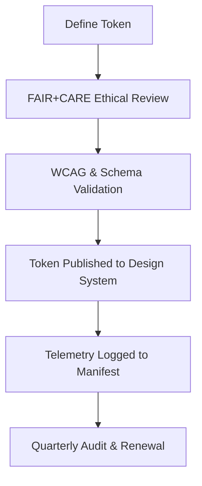

<div align="center">

# 🎨 **Kansas Frontier Matrix — Design Tokens Overview**
`docs/design/tokens/README.md`

**Purpose:**  
Define and manage the centralized **design token architecture** for the **Kansas Frontier Matrix (KFM)** ecosystem — ensuring consistent, accessible, and ethical design language across web, dashboard, and documentation interfaces in compliance with **FAIR+CARE** and **Master Coder Protocol v6.3**.

[](../../README.md)
[](../../standards/faircare.md)
[](../../../LICENSE)
[](../../../releases/v10.0.0/manifest.zip)

</div>

---

## 📘 Overview

Design tokens form the **visual foundation** of the KFM design system.  
They encode values for color, typography, spacing, motion, and accessibility into reusable variables, ensuring **uniform styling**, **cultural inclusivity**, and **sustainability** across all applications.

Tokens are:
- **Machine-readable** (JSON/YAML compatible).  
- **WCAG 2.1 AA–compliant**.  
- **FAIR+CARE-verified** for cultural neutrality.  
- **Version-controlled** under **MCP governance workflows**.  

---

## 🗂️ Directory Layout

```
docs/design/tokens/
├── README.md                        # This file
├── color-palette.md                 # Color definitions and contrast ratios
├── typography-system.md             # Font scales, weights, and line heights
├── spacing-grid.md                  # Spacing and layout grid standards
├── accessibility-tokens.md          # Tokens governing a11y features and focus states
└── iconography-system.md            # Icons, symbols, and ethical visual usage
```

---

## 🧩 Token Architecture

| Category | Description | Example Variables | Validation Workflow |
|---|---|---|---|
| **Color Tokens** | Define surfaces, typography, data visualization hues. | `color.bg.surface`, `color.text.primary`, `color.link.focus` | `design-tokens-validate.yml` |
| **Typography Tokens** | Set scalable font sizes, weights, and line spacing. | `font.size.base`, `font.lineheight.normal` | `design-tokens-validate.yml` |
| **Spacing Tokens** | Establish padding, margin, and layout rhythm. | `spacing.sm`, `grid.columns` | `design-tokens-validate.yml` |
| **Accessibility Tokens** | Manage focus outlines, ARIA labels, and reduced motion. | `focus.outline.color`, `motion.prefersReduced` | `accessibility_scan.yml` |
| **Iconography Tokens** | Define consistent symbols, ARIA alt text, and semantics. | `icon.size.md`, `icon.label.info` | `faircare-visual-audit.yml` |

---

## 🎨 FAIR+CARE Ethical Integration

Each token group incorporates **ethical design standards** to ensure visual equity and cultural respect:

| Principle | Implementation |
|---|---|
| **Collective Benefit** | Token system benefits all user groups via accessibility and readability. |
| **Authority to Control** | Indigenous and cultural data visuals marked with consent metadata. |
| **Responsibility** | Tokens are audited quarterly for ethical color and contrast use. |
| **Ethics** | Icons and imagery verified for neutrality and non-harmful symbolism. |

---

## ♿ Accessibility Compliance

Accessibility tokens ensure every KFM interface supports inclusive user interaction.

| Token | Description | Standard |
|---|---|---|
| `focus.outline.color` | High-contrast focus ring color (≥3:1). | WCAG 2.1.1 |
| `focus.outline.width` | Default 3px outline for keyboard navigation. | ISO 9241-210 |
| `motion.prefersReduced` | Animation preference toggle for vestibular sensitivity. | WCAG 2.3 |
| `aria.label` | Semantic context identifiers for screen readers. | WAI-ARIA 1.2 |
| `color.contrast.min` | Minimum acceptable color ratio. | 4.5:1 (WCAG 1.4.3) |

---

## 💾 Token Versioning Example

Each token file contains metadata headers for governance tracking:

```json
{
  "token_set": "color-palette",
  "version": "v10.0.0",
  "last_updated": "2025-11-10",
  "author": "FAIR+CARE Design Council",
  "validated_by": "design-tokens-validate.yml",
  "governance_ref": "../../standards/governance/ROOT-GOVERNANCE.md"
}
```

---

## 🧠 Example Token Snippets

### 🎨 Color Token (color-palette.md)
```json
{
  "color.text.primary": "#1A1A1A",
  "color.bg.surface": "#FFFFFF",
  "color.link.default": "#004FC6",
  "color.link.focus": "#FFB300"
}
```

### 🔠 Typography Token (typography-system.md)
```json
{
  "font.size.base": "16px",
  "font.size.h1": "2rem",
  "font.weight.bold": "700",
  "font.lineheight.normal": "1.6"
}
```

### 🧭 Accessibility Token (accessibility-tokens.md)
```json
{
  "focus.outline.color": "#FFB300",
  "focus.outline.width": "3px",
  "motion.prefersReduced": true
}
```

---

## ⚙️ CI/CD Validation Workflows

| Workflow | Purpose | Artifact |
|---|---|---|
| `design-tokens-validate.yml` | Validates token syntax, structure, and WCAG compliance. | `reports/ui/design-token-lint.json` |
| `faircare-visual-audit.yml` | Confirms cultural neutrality and CARE compliance. | `reports/faircare-visual-validation.json` |
| `governance-telemetry.yml` | Records version updates in manifest and telemetry logs. | `releases/v10.0.0/manifest.zip` |

---

## 📊 Design Token Metrics

| Metric | Target | Verified By |
|---|---|---|
| **WCAG 2.1 AA Compliance** | 100% | `design-tokens-validate.yml` |
| **FAIR+CARE Ethical Coverage** | ≥ 90% | FAIR+CARE Review |
| **Contrast Ratio Validation** | ≥ 4.5:1 | Accessibility Linter |
| **Version Mapping Coverage** | 100% | Governance Telemetry |
| **Localization Support** | 100% for language tokens | `faircare-visual-audit.yml` |

---

## 🧮 Token Lifecycle



Tokens evolve through continuous validation and ethical certification to maintain trust and accessibility across all releases.

---

## 🕰️ Version History

| Version | Date | Author | Summary |
|---|---|---|---|
| v10.0.0 | 2025-11-10 | FAIR+CARE Design Council | Established centralized design token repository with accessibility, FAIR+CARE integration, and automated validation workflows. |

---

<div align="center">

**© 2025 Kansas Frontier Matrix — CC-BY 4.0**  
Maintained under **Master Coder Protocol v6.3** · FAIR+CARE Certified · Diamond⁹ Ω / Crown∞Ω Ultimate Certified  
[⬅ Back to Design System Index](../README.md) · [Color Tokens →](color-palette.md)

</div>