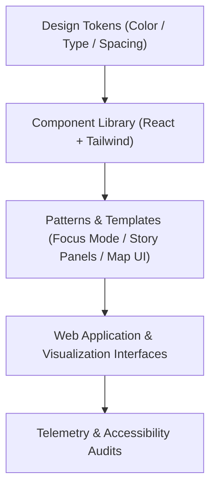

<div align="center">

# 🎨 Kansas Frontier Matrix — **Design Tokens Framework**
`docs/design/tokens/README.md`

**Purpose:**  
Defines the **foundational design tokens** — color, typography, spacing, grid, motion, and accessibility variables — that govern all Kansas Frontier Matrix (KFM) UI and visualization systems.  
These tokens serve as the *single source of truth* for cross-platform design consistency, accessibility, and energy-efficient rendering.

[](../../../docs/standards/faircare-validation.md)
[]()
[]()
[](../../../LICENSE)

</div>

---

## 📚 Overview

The **Design Tokens Framework** powers every visual and spatial decision within the KFM ecosystem — ensuring accessibility, consistency, and sustainability across web, visualization, and storytelling interfaces.  
Tokens define **scalable, FAIR+CARE-aligned parameters** that ensure all design elements meet ethical, perceptual, and environmental standards.

---

## 🗂️ Directory Layout

```plaintext
docs/design/tokens/
├── README.md                             # This file — design tokens framework overview
│
├── color-palette.md                      # Semantic color tokens (light/dark/contrast)
├── typography-system.md                  # Type scale, hierarchy, and semantic usage
├── spacing-grid.md                       # Grid, layout spacing, and responsive scaling
└── accessibility-tokens.md               # Tokens for motion, focus, and WCAG 2.2 AA compliance
```

---

## ⚙️ Token Architecture



### System Layers
1. **Design Tokens:** Universal variables stored in JSON/Figma format.  
2. **Component Layer:** React + Tailwind implementation of design tokens.  
3. **Pattern Layer:** Storytelling, map visualization, and Focus Mode templates.  
4. **Telemetry Layer:** Accessibility and sustainability performance tracking.  

---

## 🎨 Token Categories

| Category | Purpose | Standard |
|-----------|----------|-----------|
| **Color Tokens** | Semantic and data-driven color assignments. | WCAG 2.2 AA / ISO 9241-210 |
| **Typography Tokens** | Font families, weights, sizes, and hierarchy rules. | ISO 9241-210 |
| **Spacing Tokens** | Margin, padding, and layout grid rules for uniformity. | MCP-DL v6.3 |
| **Elevation Tokens** | Shadows, z-index, and surface depth levels for hierarchy. | ISO 9241-125 |
| **Motion Tokens** | Transition and animation preferences, respecting reduced motion. | WCAG 2.2 |
| **Accessibility Tokens** | Focus indicators, contrast thresholds, and font scaling factors. | FAIR+CARE / WCAG 2.2 AA |

---

## 🧩 Color Palette Example (Light / Dark Mode)

```json
{
  "color": {
    "primary": {
      "50": "#eaf7ff",
      "100": "#cfe9ff",
      "500": "#0077cc",
      "700": "#004b99",
      "900": "#002b66"
    },
    "accent": {
      "50": "#fff4e6",
      "100": "#ffe0b3",
      "500": "#ffaa33",
      "700": "#e68a00"
    },
    "neutral": {
      "50": "#fafafa",
      "200": "#e0e0e0",
      "500": "#9e9e9e",
      "900": "#212121"
    }
  }
}
```

### FAIR+CARE Compliance
- **Contrast Ratios:** Minimum 4.5:1 for text and UI elements.  
- **Color Symbolism:** Ethical and culturally neutral visual language.  
- **Dynamic Adaptation:** Color tokens adapt for dark mode accessibility.  

---

## 🔠 Typography System

| Token | Size | Line Height | Usage |
|--------|------|-------------|--------|
| `font-size-base` | 16px | 24px | Default text |
| `font-size-lg` | 18px | 28px | Section headers |
| `font-size-xl` | 24px | 32px | Major headers |
| `font-size-2xl` | 32px | 40px | Hero headlines |
| `font-size-sm` | 14px | 20px | Captions / UI text |

Typography tokens exported to:  
`web/styles/tokens/typography.css`

---

## 📏 Spacing & Grid System

| Token | Value | Purpose |
|--------|--------|----------|
| `spacing-xs` | 4px | Micro-padding / icon spacing |
| `spacing-sm` | 8px | Small component spacing |
| `spacing-md` | 16px | Standard UI gaps |
| `spacing-lg` | 24px | Card or module separation |
| `spacing-xl` | 32px | Section / layout spacing |

Grid system: **8pt modular scale** for cross-platform consistency.

---

## ♿ Accessibility Tokens (WCAG 2.2 AA)

| Token | Value | Function |
|--------|--------|----------|
| `focus-outline-width` | 2px | Focus indicator thickness |
| `focus-outline-color` | `#ffaa33` | High-contrast focus state |
| `reduced-motion` | `true` | Enables low-energy animation mode |
| `font-scale-ratio` | `1.125` | Accessible font scaling factor |
| `contrast-threshold` | `4.5:1` | Ensures WCAG 2.2 AA compliance |

All accessibility tokens validated automatically via `focus-ui-audit.yml`.

---

## 🧠 FAIR+CARE Design Alignment

| FAIR+CARE Principle | Implementation |
|----------------------|----------------|
| **Findable** | Design tokens indexed and versioned in governance ledger. |
| **Accessible** | WCAG 2.2 AA compliance verified by automated CI audits. |
| **Interoperable** | JSON/Figma/React parity across implementation layers. |
| **Reusable** | Tokens are modular and platform-agnostic. |
| **Collective Benefit** | Enables universal, accessible, and ethical design. |
| **Authority to Control** | FAIR+CARE Council validates design compliance. |
| **Responsibility** | Designers maintain token documentation and accessibility logs. |
| **Ethics** | Tokens undergo quarterly review for inclusivity and neutrality. |

---

## 🧾 Internal Use Citation

```text
Kansas Frontier Matrix (2025). Design Tokens Framework (v9.6.0).
Defines the foundational FAIR+CARE and WCAG-compliant design tokens for KFM’s multi-platform user interfaces.
Ensures accessibility, sustainability, and ethical visual consistency across all components and interaction patterns.
```

---

## 🧾 Version Notes

| Version | Date | Notes |
|----------|------|--------|
| v9.6.0 | 2025-11-03 | Added accessibility tokens and WCAG 2.2 AA conformance rules. |
| v9.5.0 | 2025-11-02 | Integrated motion tokens and energy-efficient rendering standards. |
| v9.3.2 | 2025-10-28 | Established FAIR+CARE-compliant token baseline. |

---

<div align="center">

**Kansas Frontier Matrix** · *Accessible Design Tokens × FAIR+CARE Ethics × Sustainable UI Systems*  
[🔗 Repository](https://github.com/bartytime4life/Kansas-Frontier-Matrix) • [🎨 Design System](../README.md) • [⚖️ Governance Ledger](../../../docs/standards/governance/DATA-GOVERNANCE.md)

</div>

