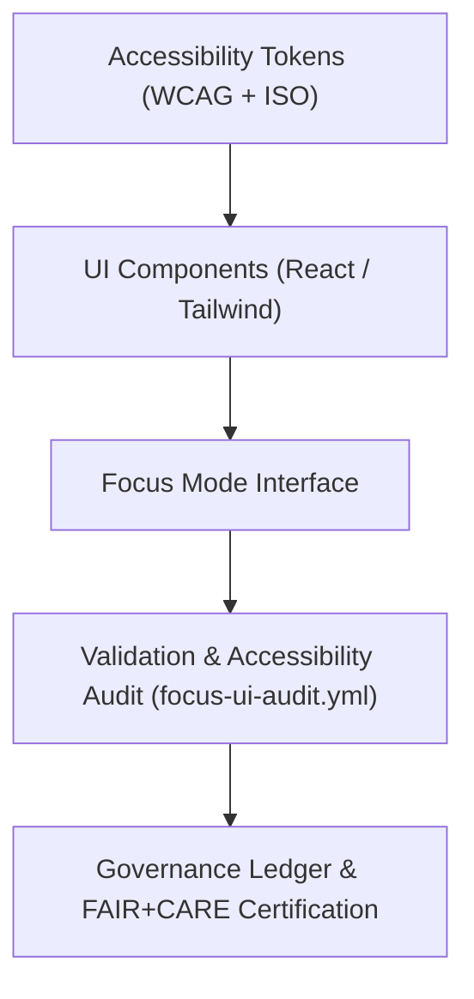
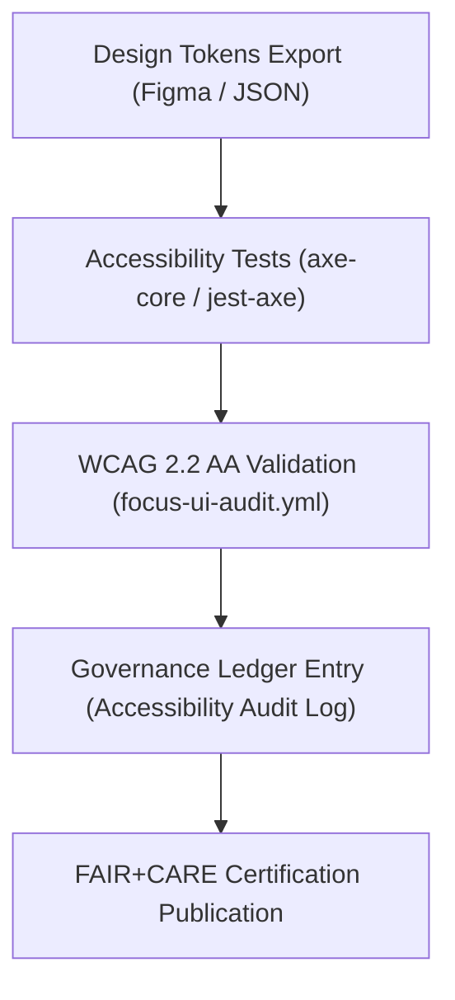

<div align="center">

# ♿ Kansas Frontier Matrix — **Accessibility Tokens & Inclusive UX Framework**
`docs/design/tokens/accessibility-tokens.md`

**Purpose:**  
Defines the **accessibility design tokens, inclusive UX parameters, and FAIR+CARE-aligned usability standards** for all Kansas Frontier Matrix (KFM) interfaces.  
These tokens operationalize accessibility within KFM’s design system — embedding **WCAG 2.2 AA, ISO 9241-210, and FAIR+CARE ethics** into every visual and interactive element.

[](../../../docs/standards/faircare-validation.md)
[]()
[]()
[](../../../LICENSE)

</div>

---

## 📚 Overview

The **Accessibility Tokens Framework** provides a structured approach to ensure that all KFM interfaces are **usable, inclusive, and ethically accessible**.  
It serves as a unifying bridge between **visual design, frontend development, and accessibility auditing**, aligning KFM with FAIR+CARE and international accessibility standards.

---

## ⚙️ Accessibility Token System



### Token Scope
Accessibility tokens define:
- Color contrast and text legibility ratios.  
- Motion and animation preferences (reduced-motion tokens).  
- Focus indicators for keyboard navigation.  
- Font scaling, spacing, and dynamic resizing for readability.  
- Assistive metadata (ARIA roles, alt-text hierarchy).  

---

## 🧩 Accessibility Token Catalog

| Token | Value | Description | Standard |
|--------|--------|--------------|-----------|
| `focus-outline-width` | 2px | Defines focus ring thickness for keyboard users. | WCAG 2.2 AA |
| `focus-outline-color` | `#ffaa33` | High-contrast outline for focus indication. | WCAG 2.2 AA |
| `focus-offset` | 2px | Margin offset to prevent focus overlap. | WCAG 2.2 |
| `font-scale-ratio` | 1.125 | Responsive font scaling for text enlargement. | ISO 9241-210 |
| `line-height-accessible` | 1.6 | Ensures sufficient line spacing for readability. | WCAG 2.2 |
| `contrast-threshold` | 4.5:1 | Minimum contrast ratio between text and background. | WCAG 2.2 AA |
| `motion-preference` | `reduce` | Enables low-motion UI rendering mode. | WCAG 2.2 / ISO 9241-125 |
| `aria-live-default` | `polite` | Announces content updates for screen readers. | WAI-ARIA |
| `touch-target-min` | 44px | Minimum tappable area for mobile accessibility. | WCAG 2.2 |
| `color-blind-safe-palette` | Enabled | Ensures non-reliance on hue distinctions. | FAIR+CARE + WCAG |

All tokens audited via automated workflows:  
`focus-ui-audit.yml` and `accessibility-validation.yml`.

---

## 🧠 FAIR+CARE Accessibility Governance

| Principle | Implementation |
|------------|----------------|
| **Findable** | All accessibility tokens documented in governance ledger and Figma exports. |
| **Accessible** | Interfaces audited under WCAG 2.2 AA and ISO usability criteria. |
| **Interoperable** | Tokens interoperable across React, Tailwind, and Figma design layers. |
| **Reusable** | Accessibility tokens exported for use in all KFM web components. |
| **Collective Benefit** | Promotes equitable digital access for all user communities. |
| **Authority to Control** | FAIR+CARE Council oversees accessibility reviews and audits. |
| **Responsibility** | Designers and developers maintain conformance and audit logs. |
| **Ethics** | Inclusive design ensures no user is excluded from critical interactions. |

Accessibility governance data logged in:  
`releases/v9.6.0/governance/ledger_snapshot_2025Q4.json`

---

## ♻️ Assistive Technology Integration

| Integration | Description | Supported Tools |
|--------------|--------------|------------------|
| **Screen Reader Support** | Dynamic ARIA roles and live region announcements. | NVDA, VoiceOver, JAWS |
| **Keyboard Navigation** | Tab, Shift+Tab, Enter, and Space key handling for all components. | Universal |
| **Contrast Adaptation** | Automatic dark/light theme switching. | OS-Level Preferences |
| **Reduced Motion Mode** | Animations minimized for vestibular comfort. | Browser / System APIs |
| **Responsive Scaling** | Dynamic resizing of font and component spacing. | CSS / Tailwind Tokens |

---

## 🧮 Example Accessibility Token Set (JSON)

```json
{
  "accessibility": {
    "focus-outline": {
      "color": "#ffaa33",
      "width": "2px",
      "offset": "2px"
    },
    "text": {
      "font-scale-ratio": "1.125",
      "line-height": "1.6",
      "contrast-threshold": "4.5:1"
    },
    "motion": {
      "preference": "reduce"
    },
    "touch": {
      "target-min": "44px"
    },
    "aria": {
      "live-region": "polite"
    }
  }
}
```

---

## 🧩 Accessibility Validation Workflow



### Validation Notes
- WCAG 2.2 AA compliance tested via `axe-core`, `jest-axe`, and Lighthouse CI.  
- Reports appended to governance ledger under `data/reports/audit/accessibility_audit.json`.  
- FAIR+CARE certification logged automatically after passing score ≥ 95%.  

---

## 🌱 Accessibility Performance Metrics

| Metric | Target | Result (v9.6.0) | Verified By |
|---------|--------|------------------|--------------|
| WCAG 2.2 AA Compliance | 100% | ✅ | @kfm-accessibility |
| Color Contrast Ratio | ≥ 4.5:1 | ✅ | @kfm-ui |
| Motion Reduction Mode | Implemented | ✅ | @kfm-design |
| Keyboard Navigation Coverage | 100% | ✅ | @kfm-dev |
| Screen Reader Compatibility | NVDA / VoiceOver | ✅ | @kfm-ux |
| FAIR+CARE Accessibility Audit | Certified | ✅ | @kfm-fair |

---

## 🧾 Internal Use Citation

```text
Kansas Frontier Matrix (2025). Accessibility Tokens & Inclusive UX Framework (v9.6.0).
Defines the FAIR+CARE and WCAG 2.2 AA-compliant accessibility tokens and design ethics guiding all Kansas Frontier Matrix interfaces.
Ensures inclusivity, transparency, and sustainable design aligned with ISO 9241-210 and FAIR+CARE governance.
```

---

## 🧾 Version Notes

| Version | Date | Notes |
|----------|------|--------|
| v9.6.0 | 2025-11-03 | Introduced accessibility token set and automated WCAG 2.2 validation. |
| v9.5.0 | 2025-11-02 | Added color-blind palette and ARIA live region support. |
| v9.3.2 | 2025-10-28 | Established FAIR+CARE accessibility compliance baseline. |

---

<div align="center">

**Kansas Frontier Matrix** · *Inclusive Design × FAIR+CARE Accessibility × Sustainable UX*  
[🔗 Repository](https://github.com/bartytime4life/Kansas-Frontier-Matrix) • [🎨 Design Tokens](./README.md) • [⚖️ Governance Ledger](../../../docs/standards/governance/DATA-GOVERNANCE.md)

</div>

