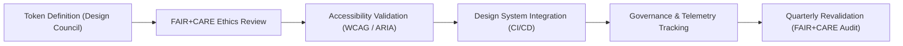

<div align="center">

# ♿ **Kansas Frontier Matrix — Accessibility Design Tokens**
`docs/design/tokens/accessibility-tokens.md`

**Purpose:**  
Define and manage all **accessibility-focused design tokens** used across the **Kansas Frontier Matrix (KFM)** design system — ensuring universal usability, compliance with **WCAG 2.1 AA**, and ethical alignment with **FAIR+CARE** standards for inclusivity and transparency.

[](../../README.md)
[](../../standards/faircare.md)
[](../../../LICENSE)
[](../../../releases/v10.0.0/manifest.zip)

</div>

---

## 📘 Overview

Accessibility tokens provide **system-level variables** that encode assistive design behaviors — such as focus visibility, ARIA relationships, motion preferences, and text contrast.  
They serve as the **foundation for ethical accessibility** throughout KFM’s interface components, ensuring that visual and interactive affordances respect user control, comfort, and consent.

---

## 🗂️ Directory Context

```
docs/design/tokens/
├── README.md
├── color-palette.md
├── typography-system.md
├── spacing-grid.md
├── accessibility-tokens.md       # This file
└── iconography-system.md
```

---

## 🧩 Token Architecture

| Category | Description | Standard |
|---|---|---|
| **Focus Tokens** | Define focus rings, outlines, and states. | WCAG 2.4.7 / ISO 9241-210 |
| **ARIA Tokens** | Semantic accessibility labels and roles. | WAI-ARIA 1.2 |
| **Motion Tokens** | System responsiveness to user animation preferences. | WCAG 2.3.3 |
| **Contrast Tokens** | Enforce minimum text and background contrast ratios. | WCAG 1.4.3 |
| **Assistive Tokens** | Manage screen reader visibility and live region alerts. | WCAG 4.1 / ARIA 1.2 |

---

## 🎨 Accessibility Tokens (v10.0)

| Token | Description | Default Value | Compliance |
|---|---|---|---|
| `focus.outline.color` | Default focus ring color for active elements. | `#FFB300` | WCAG 2.4.7 |
| `focus.outline.width` | Outline width for focused UI elements. | `3px` | ISO 9241-210 |
| `focus.outline.offset` | Spacing between focus ring and element border. | `2px` | WCAG 2.1.1 |
| `focus.transition.duration` | Animation duration for focus state. | `100ms` | WCAG 2.3 |
| `motion.prefersReduced` | Toggles reduced motion for sensitive users. | `true` | WCAG 2.3.3 |
| `aria.label.default` | Generic accessible label fallback. | `"Interface region"` | ARIA 1.2 |
| `aria.live.polite` | Default polite live-region behavior for updates. | `"polite"` | WCAG 4.1 |
| `aria.live.assertive` | Assertive live-region for critical updates. | `"assertive"` | WCAG 4.1 |
| `color.contrast.min` | Minimum contrast ratio between foreground and background. | `4.5:1` | WCAG 1.4.3 |
| `skipnav.enabled` | Enables “Skip to Content” link for keyboard navigation. | `true` | WCAG 2.4.1 |

---

## 🧠 FAIR+CARE Ethical Integration

| FAIR+CARE Principle | Accessibility Expression |
|---|---|
| **Collective Benefit** | Ensures equitable usability for users of all abilities. |
| **Authority to Control** | Respects user preferences (reduced motion, high contrast). |
| **Responsibility** | Accessibility baked into design by default, not as an afterthought. |
| **Ethics** | Interface behaviors minimize cognitive or physical strain. |

> Every accessibility token is considered a **social contract** — representing an ethical commitment to inclusive participation.

---

## ♿ Focus Ring Example (Applied Token Use)

```css
:focus-visible {
  outline: var(--focus-outline-width, 3px) solid var(--focus-outline-color, #FFB300);
  outline-offset: var(--focus-outline-offset, 2px);
  transition: outline-color var(--focus-transition-duration, 100ms) ease-in-out;
}
```

**Token Mappings**
- `focus.outline.color` → `--focus-outline-color`  
- `focus.outline.width` → `--focus-outline-width`  
- `focus.transition.duration` → `--focus-transition-duration`  

---

## 🔊 ARIA Token Examples

| Token | Usage | Code Example |
|---|---|---|
| `aria.label.default` | Provides fallback labels for unlabeled regions. | `<div aria-label="Interface region"></div>` |
| `aria.live.polite` | Non-disruptive updates. | `<div aria-live="polite">Map loading...</div>` |
| `aria.live.assertive` | Urgent feedback for errors or alerts. | `<div aria-live="assertive">Error loading data</div>` |
| `aria.status.loading` | Describes loading or async state. | `<div role="status">Loading data...</div>` |

---

## 🎞️ Motion Token Integration

```js
if (window.matchMedia('(prefers-reduced-motion: reduce)').matches) {
  document.documentElement.style.setProperty('--motion-prefersReduced', true);
}
```

| Token | Description | Effect |
|---|---|---|
| `motion.prefersReduced` | Respects system-level motion preferences. | Disables animations. |
| `focus.transition.duration` | Minimal focus animation to prevent sensory discomfort. | 100ms fade. |

---

## ⚙️ Validation Workflows

| Workflow | Function | Output |
|---|---|---|
| `accessibility_scan.yml` | Checks accessibility token integration across components. | `reports/self-validation/web/a11y_summary.json` |
| `design-tokens-validate.yml` | Validates token structure and WCAG thresholds. | `reports/ui/design-token-lint.json` |
| `storybook-a11y.yml` | Automated visual and keyboard accessibility tests. | `reports/ui/a11y_component_audits.json` |
| `faircare-visual-audit.yml` | Ensures ethical and inclusive tone in accessibility copy. | `reports/faircare-visual-validation.json` |

---

## 📈 Quality & Inclusion Metrics

| Metric | Target | Verified By |
|---|---|---|
| **WCAG 2.1 AA Coverage** | 100% | Accessibility Audit |
| **ARIA Label Completeness** | 100% | `storybook-a11y.yml` |
| **Motion Preference Adherence** | 100% | System Validation |
| **Contrast Compliance** | ≥ 4.5:1 | Design Token Validator |
| **FAIR+CARE Alignment Score** | ≥ 95% | Ethics Council Review |

---

## 🧮 Accessibility Token Lifecycle



Accessibility tokens evolve through ethical governance and continuous validation under the Master Coder Protocol.

---

## 🕰️ Version History

| Version | Date | Author | Summary |
|---|---|---|---|
| v10.0.0 | 2025-11-10 | FAIR+CARE Design & Accessibility Council | Introduced centralized accessibility design tokens defining focus, ARIA, motion, and ethical usability parameters for KFM’s design system. |

---

<div align="center">

**© 2025 Kansas Frontier Matrix — CC-BY 4.0**  
Developed under **Master Coder Protocol v6.3** · FAIR+CARE Certified · Diamond⁹ Ω / Crown∞Ω Ultimate Certified  
[⬅ Back to Tokens Index](README.md) · [Color Palette →](color-palette.md)

</div>