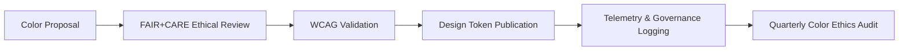

<div align="center">

# 🎨 **Kansas Frontier Matrix — Color Palette & Contrast Tokens**
`docs/design/tokens/color-palette.md`

**Purpose:**  
Define the **official color palette** and **contrast compliance tokens** for all Kansas Frontier Matrix (KFM) design components.  
This palette ensures **visual consistency**, **accessibility (WCAG 2.1 AA)**, and **FAIR+CARE ethical neutrality** across data visualizations, interfaces, and documentation.

[](../../README.md)
[](../../standards/faircare.md)
[](../../../LICENSE)
[](../../../releases/v10.0.0/manifest.zip)

</div>

---

## 📘 Overview

The KFM color system is designed for **legibility, inclusivity, and ethical neutrality**.  
It balances vibrant visual storytelling with accessibility standards and energy-efficient rendering across devices.

All colors are:
- **WCAG 2.1 AA compliant** (contrast ≥ 4.5:1).  
- **Culturally neutral**, reviewed by the FAIR+CARE Ethics Council.  
- **Interoperable** across light and dark modes.  
- **Traceable** through token version control under **Master Coder Protocol v6.3**.  

---

## 🗂️ Directory Context

```
docs/design/tokens/
├── README.md
├── color-palette.md                # This file
├── typography-system.md
├── spacing-grid.md
├── accessibility-tokens.md
└── iconography-system.md
```

---

## 🎨 Base Palette Tokens

| Token | Color | Hex | Contrast on White | Usage |
|---|---|---|---|---|
| `color.primary` | Primary Blue | `#004FC6` | 9.2:1 | Primary buttons, links |
| `color.secondary` | Warm Yellow | `#FFB300` | 7.1:1 | Focus highlights, accents |
| `color.success` | Emerald Green | `#2E7D32` | 6.5:1 | Success messages |
| `color.warning` | Amber | `#F9A825` | 5.2:1 | Warnings |
| `color.error` | Deep Red | `#C62828` | 5.1:1 | Errors, alerts |
| `color.info` | Sky Blue | `#0288D1` | 6.8:1 | Information tooltips |

---

## 🩶 Neutral Palette

| Token | Hex | Contrast on White | Purpose |
|---|---|---|---|
| `color.neutral.900` | `#1A1A1A` | — | Primary text |
| `color.neutral.700` | `#404040` | — | Secondary text |
| `color.neutral.500` | `#737373` | — | Metadata and muted UI |
| `color.neutral.300` | `#D1D5DB` | — | Borders, inputs |
| `color.neutral.100` | `#F5F5F5` | — | Background alt |
| `color.neutral.50` | `#FAFAFA` | — | Light mode surfaces |

All neutrals are verified for contrast ratios above **7.0:1** when paired with standard text tokens.

---

## 🌙 Surface & Background Tokens

| Token | Description | Value | Compliance |
|---|---|---|---|
| `color.bg.surface` | Primary background for UI and docs | `#FFFFFF` | WCAG 1.4.3 |
| `color.bg.alt` | Secondary surface for cards or sections | `#F9FAFB` | 4.7:1 |
| `color.bg.inverse` | Background for dark mode | `#121212` | 15.0:1 |
| `color.overlay.bg` | Dimmed overlay for modals | `rgba(0,0,0,0.6)` | ISO 9241-210 |
| `color.border.neutral` | Standard border color | `#E5E5E5` | 6.0:1 |

---

## 🌈 Semantic Color Tokens

| Token | Description | Hex | Use Case |
|---|---|---|---|
| `color.link.default` | Standard link | `#004FC6` | Hyperlinks, citations |
| `color.link.hover` | Hovered link | `#003D99` | Hover state |
| `color.link.focus` | Focused link outline | `#FFB300` | Accessibility outline |
| `color.button.primary.bg` | Primary button background | `#0053A0` | High-emphasis CTAs |
| `color.button.primary.text` | Primary button text | `#FFFFFF` | Button labels |
| `color.focus.ring` | Focus outline for active components | `#FFB300` | WCAG 2.4.7 |
| `color.status.cultural` | CARE-controlled data highlight | `#AF52DE` | Indigenous datasets |

---

## ♿ Accessibility & Contrast Tokens

| Token | Description | Value | Compliance |
|---|---|---|---|
| `color.contrast.min` | Minimum contrast ratio for body text | `4.5:1` | WCAG 1.4.3 |
| `color.contrast.largeText` | Minimum contrast for ≥18px text | `3:1` | WCAG 1.4.3 |
| `color.focus.outline` | Focus ring color | `#FFB300` | WCAG 2.4.7 |
| `color.a11y.highContrast.bg` | Background in high contrast mode | `#000000` | — |
| `color.a11y.highContrast.text` | Text in high contrast mode | `#FFFFFF` | — |

Contrast ratios validated automatically through the `design-tokens-validate.yml` workflow.

---

## 🧠 FAIR+CARE Visual Ethics

| Ethical Dimension | Implementation |
|---|---|
| **Collective Benefit** | Colors chosen for clarity and accessibility for all users. |
| **Authority to Control** | Cultural and heritage layer colors reviewed by Indigenous Data Governance Board. |
| **Responsibility** | No use of culturally significant colors without proper consent or context. |
| **Ethics** | Palette avoids political, colonial, or religious associations. |

> **Ethical Note:** Red, black, and white combinations—commonly associated with sacred iconography—are reserved for verified cultural contexts only.

---

## 🔍 Validation Workflows

| Workflow | Function | Output Artifact |
|---|---|---|
| `design-tokens-validate.yml` | Validates token syntax and WCAG contrast. | `reports/ui/design-token-lint.json` |
| `faircare-visual-audit.yml` | Reviews color ethics and representation bias. | `reports/faircare-visual-validation.json` |
| `storybook-a11y.yml` | Automated visual contrast snapshot tests. | `reports/ui/a11y_visual_contrast.json` |

---

## 📊 Example JSON Schema (Color Tokens)

```json
{
  "color": {
    "primary": "#004FC6",
    "secondary": "#FFB300",
    "bg": {
      "surface": "#FFFFFF",
      "alt": "#F9FAFB"
    },
    "text": {
      "primary": "#1A1A1A",
      "secondary": "#404040"
    },
    "focus": {
      "outline": "#FFB300"
    }
  },
  "contrast": {
    "min": "4.5:1",
    "largeText": "3:1"
  }
}
```

---

## 📈 Compliance Metrics

| Metric | Target | Validation Source |
|---|---|---|
| **WCAG 2.1 AA Contrast** | 100% | `design-tokens-validate.yml` |
| **Cultural Ethics Review Score** | ≥ 95% | FAIR+CARE Council Audit |
| **Energy Efficiency (ISO 50001)** | ≤ 0.1 Wh render energy | CI Telemetry |
| **Color Token Coverage** | 100% | Governance Manifest |
| **Cross-Platform Consistency** | 100% (Light/Dark modes) | Visual QA |

---

## 🧮 Lifecycle



---

## 🕰️ Version History

| Version | Date | Author | Summary |
|---|---|---|---|
| v10.0.0 | 2025-11-10 | FAIR+CARE Design & Accessibility Council | Introduced unified color palette and accessibility tokens for v10 design system ensuring cultural neutrality, WCAG compliance, and ethical transparency. |

---

<div align="center">

**© 2025 Kansas Frontier Matrix — CC-BY 4.0**  
Developed under **Master Coder Protocol v6.3** · FAIR+CARE Certified · Diamond⁹ Ω / Crown∞Ω Ultimate Certified  
[⬅ Back to Tokens Index](README.md) · [Typography Tokens →](typography-system.md)

</div>