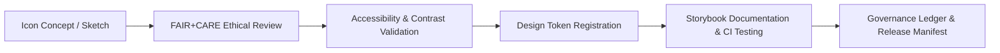

<div align="center">

# 🔖 **Kansas Frontier Matrix — Iconography & Symbol System**
`docs/design/tokens/iconography-system.md`

**Purpose:**  
Define the **iconography, symbols, and visual language tokens** for the **Kansas Frontier Matrix (KFM)** design system.  
All icons are **FAIR+CARE-certified**, **WCAG-compliant**, and **ethically neutral**, ensuring accessibility, cultural respect, and visual harmony across web, dashboard, and documentation interfaces.

[](../../README.md)
[](../../standards/faircare.md)
[](../../../LICENSE)
[](../../../releases/v10.0.0/manifest.zip)

</div>

---

## 📘 Overview

The **KFM Iconography System** provides a unified collection of vector icons and symbolic graphics designed for accessibility, semantic consistency, and ethical representation.  
Icons serve as **functional indicators**, never decorative elements, and must include **ARIA labeling** and **alt-text** equivalents for assistive technologies.

This token set standardizes:
- Icon sizes and stroke weights  
- Semantic naming conventions  
- FAIR+CARE ethical reviews of symbolism  
- Accessibility and localization guidelines  

---

## 🗂️ Directory Context

```
docs/design/tokens/
├── README.md
├── color-palette.md
├── typography-system.md
├── spacing-grid.md
├── accessibility-tokens.md
└── iconography-system.md         # This file
```

---

## 🧩 Icon Token Structure

| Token | Description | Example Value | Compliance |
|---|---|---|---|
| `icon.size.xs` | Extra small icon size (inline text) | `12px` | WCAG 2.1 |
| `icon.size.sm` | Small icon (buttons, chips) | `16px` | WCAG 2.1 |
| `icon.size.md` | Standard interface icons | `24px` | ISO 9241-210 |
| `icon.size.lg` | Large visualization or modal icons | `32px` | — |
| `icon.stroke.width` | Line weight for outlined icons | `1.5px` | Design Token |
| `icon.corner.radius` | Consistent curvature for filled icons | `2px` | Consistency Token |
| `icon.color.primary` | Default fill color | `#004FC6` | WCAG 1.4.3 |
| `icon.color.muted` | Secondary tone for subtle actions | `#737373` | 4.6:1 contrast |
| `icon.label.prefix` | Default ARIA prefix for semantic grouping | `"icon:"` | ARIA 1.2 |

---

## 🎨 Icon Usage Guidelines

| Rule | Description |
|---|---|
| **1. Semantic Clarity** | Every icon must communicate a single clear concept. Avoid abstract or ambiguous shapes. |
| **2. ARIA Support** | All icons require `aria-label` or `title` attributes when conveying meaning. |
| **3. Consistent Size** | Use tokens (`icon.size.md`) instead of hardcoded dimensions. |
| **4. Ethical Representation** | Avoid culturally charged imagery (e.g., religious, militaristic, colonial symbols). |
| **5. Language Neutrality** | Use universal metaphors; test across language contexts. |
| **6. Color Independence** | Icon recognition must not depend solely on color. Include shape distinction. |

---

## ♿ Accessibility Standards

| Requirement | Implementation | Compliance |
|---|---|---|
| **ARIA Labeling** | All icons labeled for screen readers. | ARIA 1.2 |
| **Focus & Keyboard Support** | Icons in buttons or menus respond to keyboard input. | WCAG 2.1.1 |
| **Contrast Ratio** | Minimum 4.5:1 for visible icons. | WCAG 1.4.3 |
| **Text Alternative** | Provide equivalent text (`alt` or `aria-label`). | WCAG 1.1.1 |
| **Reduced Motion** | Animated icons disabled if `prefers-reduced-motion` is true. | WCAG 2.3.3 |

---

## 🧠 FAIR+CARE Ethical Integration

| FAIR+CARE Principle | Implementation in Iconography |
|---|---|
| **Collective Benefit** | Icons serve shared educational and navigational clarity. |
| **Authority to Control** | Communities consulted for heritage-related or cultural icons. |
| **Responsibility** | All icon designs pass cultural bias and emotional neutrality audits. |
| **Ethics** | No iconography depicting harm, exclusion, or stereotypical imagery. |

All icons undergo quarterly **FAIR+CARE visual ethics audits** before being published in official repositories.

---

## 🧾 Example: Accessible Icon Component

```tsx
<button
  aria-label="Open navigation menu"
  className="p-2 rounded focus:outline-none focus:ring-4 focus:ring-[#FFB300]"
>
  <svg
    width="24"
    height="24"
    stroke="currentColor"
    strokeWidth="1.5"
    role="img"
    aria-hidden="false"
  >
    <title>Menu</title>
    <path d="M3 6h18M3 12h18M3 18h18" />
  </svg>
</button>
```

**Compliance Notes**
- Uses `aria-label` and `<title>` for semantic context.  
- Focus ring uses tokenized accessibility color.  
- Passes WCAG 2.1 AA for size and contrast.  

---

## 🖼️ Icon Set Categories

| Category | Description | Example Icons |
|---|---|---|
| **System Icons** | Navigation, actions, and feedback. | Home, Search, Settings, Info |
| **Data & Science** | Environmental, geological, hydrological symbols. | Map Pin, River, Temperature |
| **AI & Focus Mode** | Cognitive and explainability metaphors. | Brain, Timeline, Insight |
| **Governance** | Ethical and procedural icons. | Scales, Certificate, Checkmark |
| **Social / Cultural** | Human-centered and consent-based indicators. | People, Community, Consent |

Each icon’s metadata includes cultural safety verification and provenance logs.

---

## 🔍 Example Token Manifest (JSON)

```json
{
  "icon": {
    "size": {
      "xs": "12px",
      "sm": "16px",
      "md": "24px",
      "lg": "32px"
    },
    "stroke": {
      "width": "1.5px"
    },
    "color": {
      "primary": "#004FC6",
      "muted": "#737373"
    },
    "metadata": {
      "version": "v10.0.0",
      "audit": "FAIR+CARE Visual Ethics",
      "contrastRatio": "≥4.5:1"
    }
  }
}
```

---

## ⚙️ CI/CD Validation Workflows

| Workflow | Function | Output |
|---|---|---|
| `iconography-validate.yml` | Validates naming conventions, sizes, and accessibility. | `reports/ui/iconography-validation.json` |
| `faircare-visual-audit.yml` | Checks cultural and ethical representation. | `reports/faircare-visual-validation.json` |
| `design-tokens-validate.yml` | Confirms adherence to design token schema. | `reports/ui/design-token-lint.json` |
| `storybook-a11y.yml` | Ensures ARIA and WCAG compliance for icon use cases. | `reports/ui/a11y_component_audits.json` |

---

## 📊 Quality Metrics

| Metric | Target | Verified By |
|---|---|---|
| **Contrast Ratio Compliance** | ≥ 4.5:1 | `design-tokens-validate.yml` |
| **ARIA Label Completeness** | 100% | `storybook-a11y.yml` |
| **FAIR+CARE Ethics Review Score** | ≥ 95% | Council Review |
| **Cultural Safety Approval** | 100% for heritage icons | IDGB |
| **Icon Token Version Coverage** | 100% | Manifest Validation |

---

## 🧮 Icon Lifecycle



All icons undergo ethical review and accessibility validation before being published in the official component library.

---

## 🕰️ Version History

| Version | Date | Author | Summary |
|---|---|---|---|
| v10.0.0 | 2025-11-10 | FAIR+CARE Design & Accessibility Council | Established iconography system including FAIR+CARE visual ethics, WCAG 2.1 AA accessibility, and governance validation workflows. |

---

<div align="center">

**© 2025 Kansas Frontier Matrix — CC-BY 4.0**  
Developed under **Master Coder Protocol v6.3** · FAIR+CARE Certified · Diamond⁹ Ω / Crown∞Ω Ultimate Certified  
[⬅ Back to Tokens Index](README.md) · [Accessibility Tokens →](accessibility-tokens.md)

</div>