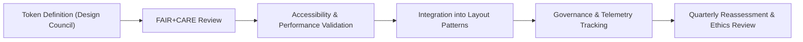

<div align="center">

# 📏 **Kansas Frontier Matrix — Spacing & Grid Tokens**
`docs/design/tokens/spacing-grid.md`

**Purpose:**  
Define the **spacing, grid, and layout measurement tokens** that ensure consistency, legibility, and sustainable visual rhythm across the **Kansas Frontier Matrix (KFM)** design system.  
These tokens follow **FAIR+CARE ethical design standards**, **WCAG 2.1 AA** accessibility ratios, and **ISO 9241-210** ergonomic principles.

[](../../README.md)
[](../../standards/faircare.md)
[](../../../LICENSE)
[](../../../releases/v10.0.0/manifest.zip)

</div>

---

## 📘 Overview

The KFM spacing and grid token system defines all **layout measurements** — from micro paddings to macro grid structures — to maintain a consistent rhythm across dashboards, story cards, and data interfaces.  
This system is **responsive**, **accessible**, and **FAIR+CARE-compliant**, providing equitable readability and cognitive balance across devices and languages.

---

## 🗂️ Directory Context

```
docs/design/tokens/
├── README.md
├── color-palette.md
├── typography-system.md
├── spacing-grid.md               # This file
├── accessibility-tokens.md
└── iconography-system.md
```

---

## 🧩 Token Architecture

| Category | Description | Standard |
|---|---|---|
| **Spacing Tokens** | Define padding, margin, and internal whitespace. | ISO 9241-210 |
| **Grid Tokens** | Establish responsive layout columns and gaps. | WCAG 1.4.8 |
| **Breakpoint Tokens** | Control layout adaptability per device width. | Responsive Web Design |
| **Radius & Shadow Tokens** | Apply to component edges and elevations. | KFM Visual Tokens |

---

## 🎨 Spacing Tokens

| Token | Description | Value | Usage |
|---|---|---|---|
| `spacing.xs` | Extra small spacing (micro-padding). | `0.25rem` (4px) | Icon buttons, labels. |
| `spacing.sm` | Small spacing. | `0.5rem` (8px) | Compact UI elements. |
| `spacing.md` | Medium spacing (default). | `1rem` (16px) | Text blocks, modals. |
| `spacing.lg` | Large spacing. | `1.5rem` (24px) | Section padding, cards. |
| `spacing.xl` | Extra large spacing. | `2rem` (32px) | Page margins, headers. |
| `spacing.section.padding` | Section padding variable. | `2rem` | Major content boundaries. |
| `spacing.grid.gap` | Gap between grid columns. | `1rem` | Layout gutters. |

**FAIR+CARE Principle:** Balanced spacing supports cognitive accessibility and readability for diverse users and abilities.

---

## 🧮 Grid Tokens

| Token | Description | Value | Compliance |
|---|---|---|---|
| `grid.columns` | Default grid column count. | `12` | Responsive Web Layout |
| `grid.gap` | Spacing between columns. | `1rem` | ISO 9241-303 |
| `grid.container.maxWidth` | Maximum container width. | `1200px` | Large screen limit |
| `grid.container.padding` | Side padding for full-width sections. | `2rem` | Mobile-friendly design |
| `grid.breakpoint.sm` | Small device breakpoint. | `640px` | WCAG 1.4.10 |
| `grid.breakpoint.md` | Medium device breakpoint. | `768px` | WCAG 1.4.10 |
| `grid.breakpoint.lg` | Large device breakpoint. | `1024px` | WCAG 1.4.10 |
| `grid.breakpoint.xl` | Extra-large screens. | `1280px` | Responsive UI |

---

## 🪶 Corner & Elevation Tokens

| Token | Description | Value | Purpose |
|---|---|---|---|
| `radius.sm` | Small corner radius for UI inputs. | `4px` | Accessibility-friendly curvature. |
| `radius.md` | Medium corner radius for cards/modals. | `8px` | Default edge softness. |
| `radius.lg` | Large radius for elevated components. | `12px` | Soft, inclusive feel. |
| `shadow.sm` | Light shadow for buttons. | `0 1px 2px rgba(0,0,0,0.05)` | Subtle depth cue. |
| `shadow.md` | Standard card shadow. | `0 2px 4px rgba(0,0,0,0.1)` | Emphasizes hierarchy. |
| `shadow.lg` | Elevated modal or overlay shadow. | `0 4px 10px rgba(0,0,0,0.15)` | Depth indication. |

---

## ♿ Accessibility Considerations

| Feature | Description | Compliance |
|---|---|---|
| **Touch Target Size** | Minimum 44px × 44px for all interactive areas. | WCAG 2.5.5 |
| **Whitespace Ratio** | Minimum 1.5× line spacing for body text. | WCAG 1.4.12 |
| **Focus Visibility** | Spacing ensures visible outlines and focus clarity. | WCAG 2.4.7 |
| **Responsive Reflow** | Grid scales seamlessly at 200% zoom. | WCAG 1.4.10 |
| **Readability Margin** | Default 70–80ch line width for long text. | ISO 9241-125 |

---

## 🧠 FAIR+CARE Integration

| Ethical Dimension | Implementation |
|---|---|
| **Collective Benefit** | Spacing and grid rhythm designed for readability across demographics. |
| **Authority to Control** | Layout adaptivity respects user zoom and scaling preferences. |
| **Responsibility** | Every token reviewed for visual sustainability and energy use. |
| **Ethics** | No layout or spacing used to conceal, manipulate, or mislead information hierarchy. |

---

## 🧾 Example Layout Implementation

```tsx
<main className="max-w-screen-xl mx-auto p-8 grid grid-cols-12 gap-4">
  <aside className="col-span-3 bg-alt rounded-lg p-4 shadow-md">
    <h2 className="text-lg font-semibold">Filter Options</h2>
  </aside>
  <section className="col-span-9 bg-surface rounded-lg p-6 shadow-md">
    <h2 className="text-lg font-semibold">Climate Data Overview</h2>
    <p className="text-base mt-2">
      Aggregated rainfall data for Kansas counties, 1900–2025.
    </p>
  </section>
</main>
```

**Design Tokens Applied**
- `spacing.grid.gap` → consistent column separation.  
- `radius.md` and `shadow.md` → balanced depth perception.  
- `grid.columns` and breakpoints ensure responsiveness and accessibility.  

---

## ⚙️ Validation Workflows

| Workflow | Function | Artifact |
|---|---|---|
| `design-tokens-validate.yml` | Confirms spacing and grid consistency. | `reports/ui/design-token-lint.json` |
| `ux-pattern-validate.yml` | Tests layout responsiveness and reflow. | `reports/ui/ux-pattern-validation.json` |
| `accessibility_scan.yml` | Verifies readable margins and focus spacing. | `reports/self-validation/web/a11y_summary.json` |
| `faircare-visual-audit.yml` | Ensures ethical balance and equitable spacing. | `reports/faircare-visual-validation.json` |

---

## 📊 Metrics

| Metric | Target | Verification |
|---|---|---|
| **Responsive Layout Coverage** | 100% | CI / UX Validation |
| **Whitespace Readability Index** | ≥ 95% | Accessibility Scan |
| **Contrast Compliance** | ≥ 4.5:1 | Token Validation |
| **Energy-Efficient Rendering** | ≤ 0.2 Wh / load | CI Telemetry |
| **FAIR+CARE Ethical Score** | ≥ 95% | Council Audit |

---

## 🧮 Token Lifecycle



---

## 🕰️ Version History

| Version | Date | Author | Summary |
|---|---|---|---|
| v10.0.0 | 2025-11-10 | FAIR+CARE Design & Accessibility Council | Established core spacing and grid token system ensuring consistent, ethical, and sustainable visual rhythm across all KFM interfaces. |

---

<div align="center">

**© 2025 Kansas Frontier Matrix — CC-BY 4.0**  
Developed under **Master Coder Protocol v6.3** · FAIR+CARE Certified · Diamond⁹ Ω / Crown∞Ω Ultimate Certified  
[⬅ Back to Tokens Index](README.md) · [Typography Tokens →](typography-system.md)

</div>