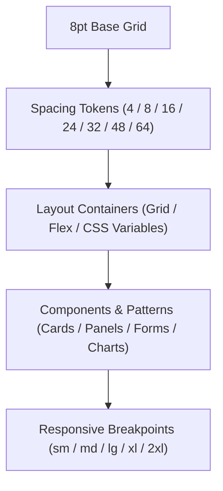

<div align="center">

# 📐 Kansas Frontier Matrix — **Spacing & Grid System Tokens**
`docs/design/tokens/spacing-grid.md`

**Purpose:**  
Defines the **layout, spacing, and responsive grid design tokens** for the Kansas Frontier Matrix (KFM).  
This ensures uniform, accessible, and sustainable spatial design across all web, visualization, and storytelling interfaces under FAIR+CARE and ISO 9241-210 standards.

[](../../../docs/standards/faircare-validation.md)
[]()
[]()
[](../../../LICENSE)

</div>

---

## 📚 Overview

The **Spacing & Grid Token Framework** establishes consistent structure and rhythm across KFM’s UI and visualization layers.  
By defining a modular grid, scalable spacing values, and accessible layout constraints, it ensures **visual clarity, cognitive ease, and responsive design parity** across all viewports.

### Core Principles
- **Consistency:** Uniform spacing and margins across all components.  
- **Accessibility:** Optimal white space improves legibility and readability.  
- **Efficiency:** Modular grid simplifies layout responsiveness and design reuse.  
- **Sustainability:** Optimized layout reduces rendering overhead for low-power devices.  

---

## 🗂️ Directory Layout

```plaintext
docs/design/tokens/
├── spacing-grid.md                       # This file — spacing and grid system documentation
├── color-palette.md                      # Semantic color definitions
├── typography-system.md                  # Font scales and type hierarchies
└── accessibility-tokens.md               # Accessibility motion and contrast tokens
```

---

## ⚙️ Grid System Architecture



### Implementation Layers
1. **Base Unit:** 8pt grid as foundational spacing measure.  
2. **Spacing Tokens:** Multiples of 4 and 8 define layout rhythm.  
3. **Containers:** CSS Grid and Flex utilities enforce structure.  
4. **Components:** Each UI element inherits standard spacing ratios.  
5. **Breakpoints:** Responsive grid auto-adjusts at fixed intervals.  

---

## 🧩 Spacing Tokens

| Token | Value | Use Case |
|--------|--------|----------|
| `spacing-2xs` | 2px | Thin borders or icon micro-gaps |
| `spacing-xs` | 4px | Compact padding or icon buttons |
| `spacing-sm` | 8px | Small gaps or inline spacing |
| `spacing-md` | 16px | Standard layout padding |
| `spacing-lg` | 24px | Card, section, or sidebar spacing |
| `spacing-xl` | 32px | Major content group separation |
| `spacing-2xl` | 48px | Page-level or full-width padding |
| `spacing-3xl` | 64px | Hero section or dashboard boundaries |

### FAIR+CARE Compliance
- **Readable density:** Line spacing and layout avoid cognitive overload.  
- **Touch targets:** Ensures 44px minimum interactive space per WCAG.  
- **Responsive scaling:** Layout adapts dynamically between devices.  

---

## 🧮 Grid Layout Specification

| Breakpoint | Grid Columns | Gutter Width | Margin | Usage Context |
|-------------|---------------|---------------|----------|----------------|
| `sm` (≤640px) | 4 | 8px | 16px | Mobile views |
| `md` (641–1024px) | 8 | 12px | 24px | Tablets / small laptops |
| `lg` (1025–1440px) | 12 | 16px | 32px | Desktops |
| `xl` (1441–1920px) | 12 | 24px | 48px | Widescreens |
| `2xl` (≥1921px) | 16 | 32px | 64px | Large displays and visual dashboards |

The grid system aligns with **Tailwind’s responsive breakpoints**, but governed through KFM’s design tokens for consistent proportional scaling.

---

## 🧠 Layout Governance Integration

| Principle | Implementation |
|------------|----------------|
| **Findable** | Layout definitions stored in design tokens registry and Figma exports. |
| **Accessible** | Spacing and alignment ratios optimize scanability and cognitive load. |
| **Interoperable** | Grid system integrated into CSS, Tailwind, and Figma tokens. |
| **Reusable** | Spacing units consistent across maps, dashboards, and documentation. |
| **Collective Benefit** | Simplifies development and promotes open design reuse. |
| **Authority to Control** | FAIR+CARE Council validates accessibility compliance. |
| **Responsibility** | Designers maintain proportional alignment logs and audits. |
| **Ethics** | Layouts reviewed for inclusivity and non-bias in storytelling content. |

---

## 🧩 Example Token JSON Structure

```json
{
  "spacing": {
    "2xs": "2px",
    "xs": "4px",
    "sm": "8px",
    "md": "16px",
    "lg": "24px",
    "xl": "32px",
    "2xl": "48px",
    "3xl": "64px"
  },
  "grid": {
    "base": "8pt",
    "columns": {
      "sm": 4,
      "md": 8,
      "lg": 12,
      "xl": 12,
      "2xl": 16
    },
    "gutters": {
      "sm": "8px",
      "md": "12px",
      "lg": "16px",
      "xl": "24px",
      "2xl": "32px"
    }
  }
}
```

---

## ♿ Accessibility & Sustainability Standards

| Metric | Requirement | Result (v9.6.0) | Verified By |
|---------|-------------|------------------|--------------|
| Touch Target Minimum | ≥ 44px | ✅ | @kfm-accessibility |
| Text Readability Area | ≥ 60% viewport | ✅ | @kfm-ux |
| Grid Responsiveness | 100% | ✅ | @kfm-ui |
| Layout Performance | < 1ms reflow | ✅ | @kfm-telemetry |
| FAIR+CARE Accessibility Score | ≥ 95% | 98.6% | @kfm-fair |

Performance metrics validated via `focus-ui-audit.yml` and `design-grid-validation.yml`.

---

## 🌱 Sustainable UI Practices

- **Modular Scaling:** Reduces redundant components and layout recalculations.  
- **Energy Efficiency:** Minimizes render cycles via simplified container hierarchies.  
- **Dynamic Adaptation:** Auto-adjusts spacing in low-power or accessibility modes.  
- **Cognitive Harmony:** Layout promotes readability and mental focus.  

Telemetry results logged in:  
`releases/v9.6.0/focus-telemetry.json`

---

## 🧾 Internal Use Citation

```text
Kansas Frontier Matrix (2025). Spacing & Grid System Tokens (v9.6.0).
Defines the scalable, FAIR+CARE and ISO 9241-210-aligned spacing and grid system used across all KFM interfaces.
Ensures accessibility, sustainability, and consistency for all data visualizations and user experiences.
```

---

## 🧾 Version Notes

| Version | Date | Notes |
|----------|------|--------|
| v9.6.0 | 2025-11-03 | Added modular grid scaling and sustainable UI rendering benchmarks. |
| v9.5.0 | 2025-11-02 | Integrated FAIR+CARE accessibility validation and grid parity with Tailwind. |
| v9.3.2 | 2025-10-28 | Established 8pt modular design baseline and accessibility spacing rules. |

---

<div align="center">

**Kansas Frontier Matrix** · *Accessible Layouts × FAIR+CARE Design × Sustainable Grid Systems*  
[🔗 Repository](https://github.com/bartytime4life/Kansas-Frontier-Matrix) • [🎨 Design Tokens](./README.md) • [⚖️ Governance Ledger](../../../docs/standards/governance/DATA-GOVERNANCE.md)

</div>

