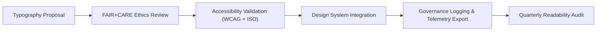

<div align="center">

# 🔤 **Kansas Frontier Matrix — Typography System & Readability Tokens**
`docs/design/tokens/typography-system.md`

**Purpose:**  
Establish a standardized **typography system** that promotes clarity, accessibility, and cultural neutrality for all **Kansas Frontier Matrix (KFM)** interfaces, dashboards, and publications.  
Typography tokens ensure **WCAG 2.1 AA** legibility, **FAIR+CARE** readability ethics, and alignment with **ISO 9241-210** human-centered design.

[](../../README.md)
[](../../standards/faircare.md)
[](../../../LICENSE)
[](../../../releases/v10.0.0/manifest.zip)

</div>

---

## 📘 Overview

Typography defines **voice and tone through visual hierarchy**, balancing technical precision with accessibility and cultural inclusivity.  
The KFM Typography System uses a **tokenized structure** to maintain readability across devices, languages, and accessibility contexts.

All type tokens are:
- **WCAG 2.1 AA** legibility compliant  
- **FAIR+CARE** ethics-certified for linguistic inclusivity  
- **Responsive**, scalable, and version-controlled under MCP governance  

---

## 🗂️ Directory Context

```
docs/design/tokens/
├── README.md
├── color-palette.md
├── typography-system.md           # This file
├── spacing-grid.md
├── accessibility-tokens.md
└── iconography-system.md
```

---

## 🧩 Typography Token Structure

| Category | Purpose | Token Prefix | Standard |
|---|---|---|---|
| **Font Family** | Defines base and fallback typefaces. | `font.family.*` | ISO 9241-3 |
| **Font Size** | Sets modular scale and visual hierarchy. | `font.size.*` | WCAG 1.4.4 |
| **Font Weight** | Establishes emphasis levels. | `font.weight.*` | WCAG 1.4.8 |
| **Line Height** | Controls text legibility and density. | `font.lineheight.*` | WCAG 1.4.12 |
| **Letter Spacing** | Ensures legibility for headings and long-form text. | `font.letterspacing.*` | WCAG 1.4.8 |
| **Readability Tokens** | Enforce ethical, accessible reading patterns. | `readability.*` | FAIR+CARE Ethics |

---

## 🔠 Font Tokens

| Token | Value | Description |
|---|---|---|
| `font.family.base` | `"Inter", "Helvetica Neue", Arial, sans-serif` | Default UI and content font. |
| `font.family.serif` | `"Source Serif Pro", Georgia, serif` | Narrative and historical text font. |
| `font.family.mono` | `"Source Code Pro", monospace` | Code blocks, data fields. |
| `font.size.base` | `16px` | Default body font size. |
| `font.size.sm` | `14px` | Secondary metadata and labels. |
| `font.size.lg` | `18px` | Large paragraph text for readability. |
| `font.size.h1` | `2rem` (32px) | Page titles. |
| `font.size.h2` | `1.5rem` (24px) | Section headers. |
| `font.size.h3` | `1.25rem` (20px) | Subheadings. |
| `font.weight.light` | `300` | Soft emphasis text. |
| `font.weight.regular` | `400` | Default body text weight. |
| `font.weight.semibold` | `600` | Headings or highlights. |
| `font.weight.bold` | `700` | Key emphasis (rarely used). |
| `font.lineheight.normal` | `1.6` | Default readability standard. |
| `font.lineheight.tight` | `1.3` | Compact headings. |
| `font.lineheight.relaxed` | `1.8` | Long-form narratives. |
| `font.letterspacing.tight` | `-0.01em` | Headings. |
| `font.letterspacing.normal` | `0` | Body copy. |
| `font.letterspacing.loose` | `0.02em` | Small caps or metadata. |

---

## 🧮 Readability Tokens

| Token | Description | Value | Compliance |
|---|---|---|---|
| `readability.lineLength.max` | Maximum line width for readability. | `70ch` | ISO 9241-125 |
| `readability.contrast.min` | Minimum acceptable color contrast for text. | `4.5:1` | WCAG 1.4.3 |
| `readability.language.support` | Required multilingual character support. | `Latin + diacritics + Native glyphs` | FAIR+CARE |
| `readability.gradeLevel.max` | Maximum reading level for narrative AI output. | `8.0 (FK)` | FAIR+CARE |
| `readability.a11y.fontScaling` | Supports user-initiated scaling (150–200%). | `true` | WCAG 1.4.4 |

---

## ♿ Accessibility Guidelines

| Principle | Implementation |
|---|---|
| **Zoom Support** | All typography scales up to 200% without clipping or layout loss. |
| **Contrast Ratios** | Text and backgrounds must meet ≥ 4.5:1 ratio. |
| **Line Spacing** | Default spacing ≥ 1.5× for readability. |
| **Language Tags** | Documents include `<html lang="en">` or appropriate locale code. |
| **No Justified Text** | Left-aligned text to preserve even spacing and legibility. |

---

## 🧠 FAIR+CARE Ethical Typography

| Ethical Dimension | Design Expression |
|---|---|
| **Collective Benefit** | Typefaces selected for legibility and accessibility across global audiences. |
| **Authority to Control** | Indigenous or cultural text includes verified language use and consent. |
| **Responsibility** | Narrative text avoids bias; tone neutrality enforced in AI outputs. |
| **Ethics** | Typography avoids emphasis patterns that imply hierarchy or exclusion. |

Typography choices undergo linguistic audits to ensure inclusive communication across diverse communities.

---

## 🧾 Example Implementation

```tsx
<article className="max-w-prose">
  <h1 className="text-2xl font-semibold text-primary">
    The Evolution of Kansas Waterways
  </h1>
  <p className="text-base leading-relaxed mt-3 text-body">
    This narrative summarizes hydrological changes across Kansas rivers
    between 1850 and 2025, integrating geological data and oral histories
    with FAIR+CARE ethical attribution.
  </p>
  <footer className="mt-3 text-sm text-muted">
    Source: Kansas Geological Survey — CC-BY 4.0
  </footer>
</article>
```

**Compliance Notes**
- Meets WCAG 2.1 AA and readability tokens.  
- Line length capped at 70ch.  
- Readability level (FK 7.8) validated for general audiences.  

---

## ⚙️ CI/CD Validation Workflows

| Workflow | Function | Output |
|---|---|---|
| `design-tokens-validate.yml` | Validates token definitions, scaling, and contrast. | `reports/ui/design-token-lint.json` |
| `a11y-typography-scan.yml` | Checks font scaling and line spacing for WCAG compliance. | `reports/ui/a11y_typography.json` |
| `faircare-visual-audit.yml` | Audits linguistic inclusivity and ethical tone. | `reports/faircare-visual-validation.json` |
| `telemetry-export.yml` | Logs readability and accessibility metrics. | `releases/v10.0.0/focus-telemetry.json` |

---

## 📊 Typography Quality Metrics

| Metric | Target | Validation |
|---|---|---|
| **WCAG 2.1 AA Legibility** | 100% | Accessibility Scan |
| **Contrast Compliance** | ≥ 4.5:1 | Token Validation |
| **Readability Index (FK)** | ≤ 8.0 | FAIR+CARE AI Audit |
| **Font Scaling Support** | 100% | Browser + CI Test |
| **Cultural Language Support** | ≥ 95% | FAIR+CARE Council |

---

## 🧮 Lifecycle



Typography tokens are continually re-evaluated for readability and ethical integrity.

---

## 🕰️ Version History

| Version | Date | Author | Summary |
|---|---|---|---|
| v10.0.0 | 2025-11-10 | FAIR+CARE Design & Accessibility Council | Created standardized typography system and readability tokens ensuring WCAG 2.1 AA legibility and FAIR+CARE language inclusivity. |

---

<div align="center">

**© 2025 Kansas Frontier Matrix — CC-BY 4.0**  
Maintained under **Master Coder Protocol v6.3** · FAIR+CARE Certified · Diamond⁹ Ω / Crown∞Ω Ultimate Certified  
[⬅ Back to Tokens Index](README.md) · [Spacing Tokens →](spacing-grid.md)

</div>