<div align="center">

# 🧭 Kansas Frontier Matrix — **UI/UX Guidelines**  
`docs/design/ui-guidelines.md`

**Mission:** Define the **user experience principles**, **accessibility requirements**,  
and **interaction behaviors** guiding all web and application interfaces  
within the **Kansas Frontier Matrix (KFM)**.

[](../standards/documentation.md)
[](README.md)
[](../standards/accessibility.md)
[](../../web/)
[](../../LICENSE)

</div>

---

```yaml
---
title: "🧭 Kansas Frontier Matrix — UI/UX Guidelines"
document_type: "README"
version: "v2.2.0"
last_updated: "2025-10-19"
created: "2025-10-10"
owners: ["@kfm-design", "@kfm-architecture"]
status: "Stable"
maturity: "Production"
tags: ["ui","ux","accessibility","interaction","map","timeline","a11y","tokens","mcp","versioning"]
license: "CC-BY-4.0"
alignment:
  - MCP-DL v6.3
  - WCAG 2.1 AA
  - WAI-ARIA 1.2
  - STAC 1.0 (UI metadata for legends/previews)
dependencies:
  - React + MapLibre Frontend
  - D3/Canvas Timeline
  - tokens.css Design System
  - Axe/Lighthouse/Playwright Testing
review_cycle: "Quarterly"
validation:
  lighthouse_min_score: 95
  axe_blocking_violations: 0
  contrast_min_ratio: 4.5
  keyboard_traps: "none"
  schema_checks: true
versioning:
  policy: "Semantic Versioning (MAJOR.MINOR.PATCH)"
  major_change: "Breaking interaction or accessibility behavior changes."
  minor_change: "New features, UI improvements, non-breaking interaction updates."
  patch_change: "Bug fixes, copy edits, token refinements, documentation corrections."
  example_next_release: "v2.3.0 - adds focus management improvements + new timeline keyboard shortcuts."
---
```

---

## 🎯 Purpose

This document codifies **UX and accessibility standards** across all Kansas Frontier Matrix interfaces.  
It ensures that every timeline, map, popup, and data visualization is designed for clarity, responsiveness,  
inclusivity, and scientific reproducibility — reflecting both the technical rigor and human storytelling  
at the heart of the project. The following principles are **mandatory** for all KFM frontends (web, kiosk, mobile).

---

## 🧭 System Overview

```mermaid
flowchart TD
    A["Header\n(Title · Search · Menu)"] --> B["Map View\n(MapLibre + Layers)"]
    B --> C["Timeline\n(Canvas/D3 sync)"]
    C --> D["Detail Panel\n(Events · Docs · AI Summary)"]
    D --> E["Footer\n(Licenses · Credits · a11y info)"]
    B --> F["HUD\n(Legend · Scale · Layer Toggles)"]
```


<!-- END OF MERMAID -->

**Layout contract**
- **Header:** Fixed; global search/navigation; never occludes focus outline.  
- **Map View:** Primary surface; overlays toggleable; no information locked behind hover-only.  
- **Timeline:** Collapsible; bi-directionally synchronized with the map.  
- **Detail Panel:** Right drawer; non-blocking; fully keyboard-accessible.  
- **Footer:** Static legal, licenses (CC-BY), and a11y statement.

---

## 🧩 Core UX Principles

| Principle | Description | Example |
|:--|:--|:--|
| **Clarity** | Elements convey purpose instantly; no ambiguous controls. | Buttons labeled “View on Map”, “Read Treaty Text”. |
| **Consistency** | Icons, colors, and controls behave identically across modules. | Layer toggles and timeline toggles share states. |
| **Accessibility** | WCAG 2.1 AA; perceivable, operable, understandable, robust. | Keyboard navigation for markers & filters. |
| **Narrative Flow** | Context emerges as users explore paths. | Clicking a treaty boundary opens date + context panel. |
| **Scalability** | Layout scales from kiosks/4K to tablets/phones. | 12-col grid; responsive tokens. |
| **Reproducibility** | Interactions render consistently across environments. | Timelines identical in Chromium/Gecko/WebKit. |

---

## ♿ Accessibility Standards (WCAG 2.1 AA)

| Category | Requirement | Implementation |
|:--|:--|:--|
| **Keyboard Navigation** | Full operation without a mouse. | Native focus order; visible focus rings; no `outline: none`. |
| **Color Contrast** | Text/bg ≥ **4.5:1** (3:1 large/bold). | Tokenized palette (see style guide). |
| **ARIA Semantics** | Accurate roles, names, states. | `<button aria-pressed="true">`, `role="dialog" aria-modal="true"`. |
| **Focus Management** | Logical tab sequence; dialogs trap and restore focus. | Drawer closes → focus returns to trigger. |
| **Reduced Motion** | Honor `prefers-reduced-motion`. | Disable panning/zoom easing; use fades only. |
| **Text Scaling** | 200% zoom without loss of content/func. | Use `rem`/`em`; avoid fixed px heights. |
| **Alt/Text Equivalents** | All meaningful images/icons have text. | `alt="Map: 1854 Treaty Boundaries"`; icons with `aria-label`. |

---

## 🧠 Interaction Behaviors

| Element | Behavior | Visual/State Response |
|:--|:--|:--|
| **Timeline** | Drag/scroll horizontally; zoom with pinch or `Ctrl+wheel`. | Smooth pan; elastic bounds; highlighted ticks; debounce rendering. |
| **Map Markers** | Hover → tooltip; click → open drawer. | Pulse animation (reduced-motion safe); 2px focus ring. |
| **Layer Toggles** | Toggle layers and update legend & HUD. | `active` accent color; label updates; announcement via `aria-live="polite"`. |
| **Search** | Autocomplete results navigable via arrows/Enter. | Highlighted suggestion; clear button with `aria-label`. |
| **AI Assistant** | Non-modal dock; ESC closes; keeps context breadcrumbs. | Motion reduced compliant slide; focus sent to first actionable. |
| **Tooltips** | Appear on hover/focus; dismiss on blur/ESC. | 300ms delay; fade; persistent on focus for keyboard users. |

---

## 📱 Responsive Design Rules

| Breakpoint | Layout Adjustment |
|:--|:--|
| **≥ 1280px (Desktop)** | Timeline visible by default; dual sidebars allowed. |
| **768–1279px (Tablet)** | Timeline collapsible; map consumes remaining height. |
| **< 768px (Mobile)** | Single-column stack; panels switch via tabs. |
| **Orientation Change** | Preserve panel/map/timeline state on rotate. |

```css
:root { --grid-columns: 12; --gutter: 1rem; }
@media (max-width: 768px) { :root { --grid-columns: 4; --gutter: 0.5rem; } }
```

---

## 🎨 Design Tokens (UI Variables)

Defined in `web/src/styles/tokens.css` (authoritative), referenced by `docs/design/style-guide.md`.

| Token | Purpose | Example |
|:--|:--|:--|
| `--color-accent` | Primary highlight | `#c77d02` |
| `--color-bg` | Neutral background | `#f9f9f9` |
| `--color-contrast` | High-contrast text | `#1a1a1a` |
| `--font-sans` | Main UI font | `"Inter", sans-serif` |
| `--radius` | Border rounding | `8px` |
| `--transition` | UI motion speed | `200ms ease` |

---

## 🧮 Focus & State Management

**Focus rules**
- Never suppress focus outlines; custom rings must maintain **≥ 3:1** contrast.  
- Restore focus to triggering control when closing drawers/modals.  
- Maintain logical DOM order to match visual order; avoid tabindex values > 0.

**State tokens**
- Success: `--color-success`; Warning: `--color-warning`; Error: `--color-error`.  
- Loading: prefer skeletons over spinners; provide `aria-busy="true"` on containers.

---

## 🧪 Testing & Validation

| Test | Tool/Method | Target |
|:--|:--|:--|
| Accessibility Audit | **Axe**, **Lighthouse**, **WAVE** | Lighthouse Accessibility ≥ **95** |
| Keyboard E2E | **Playwright** flows | Reachability; no traps; ESC behaviors |
| Contrast | Contrast checker (token pairs) | All text/bg ≥ **4.5:1** |
| Screen Reader | NVDA / VoiceOver | Logical reading order; live region announcements |
| Responsive | DevTools + Playwright | Integrity across breakpoints/orientation |
| Motion | DevTools + manual | Honors `prefers-reduced-motion` |

**Automated PR gates (CI)**
- ✅ Lighthouse ≥ 95 (Accessibility & Best Practices)  
- ✅ Axe blocking violations = 0  
- ✅ No keyboard traps (Playwright assertions)  
- ✅ Token-based contrast pairs validated  

Artifacts (reports/screens) are attached to PRs for review.

---

## 🧭 Governance & Versioning (MCP-DL v6.3)

| Version | Date | Summary | Type |
|:--|:--|:--|:--|
| **v2.2.0** | 2025-10-19 | Added versioning policy, updated accessibility testing and focus management. | Minor |
| **v2.1.0** | 2025-10-15 | Introduced detailed token table and responsive grid specs. | Minor |
| **v2.0.0** | 2025-10-10 | Complete refactor aligned with MCP-DL v6.3 and WCAG 2.1 AA. | Major |
| **v1.0.0** | 2025-09-01 | Initial release of UI/UX standards. | Major |

**Version Policy**
- **Major (X.0.0):** Breaking changes to patterns, accessibility flows, or interaction models.  
- **Minor (0.Y.0):** New features, improved tokens, enhanced guidance.  
- **Patch (0.0.Z):** Bug fixes, documentation updates, or copy edits.  

---

## 🔧 Implementation Notes

- Use **semantic HTML5**: `<header>`, `<main>`, `<aside>`, `<footer>`, `<nav>`.  
- Prefer **React ARIA** or native semantics; supplement with ARIA roles/states only when necessary.  
- CSS convention: **BEM** (`panel__header--collapsed`, `timeline__marker--active`).  
- Localize aria labels and tooltips; set `<html lang="en">` and update per locale.  
- Document modules under `docs/design/interaction-patterns.md`.  
- Timeline rendering should use **requestAnimationFrame** and offscreen Canvas when available.

---

<div align="center">

### 🧠 “Good UX is invisible — it simply lets the story unfold.”

**— Kansas Frontier Matrix Design Team**

</div>
