<div align="center">

# 🧭 Kansas Frontier Matrix — **UI/UX Guidelines**  
`docs/design/ui-guidelines.md`

**Mission:** Establish unified **user experience, accessibility, and interaction standards**  
across all interfaces of the **Kansas Frontier Matrix (KFM)** — ensuring design consistency,  
scientific reproducibility, and inclusive storytelling across web, kiosk, and research platforms.

[](../standards/documentation.md)
[](README.md)
[](../standards/accessibility.md)
[](../../web/)
[](../../LICENSE)

</div>

---

```yaml
---
title: "🧭 Kansas Frontier Matrix — UI/UX Guidelines"
document_type: "README"
version: "v2.3.0"
last_updated: "2025-10-19"
created: "2025-10-10"
owners: ["@kfm-design", "@kfm-architecture", "@kfm-accessibility"]
status: "Stable"
maturity: "Production"
tags: ["ui","ux","interaction","accessibility","tokens","a11y","mcp","stac","focus-mode","versioning"]
license: "CC-BY-4.0"
alignment:
  - MCP-DL v6.3
  - WCAG 2.1 AA
  - WAI-ARIA 1.2
  - CIDOC CRM (interface provenance)
  - OWL-Time (temporal sequencing)
  - DCAT 3.0
  - FAIR Principles
dependencies:
  - React + MapLibre Frontend
  - D3/Canvas Timeline
  - tokens.css Design System
  - FastAPI + Neo4j API endpoints
  - Axe / Lighthouse / Playwright
review_cycle: "Quarterly"
validation:
  lighthouse_min_score: 95
  axe_blocking_violations: 0
  contrast_min_ratio: 4.5
  keyboard_traps: "none"
  schema_checks: true
provenance:
  reviewed_by: ["@kfm-accessibility", "@kfm-frontend"]
  workflow_ref: ".github/workflows/site.yml"
  artifact_retention_days: 90
versioning:
  policy: "Semantic Versioning (MAJOR.MINOR.PATCH)"
  major_change: "Breaking interaction or accessibility behavior changes"
  minor_change: "New features, token enhancements, UX improvements"
  patch_change: "Bug fixes or documentation updates"
  example_next_release: "v2.4.0 - Adds telemetry policy & expanded localization"
---
```

---

## 🎯 Purpose

These guidelines codify the **UX, accessibility, and interaction design rules** across the Kansas Frontier Matrix.  
They ensure every timeline, map, popup, and visualization is **clear, consistent, and inclusive** — balancing  
data precision with narrative intuition. All frontends must meet **WCAG 2.1 AA** and **MCP reproducibility** standards.

---

## 🧭 Architecture Overview

```mermaid
flowchart TB
  subgraph UI["Frontend UI Layer"]
    A["React Components\n(MapView · Timeline · Panels · Chat)"]
    B["UI State (Redux/Context)"]
    C["Accessibility Hooks (React-ARIA)"]
  end

  subgraph API["Backend API Layer"]
    D["FastAPI Routes\n(events · layers · focus · search)"]
  end

  subgraph DB["Knowledge Graph"]
    E["Neo4j + STAC Catalog\nAI Context Store"]
  end

  A --> D
  D --> E
  B --> A
  C --> A
```


<!-- END OF MERMAID -->

---

## 🧩 Core UX Principles

| Principle | Description | Example |
|:--|:--|:--|
| **Clarity** | Elements communicate intent instantly. | “View on Map” and “Read Treaty Text” labels. |
| **Consistency** | Identical behavior across modules. | Layer toggles match timeline toggles. |
| **Accessibility** | WCAG 2.1 AA compliance required. | Keyboard navigation across all widgets. |
| **Narrative Flow** | Context revealed through exploration. | Clicking treaty → opens panel → timeline sync. |
| **Scalability** | Works seamlessly on any device. | Responsive grid & token-based layout. |
| **Reproducibility** | Interactions render identically everywhere. | Verified via Lighthouse & Playwright tests. |

---

## ♿ Accessibility Standards (WCAG 2.1 AA)

| Category | Requirement | Implementation |
|:--|:--|:--|
| **Keyboard Navigation** | Full keyboard control. | Logical tab order + visible focus rings. |
| **Color Contrast** | ≥ 4.5:1 text/background. | Enforced via tokenized palette. |
| **ARIA Semantics** | Accurate roles, names, and states. | `aria-pressed`, `aria-modal`, `role="dialog"`. |
| **Focus Management** | Trap in modals; restore on exit. | Drawer returns focus to trigger. |
| **Reduced Motion** | Honor OS `prefers-reduced-motion`. | Fade-only transitions. |
| **Text Scaling** | 200% zoom functional. | Use `rem`/`em`, flexible containers. |
| **Alt/Text Equivalents** | Every icon/image labeled. | `alt="1854 Treaty Boundaries map"` |
| **Language Tagging** | Use correct `lang` attributes. | `<p lang="ks-osage">Hoⁿje!</p>` |

---

## ⌨️ Keyboard Interaction Matrix

| Component | Key | Action | Result |
|:--|:--|:--|:--|
| **Timeline** | ← / → | Navigate events by year | Focus shifts to next marker |
| **Map** | ↑ / ↓ | Cycle through visible markers | Tooltip + focus ring |
| **Drawer (Detail Panel)** | ESC | Close panel | Restores focus |
| **AI Assistant** | Tab / Shift+Tab | Cycle within chat | Loops safely inside modal |
| **Search** | ↓ / Enter | Navigate results | Highlight selection |
| **Global** | `Alt + /` | Open help overlay | Displays keyboard shortcuts modal |

---

## 🧭 Layout & Component Flow

```mermaid
flowchart TD
  A["Header\n(Project Title · Search · Nav)"] --> B["Main Map View\n(MapLibre GL + Layers)"]
  B --> C["Timeline Panel\n(Canvas/D3 linked)"]
  C --> D["Detail Drawer\n(Events · Docs · AI Summary)"]
  D --> E["Footer\n(License · Accessibility · Build Info)"]
```


<!-- END OF MERMAID -->

**Rules**
- Header fixed; never overlaps focus ring.
- Map = primary viewport; overlays toggle independently.
- Timeline collapsible but synced with map data.
- Drawer non-blocking; must close with ESC or click-away.
- Footer static with CC-BY license and MCP badges.

---

## 🧠 Interaction Behaviors

| Element | Behavior | Visual/State Response |
|:--|:--|:--|
| **Timeline** | Scroll horizontally, zoom via pinch/wheel. | Smooth pan; highlight current year marker. |
| **Map Markers** | Hover → tooltip; click → open drawer. | Pulse animation, 2px focus ring. |
| **Layer Toggles** | Enable/disable map layers. | Accent color `active` state, aria-live update. |
| **Search** | Autocomplete + arrow navigation. | Down arrow highlights, Enter selects. |
| **AI Assistant** | Non-blocking chat panel. | Slide-in motion or fade (if reduced-motion). |
| **Tooltips** | Appear on hover/focus, fade on blur. | 300ms delay; persistent for keyboard focus. |

---

## 📱 Responsive Design Rules

| Breakpoint | Layout Behavior |
|:--|:--|
| ≥ 1280px | Timeline + map visible; dual sidebars allowed. |
| 768–1279px | Timeline collapsible; map resizes dynamically. |
| < 768px | Panels stack vertically; tab navigation replaces sidebars. |
| Orientation change | Preserve panel + map state. |

```css
:root { --grid-columns: 12; --gutter: 1rem; }
@media (max-width: 768px) {
  :root { --grid-columns: 4; --gutter: 0.5rem; }
}
```

---

## 🎨 Design Tokens

| Token | Purpose | Example |
|:--|:--|:--|
| `--color-accent` | Primary highlight | `#c77d02` |
| `--color-bg` | Neutral background | `#f9f9f9` |
| `--color-contrast` | Text/interactive contrast | `#1a1a1a` |
| `--font-sans` | Main UI font | `"Inter", sans-serif` |
| `--radius` | Border rounding | `8px` |
| `--transition` | Motion easing | `200ms ease` |

Defined in `/web/src/styles/tokens.css` and referenced by `/docs/design/style-guide.md`.

---

## 🧩 UX Review Checklist (MCP Validation)

| Category | Requirement | Verified |
|:--|:--|:--:|
| **Accessibility** | Lighthouse ≥ 95, Axe 0 blocking issues. | ✅ |
| **Keyboard Reachability** | 100% focusable. | ✅ |
| **Contrast Ratios** | ≥ 4.5:1 validated. | ✅ |
| **Responsive Layout** | Breakpoints render correctly. | ✅ |
| **Reduced Motion** | All animations disabled when set. | ✅ |
| **Localization** | Language tags and text scaling tested. | ✅ |
| **Cross-Browser** | Chrome, Firefox, Safari parity. | ✅ |

---

## 📊 UX Metrics & Telemetry Policy

*Opt-in, anonymized metrics used to evaluate UX performance.*

| Metric | Description |
|:--|:--|
| **Session Duration** | Average time users spend in timeline/map modules. |
| **Keyboard vs. Pointer Usage** | Accessibility adoption indicator. |
| **Screen Reader Activity** | Usage percentage where `aria-live` triggered. |
| **Error Logs** | Focus-loss events, broken interactions. |

**Privacy Rules**
- No personal data collected.  
- All analytics anonymized and aggregated.  
- Follows [W3C Privacy Principles](https://www.w3.org/TR/privacy-principles/).  

---

## 🧠 Cognitive & UX Writing Guidelines

- Use **plain language** (8th-grade reading level).  
- Write **verb-first** CTAs: “Explore Map”, “Open Story Panel”.  
- Define uncommon terms via tooltip or glossary link.  
- Limit on-screen cognitive load: one new concept per screen.  
- Provide in-line tips with ARIA `role="note"` and `aria-live="polite"`.  

---

## 🧮 Focus & State Management

- Never hide focus outlines; custom rings require ≥ 3:1 contrast.  
- `ESC` closes drawers/modals, returns focus to original trigger.  
- Maintain logical tab order; avoid tabindex > 0.  
- Apply `aria-busy="true"` to async-loading containers.  
- Use skeleton loaders instead of spinners.

---

## 🧪 Testing & Validation

| Test | Tool | Pass Criteria |
|:--|:--|:--|
| **Accessibility Audit** | Axe, Lighthouse, WAVE | ≥ 95 score |
| **Keyboard E2E** | Playwright | No traps or lost focus |
| **Contrast** | Contrast Checker | ≥ 4.5:1 all pairs |
| **Responsive** | DevTools, Playwright | Stable layout |
| **Screen Reader** | NVDA / VoiceOver | Correct reading order |
| **Reduced Motion** | Manual + audit | Motion off respected |

CI pipelines automatically attach **reports + screenshots** as PR artifacts.

---

## 🧭 Governance & Versioning (MCP-DL v6.3)

| Version | Date | Summary | Type |
|:--|:--|:--|:--|
| **v2.3.0** | 2025-10-19 | Added version history, telemetry policy, keyboard matrix, UX writing rules. | Minor |
| **v2.2.0** | 2025-10-16 | Introduced governance + YAML alignment. | Minor |
| **v2.1.0** | 2025-10-15 | Expanded token table + responsive grid rules. | Minor |
| **v2.0.0** | 2025-10-10 | Refactored for MCP-DL v6.3 + WCAG 2.1. | Major |
| **v1.0.0** | 2025-09-01 | Initial release of UI/UX standards. | Major |

**Version Policy**
- **Major (X.0.0):** Breaking layout or accessibility behavior.  
- **Minor (0.Y.0):** New components, tokens, patterns.  
- **Patch (0.0.Z):** Non-breaking fixes or documentation updates.  

---

## 🔗 Related Documents
- [🎨 Visual Style Guide](style-guide.md)
- [📖 Storytelling & Narrative Design](storytelling.md)
- [🧱 Component Architecture](component-architecture.md)
- [⚙️ Accessibility Standards](../standards/accessibility.md)
- [🧠 Focus Mode & AI Integration](../architecture/focus-mode.md)

---

<div align="center">

### 🧠 “Good UX is invisible — it simply lets the story unfold.”

**— Kansas Frontier Matrix Design Team**

</div>
