<div align="center">

# 🧭 Kansas Frontier Matrix — UI/UX Guidelines  
`docs/design/ui-guidelines.md`

**Mission:** Define the **user experience principles**, **accessibility requirements**,  
and **interaction behaviors** guiding all web and application interfaces  
within the **Kansas Frontier Matrix (KFM)**.

[](../../.github/workflows/site.yml)
[](README.md)
[](README.md)
[](../)
[](../../LICENSE)

</div>

---

## 🎯 Purpose

This document codifies **UX and accessibility standards** across all Kansas Frontier Matrix interfaces.  
It ensures that every timeline, map, popup, and data visualization is designed for clarity,  
responsiveness, inclusivity, and scientific reproducibility — reflecting both the technical rigor  
and the human storytelling at the heart of the project.

The following principles are **mandatory** for all KFM frontend implementations  
(web, kiosk, mobile, or research visualization).

---

## 🧩 Core UX Principles

| Principle | Description | Example |
|:--|:--|:--|
| **Clarity** | Every element must convey purpose instantly. No ambiguity in labels or actions. | Buttons clearly labeled (“View on Map”, “Read Treaty Text”). |
| **Consistency** | UI patterns (icons, colors, controls) must behave identically across modules. | Map layers and timeline toggles follow same hover/active style. |
| **Accessibility** | Meet or exceed WCAG 2.1 AA standards (contrast, focus, ARIA roles). | Keyboard navigation through map markers & filters. |
| **Narrative Flow** | Users should intuitively discover context as they explore. | Clicking a treaty boundary opens a panel with date + story. |
| **Scalability** | Layout adapts gracefully from 4K displays to tablets. | Responsive flex/grid layout. |
| **Reproducibility** | Visuals & interactions reproducible under any environment. | Timelines render identically in Chrome, Firefox, Safari. |

---

## ♿ Accessibility Standards (WCAG 2.1 AA)

| Category | Requirement | Implementation |
|:--|:--|:--|
| **Keyboard Navigation** | Full navigation without a mouse. | All focusable elements use `tabindex` and visible focus rings. |
| **Color Contrast** | Text/background ≥ 4.5:1 contrast ratio. | Defined in `/docs/design/style-guide.md` as tokenized values. |
| **ARIA Labels** | Each interactive element has an accessible name/role. | `<button aria-label="Toggle Map Layer">` |
| **Focus Management** | Logical tab order & focus traps in modals. | Timeline popups auto-return focus to triggering button. |
| **Reduced Motion** | Respect user’s OS settings (`prefers-reduced-motion`). | Disable map panning animation if motion reduced. |
| **Text Scaling** | Support up to 200% zoom without loss of content. | Responsive CSS units (`em`, `rem`, `%`). |
| **Alt Text** | All icons & images use descriptive alt tags. | `alt="Map showing 1854 Treaty Boundaries"` |

---

## 🧭 UI Structure Overview

```mermaid
flowchart TD
    A["Header\n(Project Title · Search · Menu)"] --> B["Main Map View\n(MapLibre GL + Layers)"]
    B --> C["Timeline Panel\n(Canvas / D3)"]
    C --> D["Detail Panel\n(Events · Documents · Summaries)"]
    D --> E["Footer\n(Licenses · Credits · Accessibility Info)"]
````

<!-- END OF MERMAID -->

### Layout Rules

* The **Header** remains fixed, providing global search and navigation.
* The **Map View** occupies the main viewport; all overlays must be toggleable.
* The **Timeline Panel** is collapsible and synchronized with map layers.
* The **Detail Panel** slides in from right; it’s non-blocking and fully keyboard accessible.
* The **Footer** contains static legal & license information (CC-BY, MCP, WCAG badges).

---

## 🧠 Interaction Behaviors

| Element          | Behavior                                                     | Visual Response                                       |
| :--------------- | :----------------------------------------------------------- | :---------------------------------------------------- |
| **Timeline**     | Scroll or drag horizontally; zoom via pinch or `Ctrl+wheel`. | Smooth pan, elastic edges, highlighted event markers. |
| **Map Markers**  | Hover → show tooltip; click → open detail panel.             | Pulse animation, accessible outline, focus ring.      |
| **Layer Toggle** | On/off toggles update map layers and legend dynamically.     | Button color shift (`active` state = accent color).   |
| **Search Bar**   | Supports autocomplete + keyboard navigation.                 | Down-arrow highlights suggestions.                    |
| **AI Assistant** | Docked chat panel opens non-modally; ESC closes.             | Animates with reduced motion compliance.              |
| **Tooltips**     | Persistent on focus; timeout on blur.                        | Delay 300ms; fade-in/out animation.                   |

---

## 📱 Responsive Design Rules

| Breakpoint              | Layout Adjustment                                   |
| :---------------------- | :-------------------------------------------------- |
| **≥ 1280px (Desktop)**  | Timeline visible by default; dual sidebars allowed. |
| **768–1279px (Tablet)** | Timeline collapsible; map fills remaining height.   |
| **< 768px (Mobile)**    | Single-column stack; panels switch via tabs.        |
| **Orientation Change**  | Preserve state between portrait/landscape.          |

Grid defined with CSS variables:

```css
:root {
  --grid-columns: 12;
  --gutter: 1rem;
}
@media (max-width: 768px) {
  :root {
    --grid-columns: 4;
    --gutter: 0.5rem;
  }
}
```

---

## 🎨 Design Tokens (UI Variables)

| Token              | Purpose                          | Example               |
| :----------------- | :------------------------------- | :-------------------- |
| `--color-accent`   | Primary KFM highlight color      | `#c77d02`             |
| `--color-bg`       | Neutral background               | `#f9f9f9`             |
| `--color-contrast` | High contrast text               | `#1a1a1a`             |
| `--font-sans`      | Main UI font                     | `"Inter", sans-serif` |
| `--radius`         | Border rounding for inputs/cards | `8px`                 |
| `--transition`     | UI transition speed              | `0.3s ease-in-out`    |

Defined in `/docs/design/style-guide.md` and applied globally via CSS variables in `/web/src/styles/tokens.css`.

---

## 🧮 Focus & State Management

### Visual States

| State       | Description           | Implementation                       |
| :---------- | :-------------------- | :----------------------------------- |
| `:hover`    | Cursor hover feedback | Slight elevation or color tint.      |
| `:focus`    | Keyboard focus        | 2px solid accent outline.            |
| `:active`   | Clicked/pressed state | 5% darker tone of accent color.      |
| `:disabled` | Inactive or loading   | 50% opacity; `aria-disabled="true"`. |

### Focus Logic

* Never hide outlines (`outline: none` is forbidden).
* Custom focus styles must maintain ≥3:1 contrast.
* For dialogs, trap focus within modal until dismissed.

---

## 🧪 Testing & Validation

| Test Type           | Tool / Method                 | Expected Output                 |
| :------------------ | :---------------------------- | :------------------------------ |
| Accessibility Audit | Axe, Lighthouse, or WAVE      | ≥ 95 accessibility score        |
| Responsive Test     | Browser dev tools, Playwright | Layout integrity across devices |
| Keyboard Navigation | Manual tab test               | Full reachability               |
| Color Contrast      | Contrast Checker              | All colors ≥ 4.5 : 1            |
| Screen Reader Test  | NVDA / VoiceOver              | Logical reading order           |
| Animation Audit     | Chrome DevTools               | Honors `prefers-reduced-motion` |

---

## 🧩 Interaction Flow — Map + Timeline Sync

```mermaid
sequenceDiagram
    participant User
    participant Timeline
    participant Map
    participant DetailPanel
    User->>Timeline: Scrolls to 1854
    Timeline->>Map: Filter layers by year <= 1854
    Map->>User: Highlight treaty polygons + markers
    User->>Map: Clicks on “Kansa Treaty”
    Map->>DetailPanel: Load summary + sources
    DetailPanel->>User: Display contextual story
```



<!-- END OF MERMAID -->

---

## 🧭 Implementation Notes

* Follow **BEM (Block Element Modifier)** naming convention for CSS:
  `timeline__marker--active`, `panel__header--collapsed`.
* Use **React ARIA** components or custom roles for accessible widgets.
* Prefer **semantic HTML5**: `<header>`, `<main>`, `<aside>`, `<footer>`.
* Include **`lang="en"`** and **`meta[name="viewport"]`** in HTML templates.
* Document all interactions in `/docs/design/interaction-patterns.md`.

---

<div align="center">

### 🧠 “Good UX is invisible — it simply lets the story unfold.”

**— Kansas Frontier Matrix Design Team**

</div>
