<!--
📄 Suggested filename: docs/dev/docker-compose.md (or README-devstack.md)
🗓️ Context baseline: KFM Technical Blueprint (Feb 2026)
-->

# 🐳 Kansas Frontier Matrix (KFM) — Local Dev Stack (Docker Compose)


> **Blueprint intent (Feb 2026):** KFM’s local dev environment is designed to run as a **Compose-orchestrated** stack — **PostGIS** + **Neo4j** + **FastAPI** + **React**, with optional **OPA** for policy enforcement.  
> This is explicitly framed as a consistency win: devs can run the full stack without manually installing databases. :contentReference[oaicite:0]{index=0}:contentReference[oaicite:1]{index=1}

---

## 🧭 Why this dev stack looks the way it does

KFM’s architecture strongly prefers a “**truth path**” where data and features flow through a vetted, auditable pipeline:

**Raw → Processed → Catalog/PROV → Database → API → UI** :contentReference[oaicite:2]{index=2}

That single sentence explains a lot of implementation choices:

- ✅ **Databases are never queried directly by the UI** — the front-end communicates through the backend API surface (contracts, permissions, auditability). :contentReference[oaicite:3]{index=3}
- ✅ **Policy is first-class** (CI + runtime), so governance rules can block or sanitize sensitive outputs (including AI answers). :contentReference[oaicite:4]{index=4}
- ✅ The stack is reproducible on any machine that can run Docker + Compose. :contentReference[oaicite:5]{index=5}

---

## 🗺️ Architecture at a glance

```mermaid
flowchart LR
  Raw[Raw Data 📥] --> Proc[ETL/Pipelines 🏗️]
  Proc --> Catalog[Catalog + PROV 🧾]
  Catalog --> DB[(PostGIS 🗄️)]
  Catalog --> Graph[(Neo4j 🧠)]
  DB --> API[FastAPI API ⚡]
  Graph --> API
  API --> UI[React UI 🖥️]
  API --> OPA[OPA Policy 🛡️]
  UI --> API
```



---

## ⚡ Quickstart

### 1) Create `.env` (recommended)
The blueprint describes a template file like `.env.example` being copied to `.env` at repo root. :contentReference[oaicite:6]{index=6}

```env
# ----------------------------
# Ports (host)
# ----------------------------
POSTGRES_PORT=5432
NEO4J_HTTP_PORT=7474
NEO4J_BOLT_PORT=7687
FASTAPI_PORT=8000
WEB_PORT=3000
OPA_PORT=8181

# Optional profiles
PGADMIN_PORT=5050
MINIO_PORT=9000
MINIO_CONSOLE_PORT=9001

# ----------------------------
# Postgres / PostGIS
# ----------------------------
POSTGRES_USER=postgres
POSTGRES_PASSWORD=postgres
POSTGRES_DB=kfm

# ----------------------------
# Neo4j
# ----------------------------
NEO4J_USER=neo4j
NEO4J_PASSWORD=test

# ----------------------------
# API
# ----------------------------
UVICORN_APP=api.main:app
LOG_LEVEL=info

# Optional: runtime policy checks
ENABLE_OPA=false
OPA_URL=http://opa:8181

# Optional: local AI gateway on host (e.g., Ollama)
AI_BACKEND_URL=http://host.docker.internal:11434

# ----------------------------
# Web
# ----------------------------
REACT_APP_API_URL=http://localhost:8000
CHOKIDAR_USEPOLLING=true

# ----------------------------
# Optional: MinIO (S3-like local lake)
# ----------------------------
MINIO_ROOT_USER=minio
MINIO_ROOT_PASSWORD=minio123

# Optional: PgAdmin
PGADMIN_DEFAULT_EMAIL=admin@kfm.local
PGADMIN_DEFAULT_PASSWORD=admin
```

> 🔥 **Port conflicts** are a known “first run” foot-gun: if you already have services on **5432**, **7474**, **8000**, or **3000**, change host mappings in `.env` or Compose. :contentReference[oaicite:7]{index=7}

---

### 2) Run the stack

The blueprint shows starting the stack with:

```bash
docker-compose up --build
```

:contentReference[oaicite:8]{index=8}

Modern equivalent:

```bash
docker compose up --build
```

---

### 3) Verify the stack

- **FastAPI docs**: `http://localhost:8000/docs` :contentReference[oaicite:9]{index=9}
- **Neo4j Browser UI**: `http://localhost:7474` (Bolt: `7687`) :contentReference[oaicite:10]{index=10}
- **React dev server**: `http://localhost:3000` :contentReference[oaicite:11]{index=11}

---

## 🧱 Services, ports, and what they do

| Service | Role | Default host ports | Notes |
|---|---|---:|---|
| `db` 🗄️ | PostGIS (PostgreSQL + spatial) | `5432:5432` | Persistent volume for durability |
| `graph` 🧠 | Neo4j graph database | `7474:7474`, `7687:7687` | Graph UI + Bolt driver port |
| `api` ⚡ | FastAPI backend (Uvicorn) | `8000:8000` | REST + (optional) GraphQL; policy-aware API surface :contentReference[oaicite:12]{index=12} |
| `web` 🖥️ | React dev server | `3000:3000` | Map-centric UX (MapLibre/Cesium) :contentReference[oaicite:13]{index=13} |
| `opa` 🛡️ | Policy engine (optional profile) | `8181:8181` | Runtime allow/deny/sanitize decisions :contentReference[oaicite:14]{index=14} |
| `pgadmin` 🧰 | DB admin UI (optional profile) | `5050:80` | Dev ergonomics |
| `minio` 🪣 | Local object store (optional profile) | `9000`, `9001` | Dev “data-lake-like” workflows |

> 🔌 **Internal networking:** Compose networking lets containers resolve each other by service name (e.g., API connects to Postgres at `db` and Neo4j at `graph`). :contentReference[oaicite:15]{index=15}

---

## 📁 Expected repo layout (compose-friendly)

This is the “shape” the blueprint implies for code + pipelines + datasets, including a strong emphasis on versioned datasets and metadata paths. :contentReference[oaicite:16]{index=16}

```text
📦 Kansas-Frontier-Matrix/
├── api/                     # ⚡ FastAPI backend (Python)
├── web/                     # 🖥️ React (+ TS) frontend
├── pipelines/               # 🧪 ETL + simulation scripts
├── data/                    # 🗂️ Datasets + metadata
│   ├── raw/
│   ├── processed/
│   ├── catalog/
│   └── provenance/
├── policies/                # 🛡️ OPA/Conftest policies as code (optional but recommended)
└── docs/                    # 📚 Documentation + narratives
```

---

## 🔥 Dev ergonomics (hot reload expectations)

- **Backend**: mount backend code and run Uvicorn with reload. :contentReference[oaicite:17]{index=17}
- **Frontend**: mount the React project so hot reload works in-container. :contentReference[oaicite:18]{index=18}

> If React doesn’t reflect changes, the blueprint points directly at mount-path issues (common on Windows). Ensure the correct directory (often `web/src`) is mounted. :contentReference[oaicite:19]{index=19}

---

# ✅ Enhanced `docker-compose.yml` (KFM Dev Stack)

> 📌 Place at repo root: `📦 Kansas-Frontier-Matrix/docker-compose.yml`

**Design goals baked into this Compose file**
- ✅ Reproducible multi-service dev environment (one command up/down) :contentReference[oaicite:20]{index=20}
- ✅ Explicit DB readiness checks (healthchecks + dependency order)
- ✅ Clean toggle for **OPA**, **PgAdmin**, and **MinIO** via **profiles** (keeping default stack lean) :contentReference[oaicite:21]{index=21}
- ✅ Service-name networking (`db`, `graph`) to match blueprint expectations :contentReference[oaicite:22]{index=22}

```yaml
name: kfm

networks:
  kfm:
    driver: bridge

services:
  # ----------------------------
  # 🗄️ PostGIS (Postgres + PostGIS)
  # ----------------------------
  db:
    image: postgis/postgis:16-3.4
    restart: unless-stopped
    environment:
      POSTGRES_USER: ${POSTGRES_USER:-postgres}
      POSTGRES_PASSWORD: ${POSTGRES_PASSWORD:-postgres}
      POSTGRES_DB: ${POSTGRES_DB:-kfm}
    ports:
      - "${POSTGRES_PORT:-5432}:5432"
    volumes:
      - db_data:/var/lib/postgresql/data
      # Optional: SQL init scripts (create extensions, roles, etc.)
      # - ./infra/db/init:/docker-entrypoint-initdb.d:ro
    healthcheck:
      test: ["CMD-SHELL", "pg_isready -U $$POSTGRES_USER -d $$POSTGRES_DB"]
      interval: 5s
      timeout: 5s
      retries: 20
    networks: [kfm]

  # ----------------------------
  # 🧠 Neo4j (Graph DB)
  # ----------------------------
  graph:
    image: neo4j:5
    restart: unless-stopped
    environment:
      # Keep user/password separately (useful for healthchecks + clients)
      NEO4J_USER: ${NEO4J_USER:-neo4j}
      NEO4J_PASSWORD: ${NEO4J_PASSWORD:-test}
      NEO4J_AUTH: ${NEO4J_USER:-neo4j}/${NEO4J_PASSWORD:-test}

      # Optional but common: APOC plugin for graph workflows
      NEO4J_PLUGINS: '["apoc"]'
      NEO4J_dbms_security_procedures_unrestricted: "apoc.*"
      NEO4J_dbms_security_procedures_allowlist: "apoc.*"
    ports:
      - "${NEO4J_HTTP_PORT:-7474}:7474"
      - "${NEO4J_BOLT_PORT:-7687}:7687"
    volumes:
      - graph_data:/data
      - graph_logs:/logs
      - graph_import:/var/lib/neo4j/import
      - graph_plugins:/plugins
    healthcheck:
      test: ["CMD-SHELL", "cypher-shell -a bolt://localhost:7687 -u $$NEO4J_USER -p $$NEO4J_PASSWORD 'RETURN 1;'"]
      interval: 10s
      timeout: 10s
      retries: 30
    networks: [kfm]

  # ----------------------------
  # ⚡ FastAPI backend (Uvicorn)
  # ----------------------------
  api:
    build:
      context: ./api
      dockerfile: Dockerfile
    restart: unless-stopped
    env_file:
      - .env
    depends_on:
      db:
        condition: service_healthy
      graph:
        condition: service_healthy

    environment:
      # Docker-internal hostnames (service names)
      POSTGRES_HOST: db
      POSTGRES_PORT: 5432
      NEO4J_HOST: graph
      NEO4J_BOLT_PORT: 7687

      # App entrypoint string (override in .env if needed)
      UVICORN_APP: ${UVICORN_APP:-api.main:app}
      LOG_LEVEL: ${LOG_LEVEL:-info}

      # Optional: runtime policy checks (enable explicitly)
      ENABLE_OPA: ${ENABLE_OPA:-false}
      OPA_URL: ${OPA_URL:-http://opa:8181}

      # Optional: local AI gateway (e.g., Ollama running on host)
      AI_BACKEND_URL: ${AI_BACKEND_URL:-http://host.docker.internal:11434}

    # Helps Linux containers reach host services via host.docker.internal
    extra_hosts:
      - "host.docker.internal:host-gateway"

    ports:
      - "${FASTAPI_PORT:-8000}:8000"

    volumes:
      - ./api:/app/api
      - ./pipelines:/app/pipelines
      - ./data:/app/data
      - ./docs:/app/docs
      - ./policies:/app/policies:ro

    working_dir: /app

    command: >
      sh -c "uvicorn $$UVICORN_APP --host 0.0.0.0 --port 8000 --reload --log-level $$LOG_LEVEL"

    healthcheck:
      test: ["CMD", "python", "-c", "import urllib.request; urllib.request.urlopen('http://127.0.0.1:8000/docs').read()"]
      interval: 10s
      timeout: 5s
      retries: 30
    networks: [kfm]

  # ----------------------------
  # 🖥️ React frontend (dev server)
  # ----------------------------
  web:
    build:
      context: ./web
      dockerfile: Dockerfile
    restart: unless-stopped
    env_file:
      - .env
    depends_on:
      api:
        condition: service_healthy
    ports:
      - "${WEB_PORT:-3000}:3000"
    environment:
      REACT_APP_API_URL: ${REACT_APP_API_URL:-http://localhost:8000}
      CHOKIDAR_USEPOLLING: ${CHOKIDAR_USEPOLLING:-true}
    volumes:
      - ./web:/app/web
      - web_node_modules:/app/web/node_modules
    working_dir: /app/web
    command: >
      sh -c "npm install && npm start"
    networks: [kfm]

  # ----------------------------
  # 🛡️ OPA (optional policy engine)
  # Enable with: docker compose --profile opa up --build
  # ----------------------------
  opa:
    image: openpolicyagent/opa:latest
    restart: unless-stopped
    profiles: ["opa"]
    ports:
      - "${OPA_PORT:-8181}:8181"
    volumes:
      - ./policies:/policies:ro
    command:
      - "run"
      - "--server"
      - "--addr=0.0.0.0:8181"
      - "/policies"
    networks: [kfm]

  # ----------------------------
  # 🧰 PgAdmin (optional devtools profile)
  # Enable with: docker compose --profile devtools up --build
  # ----------------------------
  pgadmin:
    image: dpage/pgadmin4:latest
    restart: unless-stopped
    profiles: ["devtools"]
    environment:
      PGADMIN_DEFAULT_EMAIL: ${PGADMIN_DEFAULT_EMAIL:-admin@kfm.local}
      PGADMIN_DEFAULT_PASSWORD: ${PGADMIN_DEFAULT_PASSWORD:-admin}
    ports:
      - "${PGADMIN_PORT:-5050}:80"
    depends_on:
      db:
        condition: service_healthy
    networks: [kfm]

  # ----------------------------
  # 🪣 MinIO (optional “lake” profile)
  # Enable with: docker compose --profile lake up --build
  # ----------------------------
  minio:
    image: minio/minio:latest
    restart: unless-stopped
    profiles: ["lake"]
    environment:
      MINIO_ROOT_USER: ${MINIO_ROOT_USER:-minio}
      MINIO_ROOT_PASSWORD: ${MINIO_ROOT_PASSWORD:-minio123}
    command: server /data --console-address ":9001"
    ports:
      - "${MINIO_PORT:-9000}:9000"
      - "${MINIO_CONSOLE_PORT:-9001}:9001"
    volumes:
      - minio_data:/data
    networks: [kfm]

volumes:
  db_data:
  graph_data:
  graph_logs:
  graph_import:
  graph_plugins:
  web_node_modules:
  minio_data:
```

---

## 🧪 Day-to-day dev commands

```bash
# Follow logs (API)
docker compose logs -f api

# Run a one-off pipeline inside the API container
docker compose exec api python pipelines/my_pipeline.py

# Open a shell inside API
docker compose exec api sh
```

These patterns are explicitly described as part of the expected dev cycle (keep stack running and use additional terminals for workflows). :contentReference[oaicite:23]{index=23}

---

## 🧠 API + UI expectations (what you’ll see once running)

- FastAPI is positioned as the main integration surface for the platform: REST endpoints + interactive docs + policy hooks. :contentReference[oaicite:24]{index=24}:contentReference[oaicite:25]{index=25}
- The front-end is map-centric and references **MapLibre GL JS (2D)** and **CesiumJS (3D)** in the system design. :contentReference[oaicite:26]{index=26}
- Backend patterns referenced include map tiles endpoints (`/tiles/...`) and an optional GraphQL endpoint (`/graphql`). :contentReference[oaicite:27]{index=27}:contentReference[oaicite:28]{index=28}

---

## 🛡️ Policy posture (CI + runtime): why OPA shows up here

The blueprint describes runtime policy enforcement patterns like:
- allow/deny on sensitive dataset access
- optional sanitization (mask/round) instead of hard deny
- OPA as sidecar container or embedded evaluation
- policies as “source of truth” in a `policy/` folder, and decisions auditable by policy version/hash :contentReference[oaicite:29]{index=29}

This is also aligned with governance principles like **FAIR as checklist-like policy gating** and **CARE** (“collective benefit”, “authority to control”, etc.) being supported by the policy system. :contentReference[oaicite:30]{index=30}

> 🌱 **Why we care (beyond engineering):** Indigenous Data Sovereignty literature highlights that FAIR alone cannot sufficiently protect Indigenous data, and explicitly calls for CARE (collective benefit, authority to control, responsibility, ethics) as a necessary addition. :contentReference[oaicite:31]{index=31}

---

## 🧯 Troubleshooting checklist (the “known pain points”)

- **Port already in use** (5432/7474/8000/3000): change `.env` or stop the conflicting service. :contentReference[oaicite:32]{index=32}
- **Docker memory too low / big datasets slow or containers killed:** increase Docker Desktop memory. :contentReference[oaicite:33]{index=33}
- **Volume permission issues (data/ writes, Windows/Mac UID mismatch):** ensure mounted dirs are writable; consider running container with matching UID/GID if needed. :contentReference[oaicite:34]{index=34}
- **React not hot-reloading:** confirm mounts (often `web/src` path issues). :contentReference[oaicite:35]{index=35}
- **Rebuild after dependency changes:** rerun with `--build` or `docker-compose build`. :contentReference[oaicite:36]{index=36}

---

## 🔐 Security sanity notes (dev stack)

Even in dev, the system docs recommend:
- keep images updated
- expose only necessary ports
- consider non-root containers
- treat Docker group access as effectively root-equivalent :contentReference[oaicite:37]{index=37}

---

## 📚 References (project files)

> These are the core documents this dev-stack spec is aligned to:

- KFM blueprint + dev onboarding: :contentReference[oaicite:38]{index=38} :contentReference[oaicite:39]{index=39}  
- KFM system documentation (Docker/Compose patterns + security posture): :contentReference[oaicite:40]{index=40} :contentReference[oaicite:41]{index=41}  
- CARE/FAIR + Indigenous Data Governance background: :contentReference[oaicite:42]{index=42}

> Additional project library references surfaced in the workspace:
- Image formats reference (useful when adding map tiles, imagery, export pipelines): :contentReference[oaicite:43]{index=43}  
- Web design references (UI consistency + documentation polish): :contentReference[oaicite:44]{index=44} :contentReference[oaicite:45]{index=45}  
- Node/React ecosystem reference: :contentReference[oaicite:46]{index=46}  
- KFM comprehensive documentation bundle: :contentReference[oaicite:47]{index=47}
