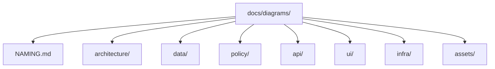
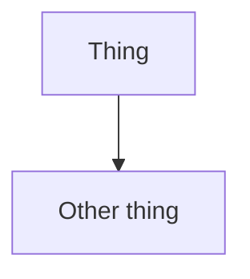
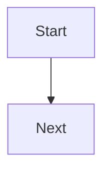

<!-- [KFM_META_BLOCK_V2]
doc_id: kfm://doc/f65408a5-e80a-431f-82e2-25e696ea3d16
title: Diagram naming
type: standard
version: v1
status: draft
owners: TBD
created: 2026-03-02
updated: 2026-03-02
policy_label: public
related:
  - TODO: docs/diagrams/README.md (add if/when a diagrams index exists)
tags: [kfm, diagrams, naming]
notes:
  - Defines naming conventions for diagram source + exported assets under docs/diagrams/.
  - Designed to keep diagram references stable for evidence-first docs and CI link checking.
[/KFM_META_BLOCK_V2] -->

# Diagram naming
**Purpose:** keep diagram paths predictable, linkable, and reviewable (so docs and evidence links do not break).


> **NOTE**
> This is a **repo-facing convention**. If your PR adds diagrams that do not follow these rules, expect review comments (or future CI lint failures).

## Navigation
- [Goals](#goals)
- [Directory layout](#directory-layout)
- [What belongs here](#what-belongs-here)
- [File naming scheme](#file-naming-scheme)
- [Diagram ID and stable linking](#diagram-id-and-stable-linking)
- [Source vs exported assets](#source-vs-exported-assets)
- [Supported diagram types](#supported-diagram-types)
- [Templates](#templates)
- [Examples](#examples)
- [PR review checklist](#pr-review-checklist)
- [Changelog](#changelog)

---

## Goals

Diagram names should make the following **cheap and reliable**:

1. **Stable references** from other docs (links shouldn’t rot).
2. **Deterministic discovery** (humans and tools can find “the diagram for X” quickly).
3. **Diff-friendly reviews** (source-first, text where possible; exports where needed).
4. **No environment leakage** (diagram identity should not bake in hostnames or deployment URLs).

---

## Directory layout

Recommended layout (add folders only when it improves navigation; avoid deep trees):

```text
docs/diagrams/
  NAMING.md
  architecture/
  data/
  policy/
  api/
  ui/
  infra/
  assets/          # exported images (svg/png) that are referenced by docs
```

Mermaid view of the same structure:



Fallback (for non-Mermaid renderers): `docs/diagrams/` contains diagram **sources** grouped by domain, plus `assets/` for exported images.

---

## What belongs here

### Acceptable inputs
- Diagram **source** files:
  - Markdown with Mermaid blocks (`.md`)
  - Mermaid-only source files (`.mmd`) *(optional; only if your tooling uses it)*
  - PlantUML source (`.puml`) *(only if you also document how to render it)*
  - Graphviz DOT source (`.dot`) *(same rule as above)*
- Exported, referenced assets:
  - `assets/*.svg`, `assets/*.png` (keep sizes reasonable; SVG preferred)

### Exclusions
- Random screenshots with unclear provenance (use source-first diagrams where possible).
- “final.png”, “diagram2.png”, “new-arch.png” (non-semantic names are not allowed).
- Generated files **without** a documented regeneration path.

> **TIP**
> If a diagram is generated (PlantUML, Graphviz, draw.io exports), commit the **source** and include a short “How to regenerate” note near the diagram or in the PR description.

---

## File naming scheme

### Naming grammar

Every diagram file name is composed of **tokens** separated by double hyphens:

```
<scope>--<subject>--<view>[--<qualifier>].<ext>
```

- **scope**: where/what the diagram is about (usually a subsystem)
- **subject**: the thing being explained (a concept, contract, flow, boundary)
- **view**: the diagram type / viewpoint (see allowed list below)
- **qualifier** *(optional)*: disambiguator (e.g., `public`, `restricted`, `overview`, `detailed`)
- **ext**: file extension

### Token rules (MUST)
- All tokens MUST be **lowercase**.
- Tokens MUST be **ASCII** letters/digits plus `-` and `_`.
- Avoid filler words: `final`, `new`, `latest`, `v2-final`, `old`, `temp`.

### Allowed `view` values (MUST)
Use one of these (extend only by updating this doc):

- `context`
- `container`
- `component`
- `sequence`
- `flow`
- `state`
- `er`
- `schema`
- `legend`

### File extension rules (SHOULD)
- Prefer **`.md`** with Mermaid blocks for most diagrams (diffable + GitHub-renderable).
- Use **`.svg`** exports when you need:
  - clickable links in SVG, or
  - a diagram tool that isn’t rendered on GitHub natively.
- Use **`.png`** only if SVG is not viable (e.g., complex raster imagery).

<details>
<summary>Optional: regex patterns for automation / linting</summary>

```regex
# Base filename (no directories):
^[a-z0-9]+[a-z0-9_-]*--[a-z0-9]+[a-z0-9_-]*--(context|container|component|sequence|flow|state|er|schema|legend)(--[a-z0-9]+[a-z0-9_-]*)?\.(md|mmd|puml|dot|svg|png)$
```

```regex
# Exported assets must mirror a source name:
^assets/[a-z0-9]+[a-z0-9_-]*--[a-z0-9]+[a-z0-9_-]*--(context|container|component|sequence|flow|state|er|schema|legend)(--[a-z0-9]+[a-z0-9_-]*)?\.(svg|png)$
```

</details>

---

## Diagram ID and stable linking

### Stable identity rule (MUST)
Once a diagram is linked from other docs, treat its **path as an API**:
- Prefer updating the file in place.
- Rename/move only when necessary.
- If a rename is unavoidable, add a small “forwarding note” in the old location (or update every inbound link in the same PR).

### Recommended in-file metadata (SHOULD)
For diagram Markdown files, include a tiny header block:

```yaml
---
diagram_id: docs/diagrams/<domain>/<filename>
scope: <scope>
subject: <subject>
view: <view>
owners: TBD
---
```

This is intentionally simple: it supports search, review, and future automation.

> **WARNING**
> Avoid embedding environment-specific hostnames in identifiers. Use hostnames in distribution URLs, not canonical IDs.

---

## Source vs exported assets

### Source-first rule (MUST)
If you commit an exported image (`assets/*.svg` or `assets/*.png`), you MUST also commit:
1. its source (Mermaid in `.md`, `.mmd`, `.puml`, `.dot`, etc.), and
2. regeneration instructions (command, tool, or steps).

### Export naming (MUST)
Exports MUST share the same base name as the source:

```text
policy--decision-engine--sequence.md
assets/policy--decision-engine--sequence.svg
```

---

## Supported diagram types

### Mermaid in Markdown (preferred)

Minimum pattern:

````md


Plaintext fallback: brief description of what the diagram shows.
````

### PlantUML / Graphviz (allowed with guardrails)

- Keep sources next to the doc or in a sibling folder.
- Commit exports to `assets/`.
- Include a “How to regenerate” snippet (see templates below).

---

## Templates

### Template: new Mermaid diagram file

Create `docs/diagrams/<domain>/<scope>--<subject>--<view>.md`:

````md
<!-- [KFM_META_BLOCK_V2]
doc_id: kfm://doc/<uuid>
title: <Short title>
type: standard
version: v1
status: draft
owners: TBD
created: 2026-03-02
updated: 2026-03-02
policy_label: public
related:
  - <links to relevant ADRs/contracts>
tags: [kfm, diagrams]
notes:
  - <one-line purpose>
[/KFM_META_BLOCK_V2] -->

# <Short title>



Fallback: This diagram shows <one-sentence description>.
````

### Template: “How to regenerate” block

Add near the bottom of the diagram file:

```bash
# Example regeneration commands (update to your actual tooling)
# Mermaid (if using a CLI renderer):
mmdc -i docs/diagrams/<domain>/<name>.mmd -o docs/diagrams/assets/<name>.svg

# PlantUML:
plantuml -tsvg docs/diagrams/<domain>/<name>.puml -o ../assets/
```

---

## Examples

### ✅ Good names
- `kfm--trust-membrane--context.md`
- `data--truth-path--flow.md`
- `policy--policy-labels--legend.md`
- `api--evidence-resolver--sequence.md`
- `ui--evidence-drawer--component.md`
- `data--noaa_ncei_storm_events--flow.md` *(dataset slug kept intact as a token)*

### ❌ Bad names
- `diagram.png`
- `final-architecture-v7.png`
- `new_new_policy_flowchart.md`
- `architecture (copy).svg`

---

## PR review checklist

- [ ] File name follows: `<scope>--<subject>--<view>[--<qualifier>].<ext>`
- [ ] Diagram is in the correct domain folder (or justified if not)
- [ ] Mermaid diagrams include a plaintext fallback sentence
- [ ] Any exported image has a committed source + regeneration instructions
- [ ] Any rename/move updates inbound links (or leaves a forwarding note)
- [ ] No environment-specific hostnames baked into canonical identifiers

---

## Changelog

- **2026-03-02** — v1 draft created.

[Back to top](#diagram-naming)
