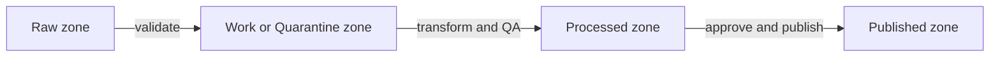

<!-- [KFM_META_BLOCK_V2]
doc_id: kfm://doc/d0120576-9857-4ab1-9619-d122fdae834b
title: docs/diagrams
type: standard
version: v2
status: draft
owners: KFM Maintainers
created: 2026-02-24
updated: 2026-03-01
policy_label: restricted
related:
  - docs/README.md
  - docs/architecture/README.md
tags: [kfm, diagrams]
notes:
  - Purpose: diagram sources + exports for KFM architecture, pipelines, and UI flows.
  - Update the related paths if your repo structure differs.
[/KFM_META_BLOCK_V2] -->

# docs/diagrams
Diagram sources + rendered exports for KFM architecture, data flows, and governed interfaces.


**Owners:** KFM Maintainers  
**Update cadence:** As architecture/pipeline/API/UI changes ship

> [!NOTE]
> **Single source of truth rule:** every committed rendered export in `out/` must have a matching editable source in `src/`.

---

## Where this fits in the repo

`docs/diagrams/` is the cross-cutting **diagram store** for the entire KFM system, referenced by:
- `docs/architecture/*` (system design + trust membrane views)
- `docs/pipelines/*` (ingestion/validation/promotion flows)
- `docs/ui/*` (Map/Story/Focus Mode routes + interaction flows)
- `docs/governance/*` (review gates, sensitivity rules, redaction patterns)

> [!TIP]
> If your repo already has `docs/architecture/diagrams/`, treat that as a *view* (links/shortcuts) and keep **canonical sources** here in `docs/diagrams/`.
> A simple pattern is a “redirect README” in `docs/architecture/diagrams/README.md` that links to this folder.

---

## Navigation
- [What belongs here](#what-belongs-here)
- [Directory layout](#directory-layout)
- [Diagram standards](#diagram-standards)
- [How to add a diagram](#how-to-add-a-diagram)
- [Rendering](#rendering)
- [Governance and safety](#governance-and-safety)
- [Diagram registry](#diagram-registry)
- [Appendix: Minimal diagram header template](#appendix-minimal-diagram-header-template)

---

## What belongs here

This directory is the **single home** for diagrams that explain or support the KFM system, including:

- **Architecture**: boundaries, trust membrane, interfaces/contracts, deployment views
- **Truth path lifecycle**: Upstream → Raw → Work/Quarantine → Processed → Catalog → Governed API → UI
- **Pipelines**: ingestion, validation, QA, provenance/audit, publishing, index/tiles rebuilds
- **APIs**: request/response flows, authn/authz, policy boundary, error model
- **UI**: route maps, interaction flows, Story/Map UI nodes, Focus Mode reasoning boundaries
- **Governance**: approval flows, redaction rules, sensitivity classifications

**Primary goal:** every diagram should be **traceable** to (a) a source artifact and (b) a policy decision, when applicable.

> [!NOTE]
> If you’re unsure where a diagram belongs, default to placing the *source* here and linking it from the most relevant doc (e.g., `docs/architecture/*`, `docs/pipelines/*`, `docs/ui/*`).

---

## Directory layout

> [!TIP]
> Prefer text-based, diff-friendly formats (Mermaid/PlantUML) for architecture and flow diagrams.
> Use binary formats (Draw.io/Excalidraw) only when you truly need freeform layout.

### Recommended full structure (sources + registry + optional exports)

```text
docs/diagrams/                                                     # Diagram system (canonical sources + optional rendered exports)
├─ README.md                                                       # This file: rules, naming, alt text, and render workflow
├─ STYLE_GUIDE.md                                                  # Optional: global diagram style rules (fonts, labels, icons)
├─ NAMING.md                                                       # Optional: filename + versioning rules (if you want more than README)
│
├─ registry/                                                       # Discovery + CI validation inputs
│  ├─ README.md                                                    # Registry format + how to validate
│  ├─ diagrams.yaml                                                # Canonical registry (recommended)
│  ├─ diagrams.csv                                                 # Optional export (spreadsheets)
│  ├─ diagrams.schema.json                                         # Optional schema for registry validation (if you enforce it)
│  ├─ tags.yaml                                                    # Optional controlled vocabulary (domains, view-types, sensitivity)
│  └─ checks/                                                      # Optional: lint/validation configs
│     ├─ mermaid-lint.yml
│     ├─ plantuml-lint.yml
│     └─ export-sync.rules.yml                                     # "every out/* must map to a src/*"
│
├─ templates/                                                      # Copy/paste starters (reduce drift)
│  ├─ README.md
│  ├─ DIAGRAM_HEADER.template.yml                                  # Header block template for diagram sources
│  ├─ mermaid/
│  │  ├─ flowchart.template.md
│  │  ├─ sequence.template.md
│  │  ├─ c4-context.template.md
│  │  └─ state-machine.template.md
│  ├─ plantuml/
│  │  ├─ sequence.template.puml
│  │  ├─ component.template.puml
│  │  └─ deployment.template.puml
│  ├─ drawio/
│  │  └─ template.drawio
│  └─ excalidraw/
│     └─ template.excalidraw
│
├─ src/                                                            # Diagram sources (canonical; always preferred)
│  ├─ _shared/                                                     # Reusable fragments + assets (avoid copy/paste drift)
│  │  ├─ README.md
│  │  ├─ assets/                                                   # Icons, logos, stencils, palettes
│  │  ├─ snippets/                                                 # Mermaid/PlantUML includes or fragments (if your tooling supports it)
│  │  └─ libraries/                                                # Draw.io / Excalidraw libraries (shapes, UI components)
│  │
│  ├─ architecture/                                                # System structure views (C4-style is encouraged)
│  │  ├─ README.md
│  │  ├─ c4/                                                       # Context/Container/Component-level views
│  │  │  ├─ context/
│  │  │  ├─ container/
│  │  │  └─ component/
│  │  ├─ trust-membrane/                                           # Policy boundary views (PEP/PDP, repo interfaces)
│  │  ├─ deployment/                                               # Environments, networking, K8s/Terraform conceptual layouts
│  │  └─ data-architecture/                                        # Canonical vs projections, index rebuilds, storage tiers
│  │
│  ├─ truth-path/                                                  # Upstream → zones → catalogs → governed surfaces
│  │  ├─ README.md
│  │  ├─ zones/                                                    # Raw / Work-Quarantine / Processed / Published gating
│  │  ├─ receipts/                                                 # Run receipts, audit trail, provenance bundle views
│  │  └─ catalog-linkage/                                          # DCAT/STAC/PROV cross-link diagrams
│  │
│  ├─ pipelines/                                                   # Pipeline & workflow diagrams
│  │  ├─ README.md
│  │  ├─ ingest/                                                   # Acquisition patterns, connectors, normalization
│  │  ├─ validate/                                                 # Schema checks, QA thresholds, quarantine triggers
│  │  ├─ promote/                                                  # Promotion contract and review gates
│  │  ├─ index-and-tiles/                                          # Search index rebuilds, PMTiles/vector tile pipelines
│  │  └─ monitoring/                                               # Observability + alerting flows tied to pipeline stages
│  │
│  ├─ interfaces/                                                  # Governed interfaces and boundary diagrams
│  │  ├─ README.md
│  │  ├─ api/                                                      # API boundary (routes, auth, error model, evidence resolver)
│  │  ├─ policy/                                                   # OPA/Rego policy flows + obligations
│  │  └─ evidence/                                                 # EvidenceRef → EvidenceBundle resolution + redaction
│  │
│  ├─ ui/                                                          # Map/Story/Focus Mode views
│  │  ├─ README.md
│  │  ├─ routes/                                                   # Route maps and page-level flows
│  │  ├─ interaction-flows/                                        # User flows (layer add, time scrub, evidence drawer)
│  │  ├─ story-nodes/                                              # Story Node v3 rendering + publish review flow
│  │  └─ focus-mode/                                               # Focus Mode orchestration boundaries (cite-or-abstain)
│  │
│  ├─ governance/                                                  # Governance, review gates, safety/redaction patterns
│  │  ├─ README.md
│  │  ├─ review-gates/                                             # Approvals, promotion checklists, steward roles
│  │  ├─ sensitivity/                                              # Policy labels, generalization, no-harm patterns
│  │  └─ audit/                                                    # Audit records, provenance, traceability surfaces
│  │
│  └─ operations/                                                  # Operational diagrams (runbooks, incident flows)
│     ├─ README.md
│     ├─ incident-response/
│     ├─ access-management/
│     └─ backup-and-recovery/
│
├─ out/                                                            # Optional rendered exports (only when needed by consumers)
│  ├─ README.md
│  ├─ architecture/
│  │  ├─ svg/
│  │  ├─ png/
│  │  └─ pdf/
│  ├─ truth-path/
│  │  ├─ svg/
│  │  ├─ png/
│  │  └─ pdf/
│  ├─ pipelines/
│  │  ├─ svg/
│  │  ├─ png/
│  │  └─ pdf/
│  ├─ interfaces/
│  │  ├─ svg/
│  │  ├─ png/
│  │  └─ pdf/
│  ├─ ui/
│  │  ├─ svg/
│  │  ├─ png/
│  │  └─ pdf/
│  ├─ governance/
│  │  ├─ svg/
│  │  ├─ png/
│  │  └─ pdf/
│  └─ thumbnails/                                                  # Optional small previews (registry/table rendering)
│
└─ tools/                                                          # Optional local helpers (keep here OR at repo root; pick one)
   ├─ README.md
   ├─ render/                                                      # Rendering entrypoints (repo-specific)
   ├─ lint/                                                        # Linting + registry validation helpers
   └─ ci/                                                          # Workflow templates/snippets (if you keep diagram CI isolated)
```

### Acceptable inputs
- `*.md` containing Mermaid diagrams (recommended for GitHub rendering)
- `*.mmd` Mermaid source (if your renderer supports it)
- `*.puml` PlantUML source
- `*.drawio` / `*.drawio.svg` for Draw.io (diagrams.net)
- `*.excalidraw` / `*.excalidraw.svg` for Excalidraw
- Rendered exports: `*.svg`, `*.png`, `*.pdf` **when** needed for downstream docs, PDFs, or slide decks

### Exclusions
- No rendered/exported artifacts **without** a corresponding source in `src/`
- No screenshots of diagrams when the source can be committed instead
- No sensitive details that increase risk (see [Governance and safety](#governance-and-safety))

---

## Diagram standards

### 1) Every diagram must have a header block

Put a short, consistent header at the top of each diagram source file (or directly above a Mermaid block):

```yaml
diagram_id: kfm://diagram/<uuid>
title: <human name>
status: draft|review|published
owners: <team or names>
created: YYYY-MM-DD
updated: YYYY-MM-DD
source_of_truth:
  - <path to spec, ADR, OpenAPI, schema, pipeline config>
policy:
  label: public|restricted|...
  notes:
    - <why>
```

### 2) Prefer “source-first” storage

- Commit the **editable** source (`.md`, `.mmd`, `.puml`, `.drawio`, `.excalidraw`)
- Optionally commit rendered outputs in `out/` when:
  - a consumer cannot render the source format, or
  - you need stable assets for PDFs, slide decks, or external publishing

### 3) Naming convention

Recommended filename pattern:

```text
<domain>--<topic>--v<major>.<minor>--YYYY-MM-DD.<ext>
```

Examples:
- `governance--data-promotion-gates--v1.0--2026-03-01.md`
- `interfaces--policy-boundary--v0.3--2026-03-01.puml`
- `ui--story-node-flow--v2.1--2026-03-01.drawio`

### 4) Mermaid conventions

- Keep node labels short and readable.
- Avoid special characters that break renderers.
- **Do not use the pipe character in node text**.

Example: Data lifecycle (promotion zones)



### 5) Diagrams are governed artifacts

Diagrams are treated as production documentation:

- They should **not bypass** the system’s governed interfaces (e.g., “UI calls DB directly” diagrams are invalid unless explicitly describing an anti-pattern).
- They must reflect the current architecture on the default branch.
- They should be reviewed when they impact:
  - access control assumptions
  - data sensitivity handling
  - public-facing narratives
  - Focus Mode reasoning or evidence claims

---

## How to add a diagram

1. **Choose a source format**
   - Flow/architecture: Mermaid or PlantUML
   - Freeform UI flows: Draw.io or Excalidraw (include an SVG export when helpful)

2. **Create the source file under `src/`**
   - Add the header block (diagram_id, owners, policy label, sources)

3. **Link it from the consuming doc**
   - Use a *relative link* to the source (preferred) or to a rendered export if needed

4. **Register it**
   - Add an entry in the [Diagram registry](#diagram-registry)

5. **Review checklist**
   - [ ] The diagram matches current code/config/contracts
   - [ ] No sensitive details are exposed (locations, credentials, private endpoints)
   - [ ] Sources are linked (ADR/spec/OpenAPI/schema/pipeline config)
   - [ ] If exported assets exist, they are reproducible from the source

---

## Rendering

> [!WARNING]
> Rendering steps are repo-specific. If your build system provides diagram tooling, document the exact commands here.

Suggested options (pick one and standardize):

- **Mermaid**: rendered natively by GitHub in Markdown
- **PlantUML**: render `.puml` → `.svg` (local jar, container, or CI job)
- **Draw.io**: maintain `.drawio` and export `.svg` alongside it

### CI recommendation (proposed)
- Lint Mermaid blocks (fail on syntax errors)
- Ensure every committed `out/` export has a matching `src/` input
- Optionally regenerate exports in CI and compare diffs (fail if out-of-date)

---

## Governance and safety

### Sensitivity rules
- If a diagram touches **sensitive or restricted** information, either:
  - generalize it (coarse geography, redacted identifiers), or
  - place it behind appropriate access controls (repo permissions), and label it clearly.

### Avoid enabling harm
Do not include:
- precise coordinates for vulnerable sites
- instructions that enable targeting, exploitation, or bypassing controls
- credentials, secrets, tokens, or internal-only endpoints

---

## Diagram registry

Maintain a lightweight registry so diagrams are discoverable.

> [!TIP]
> Prefer `registry/diagrams.yaml` as the canonical registry, and generate `diagrams.csv` from it if you want a spreadsheet view.

### Registry table (human-facing view)

| diagram_id | Domain | File | Purpose | Status | Policy | Owner | Updated |
|---|---|---|---|---|---|---|---|
| kfm://diagram/TODO | governance | `src/governance/review-gates/governance--promotion-gates--v1.0--2026-03-01.md` | Promotion contract + review gate overview | draft | restricted | KFM Maintainers | 2026-03-01 |

---

## Appendix: Minimal diagram header template

<details>
<summary>Copy/paste template</summary>

```yaml
diagram_id: kfm://diagram/<uuid>
title: <title>
status: draft
owners: <owners>
created: YYYY-MM-DD
updated: YYYY-MM-DD
source_of_truth:
  - <path>
policy:
  label: restricted
  notes:
    - <note>
```
</details>

---

[Back to top](#docsdiagrams)