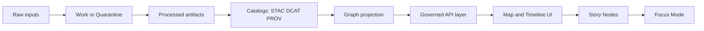

# Diagrams
_Map-first, time-aware, governed diagrams for Kansas Frontier Matrix (KFM)._

**Status:** Draft · **Owners:** Docs + Architecture (TBD)  
`docs` `diagrams` `contract-first` `evidence-first` `map-first` `time-aware` `governed`

- **Why this exists:** keep KFM’s “truth path” and trust boundaries visible, reviewable, and hard to accidentally break.
- **What this is not:** an image dump. Anything here should either (a) explain a contract/boundary, or (b) support a governed narrative/UX flow.

## Navigation
- [What belongs here](#what-belongs-here)
- [Directory layout](#directory-layout)
- [Diagram catalog](#diagram-catalog)
- [Diagram standards](#diagram-standards)
- [Security and sensitivity](#security-and-sensitivity)
- [Definition of done](#definition-of-done)
- [Notes](#notes)

---

## What belongs here

This directory contains **diagrams that describe**:

1) **System boundaries** (what talks to what) and **trust boundaries** (what is allowed to access what).  
2) **Data lifecycle + promotion gates** (how data becomes publishable / queryable).  
3) **Catalog + provenance surfaces** (how STAC/DCAT/PROV connect to runtime features).  
4) **Map/Story/Focus UX flows** where evidence and policy are user-visible trust surfaces.

If a diagram would change how someone implements KFM, treat it as **a governed artifact**: keep it precise, keep it current, and tie it to the contracts/docs it represents.

---

## Directory layout

This is a **recommended** layout. Create subfolders when you add the first diagram in that category.

```text
docs/diagrams/
  README.md                 # this file
  architecture/             # subsystem boundaries, trust membrane diagrams
  data/                     # raw→work→processed, catalogs, promotion gates
  governance/               # policy labels, obligations, review flows
  ui/                       # map/timeline/story/evidence drawer flows
  focus-mode/               # retrieval + evidence + citation verification flows
  security/                 # threat models, abuse cases, mitigations
  adr/                      # decision diagrams paired with ADRs (if used)
```

---

## Diagram catalog

Add every diagram to this table so people can find “the one true picture” quickly.

| ID | Diagram | Primary file | Owner | Status | Notes |
|---:|---|---|---|---|---|
| KFM-DIAG-ARCH-01 | Canonical pipeline boundaries | `architecture/pipeline-boundaries.md` | TBD | Proposed | Should match Master Guide + blueprint docs |
| KFM-DIAG-DATA-01 | Data lifecycle + promotion gates | `data/lifecycle-and-promotion.md` | TBD | Proposed | Raw/work/quarantine/processed + catalogs |
| KFM-DIAG-GOV-01 | Policy decisions + obligations | `governance/policy-decision-flow.md` | TBD | Proposed | “default-deny” posture and redaction steps |
| KFM-DIAG-UI-01 | Map Explorer trust surface | `ui/map-explorer-trust-surface.md` | TBD | Proposed | Where version/license/policy badges appear |
| KFM-DIAG-FOCUS-01 | Focus Mode control loop | `focus-mode/control-loop.md` | TBD | Proposed | Must include citation verification hard gate |
| KFM-DIAG-SEC-01 | Trust membrane threat model | `security/trust-membrane-checklist.md` | TBD | Proposed | Frontend must not bypass policy surfaces |

> Tip: prefer **one diagram = one file** (plus optional export), so ownership + review are clear.

---

## Diagram standards

### Preferred formats
- **Mermaid in Markdown** for most diagrams (diffable, reviewable in PRs).
- For tools like draw.io / Figma / Illustrator:
  - Commit the **source** file (editable) and an exported **SVG** (preferred) or PNG.
  - Keep exports “derived”; treat the source as canonical.

### Naming
Use stable, readable names:
- `kebab-case` files and folders
- include scope in the name when helpful:
  - `pipeline-boundaries.md`
  - `data-lifecycle.md`
  - `focus-mode-control-loop.md`

### Content rules
- Labels should be **verbs** on arrows when it helps (“promotes”, “validates”, “resolves evidence”).
- Keep node text short and unambiguous.
- Avoid “magic” arrows that skip policy/provenance steps.

### Mermaid conventions
- Prefer `flowchart LR` or `flowchart TD` (simple + readable).
- Avoid very long node strings.
- If diagram meaning is critical, include a short **plain-language summary** below it.

#### Example: canonical boundary flow (starter)


Summary: data must become **processed + cataloged + policy-checked** before it is allowed into runtime surfaces (graph, API, UI, story, focus).

---

## Security and sensitivity

Diagrams can leak sensitive details even when the code is private.

Do **not** put the following in diagrams unless the diagram is explicitly restricted and reviewed:
- secrets, tokens, internal credentials
- private hostnames, bucket names, or network topology that increases attack surface
- precise locations for sensitive sites or vulnerable infrastructure
- anything that would allow inference of restricted datasets through “existence hints”

When in doubt: generalize, remove specifics, and add a note like **“details intentionally omitted; see restricted design doc”**.

---

## Definition of done

When adding or changing a diagram, the PR should satisfy:

- [ ] Diagram is listed in the [Diagram catalog](#diagram-catalog)
- [ ] Diagram has an owner (team or steward)
- [ ] Diagram has a short summary and states key assumptions
- [ ] If the diagram represents a contract/boundary: it links to the governing doc/ADR/contract
- [ ] If an export exists (SVG/PNG), the editable source is also committed
- [ ] No sensitive details are included (or the diagram is correctly restricted + reviewed)
- [ ] Diagram renders on GitHub (Mermaid) or has a usable exported artifact
- [ ] Links are valid (or explicitly marked as “expected path”)

---

## Notes

- Treat diagrams as “living contracts”: when code or policy changes, update the diagram in the same PR (or create a follow-up PR immediately).
- If multiple diagrams disagree, the “owner + governing doc” decides; fix the drift, don’t let it linger.
