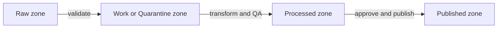

<!-- [KFM_META_BLOCK_V2]
doc_id: kfm://doc/d0120576-9857-4ab1-9619-d122fdae834b
title: docs/diagrams
type: standard
version: v1
status: draft
owners: KFM Maintainers
created: 2026-02-24
updated: 2026-02-24
policy_label: restricted
related:
  - docs/README.md
  - docs/architecture/README.md
tags: [kfm, diagrams]
notes:
  - Purpose: diagram sources + exports for KFM architecture, pipelines, and UI flows.
  - Update the related paths if your repo structure differs.
[/KFM_META_BLOCK_V2] -->

# docs/diagrams
Diagram sources + rendered exports for KFM architecture, data flows, and governed interfaces.


**Owners:** KFM Maintainers  
**Update cadence:** As architecture/pipeline/API/UI changes ship

---

## Navigation
- [What belongs here](#what-belongs-here)
- [Directory layout](#directory-layout)
- [Diagram standards](#diagram-standards)
- [How to add a diagram](#how-to-add-a-diagram)
- [Rendering](#rendering)
- [Governance and safety](#governance-and-safety)
- [Diagram registry](#diagram-registry)

---

## What belongs here

This directory is the **single home** for diagrams that explain or support the KFM system, including:

- **Architecture**: domain boundaries, trust membrane, interfaces/contracts, deployment views
- **Data lifecycle**: Raw → Work/Quarantine → Processed → Published promotion gates
- **Pipelines**: ingestion, validation, QA, provenance/audit, publishing
- **APIs**: request/response flows, authz/authn, policy boundary, error model
- **UI**: route maps, interaction flows, Story/Map UI nodes, Focus Mode reasoning boundaries
- **Governance**: approval flows, redaction rules, sensitivity classifications

**Primary goal:** every diagram should be **traceable** to (a) a source artifact and (b) a policy decision, when applicable.

> [!NOTE]
> If you’re unsure where a diagram belongs, default to placing the *source* here and linking it from the most relevant doc (e.g., `docs/architecture/*`, `docs/pipelines/*`, `docs/ui/*`).

---

## Directory layout

> [!TIP]
> Prefer text-based, diff-friendly formats (Mermaid/PlantUML) for architecture and flow diagrams.
> Use binary formats (Draw.io/Excalidraw) when you truly need freeform layout.

Expected structure (adjust to match your repo):

```text
docs/diagrams/                                   # Diagram system (sources + optional rendered exports)
├─ README.md                                     # This file: rules, naming, alt text, and render workflow
│
├─ registry/                                     # Optional registries/manifests for discovery + CI checks
│  └─ diagrams.csv                               # Optional machine-readable diagram registry (id, title, src, output)
│
├─ src/                                          # Diagram sources (preferred; treat as canonical)
│  ├─ mermaid/                                   # Mermaid sources (.mmd or .md w/ Mermaid blocks)
│  ├─ plantuml/                                  # PlantUML sources (.puml)
│  ├─ drawio/                                    # Draw.io sources (.drawio)
│  └─ excalidraw/                                # Excalidraw sources (.excalidraw)
│
└─ out/                                          # Optional rendered exports (recommended for docs consumption)
   ├─ svg/                                       # Vector exports (preferred for docs)
   ├─ png/                                       # Raster exports (previews/thumbnails)
   └─ pdf/                                       # PDF exports (print/share)
```

### Acceptable inputs
- `*.md` containing Mermaid diagrams (recommended for GitHub rendering)
- `*.mmd` Mermaid source (if your renderer supports it)
- `*.puml` PlantUML source
- `*.drawio` / `*.drawio.svg` for Draw.io (diagrams.net)
- `*.excalidraw` / `*.excalidraw.svg` for Excalidraw
- Rendered exports: `*.svg`, `*.png`, `*.pdf` **when** needed for downstream docs, PDFs, or slide decks

### Exclusions
- No generated artifacts **without** a corresponding source in `src/`
- No screenshots of diagrams when the source can be committed instead
- No sensitive details that increase risk (see [Governance and safety](#governance-and-safety))

---

## Diagram standards

### 1) Every diagram must have a header block

Put a short, consistent header at the top of each diagram source file (or directly above a Mermaid block):

```yaml
diagram_id: kfm://diagram/<uuid>
title: <human name>
status: draft|review|published
owners: <team or names>
updated: YYYY-MM-DD
source_of_truth:
  - <path to spec, ADR, OpenAPI, schema, pipeline config>
policy:
  label: public|restricted|...
  notes: <why>
```

### 2) Prefer “source-first” storage

- Commit the **editable** source (`.md`, `.mmd`, `.puml`, `.drawio`, `.excalidraw`)
- Optionally commit rendered outputs in `out/` when:
  - a consumer cannot render the source format, or
  - you need stable assets for PDFs, slide decks, or external publishing

### 3) Naming convention

Recommended filename pattern:

```text
<domain>--<topic>--v<major>.<minor>--YYYY-MM-DD.<ext>
```

Examples:
- `governance--data-promotion-gates--v1.0--2026-02-24.md`
- `api--policy-boundary--v0.3--2026-02-24.puml`
- `ui--story-node-flow--v2.1--2026-02-24.drawio`

### 4) Mermaid conventions

- Keep node labels short and readable.
- Avoid special characters that break renderers.
- **Do not use the pipe character in node text**.

Example: Data lifecycle (promotion zones)



### 5) Diagrams are governed artifacts

Diagrams are treated as production documentation:

- They should **not bypass** the system’s governed interfaces (e.g., “UI calls DB directly” diagrams are invalid unless explicitly describing an anti-pattern).
- They must reflect the current architecture on the default branch.
- They should be reviewed when they impact:
  - access control assumptions
  - data sensitivity handling
  - public-facing narratives
  - Focus Mode reasoning or evidence claims

---

## How to add a diagram

1. **Choose a source format**
   - Flow/architecture: Mermaid or PlantUML
   - Freeform UI flows: Draw.io or Excalidraw (include an SVG export when helpful)

2. **Create the source file under `src/`**
   - Add the header block (diagram_id, owners, policy label, sources)

3. **Link it from the consuming doc**
   - Use a *relative link* to the source (preferred) or to a rendered export if needed

4. **Register it**
   - Add an entry in the [Diagram registry](#diagram-registry)

5. **Review checklist**
   - [ ] The diagram matches current code/config/contracts
   - [ ] No sensitive details are exposed (locations, credentials, private endpoints)
   - [ ] Sources are linked (ADR/spec/OpenAPI/schema/pipeline config)
   - [ ] If exported assets exist, they are reproducible from the source

---

## Rendering

> [!WARNING]
> Rendering steps are repo-specific. If your build system provides diagram tooling, document the exact commands here.

Suggested options (pick one and standardize):

- **Mermaid**: rendered natively by GitHub in Markdown
- **PlantUML**: render `.puml` → `.svg` (local jar, container, or CI job)
- **Draw.io**: maintain `.drawio` and export `.svg` alongside it

### CI recommendation (proposed)
- Lint Mermaid blocks (fail on syntax errors)
- Ensure every committed `out/` export has a matching `src/` input
- Optionally regenerate exports in CI and compare diffs (fail if out-of-date)

---

## Governance and safety

### Sensitivity rules
- If a diagram touches **sensitive or restricted** information, either:
  - generalize it (coarse geography, redacted identifiers), or
  - place it behind appropriate access controls (repo permissions), and label it clearly.

### Avoid enabling harm
Do not include:
- precise coordinates for vulnerable sites
- instructions that enable targeting, exploitation, or bypassing controls
- credentials, secrets, tokens, or internal-only endpoints

---

## Diagram registry

Maintain a lightweight registry so diagrams are discoverable.

| diagram_id | File | Purpose | Status | Owner | Updated |
|---|---|---|---|---|---|
| kfm://diagram/TODO | `src/mermaid/governance--data-promotion-gates--v1.0--2026-02-24.md` | Data lifecycle zones and promotion gates | draft | KFM Maintainers | 2026-02-24 |

> [!TIP]
> If you prefer machine-readable indexes, add `docs/diagrams/registry/diagrams.csv` and keep it in sync.

---

### Appendix: Minimal diagram header template

<details>
<summary>Copy/paste template</summary>

```yaml
diagram_id: kfm://diagram/<uuid>
title: <title>
status: draft
owners: <owners>
created: YYYY-MM-DD
updated: YYYY-MM-DD
source_of_truth:
  - <path>
policy:
  label: restricted
  notes:
    - <note>
```
</details>

---

[Back to top](#docsdiagrams)
