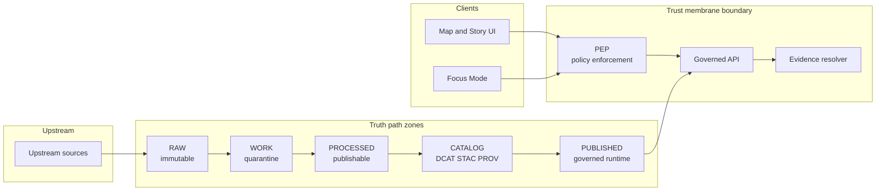
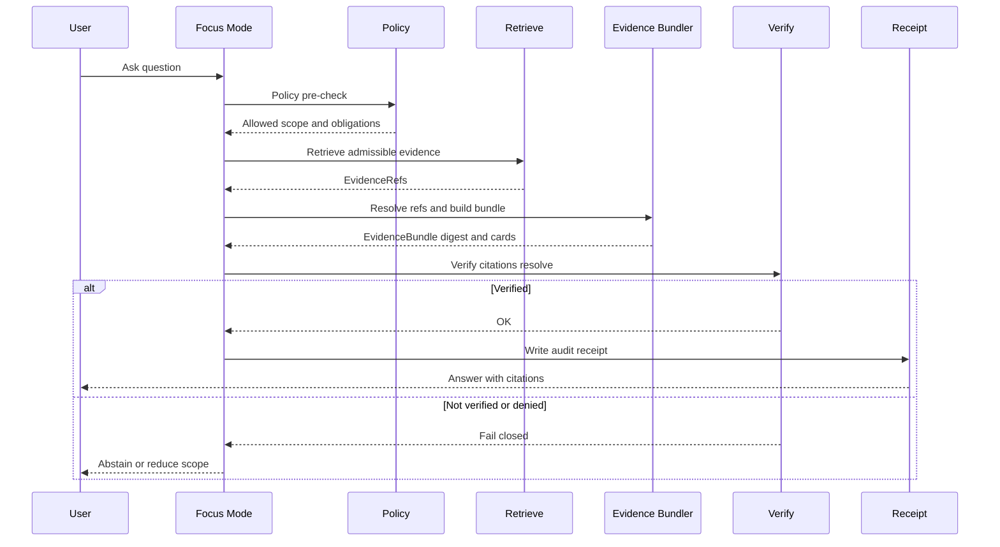
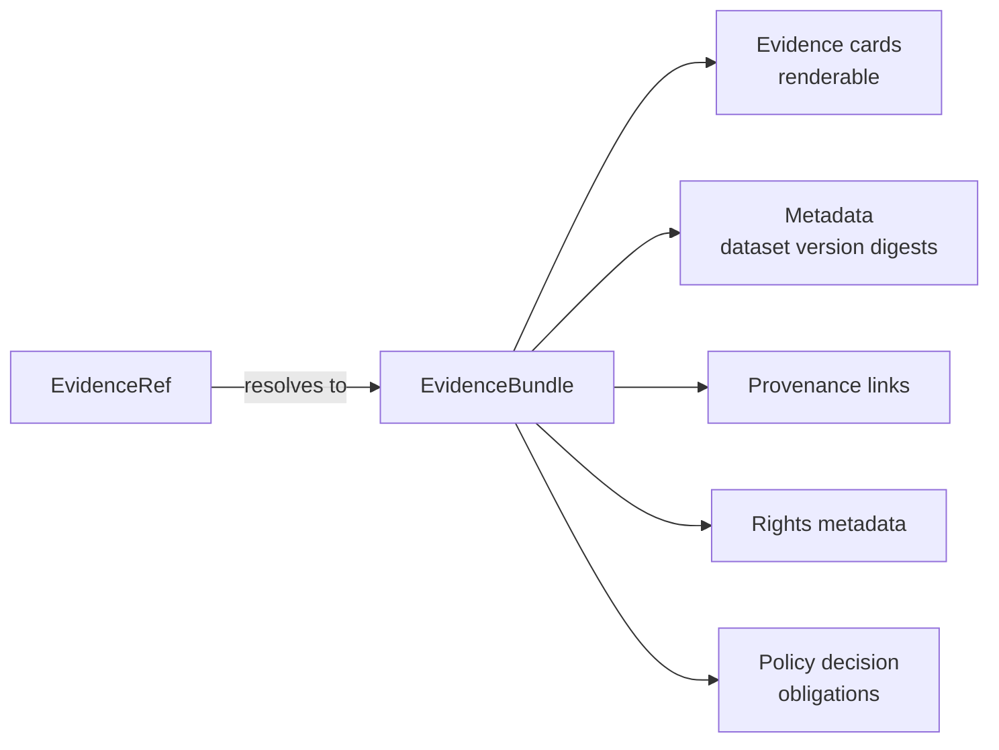

<!-- [KFM_META_BLOCK_V2]
doc_id: kfm://doc/4c7e6e9e-4c66-4a3f-9e7b-6ab1b9f3f8a1
title: KFM Diagram Style Guide
type: standard
version: v1
status: draft
owners: TBD
created: 2026-03-02
updated: 2026-03-02
policy_label: public
related:
  - docs/diagrams/
tags: [kfm, diagrams, style-guide]
notes:
  - This file defines house rules for diagrams (Mermaid-first) used across KFM docs.
  - Owners + policy_label should be confirmed in governance review.
[/KFM_META_BLOCK_V2] -->

# KFM Diagram Style Guide
**Purpose:** Make diagrams *legible, reviewable, governable,* and *evidence-aligned* across the Kansas Frontier Matrix (KFM).


> **WARNING**
> Diagrams are “user-facing claims in pictures.” If a diagram implies a behavior or guarantee, it must be **traceable** (tagged, scoped, and consistent with KFM invariants). When in doubt, mark uncertain parts as **PROPOSED**.

## Navigation
- [Goals](#goals)
- [What counts as a diagram](#what-counts-as-a-diagram)
- [Core KFM invariants to reflect](#core-kfm-invariants-to-reflect)
- [Diagram taxonomy](#diagram-taxonomy)
- [Conventions](#conventions)
- [Mermaid rules](#mermaid-rules)
- [Templates](#templates)
- [Review checklist](#review-checklist)
- [Directory layout](#directory-layout)
- [Appendix](#appendix)

---

## Goals
Diagrams in KFM documentation must:

- **Reduce ambiguity** (reviewers should not need a meeting to interpret them).
- **Support governance** (boundaries, policy, evidence, and promotion gates are explicit).
- **Stay maintainable** (diagram sources live in git; diffs are meaningful).
- **Be accessible** (do not rely on color alone; include a short text summary).

[↑ Back to top](#kfm-diagram-style-guide)

---

## What counts as a diagram
A “diagram” includes:

- Architecture block diagrams
- Data flow / pipeline flows
- Sequence diagrams (request paths)
- State machines (lifecycle zones, promotion gates)
- UI flows (Map/Story/Focus Mode)
- ERDs / schema relationships (when applicable)

**Out of scope:** cartographic map design guidance (see mapping design docs elsewhere).

[↑ Back to top](#kfm-diagram-style-guide)

---

## Core KFM invariants to reflect
When you diagram KFM, these are the *must-not-break* concepts that should appear **explicitly** where relevant:

1) **Truth path zones + promotion gates**  
   Upstream → RAW → WORK/QUARANTINE → PROCESSED → CATALOG/TRIPLET → PUBLISHED.

2) **Trust membrane**  
   Clients **never** hit databases/object stores directly. Access flows through a governed API and policy enforcement boundary.

3) **Evidence-first UX + cite-or-abstain behavior**  
   Anything shown in UI/Story/Focus outputs should be backed by resolvable evidence; if verification fails, the system narrows or abstains.

> **TIP**
> If your diagram does not touch these invariants, do not force them in. But when it *does*, make them visible, not implied.

[↑ Back to top](#kfm-diagram-style-guide)

---

## Diagram taxonomy
Use these categories to name and review diagrams:

| Category | Use when you need to show | Typical audience | Must include |
|---|---|---|---|
| `architecture` | components + boundaries | engineers, reviewers | trust membrane boundary |
| `dataflow` | movement across lifecycle zones | data engineers, stewards | truth path zones, gates |
| `sequence` | API paths + responsibilities | engineers, security | policy checks, verification gates |
| `state` | lifecycle states (dataset/story/evidence) | engineers, stewards | states + transitions + guard conditions |
| `ui-flow` | user journeys | product, design, reviewers | evidence drawer / citations touchpoints |
| `schema` | relationships + keys | data engineers | identifiers + time semantics (if relevant) |

[↑ Back to top](#kfm-diagram-style-guide)

---

## Conventions

### 1) Every diagram gets a header block
At the top of the Markdown file containing the diagram (or above the Mermaid block), include:

- **Title**
- **Status:** `CONFIRMED` / `PROPOSED` / `UNKNOWN`
- **Scope:** what the diagram covers and what it explicitly does *not* cover
- **Assumptions:** any assumptions the diagram depends on
- **Last verified:** date + how it was verified (repo path, contract, ADR, etc.)

Example:

```text
Title: Focus Mode control loop
Status: CONFIRMED (concept), PROPOSED (endpoint names)
Scope: governed Q&A flow, excludes UI rendering details
Assumptions: evidence resolver exists; citations are verifiable
Last verified: 2026-03-02 (against KFM governance guide)
```

### 2) Tag uncertain details, don’t hide them
- Prefer explicit labels like `PROPOSED: <detail>` and `UNKNOWN: <detail>` over vague dashed lines.
- If the repo could differ, do **not** draw a “final architecture” without marking it PROPOSED.

### 3) Boundary-first layout
Show boundaries early and clearly:

- `Client` boundary (UI, CLI, external tools)
- `Trust membrane` boundary (policy enforcement point, governed API, evidence resolver)
- `Storage / Canonical stores` boundary (if shown)

### 4) Time-aware naming
If time is relevant, label it:

- `event_time` (when it happened in the world)
- `valid_time` (when it is true in reality)
- `transaction_time` (when the system recorded it)

If time is *not* relevant, say so in `Scope`.

### 5) Safety + sensitivity in diagrams
If the diagram includes location/sensitive entities:

- Do **not** include precise coordinates for vulnerable/private/culturally restricted sites.
- Use coarse geography (county/region) and label the generalization.
- If sensitivity is unclear: **default-deny** (redact or omit; add a note).

[↑ Back to top](#kfm-diagram-style-guide)

---

## Mermaid rules
Mermaid is the default because it’s text, reviewable, and renders in GitHub-flavored Markdown.

### Required
- Use fenced blocks labeled `mermaid`:
  ```mermaid
  flowchart LR
    A --> B
  ```
- **Avoid the `|` character in node text.** (It can break or confuse renderers and is easy to misread in diffs.)
- Keep node labels short; prefer `<br/>` for line breaks.
- Prefer **left-to-right** (`LR`) for architecture/dataflow unless vertical is clearly better.
- Prefer nouns for components (`Policy Engine`, `Evidence Resolver`) and verbs for edges (`resolves`, `validates`).

### Recommended
- Use `subgraph` to show boundaries (Client, Trust membrane, Stores).
- Use consistent names across diagrams:
  - `PEP` for the policy enforcement point boundary component
  - `Evidence Resolver` for EvidenceRef → EvidenceBundle
  - `Run Receipt` for audit/receipt artifact

### Forbidden
- Color-only semantics (“red means denied”) without labels.
- Unlabeled arrows. Every edge should convey a relationship.
- Diagrams that contradict invariants (e.g., UI → DB direct).

> **NOTE**
> If Mermaid rendering is unavailable in a viewer, the code block should still read like structured pseudocode.

[↑ Back to top](#kfm-diagram-style-guide)

---

## Templates

### Template: Truth path + trust membrane overview
**Use for:** explaining the governed lifecycle and runtime boundary in one picture.  
**Status guidance:** treat exact module names as PROPOSED unless the repo confirms them.



**Text summary:** Upstream data promotes through lifecycle zones; clients only access promoted outputs through the trust membrane, where policy and evidence resolution occur.

---

### Template: Focus Mode governed control loop
**Use for:** showing anti-hallucination gates.



**Text summary:** The system must fail closed if citations cannot be verified or policy denies.

---

### Template: Evidence Resolver contract slice
**Use for:** any place you diagram citations.



**Text summary:** A “citation” is a resolvable reference that yields an inspectable bundle, not just a pasted URL.

[↑ Back to top](#kfm-diagram-style-guide)

---

## Review checklist
Use this checklist in PR review for any changed/added diagram.

### Diagram quality
- [ ] Title + Status (`CONFIRMED/PROPOSED/UNKNOWN`) present
- [ ] Scope and exclusions are explicit
- [ ] Boundaries are clear (Client vs Trust membrane vs Stores)
- [ ] Edges are labeled and directional meaning is clear
- [ ] Diagram is readable without color
- [ ] A 1–3 sentence text summary exists under the diagram

### Governance alignment
- [ ] If showing data movement, truth path zones are correct
- [ ] If showing runtime access, trust membrane is enforced (no direct client → store)
- [ ] If diagram implies “guarantees,” they align with KFM invariants or are marked PROPOSED
- [ ] Any sensitive location handling is generalized/redacted as needed

### Maintainability
- [ ] Mermaid compiles (no renderer errors)
- [ ] Nodes avoid `|` in text labels
- [ ] Names match other diagrams (PEP, Evidence Resolver, etc.)
- [ ] If a generated image is used, the source-of-truth diagram is present and referenced

[↑ Back to top](#kfm-diagram-style-guide)

---

## Directory layout
This repository already contains `docs/` and `docs/diagrams/` (per inventory docs). Recommended structure *for diagrams*:

```text
docs/diagrams/
  STYLE_GUIDE.md              # this file
  architecture/               # PROPOSED: architecture views
  dataflow/                   # PROPOSED: truth path, pipelines
  sequence/                   # PROPOSED: request flows
  ui-flow/                    # PROPOSED: user journeys
  schema/                     # PROPOSED: ERDs, key relationships
```

> **NOTE**
> If the repo uses a different layout, keep the *intent* of the folders, but follow repo conventions.

[↑ Back to top](#kfm-diagram-style-guide)

---

## Appendix

<details>
  <summary>Diagram DoD (Definition of Done)</summary>

- Diagram updated in the same change as the behavior/contract it documents.
- Diagram is tagged with status and has a text summary.
- If the diagram impacts Story Nodes or Focus Mode behavior, ensure citation/verification gates are shown or referenced.
- If diagram shows promotion/gating, include the gate name and what fails closed.

</details>

<details>
  <summary>Mermaid quick reference</summary>

- `flowchart LR` for architecture and dataflow
- `sequenceDiagram` for request paths
- `stateDiagram-v2` for lifecycle states
- Use `subgraph` for boundaries
- Prefer `<br/>` over long labels

</details>

---

_End of document._
