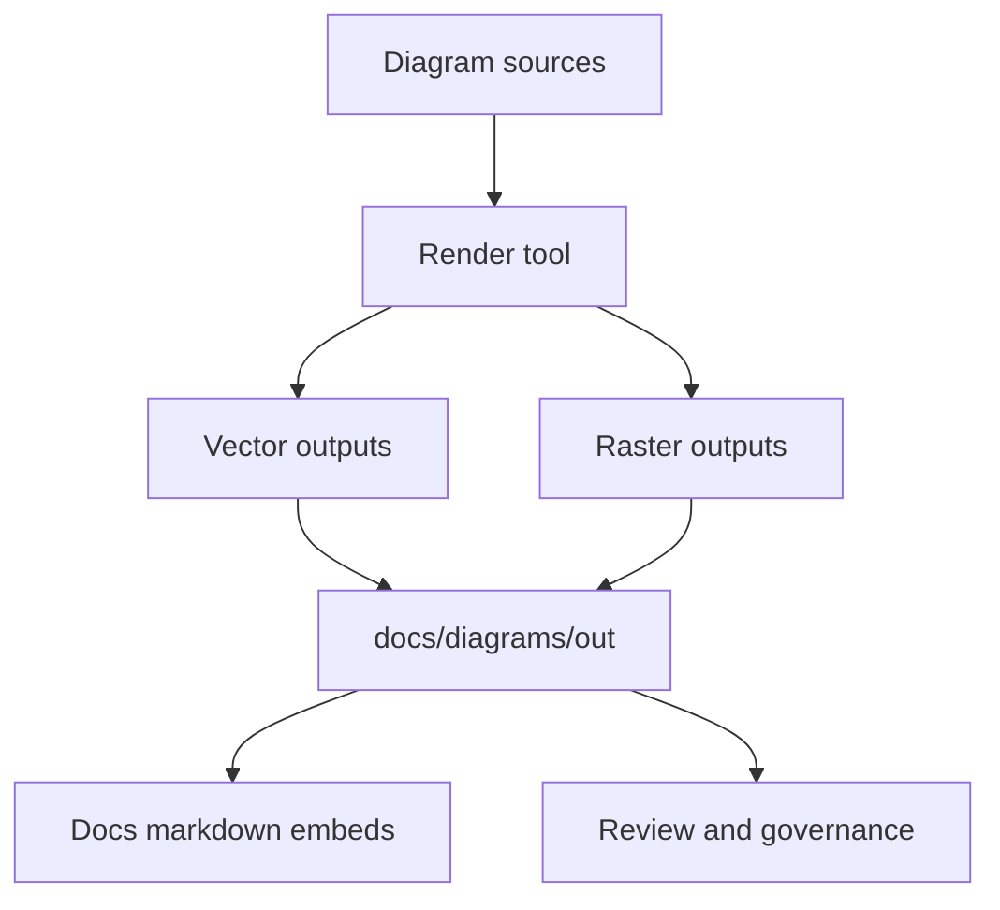

<!-- [KFM_META_BLOCK_V2]
doc_id: kfm://doc/0e0b5a5a-4b5d-4c8f-9b6e-3b2e4c3fdb6c
title: docs/diagrams/out
type: standard
version: v1
status: draft
owners: TODO
created: 2026-03-01
updated: 2026-03-01
policy_label: public
related:
  - ../README.md
  - ../../README.md
tags: [kfm, docs, diagrams, build-artifacts]
notes:
  - Generated diagram outputs used by documentation and design review.
[/KFM_META_BLOCK_V2] -->

# docs/diagrams/out

Generated **diagram render outputs** used across KFM documentation and design review.

**Status:** generated · **Owners:** TODO · **Policy:** public


> WARNING  
> Treat everything in `docs/diagrams/out/` as **build output**.  
> If you need to change a diagram, edit the **diagram source** (expected in `docs/diagrams/src/`) and re-render.

---

## Quick navigation

- [What this is](#what-this-is)
- [Where this fits](#where-this-fits)
- [Directory layout](#directory-layout)
- [What belongs here](#what-belongs-here)
- [What must not go here](#what-must-not-go-here)
- [How to regenerate outputs](#how-to-regenerate-outputs)
- [Review checklist](#review-checklist)
- [Diagram build pipeline](#diagram-build-pipeline)
- [Naming conventions](#naming-conventions)
- [Troubleshooting](#troubleshooting)

---

## What this is

This folder contains **rendered diagram artifacts** (typically SVG/PNG/PDF) that are referenced by:

- Markdown docs throughout `docs/`
- Architecture and pipeline reviews
- Story and UI specifications

Design intent:

- **Stable, linkable filenames** (so doc links don’t churn).
- **Deterministic builds** (same inputs → same outputs).
- **Reviewable diffs** (vector-first; minimal noise).

---

## Where this fits

This directory is a **documentation artifact sink**:

- Human edits belong in *diagram sources* (expected: `docs/diagrams/src/`)
- This folder contains the *compiled results* that get embedded into docs

If you see a diagram referenced from markdown, it should point to **this** directory, not to a local machine export path.

---

## Directory layout

Expected shape:

```text
docs/diagrams/                                         # Diagram hub (sources + rendered outputs)
├─ src/                                                # Diagram sources (expected; editable; reviewed)
│  └─ ...                                              # Mermaid/PlantUML/Graphviz/Draw.io sources + small assets
│
└─ out/                                                # Rendered outputs (this folder; generated if possible)
   ├─ README.md                                        # Output policy: what gets committed, how generated, determinism rules
   ├─ manifest.json                                    # OPTIONAL (recommended): index of outputs + digests/provenance (no drift)
   ├─ svg/                                             # OPTIONAL: vector exports (preferred for docs)
   ├─ png/                                             # OPTIONAL: raster exports (screenshots/previews)
   └─ pdf/                                             # OPTIONAL: printable bundles (reports/decks; policy-safe)
```

> NOTE  
> `manifest.json` is recommended when we want to treat diagrams like governed artifacts:
> predictable names, optional digests, and a single place to review what changed.

---

## What belongs here

**Allowed content:**

- Rendered diagram outputs:
  - `.svg` (preferred)
  - `.png` (fallback for environments that don’t render SVG well)
  - `.pdf` (print-friendly exports)
- Optional build metadata:
  - `manifest.json` (or similar) enumerating outputs and (optionally) digests
- This `README.md`

**Recommended rule of thumb:**
- If a file is created by a renderer, exporter, or CI job, it belongs here.

---

## What must not go here

**Do not place source files in `out/`:**

- Mermaid source (`.mmd`) files
- Draw.io sources (`.drawio`)
- Figma exports that are not “final” and stable
- Editable vector masters (`.ai`, `.psd`, etc.)
- Random screenshots unless they are explicitly the approved artifact

**Do not place sensitive content here:**

- Any diagram that reveals restricted locations, private identifiers, or policy-restricted data
- Any diagram that includes third-party images/icons without clear rights

When in doubt: **treat as restricted** and route through governance review.

---

## How to regenerate outputs

### Preferred

Use the repo’s diagram build command (varies by stack):

```bash
# Examples only. Use the command your repo defines.
# make diagrams
# npm run docs:diagrams
# pnpm diagrams:build
```

### If you do not know the build command

Search for the owner script:

```bash
# ripgrep for likely scripts/targets
rg -n "diagrams(:|_)" package.json Makefile justfile .github/workflows tools/ docs/
```

Common places the render step lives:

- `Makefile` / `justfile`
- `package.json` scripts
- `tools/diagrams/`
- a docs workflow in `.github/workflows/`

---

## Review checklist

Before merging changes to `docs/diagrams/out/`, confirm:

- [ ] Filenames are stable and predictable
- [ ] No timestamps or machine-specific paths are embedded in outputs
- [ ] SVGs are optimized (no megabyte-scale exports unless justified)
- [ ] Raster outputs are sized appropriately for docs
- [ ] Diagrams do not introduce restricted or sensitive information
- [ ] Any third-party assets have rights/license notes
- [ ] If a manifest exists, it is updated and consistent

---

## Diagram build pipeline



---

## Naming conventions

Suggested pattern:

- **Domain-first**: `pipeline-promotion-gates.svg`
- **Component-first**: `api-evidence-resolver.svg`
- **UI-first**: `ui-map-story-focus-surfaces.svg`

Keep names:

- lowercase
- hyphen-separated
- no spaces
- no timestamps

---

## Troubleshooting

<details>
<summary>Outputs keep changing even when sources do not</summary>

Common causes:

- Non-deterministic ordering in exports
- Embedded timestamps
- Fonts substituted differently between machines/CI
- Renderer version drift

Mitigations:

- Pin renderer versions
- Normalize fonts (or convert text to paths for final SVGs)
- Avoid embedding timestamps in output files
</details>

<details>
<summary>Markdown renders locally but not in GitHub</summary>

Try:

- Prefer `.svg` but include a `.png` fallback if needed
- Ensure relative paths are correct from the referencing doc
</details>

---

_Back to top:_ [docs/diagrams/out](#docsdiagramsout)
