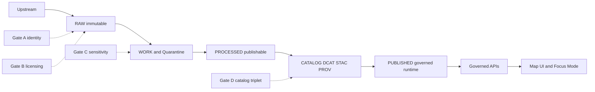

<!-- [KFM_META_BLOCK_V2]
doc_id: kfm://doc/502b6a7a-4ce0-4ad6-8316-3804216247e0
title: Architecture diagrams output
type: standard
version: v1
status: draft
owners: TBD
created: 2026-03-01
updated: 2026-03-01
policy_label: restricted
related:
  - TBD
tags: [kfm, diagrams, architecture]
notes:
  - Rendered artifacts only. Do not hand-edit outputs; edit sources and re-render.
  - Treat diagram content as governed: no sensitive locations or restricted implementation detail without review.
[/KFM_META_BLOCK_V2] -->

# Architecture diagrams output


Rendered, versioned architecture diagrams for Kansas Frontier Matrix (KFM).

> **Do not edit files in this directory by hand.**  
> Update diagram sources and re-render outputs so changes remain reproducible and reviewable.

---

## Quick navigation

- [Overview](#overview)
- [Directory tree](#directory-tree)
- [Directory contract](#directory-contract)
- [Diagram registry](#diagram-registry)
- [Reference architecture diagrams](#reference-architecture-diagrams)
- [How to regenerate diagrams](#how-to-regenerate-diagrams)
- [Naming conventions](#naming-conventions)
- [Governance and safety](#governance-and-safety)
- [Pull request checklist](#pull-request-checklist)

---

## Overview

This folder contains **rendered output** diagrams that describe the **KFM architecture** (system decomposition, truth path lifecycle, trust membrane, and deployment concepts).

**Confirmed concept:** KFM is designed as a map-first, time-aware, governed, evidence-first platform with a strict lifecycle (Upstream → RAW → WORK/Quarantine → PROCESSED → CATALOG → PUBLISHED) and a trust membrane where clients access data only through governed APIs.  
**Unknown in repo:** the exact renderer tooling and the complete set of diagrams currently present here.

---

## Directory tree

```text
docs/diagrams/out/architecture/
  README.md
  *.svg            # preferred: crisp in GitHub + documentation
  *.png            # allowed: screenshots or non-vector exports
  *.pdf            # allowed: print-ready exports when needed
  *.md             # allowed: auto-exported diagram “wrapper” pages
```

---

## Directory contract

### Acceptable inputs

These belong here:

- **Rendered diagrams** that are reproducible from source definitions
  - Preferred: `*.svg`
  - Allowed: `*.png`, `*.pdf`
- **Auto-generated** markdown wrappers (`*.md`) that embed or explain a rendered artifact
- Optional: `checksums.json` or `manifest.json` if your build produces them (**Proposed**)

### Exclusions

These do **not** belong here:

- Diagram **sources** (Mermaid, PlantUML, draw.io, Figma exports before normalization)  
  → put them in a source directory (example: `docs/diagrams/src/...`) (**Proposed path**)
- One-off screenshots pasted in without a reproducible source
- Any diagram that includes:
  - precise coordinates for vulnerable sites
  - secrets, credentials, internal hostnames
  - policy-restricted data flows without an explicit review label

---

## Diagram registry

Keep this table updated so downstream docs and UIs can reliably link to stable diagram IDs.

| Diagram ID | Purpose | Output files | Source location | Used by |
|---|---|---|---|---|
| `kfm-architecture-overview` | System decomposition and major boundaries | `kfm-architecture-overview.svg` | **Unknown** | docs, UI |
| `kfm-truth-path-lifecycle` | Data lifecycle zones and promotion gates | `kfm-truth-path-lifecycle.svg` | **Unknown** | docs, onboarding |
| `kfm-trust-membrane` | Policy boundary and governed access | `kfm-trust-membrane.svg` | **Unknown** | docs, security review |
| `kfm-deployment-topology` | Default deployment concept | `kfm-deployment-topology.svg` | **Unknown** | infra docs |

> **Note:** The registry above is a **Proposed baseline**. Replace “Unknown” values with real paths when wiring the diagram build.

---

## Reference architecture diagrams

These Mermaid diagrams are **conceptual** and exist here so the README remains useful even when rendered assets are missing or in flux.

### KFM system overview

```mermaid
flowchart LR
  subgraph Upstream[Upstream]
    U1[Open data]
    U2[Sensors and IoT]
    U3[Remote sensing]
  end

  subgraph Pipelines[Pipelines]
    P1[Ingest]
    P2[Validate and normalize]
    P3[Receipts and audit]
  end

  subgraph Zones[Lifecycle zones]
    Z1[RAW]
    Z2[WORK and Quarantine]
    Z3[PROCESSED]
    Z4[CATALOG]
    Z5[PUBLISHED]
  end

  subgraph Runtime[Governed runtime]
    API[Policy enforced APIs]
    UI[Map and Story UI]
    FM[Focus Mode]
  end

  Upstream --> Pipelines --> Z1 --> Z2 --> Z3 --> Z4 --> Z5 --> API --> UI
  API --> FM
  UI --> FM
```



### Truth path lifecycle



---

## How to regenerate diagrams

**Unknown in repo:** the exact command(s) that build diagrams.

Use this approach to find and standardize the renderer entrypoint:

1. **Locate the diagram build tool**
   - Search for “diagrams”, “mermaid”, “plantuml”, “render”, or “drawio”.
2. **Run the renderer locally**
3. **Verify outputs are deterministic**
   - Filenames stable
   - No machine-specific timestamps embedded in SVG/PDF
4. **Commit outputs + update the registry table**

### Proposed search commands

```bash
# Look for existing scripts or tooling
git grep -n "mermaid\\|plantuml\\|drawio\\|diagrams\\|render" -- \
  package.json pnpm-lock.yaml yarn.lock Makefile scripts tools docs
```

### Proposed build commands

Replace these with the real repo commands once confirmed:

```bash
# Example only — not confirmed in repo
pnpm run diagrams:build

# Example only — not confirmed in repo
make diagrams
```

---

## Naming conventions

### Diagram IDs

**Proposed convention:** stable, kebab-case IDs.

- `kfm-<topic>`
- `kfm-<topic>-<view>`
- Keep IDs stable even if the diagram contents evolve.

### Output filenames

**Proposed convention:**

- `kfm-<diagram-id>.svg`
- Optional version tag when needed for long-lived external links:
  - `kfm-<diagram-id>--v1.svg`

### Linking style

Prefer linking to SVG from markdown so GitHub renders crisply.

Example:

```md

```

---

## Governance and safety

Treat diagrams as governed artifacts:

- **Cite-or-abstain:** diagrams that justify decisions should reference the underlying design docs or ADRs.
- **Default-deny for sensitive content:** if a diagram includes restricted implementation detail, it should be labeled and stored in a restricted location (or redacted).
- **No precise vulnerable site locations:** use coarse geography or abstract examples.

---

## Pull request checklist

- [ ] I did not hand-edit rendered output files
- [ ] I can point to the source diagram(s) used to render these outputs
- [ ] Filenames are stable and match the registry table
- [ ] Diagrams contain no secrets, internal hostnames, or sensitive coordinates
- [ ] The diagram registry table is updated
- [ ] Any downstream docs that embed these diagrams were updated (if applicable)

---

<details>
<summary>Appendix: suggested manifest format</summary>

If your renderer produces many outputs, consider adding a small manifest file (**Proposed**) to aid audits.

```json
{
  "generated_at": "2026-03-01",
  "renderer": "TBD",
  "items": [
    {
      "diagram_id": "kfm-truth-path-lifecycle",
      "outputs": [
        "kfm-truth-path-lifecycle.svg"
      ],
      "source": "TBD",
      "notes": "Conceptual lifecycle and promotion gates"
    }
  ]
}
```

</details>
