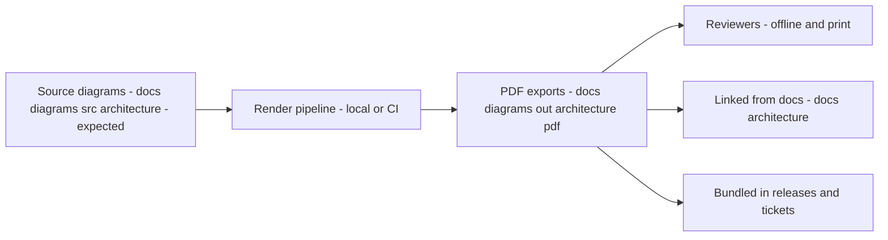

<!-- [KFM_META_BLOCK_V2]
doc_id: kfm://doc/99e534ef-3d84-4941-9558-fbe65715fa30
title: Architecture Diagram PDFs
type: standard
version: v1
status: draft
owners: kfm-core (TODO)
created: 2026-03-01
updated: 2026-03-01
policy_label: public
related:
  - ../../../../architecture/
  - ../../../src/architecture/            # TODO: confirm actual source path
tags: [kfm, diagrams, architecture, pdf, generated]
notes:
  - Output-only directory: PDFs are generated from source diagrams; do not hand-edit.
  - Replace TODO build commands with the repo’s real render pipeline once confirmed.
[/KFM_META_BLOCK_V2] -->

# Architecture Diagram PDFs (Generated)

**Purpose:** Offline-friendly, printable **PDF renders** of KFM architecture diagrams (reviews, releases, and “attach to ticket” workflows).


> **WARNING**
> **Do not hand-edit PDFs in this directory.**  
> Treat these as **build outputs**. Update the source diagram, then re-render.

---

## Quick navigation

- [What belongs here](#what-belongs-here)
- [What must not go here](#what-must-not-go-here)
- [How this fits in the repo](#how-this-fits-in-the-repo)
- [Source → PDF workflow](#source--pdf-workflow)
- [Naming and versioning](#naming-and-versioning)
- [Review checklist](#review-checklist)
- [Directory tree](#directory-tree)
- [Linking patterns](#linking-patterns)

---

## What belongs here

**✅ Acceptable inputs**

- **Generated** `*.pdf` exports of architecture diagrams (system overview, component decomposition, dataflow, deployment topology, trust boundary diagrams, etc.).
- A single `README.md` (this file) describing the contract for this output directory.

**Recommended characteristics**

- Vector-first or crisp rasterization (legible when printed).
- Reasonable size (avoid multi-100MB PDFs unless there is a strong reason; consider downsampling images or splitting diagrams).

---

## What must not go here

**❌ Exclusions**

- Source-of-truth diagram formats (examples):
  - Mermaid source (`.mmd`, `.md` with Mermaid blocks)
  - Draw.io / diagrams.net (`.drawio`)
  - PlantUML (`.puml`)
  - Figma exports / design source files
- Screenshots, ad-hoc images, or drafts that are not generated artifacts.
- Sensitive / restricted content that should not ship in the default `public` docs tree.

> **NOTE**
> If a diagram must be **restricted**, it should be moved to the repo’s restricted documentation location (per governance), and the links updated accordingly.

---

## How this fits in the repo

This directory is intended to be part of the docs/diagrams “build output” area, specifically:

- **Domain:** architecture diagrams
- **Format:** PDF (offline/print/release-friendly)
- **Role:** stable targets for links from narrative docs, tickets, and release notes

Related (expected) neighbors:

- `docs/architecture/` — narrative architecture docs that may link to these PDFs  
- `docs/diagrams/src/architecture/` — diagram sources (TODO: confirm exact path in this repo)

---

## Source → PDF workflow



### Regenerating PDFs

> **TODO:** Replace the commands below with the repo’s **actual** diagram build command(s).

```bash
# Example: discover likely build hooks (pick what exists in-repo)
ls -la scripts tools package.json Makefile Taskfile.yml 2>/dev/null

# Example: common patterns (update to match this repo)
# make diagrams
# npm run diagrams:render
# pnpm run diagrams:render
# ./scripts/diagrams/render.sh
```

**Regeneration invariant**

- A PDF in this directory **MUST** have a corresponding source diagram (same basename) in the source tree.
- If you change the source diagram, **re-render and commit** the updated PDF in the same PR.

---

## Naming and versioning

**Goal:** stable, grep-able names that support linking and release notes.

### Recommended filename schema

```
<system>__<diagram_slug>__v<semver>__<YYYY-MM-DD>.pdf
```

Examples:

- `kfm__system-overview__v1.0.0__2026-03-01.pdf`
- `kfm__dataflow-truth-path__v1.2.0__2026-03-01.pdf`

### When to bump versions

- **PATCH**: cosmetic edits, label fixes, minor layout cleanup (no semantic change)
- **MINOR**: architecture changes that preserve major conceptual model
- **MAJOR**: architectural reframe (new trust boundaries, new domain decomposition, etc.)

---

## Review checklist

Use this checklist when adding/updating PDFs:

- [ ] Diagram content matches the current architecture narrative (no contradictions).
- [ ] Trust boundary / “policy boundary” is not bypassed in the diagram (no UI → DB direct paths).
- [ ] No restricted data, credentials, or sensitive endpoint details embedded.
- [ ] PDF is readable at 100% zoom and printable on letter/A4.
- [ ] File name follows naming convention (or includes a rationale if not).
- [ ] Source diagram exists and is updated in the same PR.
- [ ] Links from narrative docs are updated (if a diagram was renamed).

---

## Directory tree

> **NOTE**
> This is the **expected** layout around this directory. Update it if the repo structure differs.

```text
docs/
└── diagrams/
    ├── src/                        # diagram sources (expected)
    │   └── architecture/
    └── out/                        # generated artifacts (expected)
        └── architecture/
            └── pdf/
                ├── README.md
                └── *.pdf
```

---

## Linking patterns

### Link a PDF from a narrative doc

Use a **relative link** (preferred) so it works in forks and offline clones.

Example (from something under `docs/architecture/`):

```md
See the PDF export: ../diagrams/out/architecture/pdf/kfm__system-overview__v1.0.0__2026-03-01.pdf
```

### Keep diagrams discoverable

If a diagram is “core,” consider adding it to an index list in `docs/architecture/README.md` (if present), with a short description and last-updated date.

---

<details>
  <summary>Troubleshooting</summary>

- **PDF looks blurry:** check render DPI settings (or export as vector where possible).
- **Repo bloat:** compress PDFs, split large diagrams, or adopt Git LFS for binary artifacts (repo policy-dependent).
- **Drift:** if PDFs and sources diverge, treat PDFs as stale and re-render immediately.

</details>
