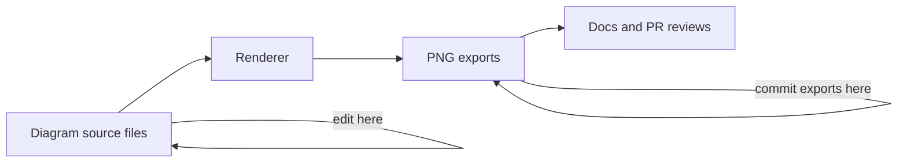

<!-- [KFM_META_BLOCK_V2]
doc_id: kfm://doc/cc8d8ef6-e606-4a83-873c-7dc234bd7593
title: Architecture Diagrams (PNG) — Output Directory
type: standard
version: v1
status: draft
owners: kfm-maintainers
created: 2026-03-01
updated: 2026-03-01
policy_label: restricted
related:
  - docs/diagrams/README.md
  - docs/architecture/
  - docs/diagrams/src/architecture/
tags: [kfm, diagrams, architecture, png]
notes:
  - This directory is for generated PNG exports only; edit sources elsewhere.
  - Default-deny: treat outputs as restricted until explicitly reviewed for release.
[/KFM_META_BLOCK_V2] -->

# Architecture diagrams — PNG exports

**Purpose:** Store _generated_ PNG renderings of KFM architecture diagrams for use in docs, issues, and reviews (diff-friendly source lives elsewhere).  
**Status:** draft • **Owners:** `kfm-maintainers` • **Policy:** `restricted` (default-deny)


---

## Quick navigation

- [What this folder is](#what-this-folder-is)
- [What belongs here](#what-belongs-here)
- [What must NOT go here](#what-must-not-go-here)
- [Naming and versioning rules](#naming-and-versioning-rules)
- [Diagram inventory](#diagram-inventory)
- [How to regenerate PNGs](#how-to-regenerate-pngs)
- [Quality gates](#quality-gates)
- [Directory layout](#directory-layout)

---

## What this folder is

This directory (`docs/diagrams/out/architecture/png/`) is the **output zone** for **PNG exports** of architecture diagrams.

- **Source-of-truth:** the diagram source (Mermaid, PlantUML, draw.io, etc.) **must live outside** this folder (commonly under a `docs/diagrams/src/...` path).
- **This folder:** contains only the generated `.png` artifacts that are referenced by Markdown and review materials.

> NOTE  
> PNGs exist to make architecture review easy in GitHub (inline preview, issues, PRs).  
> The **editable** diagram sources must remain versioned and reviewable.

---

## What belongs here

| Allowed | Why | Examples |
|---|---|---|
| `*.png` diagram exports | Portable, previewable in GitHub | `kfm-arch-overview--v1.png` |
| `*.png` with deterministic naming | Supports stable references | `kfm-truth-path--20260301.png` |
| Small companion files _only if required by tooling_ | Some exporters emit sidecars | (Only if your renderer requires it; otherwise avoid) |

---

## What must NOT go here

| Do not commit | Reason | Put it where instead |
|---|---|---|
| Editable diagram sources (`*.mmd`, `*.drawio`, `*.puml`, etc.) | This is an **output** directory | `docs/diagrams/src/architecture/` (or your repo’s canonical “src” folder) |
| Sensitive internals (secrets, private endpoints, exact protected locations) | **Policy / safety** | Redact at source; if truly necessary, store in a restricted/private repo or restricted path with governance review |
| One-off screenshots with unclear provenance | Breaks traceability | Prefer source diagrams or link to a run receipt / ADR |
| Huge raster images (> ~2–5 MB) | Bloats repo + slows PRs | Export at a reasonable resolution; prefer SVG/PDF for high-detail diagrams (if available elsewhere) |

---

## Naming and versioning rules

Use names that are **stable**, **sortable**, and **self-explanatory**.

### Recommended filename pattern

`kfm-<area>--<diagram_slug>--<version_or_date>.png`

Examples:
- `kfm-arch--overview--v1.png`
- `kfm-arch--component-decomposition--20260301.png`
- `kfm-arch--deployment-topology--vNext.png`

### Minimum requirements

- **Lowercase**
- **Dashes only** (`-`) inside slugs
- Use `--` as a separator between major parts
- Avoid spaces and underscores
- If the diagram corresponds to a spec/ADR/versioned design, include the version token (`v1`, `vNext`, etc.)

---

## Diagram inventory

> TIP  
> Keep this table updated so reviewers can see “what’s canonical” without browsing the folder.

| PNG file | Canonical diagram name | Primary purpose | Source (edit here) | Policy label | Notes |
|---|---|---|---|---|---|
| _TODO_ | KFM Architecture Overview | 10,000-ft system view | `docs/diagrams/src/architecture/...` | restricted | Add when available |
| _TODO_ | Truth Path Lifecycle | Explain RAW→WORK→…→PUBLISHED | `docs/diagrams/src/architecture/...` | restricted | Must match current promotion contract |
| _TODO_ | Trust Membrane Boundary | Show governed API / policy enforcement | `docs/diagrams/src/architecture/...` | restricted | Do not include secrets |
| _TODO_ | Deployment Topology | Infra-level view (logical) | `docs/diagrams/src/architecture/...` | restricted | Keep cloud/vendor-neutral where possible |

---

## How to regenerate PNGs

Because repos differ in tooling, this README does **not** assume a specific generator command.

### Discover the renderer in this repo

From repo root, look for scripts/config mentioning diagrams:

```bash
# ripgrep search for likely render entrypoints
rg -n "diagram|diagrams|mermaid|plantuml|drawio|render" \
  package.json Makefile scripts/ tools/ docs/
```

Also check CI workflows for “diagram build” steps:

```bash
rg -n "diagram|mermaid|plantuml|drawio" .github/workflows/
```

### Expected regeneration behavior

A correct renderer should:
- take sources from a “src” diagrams directory,
- produce PNGs into this directory,
- be deterministic (same input → same bytes) where feasible,
- fail closed if inputs are missing.

> WARNING  
> **Do not hand-edit** PNGs.  
> If a diagram is wrong, update the **source** diagram and re-export.

---

## Quality gates

Use this checklist when adding/updating a PNG export:

- [ ] Source diagram updated (NOT in this folder)
- [ ] PNG re-exported into `docs/diagrams/out/architecture/png/`
- [ ] Filename follows the naming rules above
- [ ] Diagram content is **policy-safe** (no secrets, no restricted site precision, no sensitive internals)
- [ ] Diagram inventory table updated with:
  - [ ] canonical name
  - [ ] source path
  - [ ] policy label
- [ ] Any linked docs/ADRs updated to match the diagram
- [ ] File size is reasonable (prefer < 2 MB unless justified)

---

## Directory layout

Current folder:

```text
docs/
  diagrams/
    out/
      architecture/
        png/
          README.md   # you are here
          *.png       # generated exports only
```

Suggested (optional) sibling outputs (only if your repo supports them):

```text
docs/diagrams/out/architecture/
  png/    # raster exports (this folder)
  svg/    # vector exports (preferred for docs, if available)
  pdf/    # print-friendly exports (optional)
```

---

## Diagram build flow



---

<details>
<summary>Appendix: quick authoring reminders</summary>

- Always add meaningful **alt text** when embedding PNGs in Markdown.
- If you must include an image from an external source, record attribution and license in the referencing doc.
- Prefer **vendor-neutral** architecture diagrams unless the point of the diagram is vendor-specific.

</details>

---

↑ [Back to top](#architecture-diagrams--png-exports)
