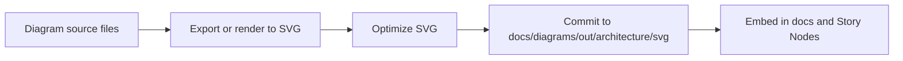

<!-- [KFM_META_BLOCK_V2]
doc_id: kfm://doc/6f8d9b2b-4b4e-4b1d-9f28-0f5d2d9a5a2a
title: Architecture SVG diagrams
type: standard
version: v1
status: draft
owners: TODO: kfm-architecture-owners
created: 2026-03-01
updated: 2026-03-01
policy_label: public
related:
  - docs/diagrams/
  - docs/architecture/
tags: [kfm, diagrams, architecture, svg]
notes:
  - This directory is an output location for SVG exports (treat as generated artifacts).
  - If any diagram includes sensitive details, re-label policy_label and relocate as required.
[/KFM_META_BLOCK_V2] -->

# Architecture diagrams (SVG)

**One-line purpose:** Canonical **SVG exports** of KFM architecture diagrams for embedding in docs, Story Nodes, and reviews.


> **Status:** draft (directory README) • **Owners:** `TODO` • **Policy label:** `public` (update if diagrams contain sensitive detail)

---

## Quick navigation

- [Overview](#overview)
- [What belongs here](#what-belongs-here)
- [Directory layout](#directory-layout)
- [How these SVGs are produced](#how-these-svgs-are-produced)
- [Conventions](#conventions)
- [Governance and safety](#governance-and-safety)
- [Diagram index](#diagram-index)
- [Change checklist](#change-checklist)
- [Troubleshooting](#troubleshooting)

---

## Overview

This folder contains **SVG renderings of architecture diagrams**.

Think of this as the **“compiled output”** layer for architecture visuals:
- optimized for linking/embedding in Markdown
- stable file paths for references
- suitable for PR review diffs (with a consistent export process)

If you need to *edit* a diagram, edit the **source diagram** (wherever your repo keeps it), then re-export to SVG into this folder.  
**Do not** hand-edit SVGs unless you are fixing export/compatibility issues.

[Back to top](#quick-navigation)

---

## What belongs here

### ✅ Acceptable inputs

- `*.svg` architecture diagrams (exported)
- `README.md` (this file)
- Optional: a small `index.json` or `manifest.yml` **only if** your tooling generates it (not required)

### 🚫 Exclusions

Do **not** put any of the following here:

- Source-format diagrams: `.drawio`, `.excalidraw`, `.fig`, `.sketch`, `.puml`, `.mmd`, `.pptx`, `.ai`
- Raster exports: `.png`, `.jpg`, `.gif` (keep those in a sibling raster output folder if needed)
- Secrets or environment-specific deployment details (cluster names, internal hostnames, account IDs, private endpoints)
- “One-off” screenshots or ad-hoc copies (use a proper source + export workflow)

[Back to top](#quick-navigation)

---

## Directory layout

```text
docs/
└── diagrams/
    └── out/
        └── architecture/
            └── svg/
                ├── README.md
                └── *.svg
```

[Back to top](#quick-navigation)

---

## How these SVGs are produced

**Source → export → optimize → commit → reference**



### Recommended (tool-agnostic) export steps

1. **Edit** the diagram in its source format (tool-specific)
2. **Export** as SVG with:
   - text preserved as text (avoid outlines where possible)
   - a stable `viewBox`
   - no external font dependencies if avoidable
3. **Optimize** SVG (lossless), e.g. with SVGO (optional but recommended)
4. **Verify** the SVG renders correctly in:
   - GitHub UI
   - your docs site (if any)
5. **Reference** the SVG from Markdown using relative paths

> TODO: If your repo has a diagrams build command (Makefile, npm script, task runner), document it here.

[Back to top](#quick-navigation)

---

## Conventions

### Naming

**Recommended naming format (choose one and be consistent):**

- `kfm-architecture--<topic>.svg`  
  Example: `kfm-architecture--trust-membrane.svg`

or

- `<domain>--<diagram>--v<major>.<minor>.svg`  
  Example: `core--reference-model--v1.0.svg`

**Avoid:**
- spaces
- mixed casing
- ambiguous names like `diagram-final.svg`

### Embedding in Markdown

Use relative links from the doc that consumes the diagram:

```md

```

If the diagram is key to understanding, add one sentence of **textual summary** below it for accessibility.

### SVG hygiene

- Keep file size reasonable (prefer simplification over embedded raster images)
- Avoid external references (remote fonts, remote images)
- Prefer semantic grouping/layers when the diagram tool supports it

[Back to top](#quick-navigation)

---

## Governance and safety

Architecture diagrams can accidentally become a **policy bypass** (by implying forbidden data flows) or a **leak vector** (by embedding sensitive infrastructure identifiers).

When adding/updating diagrams:

- **Reflect KFM invariants**
  - clients do not access storage directly
  - all access goes through governed APIs and policy enforcement
  - show the “truth path” lifecycle zones when depicting data movement
- **Default to abstraction**
  - use generic environment labels (`prod`, `staging`) instead of real cluster IDs
  - avoid internal hostnames, account numbers, IP ranges
- **Sensitive locations rule**
  - if any diagram contains precise coordinates or sensitive site locations, generalize or remove

If a diagram **must** include sensitive operational detail:
- move it to a restricted location (per governance)
- update `policy_label` and doc references accordingly

[Back to top](#quick-navigation)

---

## Diagram index

Maintain this table as the canonical “what’s here” registry.

| File | What it shows | Used by | Status |
|------|---------------|---------|--------|
| *(add rows)* | | | |

> Tip: Keep diagram filenames stable; rename only with a sweep updating all references.

[Back to top](#quick-navigation)

---

## Change checklist

Use this checklist for PRs that modify or add SVG diagrams:

- [ ] Source diagram updated (not edited only in SVG)
- [ ] SVG export settings produce stable output (viewBox, text readable)
- [ ] SVG optimized (optional) and still renders correctly
- [ ] No secrets, private endpoints, or sensitive identifiers included
- [ ] Any implied data flows respect KFM governance invariants
- [ ] Diagram embedded from docs with alt text + 1–2 sentence summary
- [ ] Diagram index table updated

[Back to top](#quick-navigation)

---

## Troubleshooting

### The SVG looks different on GitHub than in the diagram tool

- Ensure fonts are either embedded safely or use standard fonts
- Prefer exporting text as text (not outlines) unless rendering issues require outlines

### The SVG is huge

- Remove embedded bitmaps
- Simplify paths in the diagram tool
- Run a lossless SVG optimizer

### Links inside SVG don’t work

- GitHub may sanitize parts of SVGs
- Prefer linking from Markdown text near the diagram instead of relying on embedded SVG hyperlinks

[Back to top](#quick-navigation)
