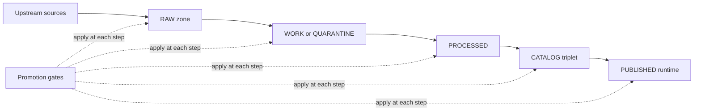
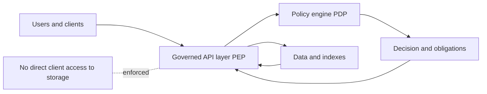

<!-- [KFM_META_BLOCK_V2]
doc_id: kfm://doc/9a9c4b16-2dd9-4b09-b4b3-8a3c5f7f1a5a
title: Governance Diagrams (Rendered Outputs)
type: standard
version: v1
status: draft
owners: TBD (kfm-governance)
created: 2026-03-01
updated: 2026-03-01
policy_label: public
related:
  - docs/diagrams/
  - docs/diagrams/out/
  - docs/diagrams/src/ (TODO: confirm source path)
  - docs/governance/ (TODO: confirm)
tags: [kfm, diagrams, governance, trust-membrane, truth-path, promotion-contract]
notes:
  - This README documents the *rendered outputs* directory for governance diagrams.
  - Treat contents as generated artifacts; avoid hand-editing outputs.
[/KFM_META_BLOCK_V2] -->

# KFM Governance Diagrams (Rendered Outputs)

Rendered (generated) diagram artifacts that explain **KFM governance**: the **truth path** lifecycle, the **trust membrane**, **promotion gates**, and **policy/redaction obligations**.


---

## Quick links

- [Purpose](#purpose)
- [Where this directory fits](#where-this-directory-fits)
- [What belongs here](#what-belongs-here)
- [What-must-not-go-here](#what-must-not-go-here)
- [Diagram index](#diagram-index)
- [Governance concepts captured](#governance-concepts-captured)
- [Regeneration](#regeneration)
- [Quality gates](#quality-gates)
- [Appendix: manifest template](#appendix-manifest-template)

---

## Purpose

This directory exists to store **final, viewable artifacts** (SVG/PNG/PDF) for governance diagrams used across:
- docs
- architecture reviews
- story/design discussions
- UI embedding (when applicable)

> **Rule of thumb:** if it’s meant to be *viewed*, it can live here.  
> If it’s meant to be *edited*, it should live in a source directory (see “Regeneration”).

---

## Where this directory fits

**Path:** `docs/diagrams/out/governance/`

- `docs/diagrams/` — diagram system root (conventions, index) *(not confirmed in repo; inferred from path)*
- `docs/diagrams/src/...` — editable sources (Mermaid/PlantUML/drawio/etc.) *(TODO: confirm exact path)*
- `docs/diagrams/out/...` — rendered outputs (this directory)

### Status legend for “truth discipline”
We use these tags in this README to avoid accidental invention:

- **CONFIRMED:** described in KFM governance/design docs
- **PROPOSED:** recommended convention/process (safe default; may need adjustment)
- **UNKNOWN:** requires repo verification (paths, scripts, exact filenames)

---

## What belongs here

✅ **Allowed (PROPOSED defaults):**
- Rendered images: `.svg`, `.png`, `.pdf`
- Companion metadata: `manifest.*` / `README.md` / `checksums.*` *(if you choose to add them)*
- Render outputs that are stable references from other docs (prefer SVG for crisp embedding)

✅ **Recommended file formats (PROPOSED):**
- Primary: `*.svg`
- Secondary: `*.png` (for platforms that don’t render SVG well)
- Optional: `*.pdf` (print-ready)

---

## What must not go here

❌ **Do NOT put these in `out/`:**
- Editable sources (`*.mmd`, `*.puml`, `*.drawio`, `*.excalidraw`, `*.pptx`, etc.)  
  → put them under a source folder (UNKNOWN exact path; typically `docs/diagrams/src/...`)
- Anything containing secrets, tokens, credentials, private endpoints
- Anything containing sensitive location detail that violates policy/redaction obligations  
  (e.g., “vulnerable sites” with precise coordinates)  
- “One-off” scratch diagrams that are not referenced anywhere
- Vendor binaries or huge exports without a consumer

---

## Diagram index

> **NOTE:** This table is a *registry template*. Fill the “Artifact” column with actual filenames that exist in this directory.  
> The filenames below are **placeholders (UNKNOWN)** until verified.

| Diagram ID | What it explains | Artifact (in this folder) | Source (elsewhere) | Policy label | Owner |
|---|---|---:|---:|---:|---|
| GOV-TRUTH-PATH | Upstream → RAW → WORK → PROCESSED → CATALOG → PUBLISHED lifecycle | `gov__truth_path__v1.svg` *(UNKNOWN)* | `docs/diagrams/src/governance/truth_path.mmd` *(UNKNOWN)* | public | TBD |
| GOV-TRUST-MEMBRANE | “Clients only through governed APIs” policy boundary | `gov__trust_membrane__v1.svg` *(UNKNOWN)* | `...` *(UNKNOWN)* | public | TBD |
| GOV-PROMOTION | Promotion Contract gates (A–E…) | `gov__promotion_contract__v1.svg` *(UNKNOWN)* | `...` *(UNKNOWN)* | public | TBD |
| GOV-POLICY-LABELS | Policy labels and redaction obligations decision flow | `gov__policy_labels__v1.svg` *(UNKNOWN)* | `...` *(UNKNOWN)* | mixed | TBD |
| GOV-FOCUS-CITE | Focus Mode cite-or-abstain evidence resolution | `gov__focus_cite_or_abstain__v1.svg` *(UNKNOWN)* | `...` *(UNKNOWN)* | public | TBD |

---

## Governance concepts captured

The governance diagram set should cover (at minimum):

- **Truth path lifecycle** (CONFIRMED concept)
- **Trust membrane** boundary (CONFIRMED concept)
- **Promotion Contract** with minimum gates (CONFIRMED concept)
- **Policy labels + redaction obligations** (CONFIRMED concept)
- **Evidence-first UX + cite-or-abstain** (CONFIRMED concept)

If you add a new governance diagram, you should be able to answer:

1. **Which governance invariant does it represent?**
2. **What policy decisions does it encode?**
3. **What’s the evidence source-of-truth?** (doc section, ADR, contract)
4. **Is it safe to publish?** (policy label + redaction)

---

## Reference diagrams (inline)

### Truth path lifecycle (conceptual)



### Trust membrane (conceptual)



---

## Regeneration

**Principle (PROPOSED, but strongly recommended):**  
Treat everything in `docs/diagrams/out/` as **generated**. Don’t hand-edit outputs. Fix sources → regenerate → commit outputs.

### Expected workflow (PROPOSED)

1. Edit the source diagram in the source directory *(UNKNOWN exact path)*.
2. Run the diagram build/export script.
3. Ensure the output artifact lands here (`docs/diagrams/out/governance/`).
4. Update the [Diagram index](#diagram-index) table (or a manifest file).
5. Ensure links from other docs remain stable.

### Build commands (UNKNOWN — replace with repo truth)

```bash
# TODO: confirm actual commands in this repo.

# Example: build all diagrams
make diagrams

# Example: build governance diagrams only
make diagrams-governance

# Example: monorepo script style
pnpm -w run diagrams:build -- --scope governance
```

---

## Quality gates

### Definition of done for a governance diagram (PROPOSED)

- [ ] Output is **SVG** (preferred) and/or PNG/PDF as needed
- [ ] Diagram is **readable at 100% zoom** (no tiny fonts)
- [ ] Diagram has **no sensitive data** (or is labeled/placed appropriately)
- [ ] Diagram is referenced from at least one consumer doc (or intentionally staged)
- [ ] Entry is added/updated in the [Diagram index](#diagram-index)
- [ ] If the diagram encodes policy: a link to the policy/ADR/design section is included in the manifest or surrounding docs
- [ ] Filenames are stable and don’t break links (avoid renaming without redirects)

### Naming convention (PROPOSED)

`gov__<topic>__v<major>[__YYYY-MM-DD].<ext>`

Examples:
- `gov__truth_path__v1.svg`
- `gov__promotion_contract__v2__2026-03-01.svg`

---

## Appendix: manifest template

> **Optional but recommended (PROPOSED):** Keep a `manifest.yaml` (or JSON) in this folder so governance diagrams are auditable and discoverable.

<details>
<summary><strong>manifest.yaml template (copy/paste)</strong></summary>

```yaml
# docs/diagrams/out/governance/manifest.yaml
version: 1
scope: governance
generated_at: "2026-03-01T00:00:00Z"   # TODO: use actual build time
generator:
  name: "TODO"
  version: "TODO"
diagrams:
  - id: GOV-TRUTH-PATH
    title: "Truth path lifecycle"
    artifact: "gov__truth_path__v1.svg"
    source: "docs/diagrams/src/governance/truth_path.mmd"  # TODO: confirm
    policy_label: "public"
    owners: ["kfm-governance"]
    describes:
      - "Upstream → RAW → WORK → PROCESSED → CATALOG → PUBLISHED"
    evidence:
      - "kfm://doc/TODO#truth-path"
    notes:
      - "Conceptual; align with Definitive Design & Governance Guide."

  - id: GOV-TRUST-MEMBRANE
    title: "Trust membrane"
    artifact: "gov__trust_membrane__v1.svg"
    source: "TODO"
    policy_label: "public"
    owners: ["kfm-governance"]
    evidence:
      - "kfm://doc/TODO#trust-membrane"
```

</details>

---

## Back to top

↩️ **Back to top:** [KFM Governance Diagrams (Rendered Outputs)](#kfm-governance-diagrams-rendered-outputs)
