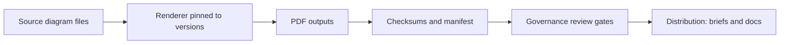

<!-- [KFM_META_BLOCK_V2]
doc_id: kfm://doc/4f5c2a2b-7de0-4aa6-83f5-6fb2f9d9a7d9
title: Governance Diagram PDFs
type: standard
version: v1
status: draft
owners: TODO(@kfm-governance-stewards)
created: 2026-03-01
updated: 2026-03-01
policy_label: restricted
related:
  - ../../../../governance/ROOT_GOVERNANCE.md  # TODO: verify path exists in this repo
  - ../../../../architecture/diagrams/         # TODO: verify path exists in this repo
tags: [kfm, governance, diagrams, pdf, generated]
notes:
  - This directory is intended to hold *rendered outputs* (PDF). Prefer editing sources elsewhere and re-rendering.
[/KFM_META_BLOCK_V2] -->

# Governance Diagram PDFs
Rendered, shareable **PDF outputs** of KFM governance diagrams (for reviews, briefings, and offline distribution).


**Status:** draft README (scaffolding) • **Owners:** `TODO(@kfm-governance-stewards)` • **Edits:** output PDFs should be regenerated, not hand-edited.

---

## Quick navigation
- [Overview](#overview)
- [Where this fits](#where-this-fits)
- [What belongs here](#what-belongs-here)
- [What must not go here](#what-must-not-go-here)
- [Artifact index](#artifact-index)
- [Regeneration contract](#regeneration-contract)
- [Naming and versioning](#naming-and-versioning)
- [Governance and review gates](#governance-and-review-gates)
- [Appendix](#appendix)

---

## Overview
This folder is the **output target** for PDF exports of governance diagrams used to explain and enforce KFM’s non-negotiables (examples: truth path lifecycle, promotion gates, trust membrane, Focus Mode control loop).

> **NOTE**
> This is an **output** directory. If you need to change a diagram, change its **source** (e.g., Mermaid/Draw.io/PlantUML), then **re-render** the PDF into this folder.

> **WARNING**
> Governance diagrams must not leak sensitive information. If a diagram could reveal restricted locations, identities, or operational secrets, it must be redacted/generalized before export.

---

## Where this fits
Expected KFM documentation layout includes:
- `docs/architecture/diagrams/` for architecture diagrams
- `docs/governance/` for governance narrative docs and review gates

This directory is specifically:
- `docs/diagrams/out/governance/pdf/` → **compiled governance diagram PDFs** (this folder)

If your repo layout differs, update the links and the “Regeneration contract” below accordingly.

**Related (expected) docs:**
- `../../../../governance/ROOT_GOVERNANCE.md` (root governance posture)
- `../../../../governance/REVIEW_GATES.md` (what triggers review / promotion blocks)
- `../../../../architecture/diagrams/` (broader system diagrams)

---

## What belongs here
### Required
- `*.pdf` — exported governance diagrams intended for review and distribution
- `README.md` — this directory contract / usage notes

### Recommended (but repo-dependent)
- `manifest.json` or `manifest.yml` — index of diagram outputs (name → source → owner → policy_label)
- `SHA256SUMS` (or similar) — checksums for PDFs to detect drift in generated artifacts

---

## What must not go here
- Editable diagram sources (`*.mmd`, `*.drawio`, `*.puml`, `*.pptx`, `*.ai`, etc.)
- Non-governance diagrams (put those under the appropriate architecture/product output folder)
- Data artifacts, screenshots with sensitive details, raw exports from operational systems
- Anything that cannot be shared with the intended audience of the PDFs

---

## Artifact index
> Keep this table aligned with actual PDFs present in this folder.  
> If you add a PDF, add a row.

| Output PDF (file) | Purpose | Source-of-truth (edit here) | Owner | Policy label | Notes |
|---|---|---|---|---|---|
| `TODO-truth-path-lifecycle.pdf` | Explain lifecycle zones + promotion flow | `TODO: docs/diagrams/src/governance/...` | TODO | restricted | Must match “truth path” contract |
| `TODO-trust-membrane.pdf` | Explain policy boundary + no-bypass rule | `TODO: docs/diagrams/src/governance/...` | TODO | restricted | Must be consistent with PEP/Evidence Resolver |
| `TODO-promotion-contract-gates.pdf` | Show gates (A–G) required to publish | `TODO: docs/diagrams/src/governance/...` | TODO | restricted | CI-fail-closed framing |
| `TODO-focus-mode-control-loop.pdf` | Show cite-or-abstain steps + receipt | `TODO: docs/diagrams/src/governance/...` | TODO | restricted | Must show “verify citations (hard gate)” |

---

## Regeneration contract
This folder should be reproducible from source diagrams via a deterministic renderer.

### Conceptual pipeline


### Minimal regeneration steps (template)
> The exact command depends on the tooling in *your* repo. Pick ONE deterministic approach and document it here.

```sh
# From repo root (TEMPLATE — replace with real commands in your repo)

# 1) Render governance diagram sources to PDF
# ./tools/diagrams/render.sh --scope governance --format pdf --out docs/diagrams/out/governance/pdf

# 2) Update manifest (if used)
# ./tools/diagrams/manifest.sh --dir docs/diagrams/out/governance/pdf --write manifest.json

# 3) Update checksums (if used)
# (cd docs/diagrams/out/governance/pdf && sha256sum *.pdf > SHA256SUMS)

# 4) Run link + policy checks (if present)
# ./tools/linkcheck.sh
# ./tools/policycheck.sh
```

### Renderer expectations (requirements)
- **Deterministic:** the same inputs produce identical PDFs (or changes are explainable and reviewed)
- **Pinned toolchain:** renderer versions are pinned to avoid drift
- **Fail-closed:** if the renderer fails, or outputs are missing, CI must fail (no “partial” publish)

---

## Naming and versioning
Use stable, scannable names:
- **kebab-case**
- include **scope** and **diagram topic**
- optional version stamp when stability matters

Recommended naming pattern:
- `kfm-governance__<topic>__v<semver>.pdf`
- or `kfm-governance__<topic>__YYYY-MM-DD.pdf`

Examples:
- `kfm-governance__truth-path__v1.pdf`
- `kfm-governance__promotion-contract-gates__v1.pdf`

---

## Governance and review gates
A governance diagram change is not “just documentation” if it changes behavior, policy posture, or public narratives.

### Review triggers (minimum)
- Diagram changes that alter:
  - lifecycle zones / “truth path” sequencing
  - promotion contract gates
  - trust membrane / no-bypass rule
  - evidence resolution / citation verification
  - Focus Mode control loop steps

### Definition of done for a diagram update
- [ ] Source diagram updated (not in this folder)
- [ ] PDF re-rendered into this folder
- [ ] Table row added/updated in [Artifact index](#artifact-index)
- [ ] Sensitive details reviewed and removed/generalized if needed
- [ ] Any manifest/checksums updated (if used)
- [ ] Governance steward sign-off recorded (where your repo tracks approvals)

---

## Appendix
<details>
<summary><strong>Starter set of governance diagrams (recommended)</strong></summary>

- Truth path lifecycle (Upstream → RAW → WORK/Quarantine → PROCESSED → CATALOG/Triplet → PUBLISHED)
- Promotion Contract gates (identity/versioning, licensing, sensitivity/redaction, triplet validation, QA thresholds, run receipt/audit, release manifest)
- Trust membrane overview (Policy Enforcement Point + Evidence Resolver; no direct client → DB/object store)
- Focus Mode control loop (policy pre-check → retrieve → bundle → answer → verify citations HARD → receipt)

</details>

---

<a id="back-to-top"></a>
**Back to top:** [Quick navigation](#quick-navigation)
