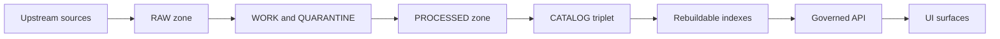

<!-- [KFM_META_BLOCK_V2]
doc_id: kfm://doc/0f0e3b8e-42b0-4a4b-9b6f-6d6d1a2c79b4
title: Governance diagrams (PNG exports)
type: standard
version: v1
status: draft
owners: TODO:KFM-Governance
created: 2026-03-01
updated: 2026-03-01
policy_label: restricted
related:
  - docs/diagrams/
  - docs/diagrams/out/governance/
  - docs/diagrams/src/governance/   # TODO: verify path
tags: [kfm, diagrams, governance, generated, png]
notes:
  - This directory contains rendered PNG exports only.
  - Do not hand-edit PNGs; change diagram sources and re-render.
[/KFM_META_BLOCK_V2] -->

# Governance diagrams — PNG exports
Rendered PNG copies of KFM governance diagrams (truth path, trust membrane, policy-as-code, promotion gates, roles/RACI).


<!-- TODO: Replace/add real repo badges (CI, linkcheck, diagram-render job) once workflow names are confirmed. -->

**Status:** generated outputs (do not edit by hand)  
**Owners:** `TODO:KFM-Governance` (set in CODEOWNERS / docs ownership registry)

---

## Quick navigation
- [What this directory is](#what-this-directory-is)
- [What belongs here](#what-belongs-here)
- [What must not go here](#what-must-not-go-here)
- [Concepts these diagrams cover](#concepts-these-diagrams-cover)
- [Naming conventions](#naming-conventions)
- [Regeneration workflow](#regeneration-workflow)
- [Review checklist](#review-checklist)
- [Directory tree](#directory-tree)
- [Related docs](#related-docs)

---

## What this directory is
This folder is the **PNG export target** for governance diagrams.

These images are intended for:
- embedding in Markdown docs and ADRs
- PR discussions and issue threads
- slide decks / offline review artifacts
- “frozen” visuals for a given governance model revision

> [!NOTE]
> Treat these PNGs as **build artifacts**: the source diagram files are the “source of truth,” and this folder is the deterministic render output.

[Back to top](#governance-diagrams--png-exports)

---

## What belongs here
✅ **Allowed**
- `*.png` files that are **rendered exports** of governance diagrams (no manual edits)
- this `README.md`

Typical governance diagram topics include:
- Truth path lifecycle (Upstream → RAW → WORK/QUARANTINE → PROCESSED → CATALOG/TRIPLET → PUBLISHED)
- Trust membrane boundary (clients never bypass the governed API / policy boundary)
- Promotion Contract gates (minimum gates, what blocks promotion)
- Policy-as-code architecture (PDP/PEP, CI vs runtime semantics)
- Sensitivity defaults and redaction/generalization rules
- Roles/RACI and review queues (Promotion Queue, Story Review Queue)

[Back to top](#governance-diagrams--png-exports)

---

## What must not go here
🚫 **Not allowed**
- diagram source files (Mermaid/PlantUML/Draw.io/Excalidraw/etc.)  
  → keep those in the **diagram source directory** (see “Regeneration workflow”)
- PDFs, SVGs, or editable formats (unless you explicitly add a sibling output folder like `../svg/`)
- screenshots of UIs containing real dataset contents (risk of restricted leakage)
- any image that includes **precise sensitive locations** or restricted identifiers

> [!WARNING]
> If you’re unsure whether a diagram could leak sensitive information, treat it as **restricted** and ask for governance/steward review before committing it.

[Back to top](#governance-diagrams--png-exports)

---

## Concepts these diagrams cover

### Reference flow: truth path + governed surfaces (conceptual)


### Policy boundary reminder
- **Policy enforcement must occur before serving data** (API / evidence resolver), and UI must not make policy decisions.
- **Publishing is gated**: promotions and story publishing require review state and resolvable citations/evidence.

> [!TIP]
> When adding a new governance diagram, prefer shapes and labels that match the canonical terminology in the KFM governance docs (RAW, WORK/QUARANTINE, PROCESSED, CATALOG/TRIPLET, PUBLISHED; PDP/PEP; “Promotion Contract”).

[Back to top](#governance-diagrams--png-exports)

---

## Naming conventions
**Goal:** predictable, sortable, stable file names that work in links.

**Recommended (PROPOSED) pattern**
- `kfm-governance-<topic>-v<major>.<minor>.png`

**Examples (illustrative)**
- `kfm-governance-truth-path-v1.0.png`
- `kfm-governance-trust-membrane-v1.0.png`
- `kfm-governance-promotion-contract-gates-v1.0.png`
- `kfm-governance-policy-as-code-pdp-pep-v1.0.png`
- `kfm-governance-roles-raci-v1.0.png`

> [!NOTE]
> The names above are examples only. Use whatever naming scheme the repo already enforces, if one exists.

[Back to top](#governance-diagrams--png-exports)

---

## Regeneration workflow
**Do not edit PNGs directly.** Update the diagram sources, then render.

**Repo assumptions (verify):**
- source diagrams live somewhere like: `docs/diagrams/src/governance/`
- rendering is performed by a script or CI job that outputs to: `docs/diagrams/out/governance/png/`

**Suggested CLI shape (PROPOSED / placeholder)**
```bash
# TODO: replace with the repo's real diagram render command / Make target / npm script.
# Example shapes only:

# Option A: a repo script
./tools/diagrams/render \
  --input docs/diagrams/src/governance \
  --output docs/diagrams/out/governance/png \
  --format png

# Option B: Makefile target
make diagrams-governance-png
```

**Determinism expectation (recommended):**
- rendering should be reproducible across machines
- if font/layout drift is a problem, pin tool versions and/or run rendering in CI containers

[Back to top](#governance-diagrams--png-exports)

---

## Review checklist
Before committing a new/updated PNG:

- [ ] Updated the **source diagram** (not the PNG)
- [ ] Re-rendered PNG output deterministically
- [ ] File name is stable: lowercase, kebab-case, no spaces
- [ ] Diagram uses canonical KFM vocabulary (truth path, trust membrane, promotion gates, PDP/PEP)
- [ ] No restricted content leaks (no precise sensitive locations; no restricted identifiers)
- [ ] Links in governance docs point to the updated PNG (no broken references)

[Back to top](#governance-diagrams--png-exports)

---

## Directory tree
```text
docs/diagrams/out/governance/png/
  README.md

  # Rendered outputs (examples; not an inventory)
  kfm-governance-truth-path-v1.0.png
  kfm-governance-trust-membrane-v1.0.png
  kfm-governance-promotion-contract-gates-v1.0.png
  kfm-governance-policy-as-code-pdp-pep-v1.0.png
  kfm-governance-roles-raci-v1.0.png
```

[Back to top](#governance-diagrams--png-exports)

---

## Related docs
**Authoritative definitions live outside this output directory.** Add/adjust links once repo paths are confirmed:

- `docs/governance/` (TODO)
- `docs/diagrams/src/governance/` (TODO)
- `policy/` (policy-as-code bundle) (TODO)
- `docs/architecture/` (truth path + trust membrane reference docs) (TODO)

---

<details>
<summary>Appendix: Why we keep PNG outputs</summary>

- Some docs consumers cannot render Mermaid/PlantUML.
- PNG exports are stable for reviews and “what changed” diffs (especially when paired with a render job).
- PNGs help keep governance concepts accessible to non-technical reviewers while remaining linked to policy and promotion gates.

</details>
