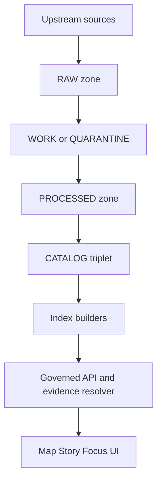
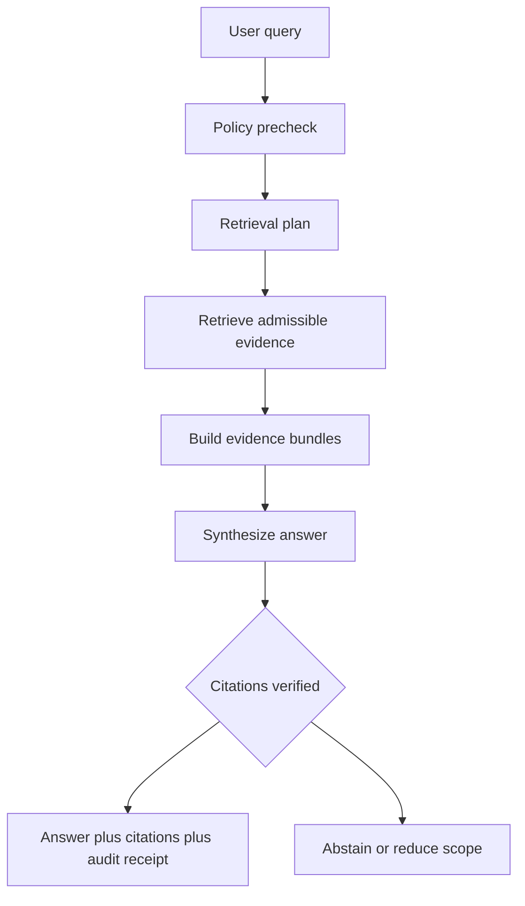

<!-- [KFM_META_BLOCK_V2]
doc_id: kfm://doc/6d6ad47e-7f5f-4ac4-9e71-a0c978059ff1
title: Governance SVG diagrams
type: standard
version: v1
status: draft
owners: KFM Maintainers
created: 2026-03-01
updated: 2026-03-01
policy_label: public
related:
  - docs/diagrams/ (TBD)
  - docs/governance/ (TBD)
tags: [kfm, diagrams, governance, svg]
notes:
  - This directory is intended for generated SVG outputs.
  - Do not hand-edit SVGs unless a file is explicitly marked as a source.
[/KFM_META_BLOCK_V2] -->

# Governance SVG diagrams

Generated SVG exports of Kansas Frontier Matrix (KFM) governance diagrams — intended for embedding in docs, PRs, and any published documentation site.


> [!WARNING]
> This folder is **output**. Prefer editing the *source* diagram(s) and regenerating SVGs.
>
> If you hand-edit SVGs here, you are opting out of reproducibility and review traceability.

## Navigation

- [Purpose](#purpose)
- [Where this fits in KFM](#where-this-fits-in-kfm)
- [What belongs here](#what-belongs-here)
- [How to update (regenerate)](#how-to-update-regenerate)
- [Diagram registry](#diagram-registry)
- [Governance and safety checklist](#governance-and-safety-checklist)
- [Directory tree](#directory-tree)
- [Related](#related)

## Purpose

This directory holds **rendered SVG diagrams** that communicate governance concepts (for example: the truth path lifecycle, promotion gates, trust membrane / policy boundary, and cite-or-abstain control loops).

These SVGs are treated as **published-facing assets**:

- stable filenames matter (other docs may link to them)
- changes should be PR-reviewed
- diagrams must not contradict governance invariants

[Back to top](#governance-svg-diagrams)

## Where this fits in KFM

KFM is an end-to-end governed system that connects:

**data → pipelines → catalogs/provenance → storage/indexing → governed APIs → Map/Story UI → Focus Mode**.

The governance diagrams in this folder primarily explain two things:

1) the **truth path** and promotion contract (how data moves from upstream to served runtime surfaces)
2) the **trust membrane** (how policy enforcement + evidence resolution sits between clients and data)





[Back to top](#governance-svg-diagrams)

## What belongs here

### Acceptable inputs

- `README.md` (this file)
- `*.svg` rendered governance diagrams
- optional sidecar files that are **purely derived** from diagram builds (for example: checksums or manifests), *if the repo’s diagram tooling produces them* (TBD)

### Exclusions

- **Source diagrams** (e.g., `.drawio`, `.mmd`, `.mermaid`, `.puml`, `.excalidraw`) — keep sources in the designated source folder (TBD)
- raster screenshots (`.png`, `.jpg`) unless there is a clear reason SVG cannot be used
- any raw/work/processed dataset artifacts
- sensitive details that increase harm:
  - exact coordinates of vulnerable/private/culturally restricted sites
  - restricted dataset identifiers
  - internal-only infrastructure diagrams that materially increase attack surface

[Back to top](#governance-svg-diagrams)

## How to update (regenerate)

1. **Edit the source** diagram(s) (location depends on repo conventions — not assumed here).
2. Regenerate SVG output using the project’s diagram build tooling.
3. Confirm output is deterministic enough to review (diffs are meaningful; filenames remain stable).
4. Open a PR that includes:
   - the updated `*.svg`
   - an updated [Diagram registry](#diagram-registry) row (if you add/rename diagrams)
   - a short explanation of the governance change

If you’re not sure where diagram sources/build commands live, here are safe discovery commands:

```bash
# Find likely diagram source folders
rg -n --hidden "docs/diagrams|mermaid|drawio|excalidraw|puml|plantuml" .

# Find build scripts in package.json files
rg -n --hidden "\"diagrams" **/package.json
```

> [!TIP]
> If regeneration changes many SVGs unexpectedly, treat it as a signal that the build pipeline is not stable enough.
> Prefer narrowing changes, pinning tool versions, and documenting the regeneration command.

[Back to top](#governance-svg-diagrams)

## Diagram registry

Add a row for each SVG in this folder that is intended to be referenced elsewhere.

| Diagram (SVG) | Topic | What it must stay consistent with | Notes |
|---|---|---|---|
| *(add filename)* | Truth path lifecycle | Zone names + ordering | Keep lifecycle terms consistent: RAW → WORK/QUARANTINE → PROCESSED → CATALOG/TRIPLET → PUBLISHED |
| *(add filename)* | Promotion Contract gates | Promotion gates & fail-closed posture | Show that promotion is blocked unless required artifacts validate |
| *(add filename)* | Trust membrane | “No direct DB/storage from clients” | Must show PEP/governed API + evidence resolver boundary |
| *(add filename)* | Focus Mode cite-or-abstain | Hard citation verification gate | Must show abstain path when citations can’t be verified |

[Back to top](#governance-svg-diagrams)

## Governance and safety checklist

Use this checklist when adding/updating diagrams.

### Governance invariants

- [ ] Diagram uses canonical lifecycle names and ordering (RAW, WORK/QUARANTINE, PROCESSED, CATALOG/TRIPLET, PUBLISHED)
- [ ] Diagram depicts the policy boundary (trust membrane): client-facing UI goes through governed APIs and evidence resolution
- [ ] Diagram does **not** imply clients can query storage/DB directly
- [ ] If a diagram references citations, it represents citations as **resolvable evidence references** (not free-form URLs)

### Safety and sensitivity

- [ ] No precise sensitive locations are shown (use coarse geography and/or generalized examples)
- [ ] No restricted dataset identifiers or internal-only endpoints are exposed
- [ ] If a diagram is internal-only, ensure it is labeled and placed according to repo policy (TBD)

[Back to top](#governance-svg-diagrams)

## Directory tree

```text
docs/diagrams/out/governance/svg/
  README.md
  *.svg
```

[Back to top](#governance-svg-diagrams)

## Related

- KFM — Definitive Design & Governance Guide (vNext) (source snapshots)
- KFM — Architecture, Governance, and Delivery Plan (pipeline briefing)

> [!NOTE]
> Replace the references above with **repo-relative links** once the canonical doc locations are confirmed.
